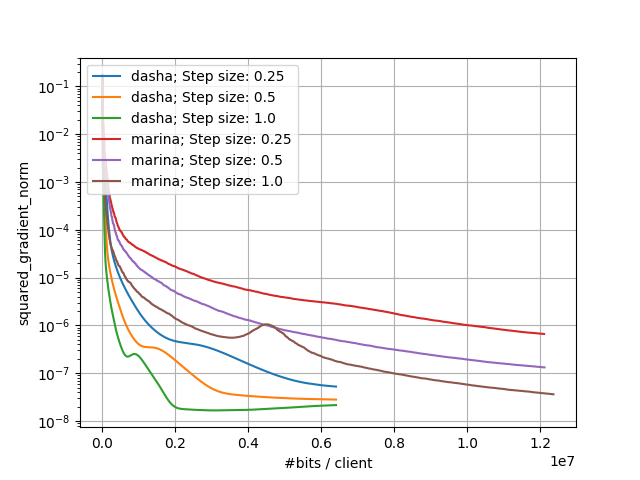
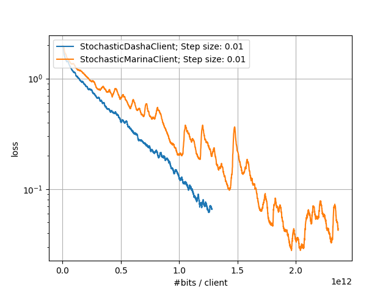

# DASHA: Distributed Nonconvex Optimization with Communication Compression and Optimal Oracle Complexity

> [!NOTE] 
> If you use this baseline in your work, please remember to cite the original authors of the paper as well as the Flower paper.

**Paper:** [openreview.net/forum?id=VA1YpcNr7ul](https://openreview.net/forum?id=VA1YpcNr7ul)

**Authors:** Alexander Tyurin, Peter Richtárik

**Abstract:** We develop and analyze DASHA: a new family of methods for nonconvex distributed optimization problems. When the local functions at the nodes have a finite-sum or an expectation form, our new methods, DASHA-PAGE, DASHA-MVR and DASHA-SYNC-MVR, improve the theoretical oracle and communication complexity of the previous state-of-the-art method MARINA by Gorbunov et al. (2020). In particular, to achieve an $\varepsilon$-stationary point, and considering the random sparsifier Rand$K$ as an example, our methods compute the optimal number of gradients $O\left(\frac{\sqrt{m}}{\varepsilon\sqrt{n}}\right)$ and $O\left(\frac{\sigma}{\varepsilon^{\frac{3}{2}}n}\right)$ in finite-sum and expectation form cases, respectively, while maintaining the SOTA communication complexity $O\left(\frac{d}{\varepsilon \sqrt{n}}\right)$. Furthermore, unlike MARINA, the new methods DASHA, DASHA-PAGE and DASHA-MVR send compressed vectors only, which makes them more practical for federated learning. We extend our results to the case when the functions satisfy the Polyak-Lojasiewicz condition. Finally, our theory is corroborated in practice: we see a significant improvement in experiments with nonconvex classification and training of deep learning models.


## About this baseline

**What’s implemented:** The code in this directory implements the experiments from the DASHA paper.

**Datasets:** Mushrooms from LIBSVM and CIFAR10 from PyTorch's Torchvision

**Hardware Setup:** These experiments were run on a desktop machine with 64 CPU cores. Any machine with 1 CPU would be able to run this code with the mushrooms dataset. The experiments with CIFAR10 would require slightly more CPU resources (e.g., 4 cores would be sufficient) and 1 GPU with CUDA.

**Contributors:** Alexander Tyurin ([https://github.com/k3nfalt](https://github.com/k3nfalt)) and Andrej Jovanović


## Experimental Setup

**Task:** Image Classification and Linear Regression

**Model:** This baseline implements two models:

* A logistic regression model with a nonconvex loss from the DASHA paper (Section A.1).
* A neural network with the cross entropy loss (Section A.4).

**Dataset:** This baseline only includes the mushrooms and CIFAR10 datasets. By default, the datasets are partitioned randomly between $n$ clients:

| Dataset | #classes | partitioning method |
| :------ | :---: | :---: |
| mushrooms | 2 | random |
| CIFAR10 | 10 | random |

**Training Hyperparameters:** In all experiments, we take parameters of algorithms predicted by the theory, except for the step sizes. In the case of the mushrooms's experiments, the step sizes are fine-tuned from the set of powers of two $\{0.25,0.5,1.0\}.$ In the case of CIFAR10's experiments, the step sizes are fixed to $0.01.$


## Environment Setup

To construct the Python environment follow these steps:


```bash
# Create the virtual environment
pyenv virtualenv 3.10.14 dasha

# Activate it
pyenv activate dasha

# Install the baseline
pip install -e .
```

## Running the Experiments

To run this FedProx with mushrooms baseline, first ensure you have activated your Poetry environment (execute `poetry shell` from this directory), then:

```bash
flwr run . # this will run using the default settings in `dasha/conf`

# you can override settings directly from the command line
# The following commands runs an experiment with the step size 0.5.
# Instead of the full, non-compressed vectors, each node sends a compressed vector with only 10 coordinates.
flwr run . --run-config "method.step-size=0.5 compressor.number-o-coordinates=10"

# if you run this baseline with a larger model, you might want to use the GPU (not used by default).
flwr run . --run-config "method.device=cuda:
```

To run using MARINA by Gorbunov et al. (2020):
```bash
flwr run . --run-config "method.name=marina"
```


## Expected Results
### Small-Scale Experiments

With the following command we run both DASHA and MARINA methods while iterating through different values of `step size`. Other parameters are the same as in the original paper. In the following command, we also ask the clients to send the full gradients to evaluate the norm of gradients metric.

```bash
# Run experiments
bash run_small_experiments.sh
```

The above commands would generate results that you can plot using the notebook in the `docs` directory. The expected results would look like:

| *Small-Scale Experiments: Comparison of DASHA and MARINA* |
|:--:| 
|  | 

### Large-Scale Experiments

In the following experiments, we compare the performance of DASHA and MARINA on the CIFAR10 dataset.

```bash
# Run experiments
bash run_large_experiments.sh
```

Similarly, the above commands would generate results that you can plot using the notebook in the `docs` directory. The expected results would look like:

| *Large-Scale Experiments: Comparison of DASHA and MARINA* |
|:--:| 
|  | 

### Running Tests

One can run the tests with the commands

```bash
# Run unit tests
pytest ./dasha/tests/
# Run unit and integration tests. Some long integration tests are turned off be default.
TEST_DASHA_LEVEL=1 pytest ./dasha/tests/
```