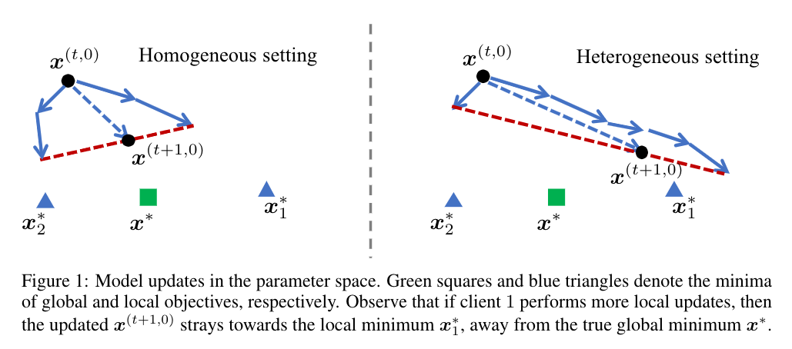

# Tackling the Objective Inconsistency Problem in Heterogeneous Federated Optimization

This is an official implementation of the following paper:
> Jianyu Wang, Qianghua Liu, Hao Liang, Gauri Joshi, H. Vincent Poor.  
**Tackling the Objective Inconsistency Problem in Heterogeneous Federated Optimization**  
_Neural Information Processing Systems (NeurIPS) 2020_.

[Paper](https://arxiv.org/abs/2007.07481)

**TL;DR**: Previous federated optization algorithms (such as FedAvg and FedProx) converge to stationary points of a mismatched objective function due to heterogeneity in data distribution and computing capacity. In this paper, we develop a general theoretical framework to understand and tackle this objective inconsistency problem.



**Abstract**: In federated optimization, heterogeneity in the clients' local datasets and computation speeds results in large variations in the number of local updates performed by each client in each communication round. Naive weighted aggregation of such models causes objective inconsistency, that is, the global model converges to a stationary point of a mismatched objective function which can be arbitrarily different from the true objective. This paper provides a general framework to analyze the convergence of federated heterogeneous optimization algorithms. It subsumes previously proposed methods such as FedAvg and FedProx and provides the first principled understanding of the solution bias and the convergence slowdown due to objective inconsistency. Using insights from this analysis, we propose FedNova, a normalized averaging method that eliminates objective inconsistency while preserving fast error convergence.


## Requirements
The implementation runs on:
- Python 3.5
- PyTorch 1.0.0
- TorchVision 0.2.1
- pdsh, paralle shell

All experiments in this paper are conducted on a private cluster with 16 machines connected via Ethernet, each of which is equipped with one NVIDIA TitanX GPU. We treat each machine as one client (worker) in the federated learning setting.

## Usage
We implement all federated optimization algorithms as subclasses of [torch.optim.optimizer](https://pytorch.org/docs/stable/optim.html). Different local update methods can be defined by revising `SampleOptimizer.step()` function and the aggregation protocol of local model changes is defined in `SampleOptimizer.average()` function.

Currently, this repository supports the following federated learning algrorithms:
- FedAvg ([Mcmahan et al. AISTAT 2017](https://arxiv.org/abs/1602.05629)): local solver is vanilla SGD; aggregate cumulative local model changes
- FedProx ([Li et al. MLSys 2020](https://arxiv.org/abs/1812.06127)): local solver is proximal SGD; aggregate cumulative local model changes
- FedNova ([Wang et al. NeurIPS 2020](https://arxiv.org/abs/2007.07481)): local solver can be vanilla SGD, proximal SGD, momentum SGD, etc.; aggregate normalized local model changes

All the above algorithms can be combined with server/slow momentum ([Wang et al. ICLR 2020](https://arxiv.org/abs/1910.00643), [Hsu et al. NeurIPS 2019 workshop](https://arxiv.org/abs/1909.06335)). One can also define more federated optimizer by adding files to `distoptim` diretory.

A typical usage is shown as follows. It is nearly the same as normal training scripts, except the addition of `optimizer.average()`.
```python
import util_v4 as util
from distoptim import *

# Load data
# DataRatios: relative sample size of clients
# rank: client index
# size: total number of clients
train_loader, test_loader, DataRatios = \
        util.partition_dataset(rank, size, args)
        
model = DEFINE_MODEL_FUNC()
criterion = DEFINE_CRI_FUNC()

algorithms = {
    'fedavg': FedProx, # with args.mu = 0
    'fedprox': FedProx, # with args.mu > 0
    'fednova': FedNova,
}
selected_algorithm = algorithms[args.optimizer]
optimizer = selected_algorithm(model.parameters(),
                               lr = args.lr,
                               mu = args.mu,
                               gmf = args.gmf,
                               ratio=DataRatios[rank],
                               momentum=args.momentum,
                               nesterov = False,
                               weight_decay=1e-4)
                               
for rnd in range(args.rounds):
    local_epochs = GET_LOCAL_EPOCH_FUNC()
    
    # Perform local updates
    for t in local_epochs:
        TRAIN_FUNC(model, criterion, optimizer, train_loader, t)
    
    # Aggregate local changes
    optimizer.average()

```

## Launch Experiments
We use `pdsh` (parallel shell) to launch experiments on a cluster of computing nodes. An example launch script is shown below.
```bash
pdsh -R ssh -w h[0-15] "python3.5 train_LocalSGD.py 
                        --pattern constant \
                        --lr 0.02 --momentum 0.9 --bs 32 --mu 0 \
                        --optimizer fednova --localE 2 \
                        --alpha 0.1 --model VGG  \
                        --name FedNova_momen_baseline   \
                        --rank %n --size 16 --backend nccl --initmethod tcp://h0:22000 \
                        --rounds 100 --seed 1 --NIID --print_freq 50 --save"
```
Explanations of arguments:
- `pattern`: pattern of local epochs, either `constant` or `uniform_random`
- `mu`: parameter for proximal SGD
- `localE`: number of local epochs in case of `constant` pattern; number of maximal local epochs in case of `uniform_random` pattern
- `alpha`: parameter to control the heterogeneity of data distribution. Smaller value yields more heterogeneity
- `name`: folder name to save results
- `rounds`: total number of communication rounds

