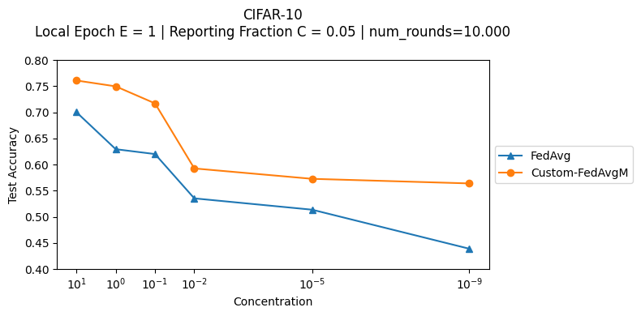
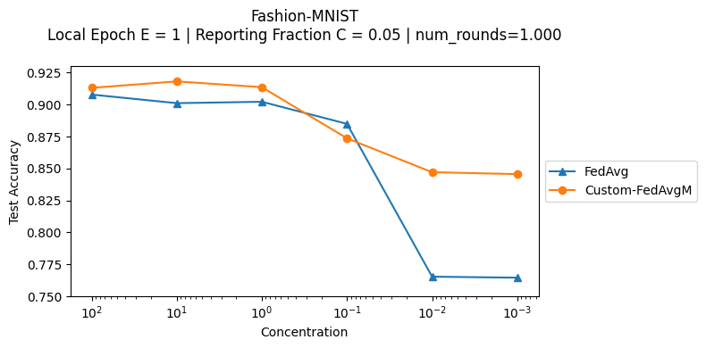
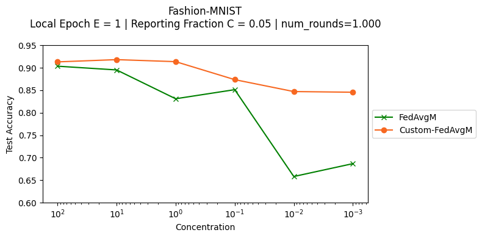

# Measuring the effects of non-identical data distribution for federated visual classification

> Note: If you use this baseline in your work, please remember to cite the original authors of the paper as well as the Flower paper.

**Paper:** [arxiv.org/abs/1909.06335](https://arxiv.org/abs/1909.06335)

**Authors:** Tzu-Ming Harry Hsu, Hang Qi, Matthew Brown

**Abstract:** Federated Learning enables visual models to be trained in a privacy-preserving way using real-world data from mobile devices. Given their distributed nature, the statistics of the data across these devices is likely to differ significantly. In this work, we look at the effect such non-identical data distributions has on visual classification via Federated Learning. We propose a way to synthesize datasets with a continuous range of identicalness and provide performance measures for the Federated Averaging algorithm. We show that performance degrades as distributions differ more, and propose a mitigation strategy via server momentum. Experiments on CIFAR-10 demonstrate improved classification performance over a range of non-identicalness, with classification accuracy improved from 30.1% to 76.9% in the most skewed settings.


## About this baseline

**What’s implemented:** The code in this directory evaluates the effects of non-identical data distribution for visual classification task based on paper _Measuring the effects of non-identical data distribution for federated visual classification_ (Hsu et al., 2019). It reproduces the FedAvgM and FedAvg performance curves for different non-identical-ness of the dataset (CIFAR-10 and Fashion-MNIST). _Figure 5 in the paper, section 4.2._

**Datasets:** CIFAR-10, and Fashion-MNIST

**Hardware Setup:** This baseline was evaluated in a regular PC without GPU (Intel i7-10710U CPU, and 32 Gb RAM). The major constraint is to run a huge number of rounds such as the reference paper that reports 10.000 round for each case evaluated. 

**Contributors:** Gustavo Bertoli [(@gubertoli)](https://github.com/gubertoli)

## Experimental Setup

**Task:** Image Classification

**Model:** This directory implements a CNN model similar to the one used on the seminal FedAvg paper (`models.py`):

- McMahan, B., Moore, E., Ramage, D., Hampson, S., & y Arcas, B. A. (2017, April). Communication-efficient learning of deep networks from decentralized data. In Artificial intelligence and statistics (pp. 1273-1282). PMLR. ([Link](http://proceedings.mlr.press/v54/mcmahan17a/mcmahan17a.pdf)):

As the following excerpt:

> "*We also ran experiments on the CIFAR-10 dataset... The model architecture was taken from the TensorFlow tutorial [38], which consists of two convolutional layers followed by two fully connected layers and then a linear transformation layer to produce logits, for a total of about 10 parameters."*

Regarding this architecture, the historical references mentioned on the FedAvg and FedAvgM papers are [this](https://web.archive.org/web/20190415103404/https://www.tensorflow.org/tutorials/images/deep_cnn) and [this](https://web.archive.org/web/20170807002954/https://github.com/tensorflow/models/blob/master/tutorials/image/cifar10/cifar10.py).

Important to highlight the rationale with this CNN model stated on FedAvgM paper:

> "*This model is not the state-of-the-art on the CIFAR-10 dataset, but is sufficient to show relative performance for the purposes of our investigation."*

**The default CNN model in use on this baseline have a centralized accuracy of ~0.74. That is different from the reported 0.86 accuracy from the original FedAvg paper. But it is still sufficient to show the relative performance for the purposes of FedAvgM investigation.**

**Dataset:** This baseline includes the CIFAR-10 and Fashion-MNIST datasets. By default it will run with the CIFAR-10. The data partition uses a configurable Latent Dirichlet Allocation (LDA) distribution (`concentration` parameter equals 0.1 as default) to create **non-iid distributions** between the clients. The understanding for this `concentration` (α) is that α→∞ all clients have identical distribution, and α→𝟢 each client hold samples from only one class.

| Dataset | # classes | # partitions | partition method | partition settings|
| :------ | :---: | :---: | :---: | :---: |
| CIFAR-10 | 10 | `num_clients` | Latent Dirichlet Allocation (LDA) | `concentration` |
| Fashion-MNIST | 10 | `num_clients` | Latent Dirichlet Allocation (LDA) | `concentration` |

**Data distribution:** The following figure illustrates the use of multiple `concentration` values to generate the data distribution over 30 clients for CIFAR-10 (10 classes) - [source code](fedavgm/utils.py):


**Training Hyperparameters:**
The following table shows the main hyperparameters for this baseline with their default value (i.e. the value used if you run `python main.py` directly)

| Description | Default Value |
| ----------- | ----- |
| total clients | 10 |
| number of rounds | 5 |
| model | CNN |
| strategy | Custom FedAvgM |
| dataset | CIFAR-10 |
| concentration | 0.1 |
| fraction evaluate | 0 |
| num cpus | 1 |
| num gpus | 0 |
| server momentum | 0.9 |
| server learning rate | 1.0 |
| server reporting fraction | 0.05 |
| client local epochs | 1 |
| client batch size | 64 |
| client learning rate | 0.01 |

### Custom FedAvgM
In contrast to the initial implementation found in Flower v1.5.0, our baseline incorporates the Nesterov accelerated gradient as a pivotal component of the momentum applied to the server model. It is worth emphasizing that the inclusion of Nesterov momentum aligns with the original definition of FedAvgM in the research paper.

To use the original Flower implementation, use the argument `strategy=fedavgm`. By default, the custom implementation is used. But, you can also refer to it on the command line as `strategy=custom-fedavgm`.

## Environment Setup

### Specifying the Python Version

This baseline was tested with Python 3.10.6 and following the steps below to construct the Python environment and install all dependencies. Both [`pyenv`](https://github.com/pyenv/pyenv) and [`poetry`](https://python-poetry.org/docs/) are assumed to be already present in your system.

```bash
# Cd to your baseline directory (i.e. where the `pyproject.toml` is), then
pyenv local 3.10.6

# Set that version for poetry
poetry env use 3.10.6

# Install the base Poetry environment
poetry install

# Activate the environment
poetry shell
```

### Google Colab
If you want to setup the environment on Google Colab, please executed the script `conf-colab.sh`, just use the Colab terminal and the following:

```bash
chmod +x conf-colab.sh
./conf-colab.sh
```

## Running the Experiments

To run this FedAvgM with CIFAR-10 baseline, first ensure you have activated your Poetry environment (execute `poetry shell` from this directory), then:

```bash  
python -m fedavgm.main # this will run using the default setting in the `conf/base.yaml`

# you can override settings directly from the command line

python -m fedavgm.main strategy=fedavg num_clients=1000 num_rounds=50 # will set the FedAvg with 1000 clients and 50 rounds

python -m fedavgm.main dataset=fmnist noniid.concentration=10 # use the Fashion-MNIST dataset and a different concentration for the LDA-based partition

python -m fedavgm.main server.reporting_fraction=0.2 client.local_epochs=5 # will set the reporting fraction to 20% and the local epochs in the clients to 5
```

## Expected Results

### CIFAR-10
Similar to FedAvgM paper as reference, the CIFAR-10 evaluation runs 10,000 rounds.

> In order to speedup the execution of these experiments, the evaluation of the _global model_ on the test set only takes place after the last round. The highest accuracy is achieved towards the last rounds, not necessarily in the last. If you wish to evaluate the _global model_ on the test set (or a validation set) more frequently, edit `get_evaluate_fn` in `server.py`. Overal, running the experiments as shown below demonstrate that `FedAvgM` is consistently superior to `FedAvg`.

For FedAvgM evaluation, it was performed a hyperparameter search of server momentum and client learning rate (similar to Figure 6 reported below) for each of the concentrations under analysis, using the following commands:

- Concentration = 1e-5 and 1e-9 (extreme non-iid)
```bash
python -m fedavgm.main --multirun client.local_epochs=1 noniid.concentration=1e-5,1e-9 strategy=custom-fedavgm,fedavg \
server.reporting_fraction=0.05 num_rounds=10000 num_clients=100 \
dataset=cifar10 client.lr=0.0003 server.momentum=0.99
```

- Concentration = 0.01
```bash
python -m fedavgm.main --multirun client.local_epochs=1 noniid.concentration=0.01 strategy=custom-fedavgm,fedavg \
server.reporting_fraction=0.05 num_rounds=10000 num_clients=100 \
dataset=cifar10 client.lr=0.003 server.momentum=0.97
```

- Concentration = 0.1
```bash
python -m fedavgm.main --multirun client.local_epochs=1 noniid.concentration=0.1 strategy=custom-fedavgm,fedavg \
server.reporting_fraction=0.05 num_rounds=10000 num_clients=100 \
dataset=cifar10 client.lr=0.0003 server.momentum=0.99
```

- Concentration = 1
```bash
python -m fedavgm.main --multirun client.local_epochs=1 noniid.concentration=1 strategy=custom-fedavgm,fedavg \
server.reporting_fraction=0.05 num_rounds=10000 num_clients=100 \
dataset=cifar10 client.lr=0.0003 server.momentum=0.997
```

- Concentration = 10
```bash
python -m fedavgm.main --multirun client.local_epochs=1 noniid.concentration=10 strategy=custom-fedavgm,fedavg \
server.reporting_fraction=0.05 num_rounds=10000 num_clients=100 \
dataset=cifar10 client.lr=0.003 server.momentum=0.9
```

Summarizing all the results:



The findings aligns with the report on the original FedAvgM paper that *"To prevent client updates from diverging, we additionally have to use a combination of low absolute learning rate and high momentum"*.

The following command reproduces the same behavior of Figure 6 from FedAvgM paper for the case of Local Epoch E=1, Reporting Fraction C=0.05, and concentration (α) = 1. In this example, it runs just 1,000 rounds:

```bash
python -m fedavgm.main --multirun client.local_epochs=1 noniid.concentration=1 \
strategy=custom-fedavgm server.reporting_fraction=0.05 num_rounds=100 num_clients=100 \
dataset=cifar10 client.lr=0.0001,0.0003,0.001,0.003,0.01,0.03,0.1,0.3 \
server.momentum=0.7,0.9,0.97,0.99,0.997
```


---
### Fashion-MNIST

```bash
python -m fedavgm.main --multirun client.local_epochs=1 \
noniid.concentration=0.001,0.01,0.1,1,10,100 strategy=custom-fedavgm,fedavg \
server.reporting_fraction=0.05 num_rounds=1000 \
num_clients=100 dataset=fmnist server.momentum=0.97 client.lr=0.003
```
The above command will evaluate the custom FedAvgM versus FedAvg on Fashion-MNIST datasets. It uses 100 clients with a reporting fraction of 5% during 1000 rounds. To evaluate the non-iid aspects, this exececution exercises concentration of [100, 10, 1, 0.1, 0.01, 0.001]:



#### Comparison between the Custom-FedAvgM and FedAvgM

To compare the improvement of the FedAvgM with Nesterov momentum (`strategy=custom-fedavgm`) and the FedAvgM without the Nesterov momentum (`strategy=fedavgm`), here we use the results of previous running with addition of the same conditions for the `fedavgm` strategy as follows:

```bash
python -m fedavgm.main --multirun client.local_epochs=1 \
noniid.concentration=0.001,0.01,0.1,1,10,100 strategy=fedavgm \
server.reporting_fraction=0.05 num_rounds=1000 \
num_clients=100 dataset=fmnist server.momentum=0.97 client.lr=0.003
```



Overall, FedAvgM with Nesterov momentum outperforms the FedAvgM without Nesterov momentum, being clear this behavior for higher non-iidness (0.01 and 0.001). In these higher non-iidness, the test accuracy for FedAvg without Nesterov momentum are worse than the FedAvg.
For larger concentrations (1, 10, 100), it was observed some runs that the centralized evaluation resulted in a loss equal NaN or Inf, thus it was required multiple runs to guarantee the accuracies reported.

