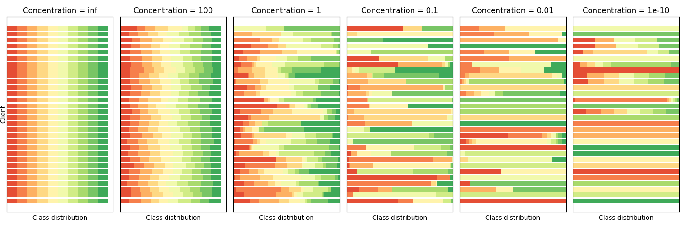

# Measuring the effects of non-identical data distribution for federated visual classification

> Note: If you use this baseline in your work, please remember to cite the original authors of the paper as well as the Flower paper.

**Paper:** [arxiv.org/abs/1909.06335](https://arxiv.org/abs/1909.06335)

**Authors:** Tzu-Ming Harry Hsu, Hang Qi, Matthew Brown

**Abstract:** Federated Learning enables visual models to be trained in a privacy-preserving way using real-world data from mobile devices. Given their distributed nature, the statistics of the data across these devices is likely to differ significantly. In this work, we look at the effect such non-identical data distributions has on visual classification via Federated Learning. We propose a way to synthesize datasets with a continuous range of identicalness and provide performance measures for the Federated Averaging algorithm. We show that performance degrades as distributions differ more, and propose a mitigation strategy via server momentum. Experiments on CIFAR-10 demonstrate improved classification performance over a range of non-identicalness, with classification accuracy improved from 30.1% to 76.9% in the most skewed settings.


## About this baseline

**What’s implemented:** The code in this directory evaluates the effects of non-identical data distribution for visual classification task based on paper _Measuring the effects of non-identical data distribution for federated visual classification_ (Hsu et al., 2019). It reproduces the FedAvgM and FedAvg performance curves for different non-identical-ness of the dataset (CIFAR-10 and FEMNIST). _Figure 5 in the paper, section 4.2._

**Datasets:** CIFAR-10, and Fashion-MNIST

**Hardware Setup:** This baseline was evaluated in a regular PC without GPU (Intel i7-10710U CPU, and 32 Gb RAM). The major constraint is to run a huge number of rounds such as the reference paper that reports 10.000 round for each case evaluated. As a reference, all the cases for the reported expected results with 1.000 round per case took 2 days.

**Contributors:** Gustavo de Carvalho Bertoli

## Experimental Setup

**Task:** Image Classification

**Model:** This directory implements the same CNN model presented in the following paper (`models.py`):

- McMahan, B., Moore, E., Ramage, D., Hampson, S., & y Arcas, B. A. (2017, April). Communication-efficient learning of deep networks from decentralized data. In Artificial intelligence and statistics (pp. 1273-1282). PMLR. ([Link](http://proceedings.mlr.press/v54/mcmahan17a/mcmahan17a.pdf)):

As the following excerpt:

> "*We also ran experiments on the CIFAR-10 dataset... The model architecture was taken from the TensorFlow tutorial [38], which consists of two convolutional layers followed by two fully connected layers and then a linear transformation layer to produce logits, for a total of about 10 parameters."*

Regarding this architecture, the historical references mentioned on the FedAvg and FedAvgM papers are [this](https://web.archive.org/web/20190415103404/https://www.tensorflow.org/tutorials/images/deep_cnn) and [this](https://web.archive.org/web/20170807002954/https://github.com/tensorflow/models/blob/master/tutorials/image/cifar10/cifar10.py).

Important to highlight the rationale with this CNN model stated on FedAvgM paper:

> "*This model is not the state-of-the-art on the CIFAR-10 dataset, but is sufficient to show relative performance for the purposes of our investigation."*

**Dataset:** This baseline includes the CIFAR-10 and Fashion-MNIST datasets. By default it will run with the CIFAR-10. The data partition uses a configurable Latent Dirichlet Allocation (LDA) distribution (`concentration` parameter equals 0.1 as default) to create **non-iid distributions** between the clients. The understanding for this `concentration` (α) is that α→∞ all clients have identical distribution, and α→𝟢 each client hold samples from only one class.

| Dataset | # classes | # partitions | partition method | partition settings|
| :------ | :---: | :---: | :---: | :---: |
| CIFAR-10 | 10 | `num_clients` | Latent Dirichlet Allocation (LDA) | `concentration` |
| Fashion-MNIST | 10 | `num_clients` | Latent Dirichlet Allocation (LDA) | `concentration` |

**Data distribution:** The following figure illustrates the use of multiple `concentration` values to generate the data distribution over 30 clients for CIFAR-10 (10 classes) - [source code](fedavgm/utils.py):



**Training Hyperparameters:**
The following table shows the main hyperparameters for this baseline with their default value (i.e. the value used if you run `python main.py` directly)

| Description | Default Value |
| ----------- | ----- |
| total clients | 10 |
| number of rounds | 5 |
| model | CNN |
| strategy | FedAvgM |
| dataset | CIFAR-10 |
| concentration | 0.1 |
| fraction evaluate | 0 |
| num cpus | 1 |
| num gpus | 0 |
| server momentum | 0.9 |
| server learning rate | 1.0 |
| server reporting fraction | 0.05 |
| client local epochs | 1 |
| client batch size | 64 |

## Specifying the Python Version
This baseline was tested with Python 3.10.6.

By default, Poetry will use the Python version in your system. In some settings, you might want to specify a particular version of Python to use inside your Poetry environment. You can do so with [`pyenv`](https://github.com/pyenv/pyenv). Check the documentation for the different ways of installing `pyenv`, but one easy way is using the [automatic installer](https://github.com/pyenv/pyenv-installer):

```bash
curl https://pyenv.run | bash # then, don't forget links to your .bashrc/.zshrc
```

You can then install any Python version with `pyenv install <python-version>` (e.g. `pyenv install 3.10.6`). Then, in order to use that version for this baseline, you'd do the following:

```bash
# cd to your baseline directory (i.e. where the `pyproject.toml` is)
pyenv local 3.10.6

# set that version for poetry
poetry env use 3.10.6

# then you can install your Poetry environment (see the next setp)
```

## Environment Setup

This baseline works with TensorFlow 2.10, no additional step required once using Poetry to set up the environment.

We use Poetry to manage the Python environment for each individual baseline. You can follow the instructions [here](https://python-poetry.org/docs/) to install Poetry in your machine. 

To construct the Python environment with Poetry follow these steps:

```bash
# install the base Poetry environment
poetry install

# activate the environment
poetry shell
```
### Google Colab
If you want to setup the environemnt on Google Colab, please executed the script `conf-colab.sh`, just use the Colab terminal and the following:

```bash
chmod +x conf-colab.sh
./conf-colab.sh
```

## Running the Experiments

To run this FedAvgM with CIFAR-10 baseline, first ensure you have activated your Poetry environment (execute `poetry shell` from this directory), then:

```bash  
python -m fedavgm.main # this will run using the default setting in the `conf/base.yaml`

# you can override settings directly from the command line

python -m fedavgm.main strategy=fedavg num_clients=1000 num_rounds=50 # will set the FedAvg with 1000 clients and 50 rounds

python -m fedavgm.main dataset=fmnist noniid.concentration=10 # use the Fashion-MNIST dataset and a different concentration for the LDA-based partition

python -m fedavgm.main server.reporting_fraction=0.2 client.local_epochs=5 # will set the reporting fraction to 20% and the local epochs in the clients to 5
```

## Expected Results


```bash
python -m fedavgm.main --multirun client.local_epochs=1 \
noniid.concentration=10,1,0.1,0.01 strategy=fedavgm,fedavg \
server.reporting_fraction=0.05 num_rounds=1000 \
num_clients=100 dataset=cifar10,fmnist
```

The above command will evaluate FedAvgM versus FedAvg on both CIFAR-10 and Fashion-MNIST datasets. It uses 100 clients with a reporting fraction of 5% during 1000 rounds. To evaluate the non-iid aspects, this exececution exercises concentration of [10, 1, 0.1, 0.01].


_For the CIFAR-10 case, the FedAvgM accuracy @ concentration equal 10 comes from the round 995 instead of round 1000. Round 995 was the latest round with an accuracy without instability (e.g, exploding gradients) during centralized evaluation of the global model. This behavior can be evidenced by the following execution:_

```bash
python -m fedavgm.main client.local_epochs=1 noniid.concentration=10 strategy=fedavgm \
server.reporting_fraction=0.05 num_rounds=1000 num_clients=100 dataset=cifar10
```

```bash
...
, (985, 0.6758999824523926), (986, 0.6347000002861023), (987, 0.5903000235557556), 
(988, 0.5055000185966492), (989, 0.49300000071525574), (990, 0.6047999858856201), 
(991, 0.7077999711036682), (992, 0.6884999871253967), (993, 0.6352999806404114), 
(994, 0.6133999824523926), (995, 0.6272000074386597), (996, 0.10000000149011612), 
(997, 0.10000000149011612), (998, 0.10000000149011612), (999, 0.10000000149011612), 
(1000, 0.10000000149011612)]}
```

