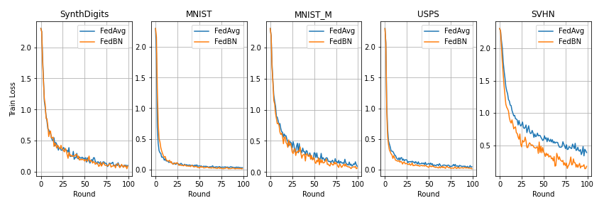

# FedBN: Federated Learning on Non-IID Features via Local Batch Normalization

> Note: If you use this baseline in your work, please remember to cite the original authors of the paper as well as the Flower paper.


**Paper:** [arxiv.org/abs/2102.07623](https://arxiv.org/abs/2102.07623)

**Authors:** Xiaoxiao Li, Meirui Jiang, Xiaofei Zhang, Michael Kamp, Qi Dou

**Abstract:** The emerging paradigm of federated learning (FL) strives to enable collaborative training of deep models on the network edge without centrally aggregating raw data and hence improving data privacy. In most cases, the assumption of independent and identically distributed samples across local clients does not hold for federated learning setups. Under this setting, neural network training performance may vary significantly according to the data distribution and even hurt training convergence. Most of the previous work has focused on a difference in the distribution of labels or client shifts. Unlike those settings, we address an important problem of FL, e.g., different scanners/sensors in medical imaging, different scenery distribution in autonomous driving (highway vs. city), where local clients store examples with different distributions compared to other clients, which we denote as feature shift non-iid. In this work, we propose an effective method that uses local batch normalization to alleviate the feature shift before averaging models. The resulting scheme, called FedBN, outperforms both classical FedAvg, as well as the state-of-the-art for non-iid data (FedProx) on our extensive experiments. These empirical results are supported by a convergence analysis that shows in a simplified setting that FedBN has a faster convergence rate than FedAvg.


## About this baseline

**What’s implemented:** Figure 3 in the paper: convergence in training loss comparing `FedBN` to `FedAvg` for five datasets.

**Datasets:** Vision datasets including digits 0-9. These datasets are: [MNIST](https://ieeexplore.ieee.org/document/726791), [MNIST-M](https://arxiv.org/pdf/1505.07818.pdf), [SVHN](http://ufldl.stanford.edu/housenumbers/nips2011_housenumbers.pdf), [USPS](https://ieeexplore.ieee.org/document/291440), and [SynthDigits](https://arxiv.org/pdf/1505.07818.pdf).

**Hardware Setup:** Using the default configurations, any machine with 8 CPU cores should be capable to run 100 rounds of FedAvg or FedBN in under 5 minutes. Therefore a GPU is not needed if you stick to the small model used in the paper and you limit clients to use a 10% of the data in each dataset (these are the default settings)

**Contributors:** Meirui Jiang, Maria Boerner, Javier Fernandez-Marques


## Experimental Setup

**Task:** Image classification

**Model:** A six-layer CNN with 14,219,210 parameters following the structure described in appendix D.2.

**Dataset:**  This baseline makes use of the pre-processed partitions created and open source by the authors of the FedBN paper. You can read more about how those were created [here](https://github.com/med-air/FedBN). Follow the steps below in the `Environment Setup` section to download them.


A more detailed explanation of the datasets is given in the following table.

|                    | MNIST              | MNIST-M                                                  | SVHN                      | USPS                                                         | SynthDigits                                                                      |
| ------------------ | ------------------ | -------------------------------------------------------- | ------------------------- | ------------------------------------------------------------ | -------------------------------------------------------------------------------- |
| data type          | handwritten digits | MNIST modification randomly colored with colored patches | Street view house numbers | handwritten digits from envelopes by the U.S. Postal Service | Synthetic digits Windows TM font varying the orientation, blur and stroke colors |
| color              | greyscale          | RGB                                                      | RGB                       | greyscale                                                    | RGB                                                                              |
| pixelsize          | 28x28              | 28 x 28                                                  | 32 x32                    | 16 x16                                                       | 32 x32                                                                           |
| labels             | 0-9                | 0-9                                                      | 1-10                      | 0-9                                                          | 1-10                                                                             |
| number of trainset | 60.000             | 60.000                                                   | 73.257                    | 9,298                                                        | 50.000                                                                           |
| number of testset  | 10.000             | 10.000                                                   | 26.032                    | -                                                            | -                                                                                |
| image shape        | (28,28)            | (28,28,3)                                                | (32,32,3)                 | (16,16)                                                      | (32,32,3)                                                                        |


**Training Hyperparameters:** By default (i.e. if you don't override anything in the config) these main hyperparameters used are shown in the table below. For a complete list of hyperparameters, please refer to the config files in `fedbn/conf`.

| Description                 | Value              |
| --------------------------- | ------------------ |
| rounds                      | 10                 |
| num_clients                 | 5                  |
| strategy_fraction_fit       | 1.0                |
| strategy.fraction_evaluate  | 0.0                |
| training samples per client | 743                |
| client.l_r                  | 10E-2              |
| local epochs                | 1                  |
| loss                        | cross entropy loss |
| optimizer                   | SGD                |
| client_resources.num_cpu    | 2                  |
| client_resources.num_gpus   | 0.0                |

## Environment Setup

To construct the Python environment, simply run:

```bash
# Set directory to use python 3.10 (install with `pyenv install <version>` if you don't have it)
pyenv local 3.10.6

# Tell poetry to use python3.10
poetry env use 3.10.6

# Install
poetry install
```

Before running the experiments you'll need to download the five datasets for this baseline. We'll be using the pre-processed datasets created by the `FedBN` authors. Download the dataset from [here](https://mycuhk-my.sharepoint.com/:u:/g/personal/1155149226_link_cuhk_edu_hk/EV1YgHfFC4RKjw06NL4JMdgBMU21CegM12SpXrSmGjt3XA?e=XK2rFs) and move the file into a new directory named `data`.
```bash
mkdir data
mv <path/to/your/digit_dataset.zip> data/

# now uncompress the zipfile
cd data && unzip digit_dataset.zip
cd data ..
```

## Running the Experiments

First, activate your environment via `poetry shell`. The commands below show how to run the experiments and modify some of its key hyperparameters via the cli. Each time you run an experiment, the log and results will be stored inside `outputs/<date>/<time>`. Please refer to [the Documentation](https://flower.ai/docs/framework/how-to-run-simulations.html) to learn more about Flower Simulation.

```bash
# run with default arguments
python -m fedbn.main

# by default, the experiments run in CPU-only mode
# allow for 5 clients in parallel on a gpu by doing
python -m fedbn.main client_resources.num_gpus=0.2

# By default, federated evaluation is disabled. Therefore the only metrics
# returned to the server are those related to the training set
# If you want to enable federated evaluation set `fraction_evaluate=1.0` to involve all clients
python -m fedbn.main strategy.fraction_evaluate=1 # your code will run slower

# adjust hyperparameters like the number of rounds or batch size like this
python -m fedbn.main num_rounds=100 dataset.batch_size

# increase the number of clients like this (note this should be a multiple
# of the number of dataset you involve in the experiment -- 5 by default)
# this means that without changing other hyperparameters, you can only have
# either 5,10,15,20,25,30,35,40,45 or 50 clients
python -m fedbn.main num_clients=20

# by default clients get assigned a 10th of the data in a dataset
# this is because the datasets you downloaded were pre-processed by the authors
# of the FedBN paper. They created 10 partitions.
# You can increase the amount of partitions each client gets by increasing dataset.percent
# Please note that as you increase that value, the maximum number of clients
# you can have in your experiment gets reduced (this is because partitions are fixed and
# can't be -- unless you add support for it -- partitioned into smaller ones)
python -m fedbn.main dataset.percent=0.2 # max allowed is 25 clients

# run with FedAvg clients leaving the rest default
python -m fedbn.main client=fedavg
```

## Limitations

The pre-processing of the five datasets provided by the authors, imposes some limitations on the number of clients that can be spawned for the experiment. Naturally, this limitation can be circumvented if you edit the code, and in particular the `dataset.DigitsDataset` constructor. The aforementioned limitation happens because each dataset is partitioned into 10 disjoint sets and a 'DigitsDataset' can only be constructed by concatenating any set of such partitions (at least one, at most all 10). _How does the limitation manifest?_ Given that we have 5 datasets, if a client just takes one partition, a FL setup can accommodate 50 clients, one using a different partition. But, if you want for instance each client have 3 partitions of the same dataset (yes, clients can only hold data of one dataset) then the maximum number of clients gets reduced to 20. Following this logic you can see that if a client wants to use all 10 partitions of a given dataset, then only 5 clients can participate in the experiment.

Another limitation in the current implementation is that there should be the same number of clients for each dataset. Also, all clients should contain the same number of partitions of their respective datasets. You can remove these constrain my editing `dataset.get_data()`.

The function `dataset.get_data()` contains a few `assert` that should make it easy find the right valid set of arguments for `num_clients` given the values of `dataset.percent` and `dataset.to_include`.

## Expected Results

Replicate the results shown below by running the following command. First ensureing you have activated your environment.

```bash

# Reproduces the results in Table 3 of the paper.
python -m fedbn.main --multirun num_rounds=100 client=fedavg,fedbn

# If you want to repeat the same experiment 5 times with different random seeds (none fixed in the code)
# adding '+repeat_num=range(5)' adds an aunxhiliary new parameter (not used in the code) that forces the --multirun
# to run a total of 2x5 configs
python -m fedbn.main --multirun num_rounds=100 client=fedavg,fedbn client_resources.num_gpus=0.2 '+repeat_num=range(5)'

# then use the notebook in docs/multirun_plot.ipynb to create the plot below
# The results show each strategy averaged for the N runs you run the experiment
```


