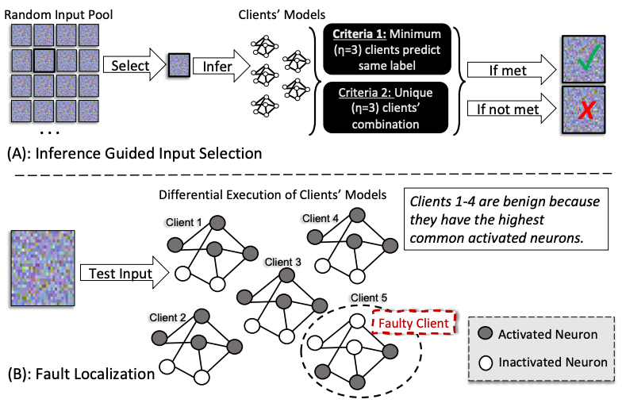
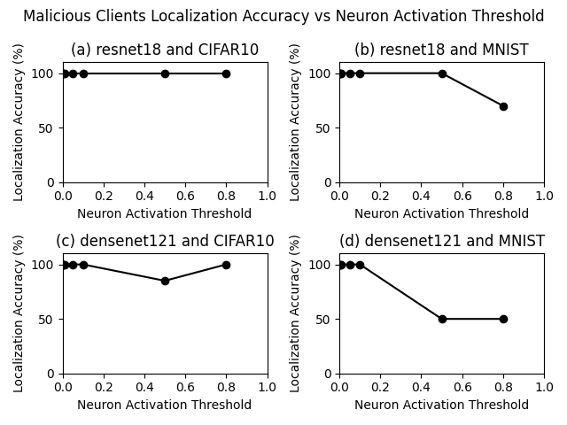

# FedDebug: Systematic Debugging for Federated Learning Applications

> Note: If you use this baseline in your work, please remember to cite the original authors of the paper as well as the Flower paper.

**Paper:** [https://dl.acm.org/doi/abs/10.1109/ICSE48619.2023.00053]

**Authors:** [Waris Gill](https://people.cs.vt.edu/waris/) (Virginia Tech, USA), [Ali Anwar](https://cse.umn.edu/cs/ali-anwar) (University of Minnesota Twin Cities, USA), [Muhammad Ali Gulzar](https://people.cs.vt.edu/~gulzar/) (Virginia Tech, USA)

**Abstract:** In Federated Learning (FL), clients independently train local models and share them with a central aggregator to build a global model. Impermissibility to access clients' data and collaborative training make FL appealing for applications with data-privacy concerns, such as medical imaging. However, these FL characteristics pose unprecedented challenges for debugging. When a global model's performance deteriorates, identifying the responsible rounds and clients is a major pain point. Developers resort to trial-and-error debugging with subsets of clients, hoping to increase the global model's accuracy or let future FL rounds retune the model, which are time-consuming and costly.
We design a systematic fault localization framework, FedDebug, that advances the FL debugging on two novel fronts. First, FedDebug enables interactive debugging of realtime collaborative training in FL by leveraging record and replay techniques to construct a simulation that mirrors live FL. FedDebug's _breakpoint_ can help inspect an FL state (round, client, and global model) and move between rounds and clients' models seamlessly, enabling a fine-grained step-by-step inspection. Second, FedDebug automatically identifies the client(s) responsible for lowering the global model's performance without any testing data and labels---both are essential for existing debugging techniques. FedDebug's strengths come from adapting differential testing in conjunction with neuron activations to determine the client(s) deviating from normal behavior. FedDebug achieves 100% accuracy in finding a single faulty client and 90.3% accuracy in finding multiple faulty clients. FedDebug's interactive debugging incurs 1.2% overhead during training, while it localizes a faulty client in only 2.1% of a round's training time. With FedDebug, we bring effective debugging practices to federated learning, improving the quality and productivity of FL application developers.

**<u>Application of FedDebug</u>:** We used FedDebug to detect backdoor attacks in Federated Learning, resulting in [Fed-Defender](https://dl.acm.org/doi/10.1145/3617574.3617858). The code is implemented using the Flower Framework in [this repository](https://github.com/warisgill/FedDefender). We plan to adapt Fed-Defender to Flower baseline guidelines soon.

## High Level Overview of FedDebug Differential Testing Approach



## About this baseline
**What's implemented:** 
FedDebug is a systematic malicious client(s) localization framework designed to advance debugging in Federated Learning (FL). It enables interactive debugging of real-time collaborative training and automatically identifies clients responsible for lowering global model performance without requiring testing data or labels.

This repository implements the FedDebug technique of localizing malicious client(s) in a generic way, allowing it to be used with various fusion techniques and CNN architectures. Specifically, it replicates the results presented in Table 2 and Figure 10 of the original paper. These results demonstrate FedDebug's ability to localize multiple faulty clients and its performance under different neuron activation thresholds. You can find the original code of FedDebug [here](https://github.com/SEED-VT/FedDebug).


**Datasets:** This baseline uses two datasets:
1. CIFAR-10: 50,000 training and 10,000 testing 32x32 RGB images across 10 classes.
2. MNIST: 60,000 training and 10,000 testing images across 10 classes. 
2. FEMNIST: Over 340,000 training and 40,000 testing 28x28 grayscale images across 10 classes.

**Hardware Setup:**
These experiments were run on a machine with 8 CPU cores and an Nvidia Tesla P40 GPU. 
> **Note:** This baseline also contains a smaller CNN model (LeNet) to run all these experiments on a CPU. Furthermore, the experiments are also scaled down to obtain representative results of the FedDebug evaluations.

**Contributors:** Waris Gill ([GitHub Profile](https://github.com/warisgill))
## Experimental Setup
**Task:** Image classification, Malicious/Faulty Client (s) Removal, Debugging and Testing
**Models:** This baseline implements two CNN architectures:
1. ResNet
2. DenseNet
3. VGG
**Dataset:** The datasets are partitioned among clients, and each client participates in the training (cross-silo). However, you can easily extend the code to work in cross-device settings. The non-IID is based on quantity-based imbalance ([niid_bench](https://arxiv.org/abs/2102.02079)).

| Dataset  | #classes | #clients | partitioning method |
| :------- | :------: | :------: | :-----------------: |
| CIFAR-10 |    10    |  30, 50  |   IID and Non-IID   |
| FEMNIST  |    10    |  30, 50  |   IID and Non-IID   |
  
**Training Hyperparameters:**
Default training hyperparameters are in `conf/base.yaml`.
## Environment Setup
Experiments are conducted with `Python 3.10.14`. It is recommended to use Python 3.10 for the experiments.
Check the documentation for the different ways of installing `pyenv`, but one easy way is using the [automatic installer](https://github.com/pyenv/pyenv-installer):

```bash
curl https://pyenv.run | bash # then, don't forget links to your .bashrc/.zshrc
```
You can then install any Python version with `pyenv install 3.10.14` Then, in order to use FedDebug baseline, you'd do the following:
```bash
# cd to your feddebug directory (i.e. where the `pyproject.toml` is)
pyenv local 3.10.14
poetry env use 3.10.14 # set that version for poetry

# run this from the same directory as the `pyproject.toml` file is
poetry install
poetry shell

# check the python version by running the following command
python --version # it should be >=3.10.14
```
This will create a basic Python environment with just Flower and additional packages, including those needed for simulation. Now you are inside your environment (pretty much as when you use `virtualenv` or `conda`).
## Running the Experiments

> [!NOTE]
> You can run almost any evaluation from the paper by changing the parameters in `conf/base.yaml`. Also, you can change the resources (per client CPU and GPU) in conf/base.yaml to speed up the simulation. Please check flower simulation guide to for more detail ([Flower Framework main](https://flower.ai/docs/framework/how-to-run-simulations.html) ).

The following command will run the default experimental setting in `conf/base.yaml` (LeNet, MNIST, with a total of 5 clients, where client-0 is malicious). FedDebug will identify client-0 as the malicious client. **The experiment took on average 62-90 seconds to complete.**

```bash
python -m feddebug.main device=cpu 
```  

Output
```output
... 

[2024-08-23 20:29:29,920][flwr][INFO] - Training Complete for Experiment: lenet-mnist-faulty_clients[['0']]-noise_rate1-TClients5-fedavg-(R1-clientsPerR5)-iid1-batch512-epochs10-lr0.001 


[2024-08-23 20:29:31,518][flwr][INFO] - True Malacious/Faulty Clients (i.e., Ground Truth) IDs are: ['0']
[2024-08-23 20:29:31,518][flwr][INFO] - Now localizing above mentioned faulty clients using differential testing approach.
[2024-08-23 20:29:36,920][flwr][INFO] - Generated 10 inputs in 0.011104822158813477 seconds.
[2024-08-23 20:29:36,920][flwr][INFO] - Getting Neuron Activations for each client.
100%|███████████████| 5/5 [00:04<00:00,  1.01it/s]
[2024-08-23 20:29:41,852][flwr][INFO] - Faulty Client Localization Time: 4.931802749633789 seconds.
[2024-08-23 20:29:41,852][flwr][INFO] - I0 Potential Malicious client(s) {'0'}
[2024-08-23 20:29:41,852][flwr][INFO] - I1 Potential Malicious client(s) {'0'}
[2024-08-23 20:29:41,852][flwr][INFO] - I2 Potential Malicious client(s) {'0'}
[2024-08-23 20:29:41,853][flwr][INFO] - I3 Potential Malicious client(s) {'0'}
[2024-08-23 20:29:41,853][flwr][INFO] - I4 Potential Malicious client(s) {'0'}
[2024-08-23 20:29:41,853][flwr][INFO] - I5 Potential Malicious client(s) {'0'}
[2024-08-23 20:29:41,853][flwr][INFO] - I6 Potential Malicious client(s) {'0'}
[2024-08-23 20:29:41,853][flwr][INFO] - I7 Potential Malicious client(s) {'0'}
[2024-08-23 20:29:41,853][flwr][INFO] - I8 Potential Malicious client(s) {'0'}
[2024-08-23 20:29:41,853][flwr][INFO] - I9 Potential Malicious client(s) {'0'}
[2024-08-23 20:29:41,853][flwr][INFO] - Fault Localization Accuracy: 100.0
Total Time taken (training + testing): 97.98241376876831
```

## Expected Results  
> Note: The following commands will take time to complete on larger models (eg., resnet) without enabling gpu.  

**FedDebug Table 2** 
```bash
poetry run python -m feddebug.main --multirun device=cpu num_clients=50 model.name=lenet dataset.name=cifar10,mnist total_faulty_clients=5,7 check_cache=True

# to generate Table 2 csv. Open fed_debug_results.csv after  
poetry run python -m feddebug.main generate_table_csv=True
# Open fed_debug_results.csv to see the results.
```
Last Command Output
```output
...
[flwr][INFO] - FedDebug’s malicious client(s) localization results svaed in fed_debug_results.csv.

```

**Neuron Activation Threshold Variation (Figure 10)**
Only execute the following commands after generating Table 2 results.   
```bash
poetry run python -m feddebug.main --multirun device=cuda  num_clients=10 model.name=densenet121,resnet18 dataset.name=cifar10,mnist total_faulty_clients=2 check_cache=True

poetry run python -m feddebug.main vary_thresholds=True device=cuda

poetry run python -m feddebug.main generate_thresholds_exp_graph=True

```
Last Command Output
```output
[2024-08-23 20:19:35,895][flwr][INFO] - Fig 10 is generated: Figure-10.pdf
```
It will generate a PDF (Figure-10.pdf) containing Figure 10 graphs as shown below. Lower thresholds value yield better results during differential testing. 



> :warning: It generates random inputs to localize malicious client(s). Thus, results might vary slightly on each run due to randomness.

## Customizing Experiments
You can customize various aspects of the experiments by modifying the `conf/base.yaml` file. This includes:
- Changing the number of clients
- Modifying the dataset partitioning method
- Adjusting training hyperparameters
- Changing the CNN architecture
Remember to consult the Flower simulation guide for more details on resource allocation and advanced configurations.
## Citation
If you publish work that uses FedDebug, please cite FedDebug and Flower as follows:
```bibtex
@inproceedings{gill2023feddebug,
  title={Feddebug: Systematic debugging for federated learning applications},
  author={Gill, Waris and Anwar, Ali and Gulzar, Muhammad Ali},
  booktitle={2023 IEEE/ACM 45th International Conference on Software Engineering (ICSE)},
  pages={512--523},
  year={2023},
  organization={IEEE}
}

@article{beutel2020flower,
  title={Flower: A Friendly Federated Learning Research Framework},
  author={Beutel, Daniel J and Topal, Taner and Mathur, Akhil and Qiu, Xinchi and Fernandez-Marques, Javier and Gao, Yan and Sani, Lorenzo and Kwing, Hei Li and Parcollet, Titouan and Gusmão, Pedro PB de and Lane, Nicholas D},
  journal={arXiv preprint arXiv:2007.14390},
  year={2020}
}
```
## Questions and Feedback
If you have any questions or feedback, feel free to contact me at: `waris@vt.edu`