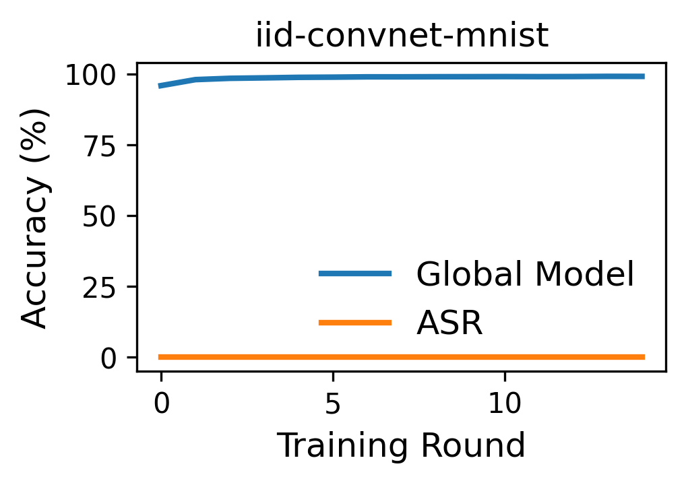

# FedDefender: Backdoor Attack Defense in Federated Learning

> [!NOTE] 
> If you use this baseline in your work, please remember to cite the original authors of the paper as well as the Flower paper.

**Paper:** [paper](https://arxiv.org/abs/2307.08672)

**Authors:** Waris Gill, Ali Anwar, Muhammad Ali Gulzar

**Abstract:** Federated Learning (FL) is a privacy-preserving distributed machine learning technique that enables individual clients (e.g., user participants, edge devices, or organizations) to train a model on their local data in a secure environment and then share the trained model with an aggregator to build a global model collaboratively. In this work, we propose FedDefender, a defense mechanism against targeted poisoning attacks in FL by leveraging differential testing. Our proposed method fingerprints the neuron activations of clients' models on the same input and uses differential testing to identify a potentially malicious client containing a backdoor. We evaluate FedDefender using MNIST and FashionMNIST datasets with 20 and 30 clients, and our results demonstrate that FedDefender effectively mitigates such attacks, reducing the attack success rate (ASR) to 10\% without deteriorating the global model performance.

## About this baseline

**What’s implemented:** FedDefender is a defense mechanism against target poisoning attacks in FL.

**Flower Datasets:** This baseline integrates `flwr-datasets` and tested on MNIST and FMNIST datasets. The code is designed to work with other datasets as well. You can easily extend the code to work with other datasets by following the Flower dataset guidelines.

**Hardware Setup:**
These experiments were run on a machine with 8 CPU cores and an Nvidia Tesla P40 GPU.

**Contributors:** Gautam Jajoo ([GitHub Profile](https://github.com/gautamjajoo))


```bash
# Create a python env
pyenv virtualenv 3.10.14 feddefender

# Activate it
pyenv activate feddefender

# Install project including developer packages
# Note the `-e` this means you install it in editable mode 
# so even if you change the code you don't need to do `pip install`
# again. However, if you add a new dependency to `pyproject.toml` you
# will need to re-run the command below
pip install -e ".[dev]"

# Even without modifying or adding new code, you can run your baseline
# with the placeholder code generated when you did `flwr new`. If you
# want to test this to familiarise yourself with how flower apps are
# executed, execute this from the directory where you `pyproject.toml` is:
flwr run .

# At anypoint during the process of creating your baseline you can 
# run the formatting script. For this do:
cd .. # so you are in the `flower/baselines` directory

# Run the formatting script (it will auto-correct issues if possible)
./dev/format-baseline.sh feddefender

# Then, if the above is all good, run the tests.
./dev/test-baseline.sh feddefender
```

## Experimental Setup

**Task:** Image classification, Malicious/Faulty Client(s) Removal

**Model:** This baseline implements two CNN architectures: ConvNet and ResNet. Other CNN models (DenseNet, VGG, etc.) are also supported. Check the `conf/base.yaml` file for more details.

**Dataset:** The datasets are partitioned among clients and the datasets MNIST and FMNIST are used.

**Training Hyperparameters:** Default training hyperparameters are in `conf/base.yaml`.

## Environment Setup

Experiments are conducted with `Python 3.10.15`. It is recommended to use Python 3.10 for the experiments.

```bash
# Create the virtual environment
pyenv virtualenv 3.10.14 <name-of-your-baseline-env>

# Activate it
pyenv activate <name-of-your-baseline-env>

# Install the baseline
pip install -e .
```

# run this from the same directory as the `pyproject.toml` file is
poetry install
poetry shell

## Running the Experiments

> [!NOTE]
> You can run almost any evaluation from the paper by changing the parameters in `conf/base.yaml`. Also, you can change the resources (per client CPU and GPU) in `conf/base.yaml` to speed up the simulation. Please check the Flower simulation guide for more details ([Flower Framework main](https://flower.ai/docs/framework/how-to-run-simulations.html)).

The following command will run the default experimental setting in `conf/base.yaml` (ConvNet, MNIST, with a total of 20 clients, where client-0 is malicious). FedDebug will identify client-0 as the malicious client.

```bash
python -m feddebug.main device=cpu
```  

Output of the last round will show the FedDebug output as follows:

```log
... 
[2024-10-24 12:25:48,758][flwr][INFO] - ***FedDefender Output Round 5 ***
[2024-10-24 12:25:48,758][flwr][INFO] - True Malicious Clients (Ground Truth) = ['0']
[2024-10-24 12:25:48,758][flwr][INFO] - Total Random Inputs = 20
[2024-10-24 12:25:48,758][flwr][INFO] - Predicted Malicious Clients = {'0': 1.0}
[2024-10-24 12:25:49,577][flwr][INFO] - [SUMMARY]
...

```
It predicts the malicious client(s) with 100% accuracy. `Predicted Malicious Clients = {'0': 1.0}` means that client-0 is predicted as the malicious client with 1.0 probability. It will also generate a graph `iid-convnet-mnist.png` as shown below: 

<!--  -->


