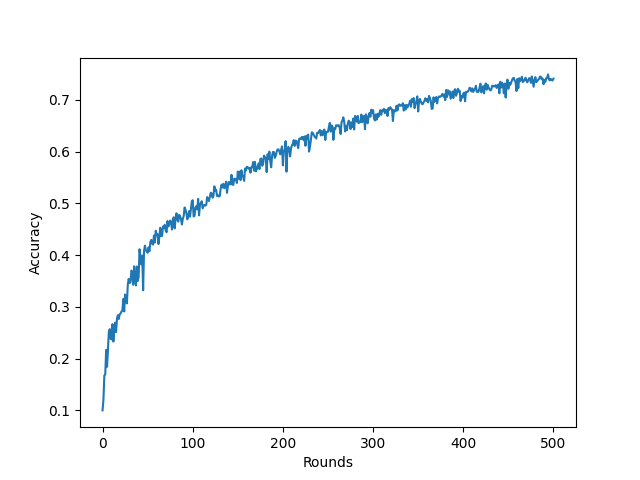
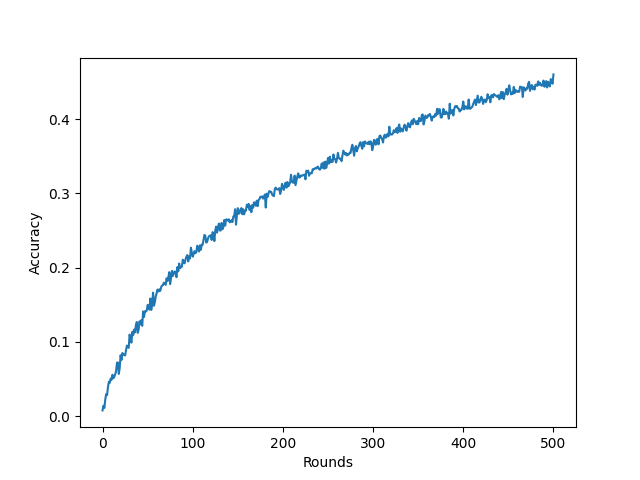

# FedExP: Speeding Up Federated Averaging via Extrapolation

> Note: If you use this baseline in your work, please remember to cite the original authors of the paper as well as the Flower paper.

****Paper:**** [openreview.net/forum?id=IPrzNbddXV](https://openreview.net/forum?id=IPrzNbddXV)

****Authors:**** : Divyansh Jhunjhunwala, Shiqiang Wang, Gauri Joshi

****Abstract:**** : Federated Averaging (FedAvg) remains the most popular algorithm for Federated Learning (FL) optimization due to its simple implementation, stateless nature, and privacy guarantees combined with secure aggregation. Recent work has sought to generalize the vanilla averaging in FedAvg to a generalized gradient descent step by treating client updates as pseudo-gradients and using a server step size. While
the use of a server step size has been shown to provide performance improvement theoretically, the practical benefit of the server step size has not been seen in most existing works. In this work, we present FedExP, a method to adaptively determine the server step size in FL based on dynamically varying pseudo-gradients throughout the FL process. We begin by considering the overparameterized convex regime, where we reveal an interesting similarity between FedAvg and the Projection Onto Convex Sets (POCS) algorithm. We then show how FedExP can be motivated as a novel extension to the extrapolation mechanism that is used to speed up POCS. Our theoretical analysis later also discusses the implications of FedExP in under-parameterized and non-convex settings. Experimental results show that
FedExP consistently converges faster than FedAvg and competing baselines on a range of realistic FL datasets.


## About this baseline

****What’s implemented:**** : The code in this directory replicates the experiments in the paper(FedExP: Speeding Up Federated Averaging via Extrapolation), which proposed the FedExP strategy. Specifically, it replicates the results for Cifar10 and Cifar100 in Figure 3.

****Datasets:**** : Cifar10 and Cifar100 from PyTorch's Torchvision

****Hardware Setup:**** : The experiment has been conducted on our server with the following specs: 
- **GPU:** 1 Tesla V100 GPU 32GB VRAM
- **CPU:** 1x24 cores Intel Xeon(R) 6248R
- **RAM:** 150 GB

****Contributors:**** : Omar Mokhtar, Roeia Amr and Yahia Salaheldin Shaaban


## Experimental Setup

****Task:**** : Image classification

****Model:**** : This directory implements the ResNet-18 Model:
The ResNet-18 model is employed in the paper as the core architecture for experiments on CIFAR-10 and CIFAR-100 datasets.

****Dataset:**** :
The baseline utilizes both CIFAR-10 and CIFAR-100 datasets, which will be distributed among 100 clients. The Dirichlet distribution is employed to introduce variability in the composition of client datasets for CIFAR.

| Dataset  | #classes | #partitions |  partitioning method   |
|:---------|:--------:|:-----------:|:----------------------:|
| Cifar10  |    10    |     100     | Dirichlet distribution |
| Cifar100 |   100    |     100     | Dirichlet distribution |


****Training Hyperparameters:**** :
The following tables show the main hyperparameters for this baseline with their default value (i.e. the value used if you run `python main.py` directly)

| Description                 | Default Value                       |
|-----------------------------|-------------------------------------|
| total clients               | 100                                 |
| clients per round           | 20                                  |
| number of rounds            | 500                                 |
| number of local rounds      | 2                                   |
| batch_size                  | 50                                  |
| client resources            | {'num_cpus': 2.0, 'num_gpus': 0.1 } |
| eta_l (local learning rate) | 0.01                                |
| epsilon                     | 0.001                               |
| decay                       | 0.998                               |
| weight_decay                | 0.0001                              |
| max_norm                    | 10                                  |

For Dataset:
Choice of alpha parameter for the Dirichlet distribution used to create heterogeneity in the client datasets for CIFAR

| Description | Default Value |
|-------------|---------------|
| alpha       | 0.3           |

## Environment Setup

To construct the Python environment follow these steps:

```bash
# set local python version via pyenv
pyenv local 3.10.6

# then fix that for poetry
poetry env use 3.10.6

# then install poetry env
poetry install

# activate the environment
poetry shell

```

## Running the Experiments

To run this FedExP with CIFAR10 baseline, first ensure you have activated your Poetry environment (execute `poetry shell` from this directory), then:
```bash  
python -m fedexp.main # this will run using the default settings in the `conf/config.yaml`

# you can override settings directly from the command line
python -m fedexp.main seed=33 num_rounds=200 # will set seed to 33 and the number of rounds to 200

# if you run this baseline with a larger model, you might want to use the GPU (not used by default).
# you can enable this by overriding the `server_device` and `client_resources` config. For example
# the below will run the server model on the GPU and 20 clients will be allowed to run concurrently on a GPU (assuming you also meet the CPU criteria for clients)
python -m fedprox.main server_device=cuda client_resources.num_gpus=0.01
```

To run using CIFAR100:

```bash
poetry run -m fedexp.main --config-name cifar100
```

To run using FedAvg:

```bash
poetry run -m fedexp.main strategy.algorithm=fedavg
```


## Expected Results

```bash
poetry run -m fedexp.main --multirun strategy.alogrithm=[fedexp,fedavg]
```
| FedExP | FedAvg |
|:----:|:----:|
| |  |


```bash
poetry run -m fedexp.main --config-name cifar100 --multirun strategy.alogrithm=[fedexp,fedavg]
```
| FedExP | FedAvg |
|:----:|:----:|
|  |  |
