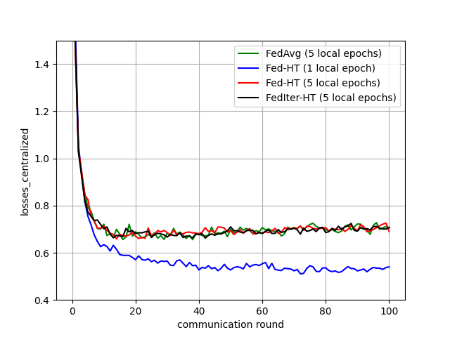
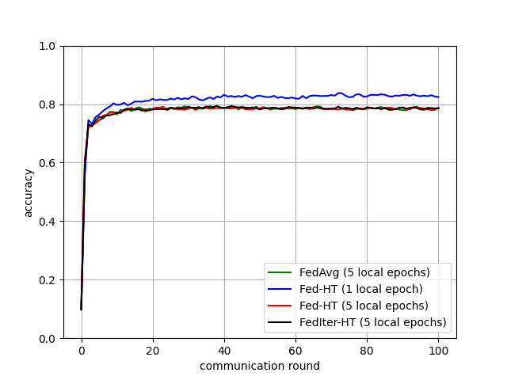

# Federated nonconvex sparse learning

> Note: If you use this Flower baseline in your work, please remember to cite the original authors of the paper, as well as Flower.

**Paper:** [https://par.nsf.gov/servlets/purl/10378100](https://par.nsf.gov/servlets/purl/10378100)

**Authors:** Qianqian Tong, Guannan Liang, Tan Zhu, Jinbo Bi

**Abstract:** Nonconvex sparse learning plays an essential role in many areas, such as signal processing and deep network compression. Iterative hard thresholding (IHT) methods are the state-of-the-art for nonconvex sparse learning due to their capability of recovering true support and scalability with large datasets. Theoretical analysis of IHT is currently based on centralized IID data. In realistic large-scale situations, however, data are distributed, hardly IID, and private to local edge computing devices. It is thus necessary to examine the property of IHT in federated settings, which update in parallel on local devices and communicate with a central server only once in a while without sharing local data. In this paper, we propose two IHT methods: Federated Hard Thresholding (Fed-HT) and Federated Iterative Hard Thresholding (FedIter-HT). We prove that both algorithms enjoy a linear convergence rate and have strong guarantees to recover the optimal sparse estimator, similar to traditional IHT methods, but now with decentralized non-IID data. Empirical results demonstrate that the Fed-HT and FedIter-HT outperform their competitor - a distributed IHT, in terms of decreasing the objective values with lower requirements on communication rounds and bandwidth.

# Environment Setup

Once inside the fedht folder (where the pyproject.toml is), you can install the project using [poetry](https://github.com/python-poetry/poetry), which automatically creates a virtual enviornment.
 
```bash
# Set python version
pyenv install 3.11.3
pyenv local 3.11.3

# Tell poetry to use python 3.11
poetry env use 3.11.3

# Install the project
poetry install

# Activate virtual environment
poetry shell
```

## About this baseline

The purpose of this baseline is 1) implement the federated aggregation strategies introduced in Tong et. al. 2020, and 2) showcase the aggregation strategies with the datasets included in the paper. The two strategies introduced include Fed-HT and FedIter-HT. Fed-HT and FedIter-HT both apply hardthresholding (restricted by the hardthresholding parameter $\tau$) following the aggregation step. FedIter-HT, additionally, applies hardthresholding to each client model prior to aggregation. We also include results using FedAvg.

A federated logistic regression classification model is implemented using the well-known MNIST dataset (with 10 clients).

| Dataset           | Model                            | Features | Classes |
| ------------------| ---------------------------------|----------|---------|
| `MNIST`           | `Multinomial Regression`         |724       | 10      |

**Contributors:** Chancellor Johnstone <chancellor.johnstone@gmail.com>

**Training Hyperparameters:** The hyperparameters can be found in `conf/base_<dataset_name>.yaml` files. The configuration files can be adjusted inline when calling the function from the terminal. The hardthresholding parameter can be adjusted through the `num_keep`. FedIter-HT can be implemented by setting `iterht=True`, but the default sets `iterht=False`. 

| Description           | Default Value (MNIST)               |
| --------------------- | ----------------------------------- |
| `num_clients`         | `10`                                |
| `num_rounds`          | `100`                               |
| `batch_size`          | `50`                                |
| `num_local_epochs`    | `10`                                |
| `num_keep`            | `500`                               |
| `learning_rate`       | `0.0005`                            |
| `weight_decay`        | `0.000`                             |
| `client resources`    | `{'num_cpus': 10, 'num_gpus':0}`    |
| `iterht`              | `False`                             |

We note that in the current implementation, only weights (and not biases) of the model(s) are subject to hardthresholding; this practice aligns with sparse model literature. Additionally, the `num_keep` hardthresholding parameter is enforced at the output layer level, as opposed to constraining the number of parameters across the entire model. Specifically, for a fully connected layer with $i$ inputs and $j$ outputs, the $j$-th output's parameters are constrained by `num_keep`.

## Expected Results
### MNIST (`num_keep` = 500)
```
python -m fedht.main --config-name base_mnist agg=fedavg num_keep=500 num_local_epochs=5 learning_rate=0.00001
python -m fedht.main --config-name base_mnist agg=fedht num_keep=500 num_local_epochs=5 learning_rate=0.00001
python -m fedht.main --config-name base_mnist agg=fedht iterht=True num_keep=500 num_local_epochs=5 learning_rate=0.00001
python -m fedht.main --config-name base_mnist agg=fedht num_keep=500 num_local_epochs=1 learning_rate=0.00001
```

<p float="left">
  
  
</p>

Based on the centralized and distributed loss shown in the figures above, we see that FedIter-HT is comparable to FedAvg from a performance perspective and, with certain local epoch selection. i.e., one local epoch, Fed-HT outperforms FedAvg. Additionally, these plots do not show potential gains made with respect to 1) communicaton efficiency due to the sparse nature of Fed-HT and FedIter-HT or 2) interpretability due to a more parsimonious classification model. Results differ slightly from published work due to differing hyperparameters.

