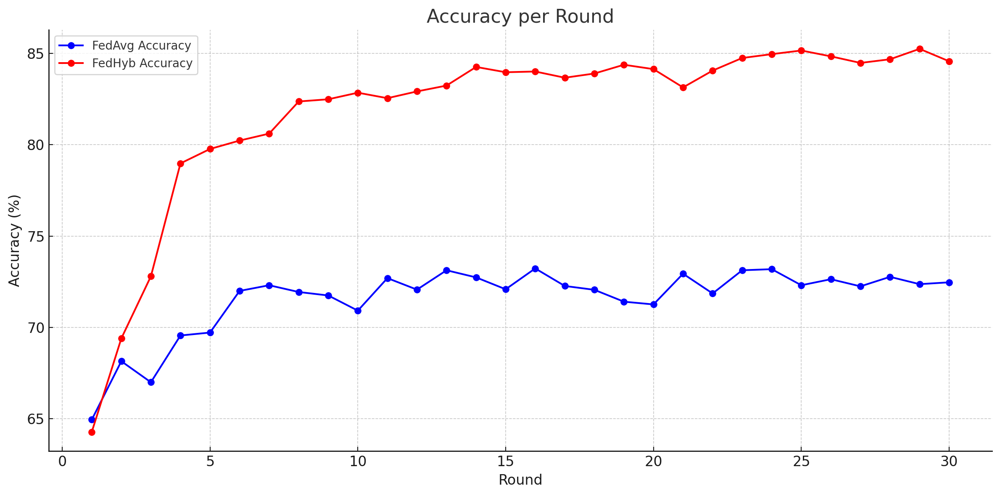
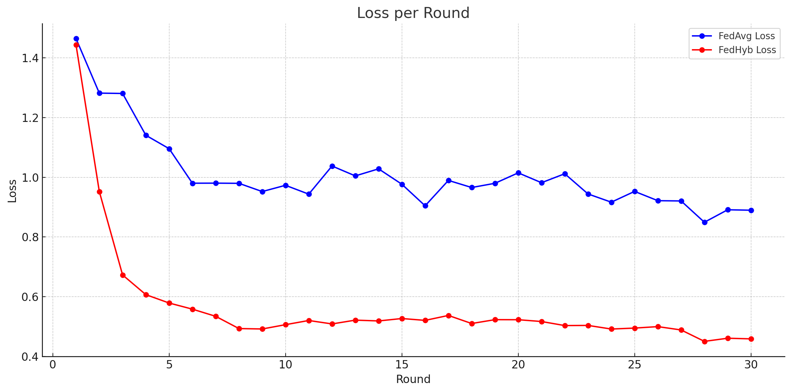
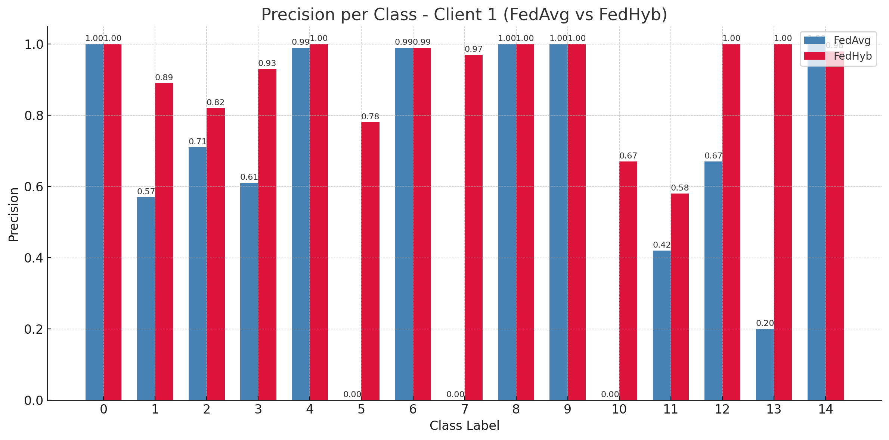

# A hybrid learning technique for intrusion detection system for smart grid

> Note: If you use this baseline in your work, please remember to cite the original authors of the paper as well as the Flower paper.

**Paper:** [https://www.sciencedirect.com/science/article/abs/pii/S2210537925000228](https://www.sciencedirect.com/science/article/abs/pii/S2210537925000228)

**Authors:** Najet Hamdi

**Abstract:** Smart grid is becoming more interconnected with external networks as a result of integrating IoT technologies,
making its supervisory control and data acquisition (SCADA) vulnerable to serious cyberattacks. Therefore, early detection of suspicious activities is of utmost importance to safeguard SCADA systems. Machine learning (ML) algorithms are effective methods for developing intrusion detection systems. However, developing an efficient and reliable detection system for smart grids remains challenging: Most suggested ML-based intrusion detection methods are based on centralized learning, in which data is collected from smart meters and transferred to a central server for training. Transferring sensitive data adds another burden to safeguarding smart grids, since it may result in significant privacy breaches and data leaks in the event of attacking the central server. In contrast to centralized learning, federated learning (FL) offers data privacy protection. FL is an
emerging cooperative learning that enables training between smart devices (clients) using local datasets which are kept on the clients’ sides. The resilience of FL-based detection systems in real-world situations, however, has not yet been examined, as clients may encounter various assaults, resulting in their local datasets having more or fewer attacks than others participating in the learning process. Motivated by this concern, we propose a FL-based intrusion detection for SCADA systems where clients have different attacks. We examine the impact of having missing attacks in local datasets on the performance of FL-based classifier. The experimental findings demonstrate a significant performance degradation of the FL-based model. As a remedy, we suggest a novel learning method – hybrid learning – that combines centralized and federated learning. The experimental results
show that the hybrid learning classifier succeeds in identifying unseen attacks.


## About this baseline

**What’s implemented:**  The code in this directory presents an improved implementation of the experiments from the referenced paper for SCADA intrusion detection using imbalanced client datasets in a federated learning setting. It simulates a realistic scenario where certain attack classes are intentionally excluded from specific clients’ training sets but appear during validation to assess the model’s ability to generalize and detect unseen threats. To enhance performance under such imbalance, the aggregation strategy incorporates both rarity and entropy-based scoring. Rarity quantifies the uniqueness of each client’s available classes relative to the overall class distribution, while entropy measures the diversity of classes within a client's dataset. These scores are combined to weigh client updates, rewarding clients with diverse or rare class distributions, thereby improving detection of underrepresented attack types.

**Datasets:** CSE-CIC-IDS2018     Online [here](https://www.unb.ca/cic/datasets/ids-2018.html).

**Hardware Setup:** This baseline was evaluated in a regular PC without GPU (Intel i7-10710U CPU, and 32 Gb RAM). The major constraint is to run a huge number of rounds such as the reference paper that reports 10.000 round for each case evaluated. 

**Contributors:** Najet Hamdi


## Experimental Setup

**Task:** Classification of cyberattacks.

**Model:** A simple MLP with four layers layers.

**Dataset:** The CSE-CIC-IDS2018 dataset is downloaded and renamed to `dataset.csv` and placed  in the `dataset/` directory.
 By default, the dataset will be partitioned into `num_clients`  clients following a stratified split based on the labels. Each client has a different number of classes, with the number randomly assigned to mimic real-world scenarios. Importantly, the missing classes are only absent from the clients’ training datasets, while the test data includes all classes. This setup is designed to evaluate each client’s ability to detect previously unseen attacks during testing. The settings are as follows:
| Dataset | #classes | #partitions | partitioning method | partition settings |
| :------ | :---: | :---: | :---: | :---: |
| CSE-CIC-IDS2018 | 15 | `num_clients` | stratified based on labels | different classes per client |


**Training Hyperparameters:** The following table shows the main hyperparameters for this baseline with their default value.
| Description | Default Value |
| ----------- | ----- |
| total clients | 10 |
| clients per round | 10 |
| number of rounds | 30 |
| local epochs | 1 |
| client resources | {'num_cpus': 2.0, 'num_gpus': 0.0 }|
| data partition | stratified based on labels (different classes per client) |
| optimizer | Adam |


## Environment Setup

To construct the Python environment, simply run:

```bash
# Set directory to use python 3.10 (install with `pyenv install <version>` if you don't have it)
pyenv local 3.10.13

# Tell poetry to use python 3.10
poetry env use 3.10.13

# Install
poetry install
```
## Running the Experiments
To run Fedhyb with CSE-CIC-IDS2018  baseline, ensure you have activated your Poetry environment (execute `poetry shell` from this directory), then:

```bash
flwr run . # this will run using the default settings in the `pyproject.toml`


# By default, centralized (server) evaluation is disabled. Therefore, the federated evaluation is activated for all the clients.
# Per_client evaluation metrics (accuracy and loss) are returned to the server at each round for weighted acuracy at he the server's side.
# We adopt a federated evaluation approach to better mimic real-world scenarios, where clients possess heterogeneous and imbalanced data #distributions.
```

## Expected Results
  The default algorithm used  is `fedhyb`. To use `fedavg` please change the `algorithm` property in the pyproject.toml file.   
  All plots shown below are generated under default settings using the follwing command 'flwr run .'

  When the execution completes, a new directory `logs` will be created with  .txt files that contains the classification report and  performance metrics for each client. 

  As shown by the last plot for a random client, FedHyb shows a notable improvement in detecting previously missing or unseen attack classes ( classes 3, 7, 10, and 14) compared to FedAvg:

    Class 7: Precision jumps from 0.00 in FedAvg to 0.97 in Fedhyb.

    Class 10: From 0.00 in FedAvg to 0.67 in Fedhyb.

    Class 3: From 0.61 to 0.93, indicating better generalization despite limited local exposure.

    Class 14: Precision remains high in both, but slightly improves in Fedhyb.

Conclusion: Fedhyb clearly helps mitigate the effect of class imbalance and supports the generalization of rare or missing attack classes across clients.

  
  
  
