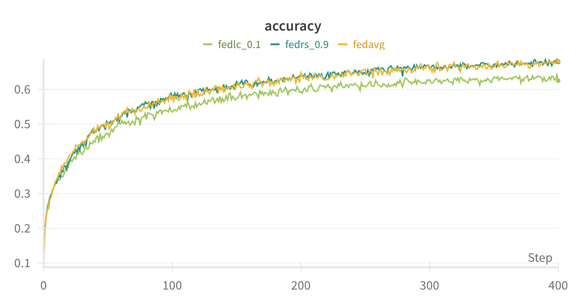
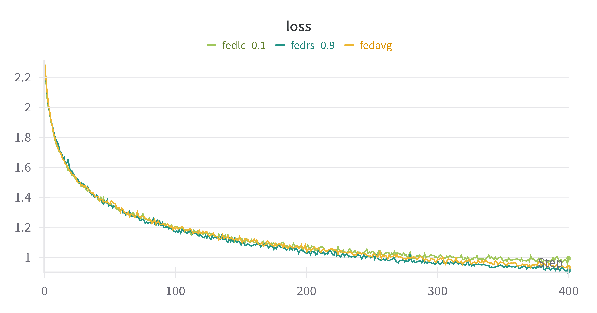
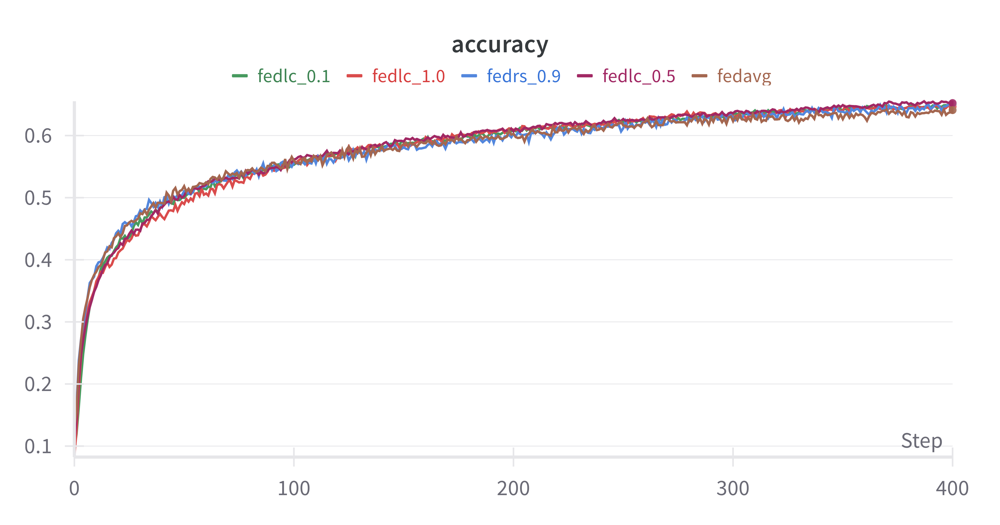
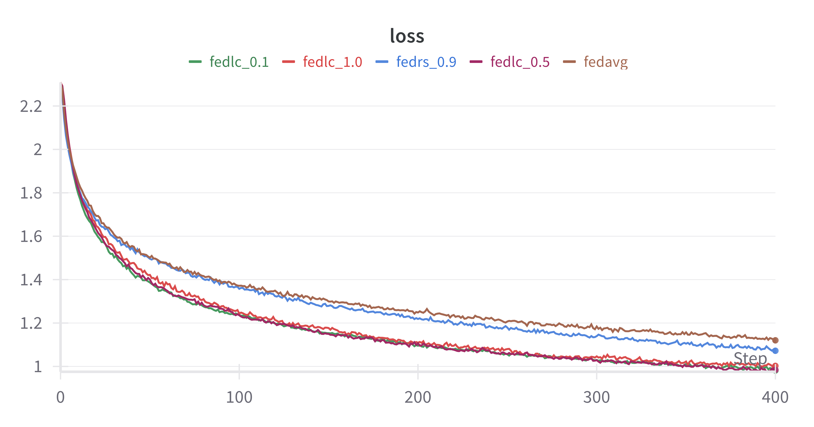

# Federated Learning with Label Distribution Skew via Logits Calibration

> [!NOTE]
> If you use this baseline in your work, please remember to cite the original authors of the paper as well as the Flower paper.

**Paper:** https://proceedings.mlr.press/v162/zhang22p

**Authors:** Jie Zhang, Zhiqi Li, Bo Li, Jianghe Xu, Shuang Wu, Shouhong Ding, Chao Wu

**Abstract:** Traditional federated optimization methods perform poorly with heterogeneous data (i.e. , accuracy reduction), especially for highly skewed data. In this paper, we investigate the label distribution skew in FL, where the distribution of labels varies across clients. First, we investigate the label distribution skew from a statistical view. We demonstrate both theoretically and empirically that previous methods based on softmax cross-entropy are not suitable, which can result in local models heavily overfitting to minority classes and missing classes. Additionally, we theoretically introduce a deviation bound to measure the deviation of the gradient after local update. At last, we propose FedLC (\textbf{Fed}erated learning via \textbf{L}ogits \textbf{C}alibration), which calibrates the logits before softmax cross-entropy according to the probability of occurrence of each class. FedLC applies a fine-grained calibrated cross-entropy loss to local update by adding a pairwise label margin. Extensive experiments on federated datasets and real-world datasets demonstrate that FedLC leads to a more accurate global model and much improved performance. Furthermore, integrating other FL methods into our approach can further enhance the performance of the global model.

## About this baseline

**What’s implemented:** This repo contains an implementation for FedLC (Federated Learning with Logits Correction) introduced by the paper. It also contains code to replicate results from Table 1 and Table 2:

| Dataset  | Partitioning Method | Skewness | Methods |
| :------- | :------: | :------: | :-----------------: |
| CIFAR-10 | Dirichlet  |  dirichlet alpha = 0.05 | FedAvg, FedProx, FedRS, FedLC  |
| CIFAR-10 | Shard-based  | num shards per partition =2 |  FedAvg, FedProx, FedRS, FedLC  |

**Datasets:** CIFAR10

**Hardware Setup:** The paper uses 8x V100 GPU set up. However, due to resource constraints, the experiments were run with ___ GPU. FedLC on CIFAR10 with 20 clients and 400 rounds.

**Contributors:** [@flydump](https://github.com/flydump)

## Experimental Setup

**Task:** Image classification

**Model:** Custom CNN model consisting of 3 CNN layers(with max pooling) and 1 fully connected layer (described in Table 9 in the Appendix of paper)

**Dataset:** The implementation currently only supports CIFAR-10 dataset. The paper considers both distribution-based and quantity-based label skew. Depending on the arguments passed to `--skew-type`, the dataset is partitioned differently. If using `--skew-type distribution` (default), the dataset is partitioned using the [DirichletPartitioner](https://flower.ai/docs/datasets/ref-api/flwr_datasets.partitioner.DirichletPartitioner.html). If `--skew-type quantity` is used, the [ShardPartitioner](https://flower.ai/docs/datasets/ref-api/flwr_datasets.partitioner.ShardPartitioner.html) is used, which sorts the dataset by labels and creates shards, and randomly allocates shards to each client (the number of which depends on the `--num-shards-per-partition` arg) 

| Dataset  |  Num classes | Num clients | Partitioning method |
| :------- | :------: | :------: | :-----------------: |
| CIFAR-10 |    10    |  10  |   Non-IID (Dirichlet and Shard-based)  |

**Training Hyperparameters:** Table below shows the **default** training hyperparams for the experiments. Values are from the original paper where provided. The main hyper-parameter of FedLC is tau which determines the logit calibration strength (refer to Equation 7 of the paper). While this value isn't specified in the paper, I used the default value used in other public implementations of FedLC (see [1](https://github.com/bytedance/feddecorr) and [2](https://github.com/KarhouTam/FL-bench) )

| Description | Default Value |
| ----------- | ----- |
| tau (logit calibration strength) | 0.5 |
| local epochs | 1 |
| learning rate | 0.01 |
| number of rounds | 400 |
| batch size | 128 |
| proximal mu (only used if alg=fedprox) | 0.0 |

## Environment Setup


```bash
# Create the virtual environment
pyenv virtualenv 3.10.14 <name-of-your-baseline-env>

# Activate it
pyenv activate <name-of-your-baseline-env>

# Install the baseline
pip install -e .
```

If running with **wandb**:

```
wandb login
```

## Running the Experiments

## Table 1 (Performance overview for different degrees of distribution-based label skew)

### Commands for CIFAR-10 with dirichlet alpha=0.05

Uses `--dirichlet-alpha=0.05` by default.

|  | Command
| ----------- | ----- | 
| FedAvg | `flwr run . --run-config "alg='fedavg' skew-type='distribution'"` | 
| FedRS ($\alpha$=0.9)| `flwr run . --run-config "alg='fedrs' fedrs-alpha=0.9 skew-type='distribution'"` | 
| FedLC ($\tau$=0.1)| `flwr run . --run-config "alg='fedlc' tau=0.1 skew-type='distribution'"` | 

After 1000 server rounds, the accuracy results on CIFAR-10 are as follows:

|  | Accuracy 
| ----------- | ----- |
| FedAvg | **0.6811** | 
| FedRS ($\tau$=0.9)| 0.6792 | 
| FedLC ($\tau$=0.1) | 0.6251 | 




## Table 2 (Performance overview for different non-IID settings on CIFAR10 and CIFAR100 (quantity-based label skew))

### Commands for CIFAR-10 with num shards per partition=2

Uses `--num-shards-per-partition=2` by default.

|  | Command
| ----------- | ----- | 
| FedAvg | `flwr run . --run-config "alg='fedavg' skew-type='quantity'"` | 
| FedProx (0.0001)| `flwr run . --run-config "alg='fedprox' proximal-mu=0.0001 skew-type='quantity'"` | 
| FedRS ($\alpha$=0.9)| `flwr run . --run-config "alg='fedrs' fedrs-alpha=0.9 skew-type='quantity'"` | 
| FedLC ($\tau$=0.1)| `flwr run . --run-config "alg='fedlc' tau=0.1 skew-type='quantity'"` | 
| FedLC ($\tau$=0.5)| `flwr run . --run-config "alg='fedlc' tau=0.5 skew-type='quantity'"` | 
| FedLC ($\tau$=1.0)| `flwr run . --run-config "alg='fedlc' tau=1.0 skew-type='quantity'"` | 


After 1000 server rounds, the accuracy results on CIFAR-10 are as follows:

|  | Accuracy 
| ----------- | ----- |
| FedAvg | 0.6410 | 
| FedRS ($\tau$=0.9)| 0.6521 | 
| FedLC ($\tau$=0.1) | 0.6503 | 
| FedLC ($\tau$=0.5) | **0.6524** | 
| FedLC ($\tau$=1.0) | 0.6466 | 



