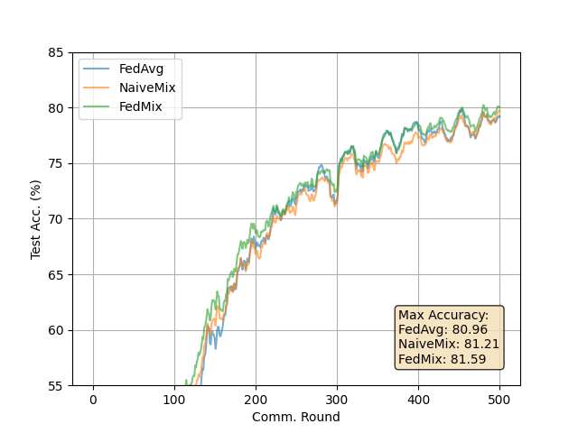

# FedMix: Approximation of Mixup under Mean Augmented Federated Learning

****Paper:**** [arxiv.org/abs/2107.00233](https://arxiv.org/abs/2107.00233)

****Authors:**** Tehrim Yoon, Sumin Shin, Sung Ju Hwang, Eunho Yang

****Abstract:**** Federated learning (FL) allows edge devices to collectively learn a model without directly sharing data within each device, thus preserving privacy and eliminating the need to store data globally. While there are promising results under the assumption of independent and identically distributed (iid) local data, current state-of-the-art algorithms suffer from performance degradation as the heterogeneity of local data across clients increases. To resolve this issue, we propose a simple framework, Mean Augmented Federated Learning (MAFL), where clients send and receive averaged local data, subject to the privacy requirements of target applications. Under our framework, we propose a new augmentation algorithm, named FedMix, which is inspired by a phenomenal yet simple data augmentation method, Mixup, but does not require local raw data to be directly shared among devices. Our method shows greatly improved performance in the standard benchmark datasets of FL, under highly non-iid federated settings, compared to conventional algorithms.


## About this baseline

****What’s implemented:**** The code in this directory implements two of the Federated Strategies mentioned in the paper: NaiveMix and FedMix

****Datasets:**** CIFAR10, CIFAR100, FEMNIST

****Hardware Setup:**** Experiments in this baseline were run on 2x Nvidia Tesla V100 16GB.

****Contributors:**** [DevPranjal](https://github.com/DevPranjal)


## Experimental Setup

****Task:**** Image Classification

****Model:**** Models used are modified versions of existing known models and are descirbed in Appendix B (Experimental Details). For CIFAR10 and CIFAR100 datasets, the authors use a modified version of VGG, while LeNet-5 is used for the FEMNIST dataset.

****Dataset:**** The datasets used (CIFAR10, CIFAR100 FEMNIST) incorporate data heterogenity in diferent ways to simulate a non-iid setting. For CIFAR10 and CIFAR100 experiments, data is allocated such that each client has data from only a selected number of randomly chosen classes. For the FEMNIST experiment, data is allocated such that each client has data from only one writer, resulting in 200-300 samples per client on average.

| Property | CIFAR10 Partioning | CIFAR100 Partioning | FEMNIST Partitioning |
| -- | -- | -- | -- |
| num classes | 10 | 100 | 62 |
| num clients | 60 | 100 | 100 |
| num classes per client | 2 | 20 | |
| non-iidness type | data from selected classes | data from selected classes | data from single writer |


****Training Hyperparameters:****

| Hyperparameter | CIFAR10 Experiments | CIFAR100 Experiments | FEMNIST Experiments |
| -- | -- | -- | -- |
| local epochs | 2 | 10 | 10 |
| local learning rate | 0.01 | 0.01 | 0.01|
| local lr decay after round | 0.999 | 0.999 | 0.999 |
| local batch size | 10 | 10 | 10 |
| num classes per client | 2 | 20 |  |
| total number of clients | 60 | 100 | 100 |
| clients per round | 15 | 10 | 10 |
| mash batch size | full local data (`all`) | full local data (`all`) | full local data (`all`)|
| mixup ratio (fedmix) | 0.05 | 0.1 | 0.2 |
| mixup ratio (naivemix) | 0.1 | 0.1 | 0.2 |
| num rounds | 500 | 500 | 200 |


## Environment Setup

```
# set local python version via pyenv
pyenv local 3.10.6

# then fix that for poetry
poetry env use 3.10.6

# then install poetry env
poetry install

# activate the environment
poetry shell
```

## Running the Experiments

To setup the directory for FEMNIST experiments, run:

```
git clone https://github.com/TalwalkarLab/leaf.git
cp -r leaf/data/femnist fedmix/
cp -r leaf/data/utils fedmix/
```

To run an experiment with default hyperparameters (as mentioned in the paper), execute:

```
python -m fedmix.main +experiment={dataset}_{strategy}
# dataset can be: cifar10, cifar100, femnist
# strategy can be: fedavg, naivemix, fedmix
```

To run custom experiments: create a new `.yaml` file in `conf/experiment` and override the default hyperparameters.

## Expected Results

To get all results, run:

```bash
# femnist experiments
python -m fedmix.main --multirun +experiment=femnist_fedavg,femnist_naivemix,femnist_fedmix

# cifar10 experiments
python -m fedmix.main --multirun +experiment=cifar10_fedavg,cifar10_naivemix,cifar10_fedmix

# cifar100 experiments
python -m fedmix.main --multirun +experiment=cifar100_fedavg,cifar100_naivemix,cifar100_fedmix
```

To generate table (similar to `Table 1` of paper) and figures (similar to `Figure 2` of paper), run the above commands and then:

```bash
# table
python -m fedmix.generate_media --output_type=table --output_path="_static/table.png" --input_directory="results/"

# femnist learning curve
python -m fedmix.generate_media --output_type=figure --output_path="_static/femnist.png" --input_directory="results/" --dataset_name="femnist"

# cifar10 learning curve
python -m fedmix.generate_media --output_type=figure --output_path="_static/cifar10.png" --input_directory="results/" --dataset_name="cifar10"

# cifar100 learning curve
python -m fedmix.generate_media --output_type=figure --output_path="_static/cifar100.png" --input_directory="results/" --dataset_name="cifar100"
```

The expected results are shown below:

| Algorithm | FEMNIST | CIFAR10 | CIFAR100 |
| -- | -- | -- | -- |
| FedAvg | - (85.3) | 80.96 (73.8) | 48.37 (50.4) |
| NaiveMix | - (85.9) | 81.21 (77.4) | 52.55 (53.8) |
| FedMix | - (**86.5**) | **81.59** (**81.2**) | **52.93** (**56.7**) |

Numbers within `()` are the reported results from the paper.


| CIFAR10 | CIFAR100 |
| ---------|----------|
|  |  |