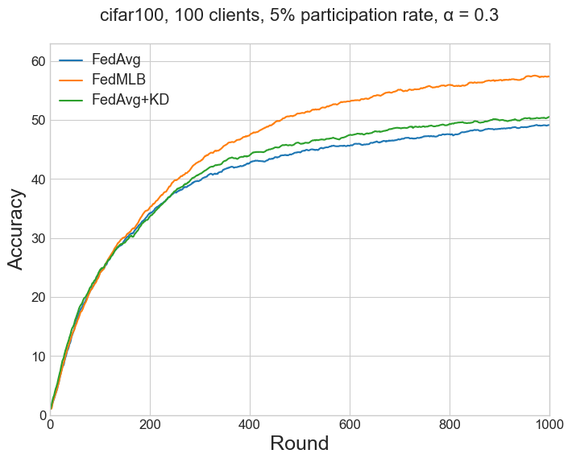
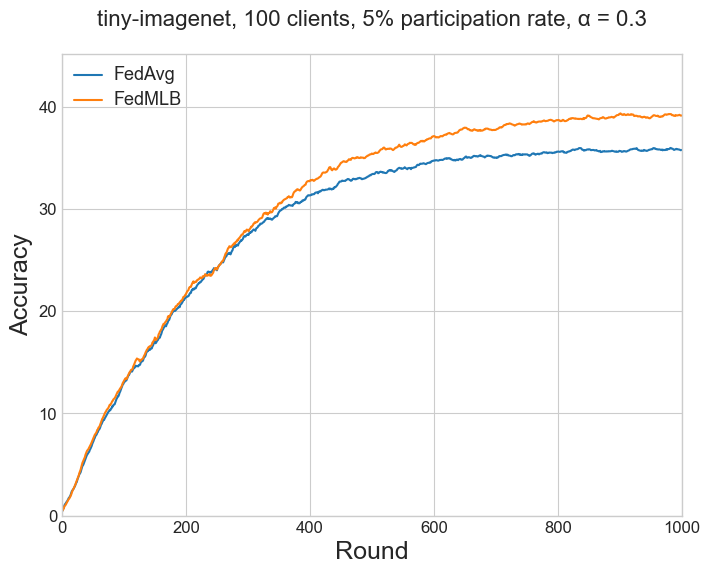
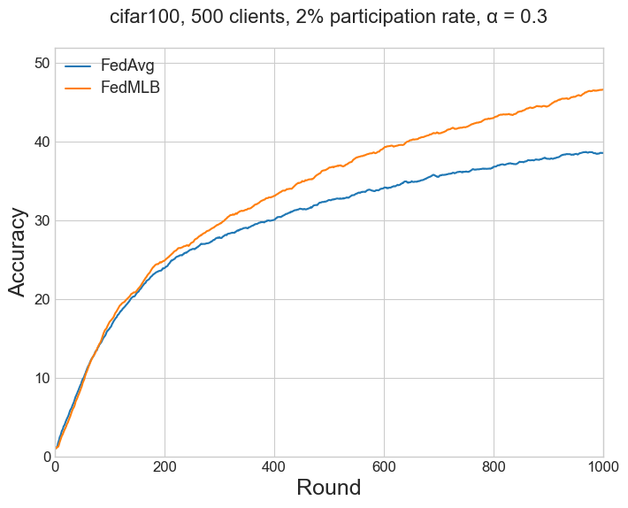
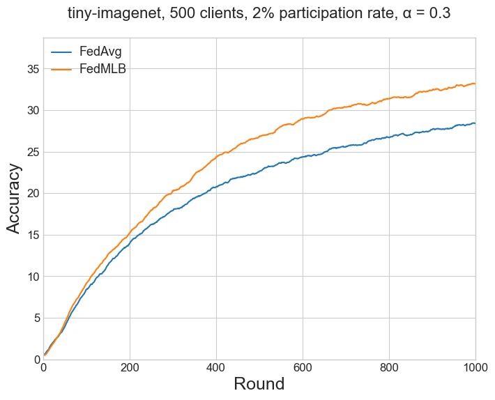
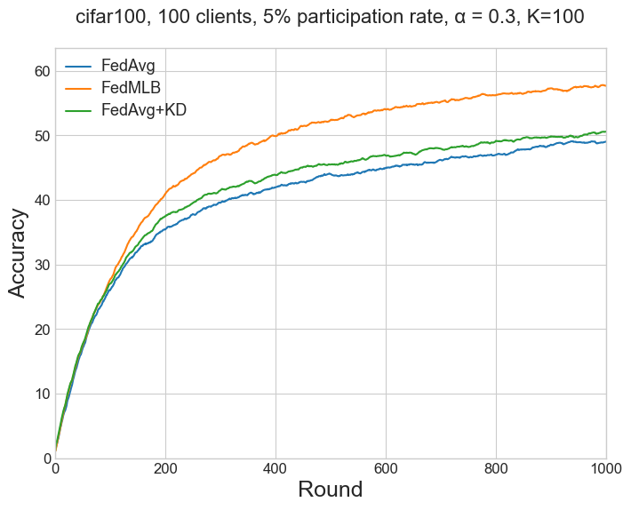

# FedMLB: Multi-Level Branched Regularization for Federated Learning

> Note: If you use this baseline in your work, please remember to cite the original authors of the paper as well as the Flower paper.

**Paper:** [proceedings.mlr.press/v162/kim22a.html](https://proceedings.mlr.press/v162/kim22a.html)

**Authors:** Jinkyu Kim, Geeho Kim, Bohyung Han

**Abstract:** *_A critical challenge of federated learning is data
heterogeneity and imbalance across clients, which
leads to inconsistency between local networks and
unstable convergence of global models. To alleviate
the limitations, we propose a novel architectural
regularization technique that constructs
multiple auxiliary branches in each local model by
grafting local and global subnetworks at several
different levels and that learns the representations
of the main pathway in the local model congruent
to the auxiliary hybrid pathways via online
knowledge distillation. The proposed technique is
effective to robustify the global model even in the
non-iid setting and is applicable to various federated
learning frameworks conveniently without
incurring extra communication costs. We perform
comprehensive empirical studies and demonstrate
remarkable performance gains in terms of accuracy
and efficiency compared to existing methods.
The source code is available in our project page._*


## About this baseline

**What’s implemented:** The code in this directory reproduces the results for FedMLB, FedAvg, and FedAvg+KD.
The reproduced results use the CIFAR-100 dataset or the TinyImagenet dataset. Four settings are available for both
the datasets,
1. Moderate-scale with Dir(0.3), 100 clients, 5% participation, balanced dataset.
2. Large-scale experiments with Dir(0.3), 500 clients, 2% participation rate, balanced dataset.
3. Moderate-scale with Dir(0.6), 100 clients, 5% participation rate, balanced dataset.
4. Large-scale experiments with Dir(0.6), 500 clients, 2% participation rate, balanced dataset.

**Datasets:** CIFAR-100, Tiny-ImageNet.

**Hardware Setup:** The code in this repository has been tested on a Linux machine with 64GB RAM. 
Be aware that in the default config the memory usage can exceed 10GB.

**Contributors:** Alessio Mora (University of Bologna, PhD, alessio.mora@unibo.it).

## Experimental Setup

**Task:** Image classification

**Model:** ResNet-18.

**Dataset:** Four settings are available for CIFAR-100,
1. Moderate-scale with Dir(0.3), 100 clients, 5% participation, balanced dataset (500 examples per client).
2. Large-scale experiments with Dir(0.3), 500 clients, 2% participation rate, balanced dataset (100 examples per client).
3. Moderate-scale with Dir(0.6), 100 clients, 5% participation rate, balanced dataset (500 examples per client).
4. Large-scale experiments with Dir(0.6), 500 clients, 2% participation rate, balanced dataset (100 examples per client).

**Dataset:** Four settings are available for Tiny-Imagenet,
1. Moderate-scale with Dir(0.3), 100 clients, 5% participation, balanced dataset (1000 examples per client).
2. Large-scale experiments with Dir(0.3), 500 clients, 2% participation rate, balanced dataset (200 examples per client).
3. Moderate-scale with Dir(0.6), 100 clients, 5% participation rate, balanced dataset (1000 examples per client).
4. Large-scale experiments with Dir(0.6), 500 clients, 2% participation rate, balanced dataset (200 examples per client).

**Training Hyperparameters:** 

| Hyperparameter  | Description | Default Value |
| ------------- | ------------- | ------------- |
| client optimizer  | Local optimizer. |  SGD|
| client learning rate  |  |  0.1 |
| learning rate decay  | Exponential decay rate for clients' learning rate. |  0.998 |
| server optimizer  | Server optimizer. (SGD with lr=1 is equivalent to applying updated by sum). |  SGD|
| server learning rate  |  |  1.0 |
| clip norm  | Clip norm during local training. | 10.0 |
| weight decay  | Weight decay during local training. |  1e-3 |
| $\lambda_1$  | Used in FedMLB. See Eq. 8 in the original paper. It weights the impact of hybrid cross-entropy loss.|  1.0 |
| $\lambda_2$  | Used in FedMLB. See Eq. 8 in the original paper. It weights the impact of hybrid KL loss.| 1.0 |
| temperature  | Regulates the smoothness of local and global predictions in distillation. | 1.0 |
| $\gamma$   | Used in FedAvg+KD. It weights the impact of local-global distillation on local training.| 0.2 |

## Environment Setup
By default, Poetry will use the Python version in your system. 
In some settings, you might want to specify a particular version of Python 
to use inside your Poetry environment. You can do so with `pyenv`. 
Check the documentation for the different ways of installing `pyenv`,
but one easy way is using the automatic installer:

```bash
curl https://pyenv.run | bash
```
You can then install any Python version with `pyenv install <python-version>`
(e.g. `pyenv install 3.9.17`) and set that version as the one to be used. 
```bash
# cd to your FedMLB directory (i.e. where the `pyproject.toml` is)
pyenv install 3.10.6

pyenv local 3.10.6

# set that version for poetry
poetry env use 3.10.6
```
To build the Python environment as specified in the `pyproject.toml`, use the following commands:
```bash
# cd to your FedMLB directory (i.e. where the `pyproject.toml` is)

# install the base Poetry environment
poetry install

# activate the environment
poetry shell
```
## Running the Experiments
Ensure you have activated your Poetry environment (execute `poetry shell` from
this directory).

### Generating clients' dataset
First (and just the first time), the data partitions of clients must be generated.

#### CIFAR-100 clients' dataset generation

To generate the partitions for the CIFAR-100 settings, i.e.:
1. Moderate-scale with Dir(0.3), 100 clients, balanced dataset (500 examples per client) -- **default config**.
2. Large-scale experiments with Dir(0.3), 500 clients, balanced dataset (100 examples per client);
3. Moderate-scale with Dir(0.6), 100 clients, balanced dataset (500 examples per client);
4. Large-scale experiments with Dir(0.6), 500 clients, balanced dataset (100 examples per client),

use the following commands:
```bash
# this will run using the default settings in the `conf/base.yaml`
# and will generate the setting for 1. (see above)
python -m fedmlb.dataset_preparation 

# this will generate the setting for 2. (see above)
python -m fedmlb.dataset_preparation dataset_config.alpha_dirichlet=0.3 total_clients=500

# this will generate the setting for 3. (see above)
python -m fedmlb.dataset_preparation dataset_config.alpha_dirichlet=0.6 

# this will generate the setting for 4. (see above)
python -m fedmlb.dataset_preparation dataset_config.alpha_dirichlet=0.6 total_clients=500
```
Note that, to reproduce those settings, we leverage the `.txt` files
contained in the `client_data` folder in this project. Such files store
the specific id of examples in the dataset that are associated with a specific client. 
For example, the file `client_data/cifar100/balanced/dirichlet0.3_clients100.txt` contains the
examples for the default setting of this repository. 
Note that those files are provided by the authors themselves
on the [paper's GitHub](https://github.com/jinkyu032/FedMLB/tree/main/client_data).

#### Tiny-ImageNet clients' dataset generation

> Note: To generate the clients' dataset for the Tiny-Imagenet dataset, the original dataset should be downloaded in advance.\
> It can be downloaded at http://cs231n.stanford.edu/tiny-imagenet-200.zip. Unzip the folder. \
> Note: This code supposes to find the folder at the path `/{YOUR_LOCAL_PATH_TO_THE_BASELINE}/fedmlb/tiny-imagenet-200`.

To generate the partitions for the Tiny-ImageNet settings, i.e.:
1. Moderate-scale with Dir(0.3), 100 clients, balanced dataset (1000 examples per client).
2. Large-scale experiments with Dir(0.3), 500 clients, balanced dataset (200 examples per client).
3. Moderate-scale with Dir(0.6), 100 clients, balanced dataset (1000 examples per client).
4. Large-scale experiments with Dir(0.6), 500 clients, balanced dataset (200 examples per client).

use the following commands:
```bash
# commands to generate clients' dataset partitions with Tiny-imagenet
# this will generate the setting for 1. (see above)
python -m fedmlb.dataset_preparation dataset_config.dataset="tiny-imagenet" 

# this will generate the setting for 2. (see above)
python -m fedmlb.dataset_preparation dataset_config.dataset="tiny-imagenet" total_clients=500

# this will generate the setting for 3. (see above)
python -m fedmlb.dataset_preparation dataset_config.dataset="tiny-imagenet" dataset_config.alpha_dirichlet=0.6 

# this will generate the setting for 4. (see above)
python -m fedmlb.dataset_preparation dataset_config.dataset="tiny-imagenet" dataset_config.alpha_dirichlet=0.6 total_clients=500
```

### Using GPUs
The code in this repository relies on TF library.
To make the simulations run on GPUs use the option `client_resources.num_cpus={PER_CLIENT_FRACTION_OF_GPU_MEMORY}`.
The default is `num_gpus=0.0`. 
For example, the following command will run on CPU only. 
```bash
python -m fedmlb.main # `client_resources.num_gpus=0.0` default

# If for instance you want to allow for two clients running on the same GPU
python -m fedmlb.main client_resources.num_gpus=0.5
```

> :warning:
Ensure that TensorFlow is configured to use GPUs.

> To use TensorFlow with GPU, CUDA and cuDNN
> have to be installed.
> Check the compatibility of versions here:
> https://www.tensorflow.org/install/source#gpu.
> For TF==2.12.0 (as required for this baseline implementation)
> CUDA==11.8 and cuDNN==8.6 are required. 
> 


### Run simulations and reproduce results
After having generated the setting, simulations can be run.
 
#### CIFAR-100
The default configuration for `FedMLB.main` uses (1.) for CIFAR-100, and can be run with the following:

```bash
python -m fedmlb.main # this will run using the default settings in the `conf/base.yaml`
```

You can override settings directly from the command line in this way:

```bash
python -m fedmlb.main clients_per_round=10 # this will run using 10 clients per round instead of 5 clients as the default config 

# this will select the dataset partitioned with 0.6 concentration parameter instead of 0.3 as the default config
python -m fedmlb.main dataset_config.alpha_dirichlet=0.6
```

To run using FedAvg:
```bash
# this will use the regular FedAvg local training
python -m fedmlb.main algorithm="FedAvg"
```

To run experiments with all the configurations of CIFAR-100, use the followings:

```bash
# this will use the setting for 1. (default)
python -m fedmlb.main
 
# this will use the setting for 2. (see above)
python -m fedmlb.main total_clients=500 clients_per_round=10 

# this will use the setting for 3. (see above)
python -m fedmlb.main dataset_config.alpha_dirichlet=0.6  

# this will use the setting for 4. (see above)
python -m fedmlb.main dataset_config.alpha_dirichlet=0.6 total_clients=500 clients_per_round=10
```

#### Tiny-Imagenet
For Tiny-ImageNet, as in the original paper, batch size of local updates should be set 
to 100 in settings with 100 clients and to 20 in settings with 500 clients;
this is equal to set the amount of local_updates to 50 (as the default) -- 
so no change to batch size is required --, in fact

local_updates = num_of_local_examples*local_epochs / batch_size

To run experiments with all the configurations of Tiny-ImageNet, use the followings:

```bash
# this will use the setting for 1. (see above)
python -m fedmlb.main dataset_config.dataset="tiny-imagenet" 

# this will use the setting for 2. (see above)
python -m fedmlb.main dataset_config.dataset="tiny-imagenet" total_clients=500 clients_per_round=10

# this will use the setting for 3. (see above)
python -m fedmlb.main dataset_config.dataset="tiny-imagenet" dataset_config.alpha_dirichlet=0.6  

# this will use the setting for 4. (see above)
python -m fedmlb.main dataset_config.dataset="tiny-imagenet" dataset_config.alpha_dirichlet=0.6 total_clients=500 clients_per_round=10
```

#### Setting a custom local batch size value
In the original paper, authors specify the amount of local updates (default to 50), 
and the amount of local epochs (default to 5), so that the batch size corresponds to:

`local_batch_size = round(local_examples * local_epochs / local_updates)`

This is the default configuration also in this repository.

To override this behaviour, and set a specific local batch size (local epochs will still 
be valid), use the following argument when launching the simulation.

```
# this will set the local batch size to 64
python -m fedmlb.main batch_size=64
```

Alternatively, it can be done by directly modifying the `base.yaml` config file by changing the value
of `batch_size`, as follows:
```
# base.yaml
...
batch_size=64 # default to null
...
``` 


### Splitting a Simulation in a bunch of Shorter Simulations
`simulation_manager.sh` contains a simple bash script to
divide a simulation in a bunch of shorter simulations.
For example, it can divide a simulation of 1000 rounds 
(`total_round`) in
50 consecutive simulations of 20 rounds each (`rounds_per_run`).
By the automatic retrieve of last checkpoint, 
the current simulation
restarts from where the previous one stopped and saves a
checkpoint at the end.

To be able to run the script, first give it the execution permission
(for Linux machines) with:
``` 
chmod +x ./simulation_manager.sh
``` 
Then launch it with:
``` 
./simulation_manager.sh
``` 
## Expected Results
This repository can reproduce the results for 3 baselines used in the experimental part
of the original paper: FedMLB, FedAvg, FedAvg+KD.

The following tables compares results produced via the code in this repository
with the results reported in the paper.
Results from the paper are reported in brackets. 
Note that (as in the original paper),
the accuracy at the target round is based on the exponential moving average with the momentum parameter
0.9. Tensorboard allows to easily visualize/calculate the moving average of a run.

All the results reported in this repository can be also downloaded 
from [this link](https://drive.google.com/file/d/1XeTnZfnW1ncaQxPdvDeShXq2dnRR5Njj/view?usp=sharing) 
(`.csv` file, 2MB).

### Table 1a and Table 2

The results of Table 1a in the paper (for FedAvg and FedMLB) refers
to CIFAR-100 (Figure 3) and Tiny-ImageNet (Figure 7a) with 
the setting (1.) Moderate-scale with Dir(0.3), 100 clients, 5% participation rate. 
Results for FedAvg+KD are from Table 2 in the paper.

To reproduce the results run the following:

```bash
# this will produce six consecutive runs
python -m fedmlb.main --multirun dataset_config.dataset="cifar100","tiny-imagenet" algorithm="FedMLB","FedAvg","FedAvg+KD" 
```

#### CIFAR-100 and Tiny-ImageNet, Dir(0.3), 100 clients, 5% participation.

<table>
  <tr>
    <td></td>
    <td style="text-align: center", colspan="4">CIFAR-100</td>
    <td style="text-align: center", colspan="4">Tiny-ImageNet</td>
  </tr>
  <tr>
    <td></td>
    <td colspan="2">Accuracy @500R</td>
    <td colspan="2">Accuracy @1000R</td>
    <td colspan="2">Accuracy @500R</td>
    <td colspan="2">Accuracy @1000R</td>
  </tr>
  <tr>
    <td>Method</td>
    <td>Paper</td>
    <td>This repo</td>
    <td>Paper</td>
    <td>This repo</td>
    <td>Paper</td>
    <td>This repo</td>
    <td>Paper</td>
    <td>This repo</td>
  </tr>
  <tr>
    <td>FedAvg</td>
    <td>41.88</td>
    <td>44.52</td>
    <td>47.83</td>
    <td>49.15</td>
    <td>33.94</td>
    <td>33.39</td>
    <td>35.42</td>
    <td>35.78</td>
  </tr>
  <tr>
    <td>FedAvg+KD</td>
    <td>42.99</td>
    <td>46.03</td>
    <td>49.17</td>
    <td>50.54</td>
    <td></td>
    <td></td>
    <td></td>
    <td></td>
  </tr>
  <tr>
    <td>FedMLB</td>
    <td>47.39</td>
    <td>51.11</td>
    <td>54.58</td>
    <td>57.33</td>
    <td>37.20</td>
    <td>35.42</td>
    <td>40.16</td>
    <td>39.14</td>
  </tr>
</table>

 

### Table 1b and Table 2

The results of Table 1b in the paper (for FedAvg and FedMLB) refers
to CIFAR-100 (Figure 3) and Tiny-ImageNet (Figure 7b) with 
the setting (2.) Large-scale experiments with Dir(0.3), 500 clients, 
2% participation rate.

To reproduce the results run the following:
```bash
python -m fedmlb.main --multirun dataset_config.dataset="cifar100","tiny-imagenet" algorithm="FedMLB","FedAvg" total_clients=500 clients_per_round=10
```
#### CIFAR-100 and Tiny-ImageNet, Dir(0.3), 500 clients, 2% participation.

<table>
  <tr>
    <td></td>
    <td style="text-align: center", colspan="4">CIFAR-100</td>
    <td style="text-align: center", colspan="4">Tiny-ImageNet</td>
  </tr>
  <tr>
    <td></td>
    <td colspan="2">Accuracy @500R</td>
    <td colspan="2">Accuracy @1000R</td>
    <td colspan="2">Accuracy @500R</td>
    <td colspan="2">Accuracy @1000R</td>
  </tr>
  <tr>
    <td>Method</td>
    <td>Paper</td>
    <td>This repo</td>
    <td>Paper</td>
    <td>This repo</td>
    <td>Paper</td>
    <td>This repo</td>
    <td>Paper</td>
    <td>This repo</td>
  </tr>
  <tr>
    <td>FedAvg</td>
    <td>29.87</td>
    <td>32.54</td>
    <td>37.48</td>
    <td>38.75</td>
    <td>23.63</td>
    <td>22.62</td>
    <td>29.48</td>
    <td>28.37</td>
  </tr>
  <tr>
    <td>FedMLB</td>
    <td>32.03</td>
    <td>36.63</td>
    <td>42.61</td>
    <td>46.65</td>
    <td>28.39</td>
    <td>26.84</td>
    <td>33.67</td>
    <td>33.13</td>
  </tr>
</table>

 

### Table 3

To reproduce results reported in Table 3 of the paper,
resulting from _more local iterations_ (K=100 or K=200 in the
paper, instead of K=50), run the following:
```bash
python -m fedmlb.main --multirun algorithm="FedMLB","FedAvg","FedAvg+KD" local_updates=100 # or local_updates=200 
```
#### K = 100 (local updates)
<table>
  <tr>
    <td></td>
    <td colspan="2">Accuracy @500R</td>
    <td colspan="2">Accuracy @1000R</td>
  </tr>
  <tr> 
    <td>Method</td>
    <td>Paper</td>
    <td>This repo</td>
    <td>Paper</td>
    <td>This repo</td>
  </tr>
  <tr>
    <td>FedAvg</td>
    <td>41.92</td>
    <td>44.02</td>
    <td>48.15</td>
    <td>49.05</td>
  </tr>
  <tr>
    <td>FedAvg+KD</td> 
    <td>42.58</td>
    <td>45.49</td>
    <td>49.15</td>
    <td>50.58</td>
  </tr>
  <tr>
    <td>FedMLB</td> 
    <td>52.53</td>
    <td>52.38</td>
    <td>58.52</td>
    <td>57.69</td>
  </tr>
</table>

 

## Results logging via Tensorboard
Beside storing results in plain text in the `output` folder, the results are also stored via 
tensorboard logs.

To launch the tensorboard to monitor results use the following command
in your activated python environment:
```bash
tensorboard --logdir /{YOUR_LOCAL_PATH_TO_THE_BASELINE}/fedmlb/fedmlb/tb_logging/
```
The command will output an address for localhost,
and results can be navigated and visualized via tensorboard GUI 
by using a browser at that address. 

Tensorboard logs in this baselines are stored in a folder with the following path structure: 
`fedmlb/fedmlb/tb_logging/{DATASET}/{MODEL}/{METHOD}/K_{LOCAL_UPDATES}/{TOTAL_CLIENTS}_clients/dir_{ALPHA_DIRICHLET}/seed_{RANDOM_SEED}`

For example, for default results with FedAvg, logs will be stored at:
`fedmlb/fedmlb/tb_logging/cifar100/resnet18/FedAvg/K_50/100_clients/dir_0.3/seed_3`
 
## Additional Detail About This Implementation
The `models.py` file contains the implementation of the models used in this baseline. A regular ResNet18 is
implemented for regular FedAvg. However, FedMLB leverages *hybrid paths* to regularize local training,
with such hybrid paths composed of a series of frozen blocks from the global models (see the paper
for reference). As in the original implementation, in `models.py` you will find the `ResNet18MLB`
that is a custom version of the regular ResNet18 containing the support for such hybrid paths (see the
`call` method of `ResNet18MLB` class).

This baseline implementation is based on TensorFlow and Keras primitives. Note that the custom
local training of `FedMLB` and `FedAvg+KD` is implemented by subclassing the `tf.keras.Model` class 
and overriding the `train_step` method (which is called automatically at each batch iteration). The
custom `tf.keras.Model` are contained in `FedAvgKDModel.py` and `FedMLBModel.py`.

Note that `FedMLB` and `FedAvg+KD` are client-side methods, which do not impact the aggregation phase 
of regular FedAvg (so this means that the built-in Flower strategy for FedAvg does not require
modifications). For this reason, there is no relevant modification in `server.py`; the `MyServer` class
just allows to start the training starting from a round > 1 (useful to stop and restart a training
saving/loading its state).

To reproduce results, preprocessing of data is of paramount importance. 
For CIFAR-100, the preprocessing of training images includes normalization,
random rotation, random crop and random flip of images; test images
are just normalized. 
For Tiny-ImageNet, the preprocessing of training images includes normalization,
random rotation, random crop and random flip of images; test images
are normalized and center cropped.
This code uses or defines subclasses of the `tf.keras.layers.Layer` class
to leverage a series of preprocessing layer to be used in the `.map()`
primitive of `tf.data.Dataset` (see `dataset.py`).

### Special Configs
The config file (`base.yaml`) contains some flags to enable features like restarting from
saved checkpoint, saving a checkpoint at the end of the training, and logging
memory usage.

- `restart_from_checkpoint: True`
If True, looks for a checkpoint of that config to restart the training,
otherwise initializes a new model.

- `save_checkpoint: True`
If True, saves a checkpoint server model at the end of the training. Checkpoints 
will be saved at the local path:
`fedmlb/fedmlb/model_checkpoints/{DATASET}/{MODEL}/{METHOD}/K_{LOCAL_UPDATES}/{TOTAL_CLIENTS}_clients/dir_{ALPHA_DIRICHLET}/seed_{RANDOM_SEED}/checkpoint_R{CURRENT_ROUND}`.

- `logging_memory_usage: False`
If True, logs memory and GPU's memory usage (need for psutil and nvidia-smi 
installed).

## Differences with the Original Implementation
In the original implementation from 
[paper's GitHub](https://github.com/jinkyu032/FedMLB/blob/main/federated_train.py#L47C12-L47C12)
CIFAR-100 images are normalized as follows:

`normalize = transforms.Normalize((0.4914, 0.4822, 0.4465), (0.2470, 0.2435, 0.2616))`

In this repository, normalization values for the three channels are slightly different, i.e.:

`tf.keras.layers.Normalization(mean=[0.5071, 0.4865, 0.4409], 
                                variance=[np.square(0.2673), np.square(0.2564), np.square(0.2762)])`

This may be the reason for the slightly improved results reported in this repo with CIFAR-100 clients 
with respect to the results in the original paper.
