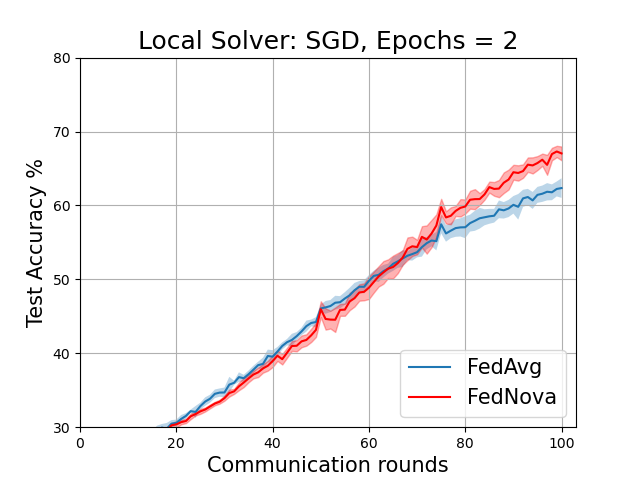
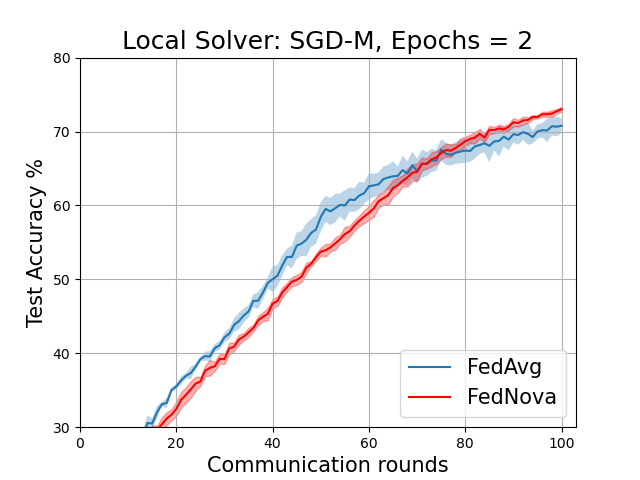
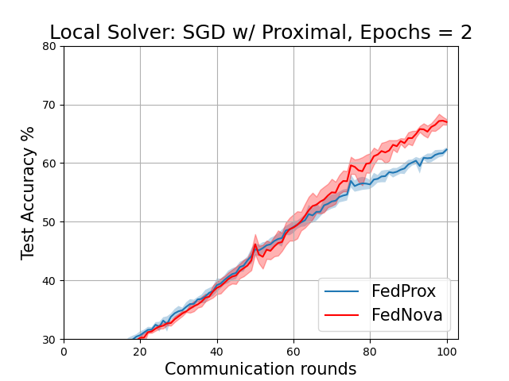
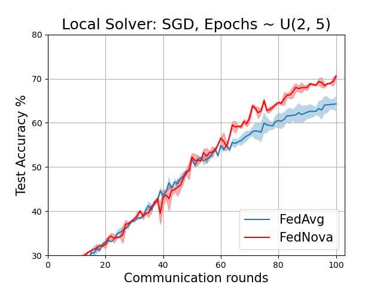
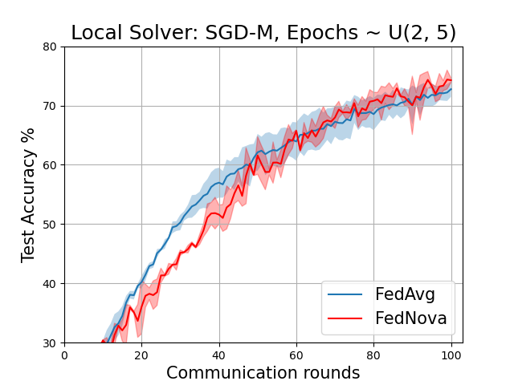
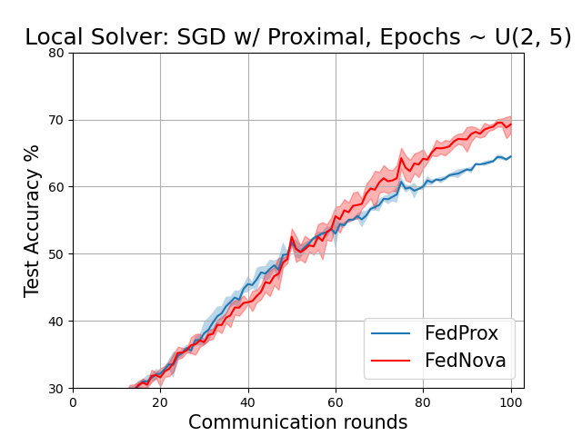

# Tackling the Objective Inconsistency Problem in Heterogeneous Federated Optimization

**Paper:** [arxiv.org/abs/2007.07481](https://arxiv.org/abs/2007.07481)

**Authors:** *Jianyu Wang, Qinghua Liu, Hao Liang, Gauri Joshi, H. Vincent Poor*

**Abstract:** *In federated learning, heterogeneity in the clients' local datasets and computation speeds results in large variations in the number of local updates performed by each client in each communication round. Naive weighted aggregation of such models causes objective inconsistency, that is, the global model converges to a stationary point of a mismatched objective function which can be arbitrarily different from the true objective. This paper provides a general framework to analyze the convergence of federated heterogeneous optimization algorithms. It subsumes previously proposed methods such as FedAvg and FedProx and provides the first principled understanding of the solution bias and the convergence slowdown due to objective inconsistency. Using insights from this analysis, we propose FedNova, a normalized averaging method that eliminates objective inconsistency while preserving fast error convergence.*


## About this baseline

**What’s implemented:** *_The code in this baseline reproduces the results from Table 1 in the paper which corresponds to experiments on Non-IID CIFAR dataset._*

**Datasets:** *_The dataset in the experiment is a Non-IID CIFAR-10 dataset which is partitioned across 16 clients using a Dirichlet distribution with parameter alpha=0.1._*

**Hardware Setup:** *_The experiment setting consists of 16 clients. The training is done on a single workstation consisting of 8 CPU cores, 32 GB of RAM and an Nvidia A100 GPU. 
The total GPU memory usage for the experiment is ~ 10 GB(1.1 GB per client + main process). Therefore effectively, 8 clients run in parallel in this setup using the default config. 
The total time for a single experiment in this setup is ~ 50 minutes. (or 30 seconds per communication round). In case of resource constraints, 
the experiment can be run with 4 clients in parallel by setting client_resources as follows: {num_cpus: 1, num_gpus: 0.25}. This uses ~ 5.4 GB of GPU memory and 4 CPU cores._*

**Contributors:** *_Aasheesh Singh (Github: [@ashdtu](https://github.com/ashdtu)), MILA-Quebec AI Institute_*


## Experimental Setup

**Task:** The task is Image classification on CIFAR-10 dataset.

**Model:** The experiment uses the below configuration of VGG-11 model for the image classification task. 
```
----------------------------------------------------------------
        Layer (type)               Output Shape         Param #
================================================================
            Conv2d-1           [-1, 64, 32, 32]           1,792
              ReLU-2           [-1, 64, 32, 32]               0
         MaxPool2d-3           [-1, 64, 16, 16]               0
            Conv2d-4          [-1, 128, 16, 16]          73,856
              ReLU-5          [-1, 128, 16, 16]               0
         MaxPool2d-6            [-1, 128, 8, 8]               0
            Conv2d-7            [-1, 256, 8, 8]         295,168
              ReLU-8            [-1, 256, 8, 8]               0
            Conv2d-9            [-1, 256, 8, 8]         590,080
             ReLU-10            [-1, 256, 8, 8]               0
        MaxPool2d-11            [-1, 256, 4, 4]               0
           Conv2d-12            [-1, 512, 4, 4]       1,180,160
             ReLU-13            [-1, 512, 4, 4]               0
           Conv2d-14            [-1, 512, 4, 4]       2,359,808
             ReLU-15            [-1, 512, 4, 4]               0
        MaxPool2d-16            [-1, 512, 2, 2]               0
           Conv2d-17            [-1, 512, 2, 2]       2,359,808
             ReLU-18            [-1, 512, 2, 2]               0
           Conv2d-19            [-1, 512, 2, 2]       2,359,808
             ReLU-20            [-1, 512, 2, 2]               0
        MaxPool2d-21            [-1, 512, 1, 1]               0
          Dropout-22                  [-1, 512]               0
           Linear-23                  [-1, 512]         262,656
             ReLU-24                  [-1, 512]               0
          Dropout-25                  [-1, 512]               0
           Linear-26                  [-1, 512]         262,656
             ReLU-27                  [-1, 512]               0
           Linear-28                   [-1, 10]           5,130
================================================================
Total params: 9,750,922
Trainable params: 9,750,922
Non-trainable params: 0
----------------------------------------------------------------
Input size (MB): 0.01
Forward/backward pass size (MB): 2.57
Params size (MB): 37.20
Estimated Total Size (MB): 39.78
----------------------------------------------------------------
```

**Dataset:** The dataset is Non-IID CIFAR-10 dataset which is partitioned across 16 clients using a Dirichlet distribution Dir16(0.1), (alpha=0.1) as done
in the [paper](https://arxiv.org/abs/2002.06440). Each client gets a different skewed distribution of the class labels following this split.

**Training Hyperparameters:**

| Hyperparameter                  | Description                                                                               | Default value |
|----------------------------------|-------------------------------------------------------------------------------------------|---------------|
| optimizer.learning_rate          | Learning rate of local client optimizers                                                  | 0.02          |
| optimizer.momentum               | Momentum factor                                                                          | 0.9             |
| optimizer.mu                     | Proximal updates factor                                                                  | 0             |
| optimizer.weight_decay          | Weight decay for regularization                                                          | 1e-4          |
| num_epochs                       | Number of local training epochs for clients                                               | 2             |
| num_rounds                       | Number of server communication rounds                                                    | 100           |
| var_local_epochs                 | Whether to have variable or fixed local client training epochs. If True, samples num_epochs uniformly in (2,5) | False         |
| batch size                       | Batch size for training                                                                   | 32            |


## Environment Setup

``` python
# Navigate to baselines/fednova
cd baselines/fednova

# Set python version
pyenv install 3.10.11
pyenv local 3.10.11

# Tell poetry to use python 3.10
poetry env use 3.10.11

# install the base Poetry environment, make sure there is no existing poetry.lock file and pyproject.toml file is located in the current directory
poetry install

# activate the environment
poetry shell
```

## Running the Experiments
Once the poetry environment is active, you can use the following command to run the various experiments in Table 1.
You would need to specify the below two command line parameters to iterate through various experiment configurations. They are as follows:

1. `optimizer`: This parameter specifies the local optimizer configuration. It can take the following values:
    - `vanilla`: This corresponds to the vanilla SGD as the client optimizer
    - `momentum`: This corresponds to the SGD optimizer with momentum. It is the default optimizer setting.
    - `proximal`: This corresponds to the SGD optimizer with proximal term in the loss.
    - `server`: This corresponds to momentum updates of global weights on the strategy or server side. The client optimizers do not use momentum in this setting. This setting is only valid for FedNova strategy. 
    - `hybrid`: This corresponds to hybrid momentum scheme where both the local client optimizer and the server maintain a momentum buffer. This setting is only valid for FedNova strategy. 

2. `strategy`: This specifies the aggregation strategy for the client updates. The default is `fednova`. 
If you do not specify this parameter, all experiments will run with FedNova as the strategy and reproduce the rightmost columns of Table 1. 
It can take the following values:
    - `fednova`: This corresponds to the FedNova (default) aggregation strategy.
    - `fedavg`: This corresponds to the FedAvg aggregation strategy. The left column of Table 1 can be reproduced by setting this parameter.

3. `var_local_epochs`: Takes value True/False. This parameter specifies whether the number of local training epochs for each client is fixed (Epochs=2) or variable(Uniform sampled from [2,5) ). 
It takes the following values:
   - `False`: (default) This corresponds to the fixed number of local epochs for each client. This corresponds to the first part of the Table 1.
   - `True`: This corresponds to the variable number of local epochs for each client. This corresponds to the second part of the Table 1.

```bash  
# Run experiments for first 6 rows of Table-1 below. 
python -m fednova.main --multirun optimizer=vanilla,momentum,proximal strategy=fedavg,fednova var_local_epochs=False,True seed=4,5,6

# Run experiments to compare effect of Momentum (No momentum vs Server vs Hybrid)
python -m fednova.main --multirun optimizer=server,hybrid strategy=fednova var_local_epochs=True seed=4,5,6

# Plot results and generate Results table. The plots are saved in _static/ directory. 
python fednova/utils.py

```

> **Note**: Due to instability in weight updates in hetrogeneous learning setting on Non-IID datasets, one or two experiments may show NaNs in the loss for few very unlucky seeds. 
> It is recommended to run each experiment for at-least 2-3 seeds for best results.

## Expected Results

The results below correspond to Table 1 of the paper on the non-IID CIFAR-10 dataset.

Centralized Evaluation: Accuracy(in %) on centralized Test set. Mean and Confidence Intervals plotted over at least 3 seeds.


| Local Epochs | Client Optimizer | FedAvg | FedNova |
| ------------ | ---------------- | ------ | ------- |
| 2            | Vanilla          | 62.35 ± 1.33 | 67.04 ± 0.94 |
| 2            | Momentum         | 70.78 ± 1.03 | 73.01 ± 0.32 |
| 2            | Proximal         | 62.30 ± 0.38 | 67.00 ± 0.47 |
| Random(2-5)  | Vanilla          | 64.30 ± 1.75 | 70.54 ± 0.43 |
| Random(2-5)  | Momentum         | 72.75 ± 1.28 | 74.26 ± 0.39 |
| Random(2-5)  | Proximal         | 64.47 ± 0.28 | 69.25 ± 1.30 |
| Random(2-5)  | Server           |      N/A     | 73.65 ± 0.51 |
| Random(2-5)  | Hybrid           |      N/A     | 75.54 ± 1.05 |

## Plots

The plots below correspond to Figure 6 (page 11) and Figure 7 in the Addendum section (page 34) of the full-length [paper](https://arxiv.org/abs/2007.07481).

**FedAvg vs FedNova for various local solvers with fixed local epochs = 2**

  


**FedAvg vs FedNova for various local solvers with variable local epochs ~ U(2,5)**

  

**Comparison of Momentum schemes for FedNova (both client and strategy side)**


