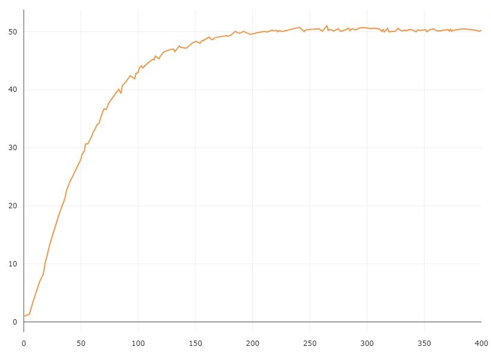
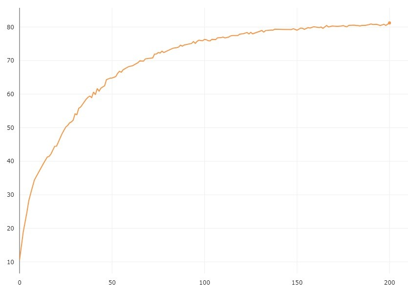
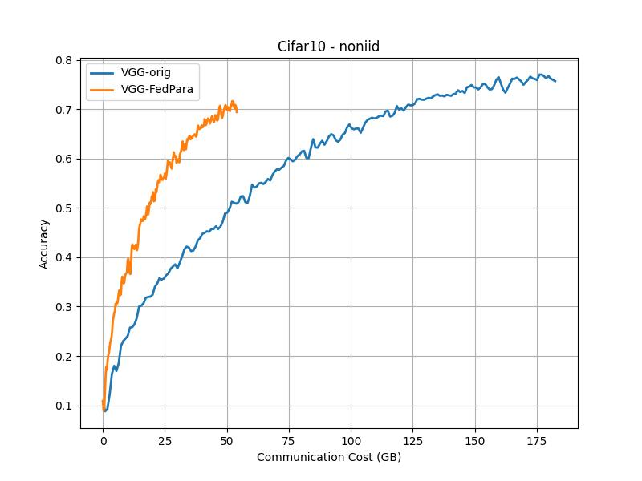

# FedPara: Low-rank Hadamard Product for Communication-Efficient Federated Learning 

> Note: If you use this baseline in your work, please remember to cite the original authors of the paper as well as the Flower paper.

**Paper:** [openreview.net/forum?id=d71n4ftoCBy](https://openreview.net/forum?id=d71n4ftoCBy)

****Authors:****  Nam Hyeon-Woo, Moon Ye-Bin, Tae-Hyun Oh

****Abstract:**** In this work, we propose a communication-efficient parameterization, FedPara,
for federated learning (FL) to overcome the burdens on frequent model uploads
and downloads. Our method re-parameterizes weight parameters of layers using
low-rank weights followed by the Hadamard product. Compared to the conventional low-rank parameterization, our FedPara method is not restricted to lowrank constraints, and thereby it has a far larger capacity. This property enables to
achieve comparable performance while requiring 3 to 10 times lower communication costs than the model with the original layers, which is not achievable by
the traditional low-rank methods. The efficiency of our method can be further improved by combining with other efficient FL optimizers. In addition, we extend
our method to a personalized FL application, pFedPara, which separates parameters into global and local ones. We show that pFedPara outperforms competing
personalized FL methods with more than three times fewer parameters. Project
page: https://github.com/South-hw/FedPara_ICLR22


## About this baseline

****What’s implemented:****  The code in this directory replicates the experiments in FedPara paper implementing the Low-rank scheme for Convolution module inspired by the [author's code]( https://github.com/South-hw/FedPara_ICLR22).

Specifically, it replicates the results for Cifar10 and Cifar100 in Figure 3 and the results for Feminist in Figure 5(a).


****Datasets:****  CIFAR10, CIFAR100, FEMNIST from PyTorch's Torchvision

****Hardware Setup:**** The experiment has been conducted on our server with the following specs:

- **GPU:** 1 Tesla V100 GPU 32GB VRAM
- **CPU:** 1x24 cores Intel Xeon(R) 6248R
- **RAM:** 150 GB

****Contributors:**** Yahia Salaheldin Shaaban, Omar Mokhtar and Roeia Amr 


## Experimental Setup

****Task:****  Image classification

****Model:****  This directory implements Vgg16 with group normalization.

****Dataset:**** 

In IID settings:

| Dataset  | #classes | #partitions |  partitioning method   |
|:---------|:--------:|:-----------:|:----------------------:|
| Cifar10  |    10    |     100     | random split |
| Cifar100 |   100    |     50     | random split|

In non-IID settings:

| Dataset  | #classes | #partitions |  partitioning method   |
|:---------|:--------:|:-----------:|:----------------------:|
| Cifar10  |    10    |     100     | Dirichlet distribution |
| Cifar100 |   100    |     50     | Dirichlet distribution |


****Training Hyperparameters:****

|   |   Cifar10 IID   | Cifar10 Non-IID      | Cifar100 IID     | Cifar100 Non-IID      | FEMNIST        |
|---|-------|-------|------|-------|----------|
| Fraction of client (K) | 16    | 16    | 8    | 8     | 10       |
| Total rounds (T) | 200   | 200   | 400  | 400   | 100      |
| Number of SGD epochs (E) | 10    | 5     | 10   | 5     | 5       |
| Batch size (B) | 64    | 64    | 64   | 64    | 10       |
| Initial learning rate (η) | 0.1   | 0.1   | 0.1  | 0.1   | 0.1-0.01      |
| Learning rate decay (τ) | 0.992 | 0.992 | 0.992| 0.992 | 0.999    |
| Regularization coefficient (λ) | 1     | 1     | 1    | 1     | 0        |


For Dataset:
Choice of alpha parameter for the Dirichlet distribution used to create heterogeneity in the client datasets for CIFAR

| Description | Default Value |
|-------------|---------------|
| alpha       | 0.5           |


## Environment Setup

:warning: _The Python environment for all baselines should follow these guidelines in the `EXTENDED_README`. Specify the steps to create and activate your environment. If there are any external system-wide requirements, please include instructions for them too. These instructions should be comprehensive enough so anyone can run them (if non standard, describe them step-by-step)._


## Running the Experiments

:warning: _Provide instructions on the steps to follow to run all the experiments._
```bash  
# The main experiment implemented in your baseline using default hyperparameters (that should be setup in the Hydra configs) should run (including dataset download and necessary partitioning) by executing the command:

poetry run python -m <baseline-name>.main <no additional arguments> # where <baseline-name> is the name of this directory and that of the only sub-directory in this directory (i.e. where all your source code is)

# If you are using a dataset that requires a complicated download (i.e. not using one natively supported by TF/PyTorch) + preprocessing logic, you might want to tell people to run one script first that will do all that. Please ensure the download + preprocessing can be configured to suit (at least!) a different download directory (and use as default the current directory). The expected command to run to do this is:

poetry run python -m <baseline-name>.dataset_preparation <optional arguments, but default should always run>

# It is expected that you baseline supports more than one dataset and different FL settings (e.g. different number of clients, dataset partitioning methods, etc). Please provide a list of commands showing how these experiments are run. Include also a short explanation of what each one does. Here it is expected you'll be using the Hydra syntax to override the default config.

poetry run python -m <baseline-name>.main  <override_some_hyperparameters>
.
.
.
poetry run python -m <baseline-name>.main  <override_some_hyperparameters>
```


## Expected Results

### Cifar100 (accuracy vs epochs)

| IID | Non-IID |
|:----:|:----:|
| |  |


### Cifar10 (accuracy vs epochs)

| IID | Non-IID |
|:----:|:----:|
| |  |
