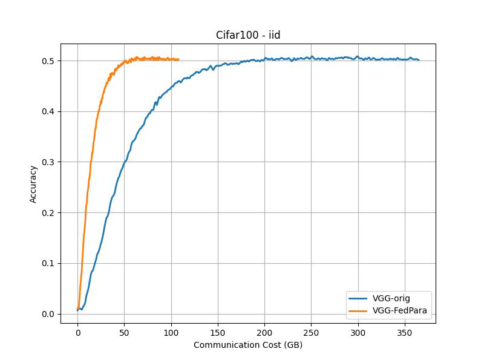
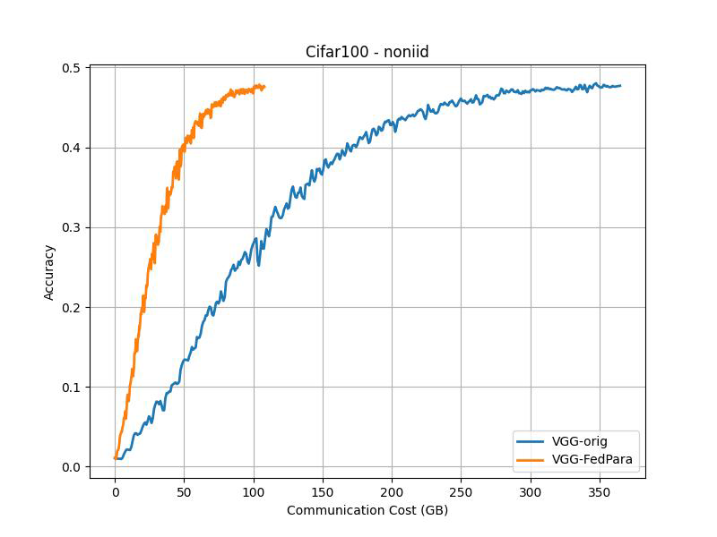
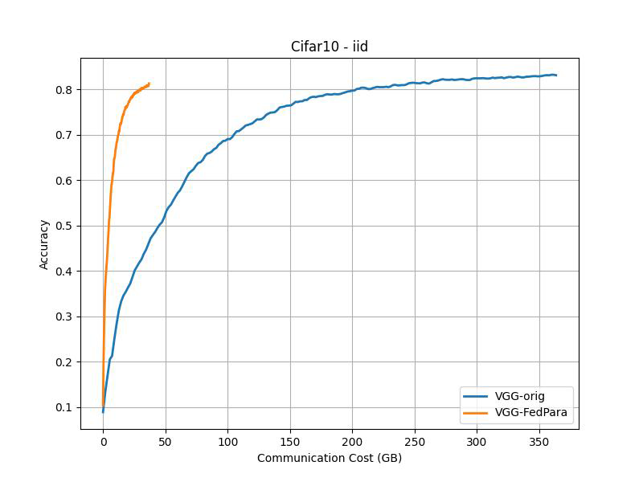
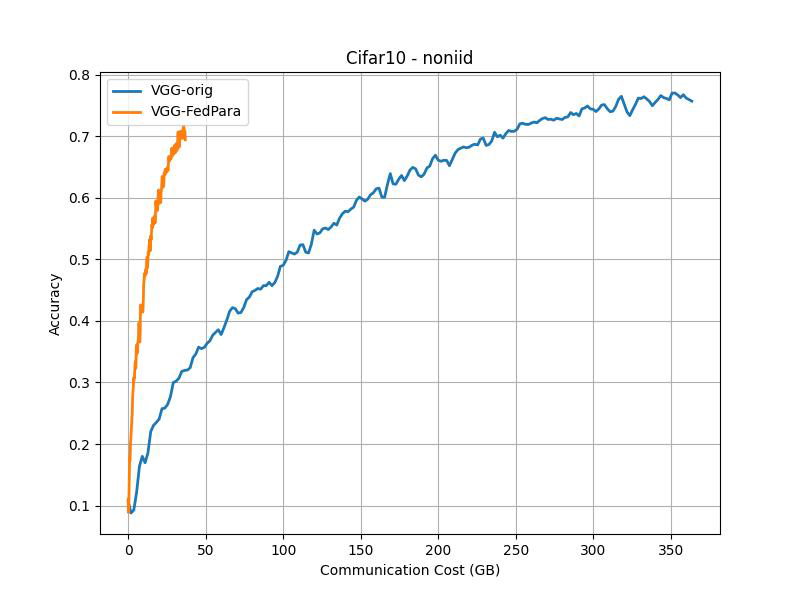
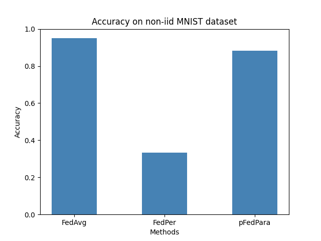

# FedPara: Low-rank Hadamard Product for Communication-Efficient Federated Learning

> Note: If you use this baseline in your work, please remember to cite the original authors of the paper as well as the Flower paper.

**Paper:** [openreview.net/forum?id=d71n4ftoCBy](https://openreview.net/forum?id=d71n4ftoCBy)

**Authors:**  Nam Hyeon-Woo, Moon Ye-Bin, Tae-Hyun Oh

**Abstract:** In this work, we propose a communication-efficient parameterization, FedPara,
for federated learning (FL) to overcome the burdens on frequent model uploads
and downloads. Our method re-parameterizes weight parameters of layers using
low-rank weights followed by the Hadamard product. Compared to the conventional low-rank parameterization, our FedPara method is not restricted to lowrank constraints, and thereby it has a far larger capacity. This property enables to
achieve comparable performance while requiring 3 to 10 times lower communication costs than the model with the original layers, which is not achievable by
the traditional low-rank methods. The efficiency of our method can be further improved by combining with other efficient FL optimizers. In addition, we extend
our method to a personalized FL application, pFedPara, which separates parameters into global and local ones. We show that pFedPara outperforms competing
personalized FL methods with more than three times fewer parameters. Project
page: https://github.com/South-hw/FedPara_ICLR22


## About this baseline

**What’s implemented:**  The code in this directory replicates the experiments in FedPara paper implementing the Low-rank scheme for Convolution module.

Specifically, it replicates the results for CIFAR-10  and CIFAR-100  in Figure 3 and the results for MNIST in Figure 5(c).


**Datasets:**  CIFAR-10, CIFAR-100, MNIST from PyTorch's Torchvision

**Hardware Setup:** The experiments have been conducted on our server with the following specs:

- **GPU:** 1x RTX A6000 GPU with 48GB VRAM
- **CPU:** 1x24 cores Intel Xeon(R) 6248R
- **RAM:** 150 GB

On a machine with RTX 3090Ti (24GB VRAM) it takes approximately 1h to run each CIFAR-10/100 experiment while using < 12GB of VRAM. You can lower the VRAM footprint my reducing the number of clients allowed to run in parallel in your GPU (do this by raising `client_resources.num_gpus`).


**Contributors:** Yahia Salaheldin Shaaban, Omar Mokhtar and Roeia Amr


## Experimental Setup

**Task:**  Image classification

**Model:**  This baseline implements VGG16 with group normalization.

**Dataset:**

| Dataset   | #classes | #partitions | partitioning method IID |      partitioning method non-IID      |
| :-------- | :------: | :---------: | :---------------------: | :-----------------------------------: |
| CIFAR-10  |    10    |     100     |      random split       | Dirichlet distribution ($\alpha=0.5$) |
| CIFAR-100 |   100    |     50      |      random split       | Dirichlet distribution ($\alpha=0.5$) |


**Training Hyperparameters:**

|                                | Cifar10 IID | Cifar10 Non-IID | Cifar100 IID | Cifar100 Non-IID | MNIST    |
| ------------------------------ | ----------- | --------------- | ------------ | ---------------- | -------- |
| Fraction of client (K)         | 16          | 16              | 8            | 8                | 10       |
| Total rounds (T)               | 200         | 200             | 400          | 400              | 100      |
| Number of SGD epochs (E)       | 10          | 5               | 10           | 5                | 5        |
| Batch size (B)                 | 64          | 64              | 64           | 64               | 10       |
| Initial learning rate (η)      | 0.1         | 0.1             | 0.1          | 0.1              | 0.1-0.01 |
| Learning rate decay (τ)        | 0.992       | 0.992           | 0.992        | 0.992            | 0.999    |
| Regularization coefficient (λ) | 1           | 1               | 1            | 1                | 0        |

As for the parameters ratio ($\gamma$) we use the following model sizes. As in the paper, $\gamma=0.1$ is used for CIFAR-10 and $\gamma=0.4$ for CIFAR-100:

| Parameters ratio ($\gamma$) | CIFAR-10 | CIFAR-100 |
| --------------------------- | -------- | --------- |
| 1.0 (original)              | 15.25M   | 15.30M    |
| 0.1                         | 1.55M    | -         |
| 0.4                         | -        | 4.53M     |


### Notes:
- Notably, Fedpara's low-rank training technique heavily relies on initialization, with our experiments revealing that employing a 'Fan-in' He initialization (or Kaiming) renders the model incapable of convergence, resulting in a performance akin to that of a random classifier. We found that only Fan-out initialization yielded the anticipated results, and we postulated that this is attributed to the variance conservation during backward propagation.

- The paper lacks explicit guidance on calculating the rank, aside from the "Rank_min - Rank_max" equation. To address this, we devised an equation aligning with the literature's explanation and constraint, solving a quadratic equation to determine max_rank and utilizing proposition 2 from the paper to establish min_rank.

- The Jacobian correction was not incorporated into our implementation, primarily due to the lack of explicit instructions in the paper regarding the specific implementation of the dual update principle mentioned in the Jacobian correction section.

- It was observed that data generation is crucial for model convergence

## Environment Setup
To construct the Python environment follow these steps:

It is assumed that `pyenv` is installed, `poetry` is installed and python 3.10.6 is installed using `pyenv`. Refer to this [documentation](https://flower.ai/docs/baselines/how-to-use-baselines.html#setting-up-your-machine) to ensure that your machine is ready.

```bash
# Set Python 3.10
pyenv local 3.10.6
# Tell poetry to use python 3.10
poetry env use 3.10.6

# Install the base Poetry environment
poetry install

# Activate the environment
poetry shell
```

## Running the Experiments

Running `FedPara` is easy. You can run it with default parameters directly or by tweaking them directly on the command line. Some command examples are shown below.

```bash
# To run fedpara with default parameters
python -m fedpara.main

# Run for more rounds and a different number of local epochs
python -m fedpara.main num_rounds=2024 num_epochs=1

# Choose parameterization scheme: lowrank or original (normal weights)
python -m fedpara.main model.param_type=standard # or lowrank (default)

# Choosing between non IID and IID scheme
python -m fedpara.main dataset_config.partition=iid # or non-iid (default)

# Choosing the ratio (lambda) of number of parameters to communicate
python -m fedpara.main model.ratio=0.1

# Choosing the CIFAR-100 config
python -m fedpara.main --config-name cifar100 # change settings as shown above if desired
```

## Expected Results

To reproduce the curves shown below (which correspond to those in Figure 3 in the paper), run the following commands. Experiments running with `model.param_type=lowrank` correspond to those with `-FedPara` in the legend of the figures below. Those with `model.param_type=standard` are labelled with the `-orig` (as original) tag.

```bash
# To run fedpara for non-iid CIFAR-10 on vgg16 for lowrank and original schemes
python -m fedpara.main --multirun model.param_type=standard,lowrank
# To run fedpara for non-iid CIFAR-100 on vgg16 for lowrank and original schemes
python -m fedpara.main --config-name cifar100 --multirun model.param_type=standard,lowrank
# To run fedpara for iid CIFAR-10 on vgg16 for lowrank and original schemes
python -m fedpara.main --multirun model.param_type=standard,lowrank num_epochs=10 dataset_config.partition=iid
# To run fedpara for iid CIFAR-100 on vgg16 for lowrank and original schemes
python -m fedpara.main --config-name cifar100 --multirun model.param_type=standard,lowrank num_epochs=10 dataset_config.partition=iid
# To run fedavg for non-iid MINST on FC
python -m fedpara.main --config-name mnist_fedavg
# To run fedper for non-iid MINST on FC
python -m fedpara.main --config-name mnist_fedper
# To run pfedpara for non-iid MINST on FC
python -m fedpara.main --config-name mnist_pfedpara
```

#### Communication Cost:
Communication costs as measured as described in the paper:
*"FL evaluation typically measures the required rounds to achieve the target accuracy as communication costs, but we instead assess total transferred bit sizes, 2 ×
(#participants)×(model size)×(#rounds)"*


### CIFAR-100 (Accuracy vs Communication Cost)

|                    IID                     |                      Non-IID                      |
| :----------------------------------------: | :-----------------------------------------------: |
|  |  |


### CIFAR-10 (Accuracy vs Communication Cost)

|                   IID                    |                     Non-IID                     |
| :--------------------------------------: | :---------------------------------------------: |
|  |  |


### NON-IID MINST (FedAvg vs FedPer vs pFedPara)

The only federated averaging (FedAvg) implementation replicates the results outlined in the paper. However, challenges with convergence were encountered when applying `pFedPara` and `FedPer` methods.



## Code Acknowledgments
Our code is inspired from these repos:
- [Fedpara low rank tensor CNN class structure](https://github.com/South-hw/FedPara_ICLR22)
- [Non-IID mnist data preparation](https://github.com/nimeshagrawal/FedAvg-Pytorch)
- [Cifar non IID data generation](https://github.com/guobbin/PFL-MoE)
