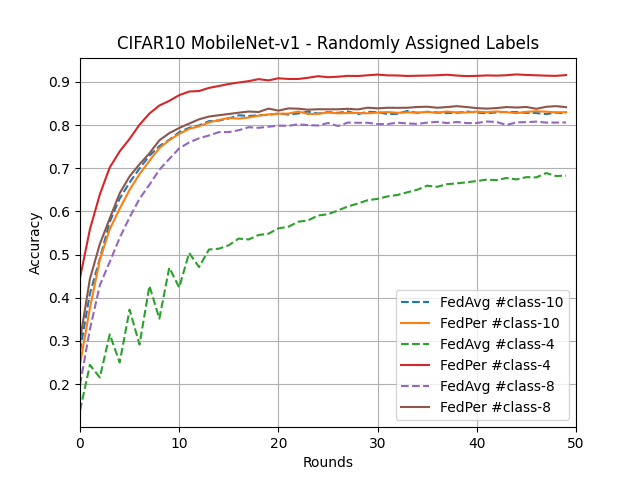
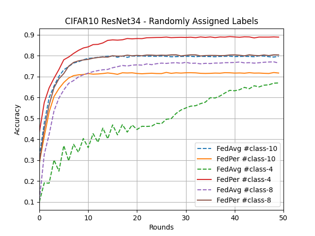
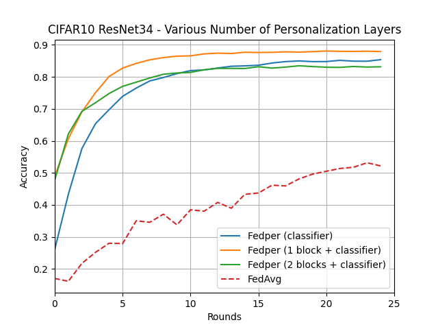

# Federated Learning with Personalization Layers

> Note: If you use this baseline in your work, please remember to cite the original authors of the paper as well as the Flower paper.

****Paper:**** : https://arxiv.org/abs/1912.00818

****Authors:**** : Manoj Ghuhan Arivazhagan, Vinay Aggarwal, Aaditya Kumar Singh, and Sunav Choudhary

****Abstract:**** : The emerging paradigm of federated learning strives to enable collaborative training of machine learning models on the network edge without centrally aggregating raw data and hence, improving data privacy. This sharply deviates from traditional machine learning and necessitates design of algorithms robust to various sources of heterogeneity. Specifically, statistical heterogeneity of data across user devices can severely degrade performance of standard federated averaging for traditional machine learning applications like personalization with deep learning. This paper proposes `FedPer`, a base + personalization layer approach for federated training of deep feed forward neural networks, which can combat the ill-effects of statistical heterogeneity. We demonstrate effectiveness of `FedPer` for non-identical data partitions of CIFAR datasets and on a personalized image aesthetics dataset from Flickr.

## About this baseline

****What’s implemented:**** : The code in this directory replicates the experiments in _Federated Learning with Personalization Layers_ (Arivazhagan et al., 2019) for CIFAR10 and FLICKR-AES datasets, which proposed the `FedPer` model. Specifically, it replicates the results found in figures 2, 4, 7, and 8 in their paper. __Note__ that there is typo in the caption of Figure 4 in the article, it should be CIFAR10 and __not__ CIFAR100. 

****Datasets:**** : CIFAR10 from PyTorch's Torchvision and FLICKR-AES. FLICKR-AES was proposed as dataset in _Personalized Image Aesthetics_ (Ren et al., 2017) and can be downloaded using a link provided on thier [GitHub](https://github.com/alanspike/personalizedImageAesthetics). One must first download FLICKR-AES-001.zip (5.76GB), extract all inside and place in baseline/FedPer/datasets. To this location, also download the other 2 related files: (1) FLICKR-AES_image_labeled_by_each_worker.csv, and (2) FLICKR-AES_image_score.txt. Current repository supports CIFAR100 but it hasn't been used to reproduce figures. 

```bash
# cd into fedper/datasets
# unzip dataset to a directory named `flickr`
unzip FLICKR-AES-001.zip -d flickr

# then move the .csv files inside flickr
mv FLICKR-AES_image_labeled_by_each_worker.csv flickr
mv FLICKR-AES_image_score.txt flickr
```

****Hardware Setup:**** : Experiments have been carried out on GPU. 2 different computers managed to run experiments: 

- GeForce RTX 3080 16GB
- GeForce RTX 4090 24GB

It's worth mentioning that GPU memory for each client is ~7.5GB. When training on less powerful GPUs, one can reduce the number of GPU in the configuration setting to e.g. 0.33. 

__NOTE:__ One experiment carried out using 1 GPU (RTX 4090) takes somehwere between 1-3h depending on dataset and model. Running ResNet34 compared to MobileNet-v1 takes approximately 10-15% longer.  

****Contributors:**** : William Lindskog


## Experimental Setup

****Task:**** : Image Classification

****Model:**** : This directory implements 2 models:

- ResNet34 which can be imported directly (after having installed the packages) from PyTorch, using `from torchvision.models import resnet34 
- MobileNet-v1

Please see how models are implemented using a so called model_manager and model_split class since FedPer uses head and base layers in a neural network. These classes are defined in the models.py file and thereafter called when building new models in the directory /implemented_models. Please, extend and add new models as you wish. 

****Dataset:**** : CIFAR10, FLICKR-AES. CIFAR10 will be partitioned based on number of classes for data that each client shall recieve e.g. 4 allocated classes could be [1, 3, 5, 9]. FLICKR-AES is an unbalanced dataset, so there we only apply random sampling. 

****Training Hyperparameters:**** : The hyperparameters can be found in conf/base.yaml file which is the configuration file for the main script. 

| Description | Default Value |
| ----------- | ----- |
| num_clients | 10 |
| clients per round | 10 |
| number of rounds | 50 |
| client resources | {'num_cpus': 4, 'num_gpus': 1 }|
| learning_rate | 0.01 |
| batch_size | 128 |
| optimizer | SGD |
| algorithm | fedavg|

****Stateful Clients:****
In this Baseline (FedPer), we must store the state of the local client head while aggregation of body parameters happen at the server. Flower is currently making this possible but for the time being, we reside to storing client _head_ state in a folder called client_states. We store the values after each fit and evaluate function carried out on each client, and call for the state before executing these funcitons. Moreover, the state of a unique client is accessed using the client ID. 

__NOTE:__ This is a work-around so that the local head parameters are not reset before each fit and evaluate. Nevertheless, it can come to change with future releases. 


## Environment Setup

To construct the Python environment follow these steps:

```bash
# install the base Poetry environment
poetry install

# activate the environment
poetry shell

# install PyTorch with GPU support. 
pip install torch==2.0.1+cu117 torchvision==0.15.2+cu117 
```
## Running the Experiments
```bash
python -m fedper.main # this will run using the default settings in the `conf/base.yaml` 

# When running models for flickr dataset, it is important to keep batch size at 4 or lower since some clients (for reproducing experiment) will have very few examples of one class
```

To reproduce figures:
```bash
# make fedper/run_scripts.sh executable
chmod u+x fedper/run_scripts.sh
# uncomment lines in script that you want to run, then  
bash fedper/run_scripts.sh

# this config can also be overriden from the CLI
```

What you need to change in configuration files: 
```bash
algorithm: fedavg, fedper # these are currently supported
server_device: 'cuda:0', 'cpu'
dataset.name: 'cifar10', 'cifar100', 'flickr'
num_classes: 10, 100, 5 # respectively 
dataset.num_classes: 4, 8, 10 #for non-iid split assigning n num_classes to each client (these numbers for CIFAR10 experiments)
model.name: mobile, resnet
```

To run multiple runs, one can also reside to `HYDRA`'s multirun option. 
```bash
# for CIFAR10
python -m fedper.main --multirun dataset.num_classes=4,8,10 model.name=resnet,mobile algorithm=fedper,fedavg model.num_head_layers=2,3

# to repeat each run 5 times, one can also add
python -m fedper.main --multirun dataset.num_classes=4,8,10 model.name=resnet,mobile algorithm=fedper,fedavg model.num_head_layers=2,3 '+repeat_num=range(5)'
```


## Expected Results

Having run the `run_script.sh`, the expected results should look something like this: 

__MobileNet-v1 on CIFAR10__



__ResNet on CIFAR10__



__MobileNet-v1 on CIFAR10 using varying size of head__


__ResNet on CIFAR10 using varying size of head__



__MobileNet-v1 on FLICKR-AES__


__ResNet on FLICKR-AES__

