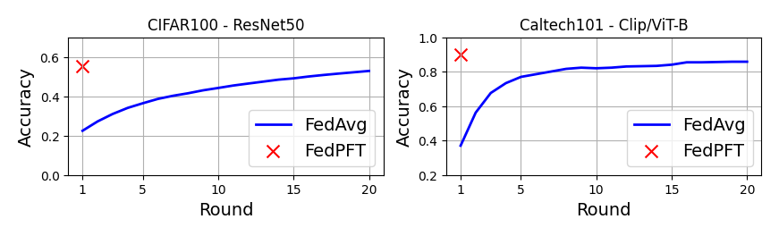

# FedPFT: One-shot Federated Learning with Foundation Models

> Note: If you use this baseline in your work, please remember to cite the original authors of the paper as well as the Flower paper.

**Paper:** [arxiv.org/abs/2402.01862](https://arxiv.org/abs/2402.01862)

**Authors:** Mahdi Beitollahi, Alex Bie, Sobhan Hemati, Leo Maxime Brunswic, Xu Li, Xi Chen, Guojun Zhang.

**Abstract:** In one-shot federated learning (FL), clients collaboratively train a global model in a single round of communication. Existing approaches for one-shot FL enhance communication efficiency at the expense of diminished accuracy. This paper introduces FedPFT (Federated Learning with Parametric Feature Transfer), a methodology that harnesses the transferability of foundation models to enhance both accuracy and communication efficiency in one-shot FL. The approach involves transferring per-client parametric models (specifically, Gaussian mixtures) of features extracted from foundation models. Subsequently, each parametric model is employed to generate synthetic features for training a classifier head. Experimental results on eight datasets demonstrate that FedPFT enhances the communication-accuracy frontier in both centralized and decentralized FL scenarios, as well as across diverse data-heterogeneity settings such as covariate shift and task shift, with improvements of up to 20.6%. Additionally, FedPFT adheres to the data minimization principle of FL, as clients do not send real features. We demonstrate that sending real features is vulnerable to potent reconstruction attacks. Moreover, we show that FedPFT is amenable to formal privacy guarantees via differential privacy, demonstrating favourable privacy-accuracy tradeoffs.


## About this baseline

**What’s implemented:** The code in this directory replicates the centralized experiments in *Parametric Feature Transfer, One-shot Federated Learning with Foundation Models* (Beitollahi et al., 2024) for CIFAR100 and Caltech101 datasets, which proposed the FedPFT algorithm. Concretely, it replicates the results in Section 5.2.

**Datasets:** CIFAR100 and Caltech101 from HuggingFace

**Hardware Setup:** These experiments were run on a desktop machine with 8 CPU threads and Nvidia 4070 with 8Gigs of ram. 

**Contributors:** Mahdi Beitollahi


## Experimental Setup

**Task:** Image classification

**Model:** This directory utilize two pre-trained, frozen models as shown in Table 1 of the paper:
* ResNet50 pre-trained on ImageNet is used for CIFAR100 dataset(see `models/resnet50`). 
* CLIP, ViT-B/32 pre-trained on web dataset is used for Caltech101 dataset (see `models/clip_vit`)

**Dataset:** This baseline includes the CIFAR100 and Caltech101 datasets. By default, it will be partitioned into 50 clients following a Dirichlet distribution with $\alpha$=0.1.

| Dataset | #classes | #partitions | partitioning method | partition settings |
| :------ | :---: | :---: | :---: | :---: |
| CIFAR100 | 100 | 50 | Dirichlet distribution | $\alpha$=0.1 |
| Caltech101 | 101 | 50 | Dirichlet distribution | $\alpha$=0.1 |

**Training Hyperparameters:** The following table shows the main hyperparameters for this baseline with their default value (i.e. the value used if you run `python main.py` directly)

| Description | Default Value |
| ----------- | ----- |
| total clients | 50 |
| clients per round | 50 |
| number of rounds | 1 |
| client resources | {'num_cpus': 2.0, 'num_gpus': 0.0 }|
| data partition | distribution with $\alpha$=0.1 |
| Number of mixtures | 1 |
| Covariance type | spherical |
| tolerance | 1e-12 |
| maximum EM iterations | 1e3 |


## Environment Setup

To construct the Python environment, simply run:

```bash
# Set directory to use python 3.10 (install with `pyenv install <version>` if you don't have it)
pyenv local 3.10.12

# Tell poetry to use python3.10
poetry env use 3.10.12

# Install
poetry install
```


## Running the Experiments

To run this FedPFT with CIFAR100 baseline, first ensure you have activated your Poetry environment (execute `poetry shell` from this directory), then:

```bash
python -m fedpft.main # this will run using the default settings in the `conf/config.yaml`

# you can override settings directly from the command line
python -m fedpft.main dataset=Caltech101 model=clip # will set dataset to Caltech101 and the pre-trained model to Clip-ViT/B32
```

To run using FedAvg:
```bash
# this will use a frozen, pre-trained model and train the classifier head
python -m fedpft.main strategy=FedAvg client=FedAvg num_rounds=20 dataset=Caltech101 model=clip num_gpus=0.2

```


## Expected Results


With the following command, we run both FedPFT and FedAvg configurations. 

```bash
# FedPFT
python -m fedpft.main dataset=CIFAR100 model=resnet50
python -m fedpft.main dataset=Caltech101 model=clip

# FedAvg with pre-trained, frozen models
python -m fedpft.main strategy=fedavg client=fedavg dataset=CIFAR100 model=resnet50 num_rounds=20 strategy.on_fit_config_fn.num_epochs=1=1 num_gpus=0.5
python -m fedpft.main strategy=fedavg client=fedavg dataset=Caltech101 model=clip num_rounds=20 num_gpus=0.2
```

The above commands would generate results that you can plot and would look like the plot shown below. This plot was generated using the jupyter notebook in the `docs/` directory of this baseline after running the commands above.


