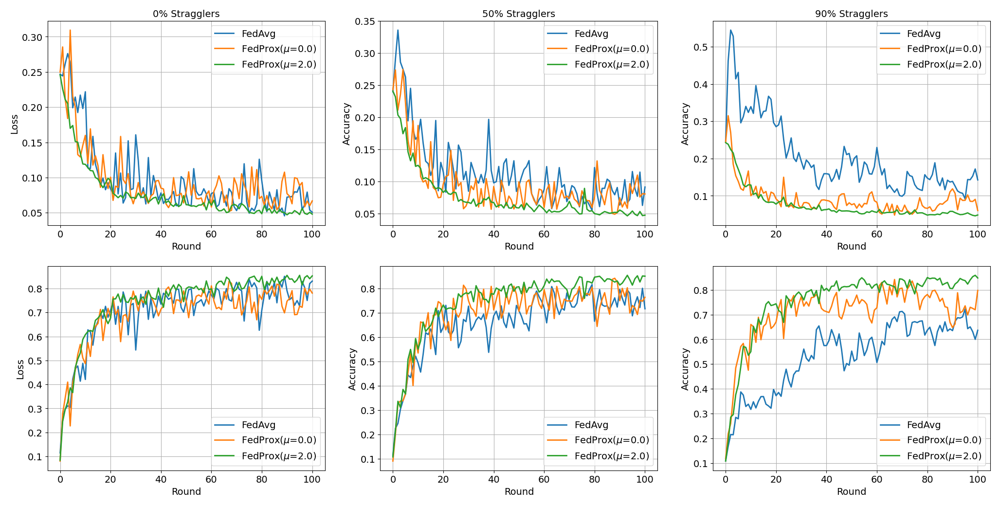

# FedProx: Federated Optimization in Heterogeneous Networks

> Note: If you use this baseline in your work, please remember to cite the original authors of the paper as well as the Flower paper.

**Paper:** [arxiv.org/abs/1812.06127](https://arxiv.org/abs/1812.06127)

**Authors:** Tian Li, Anit Kumar Sahu, Manzil Zaheer, Maziar Sanjabi, Ameet Talwalkar and Virginia Smith.

**Abstract:** Federated Learning is a distributed learning paradigm with two key challenges that differentiate it from traditional distributed optimization: (1) significant variability in terms of the systems characteristics on each device in the network (systems heterogeneity), and (2) non-identically distributed data across the network (statistical heterogeneity). In this work, we introduce a framework, FedProx, to tackle heterogeneity in federated networks. FedProx can be viewed as a generalization and re-parametrization of FedAvg, the current state-of-the-art method for federated learning. While this re-parameterization makes only minor modifications to the method itself, these modifications have important ramifications both in theory and in practice. Theoretically, we provide convergence guarantees for our framework when learning over data from non-identical distributions (statistical heterogeneity), and while adhering to device-level systems constraints by allowing each participating device to perform a variable amount of work (systems heterogeneity). Practically, we demonstrate that FedProx allows for more robust convergence than FedAvg across a suite of realistic federated datasets. In particular, in highly heterogeneous settings, FedProx demonstrates significantly more stable and accurate convergence behavior relative to FedAvg---improving absolute test accuracy by 22% on average.


## About this baseline
**What's implemented:** The code in this directory replicates the experiments in *Federated Optimization in Heterogeneous Networks* (Li et al., 2018) for MNIST, which proposed the FedProx algorithm. Concretely, it replicates the results for MNIST in Figure 1 and 7.

**Datasets:** MNIST from PyTorch's Torchvision

**Hardware Setup:** These experiments were run on a desktop machine with 24 CPU threads. Any machine with 4 CPU cores or more would be able to run it in a reasonable amount of time. Note: we install PyTorch with GPU support but by default, the entire experiment runs on CPU-only mode.

**Contributors:** Charles Beauville and Javier Fernandez-Marques


## Experimental Setup

**Task:** Image classification

**Model:** This directory implements two models:
* A logistic regression model used in the FedProx paper for MNIST (see `models/LogisticRegression`). This is the model used by default.
* A two-layer CNN network as used in the FedAvg paper (see `models/Net`)

**Dataset:** This baseline only includes the MNIST dataset. By default, it will be partitioned into 1000 clients following a pathological split where each client has examples of two (out of ten) class labels. The number of examples in each client is derived by sampling from a powerlaw distribution. The settings are as follows:

| Dataset | #classes | #partitions | partitioning method | partition settings |
| :------ | :---: | :---: | :---: | :---: |
| MNIST | 10 | 1000 | pathological with power law | 2 classes per client |

**Training Hyperparameters:**
The following table shows the main hyperparameters for this baseline with their default value (i.e. the value used if you run `python main.py` directly)

| Description | Default Value |
| ----------- | ----- |
| total clients | 1000 |
| clients per round | 10 |
| number of rounds | 100 |
| client resources | {'num_cpus': 2.0, 'num_gpus': 0.0 }|
| data partition | pathological with power law (2 classes per client) |
| optimizer | SGD with proximal term |
| proximal mu | 1.0 |
| stragglers_fraction | 0.9 |

## Environment Setup

To construct the Python environment, simply run:

```bash
# Set directory to use python 3.10 (install with `pyenv install <version>` if you don't have it)
pyenv local 3.10.12

# Tell poetry to use python3.10
poetry env use 3.10.12

# Install
poetry install
```

## Running the Experiments

To run this FedProx with MNIST baseline, first ensure you have activated your Poetry environment (execute `poetry shell` from this directory), then:

```bash
python -m fedprox.main # this will run using the default settings in the `conf/config.yaml`

# you can override settings directly from the command line
python -m fedprox.main mu=1 num_rounds=200 # will set proximal mu to 1 and the number of rounds to 200

# if you run this baseline with a larger model, you might want to use the GPU (not used by default).
# you can enable this by overriding the `server_device` and `client_resources` config. For example
# the below will run the server model on the GPU and 4 clients will be allowed to run concurrently on a GPU (assuming you also meet the CPU criteria for clients)
python -m fedprox.main server_device=cuda client_resources.num_gpus=0.25
```

To run using FedAvg:
```bash
# this will use a variation of FedAvg that drops the clients that were flagged as stragglers
# This is done so to match the experimental setup in the FedProx paper
python -m fedprox.main --config-name fedavg

# this config can also be overridden from the CLI
```

## Expected results

With the following command, we run both FedProx and FedAvg configurations while iterating through different values of `mu` and `stragglers_fraction`. We ran each experiment five times (this is achieved by artificially adding an extra element to the config but it doesn't have an impact on the FL setting `'+repeat_num=range(5)'`)

```bash
python -m fedprox.main --multirun mu=0.0,2.0 stragglers_fraction=0.0,0.5,0.9 '+repeat_num=range(5)'
# note that for FedAvg we don't want to change the proximal term mu since it should be kept at 0.0
python -m fedprox.main --config-name fedavg --multirun stragglers_fraction=0.0,0.5,0.9 '+repeat_num=range(5)'
```

The above commands would generate results that you can plot and would look like the plot shown below. This plot was generated using the jupyter notebook in the `docs/` directory of this baseline after running the `--multirun` commands above.

