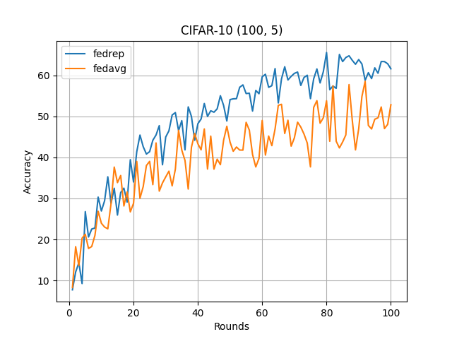

# Exploiting Shared Representations for Personalized Federated Learning

**Paper:** [arxiv.org/abs/2102.07078](http://arxiv.org/abs/2102.07078)

**Authors:** Liam Collins, Hamed Hassani, Aryan Mokhtari, Sanjay Shakkottai

**Abstract:** Deep neural networks have shown the ability to extract universal feature representations from data such as images and text that have been useful for a variety of learning tasks. However, the fruits of representation learning have yet to be fully-realized in federated settings. Although data in federated settings is often non-i.i.d. across clients, the success of centralized deep learning suggests that data often shares a global feature representation, while the statistical heterogeneity across clients or tasks is concentrated in the labels. Based on this intuition, we propose a novel federated learning framework and algorithm for learning a shared data representation across clients and unique local heads for each client. Our algorithm harnesses the distributed computational power across clients to perform many local-updates with respect to the low-dimensional local parameters for every update of the representation. We prove that this method obtains linear convergence to the ground-truth representation with near-optimal sample complexity in a linear setting, demonstrating that it can efficiently reduce the problem dimension for each client. This result is of interest beyond federated learning to a broad class of problems in which we aim to learn a shared low-dimensional representation among data distributions, for example in meta-learning and multi-task learning. Further, extensive experimental results show the empirical improvement of our method over alternative personalized federated learning approaches in federated environments with heterogeneous data.


## About this baseline

**What’s implemented:** The code in this directory replicates the experiments in _Exploiting Shared Representations for Personalized Federated Learning_ (Liam Collins et al., 2021) for CIFAR10 and CIFAR-100 datasets, which proposed the `FedRep` model. Specifically, it replicates the results of CIFAR-10 (`(100, 2), (100, 5)`) and CIFAR-100 (`(100, 5), (100, 20)`) found in table 1 in their paper.

**Datasets:** CIFAR-10, CIFAR-100 from `Flower Datasets`.

**Hardware Setup:** WSL2 Ubuntu 22.04 LTS, NVIDIA RTX 3070 Laptop, 32GB RAM, AMD Ryzen 9 5900HX. 

**Contributors:** Jiahao Tan<<karhoutam@qq.com>>


## Experimental Setup

**Task:** Image Classification

**Model:** This directory implements 2 models:

- CNNCifar10 
- CNNCifar100

These two models are modified from the [official repo](https://github.com/rahulv0205/fedrep_experiments)'s. To be clear that, in the official models, there is no BN layers. However, without BN layer helping, training will definitely collapse.

Please see how models are implemented using a so called model_manager and model_split class since FedRep uses head and base layers in a neural network. These classes are defined in the `models.py` file and thereafter called when building new models in the directory `/implemented_models`. Please, extend and add new models as you wish. 

**Dataset:** CIFAR10, CIFAR-100. CIFAR10/100 will be partitioned based on number of classes for data that each client shall receive e.g. 4 allocated classes could be [1, 3, 5, 9].

**Training Hyperparameters:** The hyperparameters can be found in `conf/base.yaml` file which is the configuration file for the main script. 

| Description           | Default Value                       |
| --------------------- | ----------------------------------- |
| `num_clients`         | `100`                               |
| `num_rounds`          | `100`                               |
| `num_local_epochs`    | `5`                                 |
| `num_rep_epochs`      | `1`                                 |
| `enable_finetune`     | `False`                             |
| `num_finetune_epochs` | `5`                                 |
| `use_cuda`            | `true`                              |
| `specified_device`    | `null`                              |
| `client resources`    | `{'num_cpus': 2, 'num_gpus': 0.5 }` |
| `learning_rate`       | `0.01`                              |
| `batch_size`          | `50`                                |
| `model_name`          | `cnncifar10`                        |
| `algorithm`           | `fedrep`                            |


## Environment Setup

To construct the Python environment follow these steps:

```bash
# Set Python 3.10
pyenv local 3.10.12
# Tell poetry to use python 3.10
poetry env use 3.10.12

# Install the base Poetry environment
poetry install

# Activate the environment
poetry shell
```

## Running the Experiments

```
python -m fedrep.main # this will run using the default settings in the `conf/base.yaml` 
```

While the config files contain a large number of settings, the ones below are the main ones you'd likely want to modify to .
```bash
algorithm: fedavg, fedrep # these are currently supported
dataset.name: cifar10, cifar100
dataset.num_classes: 2, 5, 20 (only for CIFAR-100)
model_name: cnncifar10, cnncifar100
```


## Expected Results

### CIFAR-10 (100, 2)

```
python -m fedrep.main --config-name cifar10_100_2 algorithm=fedrep 
python -m fedrep.main --config-name cifar10_100_2 algorithm=fedavg 
```
 

### CIFAR-10 (100, 5)

```
python -m fedrep.main --config-name cifar10_100_5 algorithm=fedrep 
python -m fedrep.main --config-name cifar10_100_5 algorithm=fedavg 
```
 

### CIFAR-100 (100, 5)

```
python -m fedrep.main --config-name cifar100_100_5 algorithm=fedrep 
python -m fedrep.main --config-name cifar100_100_5 algorithm=fedavg 
```
 

### CIFAR-100 (100, 20)

```
python -m fedrep.main --config-name cifar100_100_20 algorithm=fedrep 
python -m fedrep.main --config-name cifar100_100_20 algorithm=fedavg 
```
 