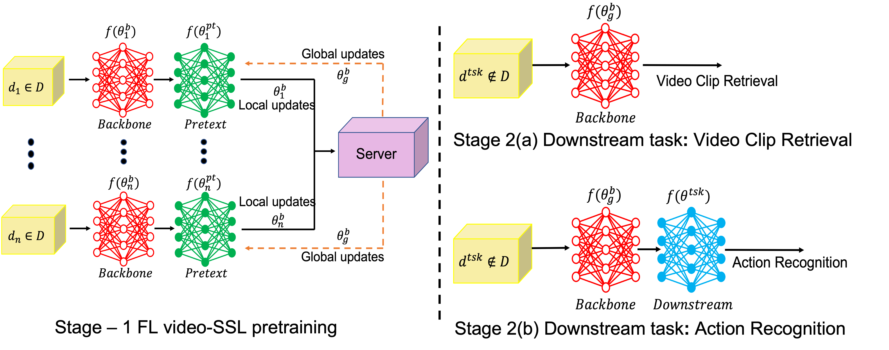

# Federated Self-supervised Learning for Video Understanding
> Note: If you use this baseline in your work, please remember to cite the original authors of the paper as well as the Flower paper.


**paper:** [arxiv.org/abs/2207.01975](https://arxiv.org/abs/2207.01975)


**Authors:** Yasar Abbas Ur Rehman, Yan Gao, Jiajun Shen, Pedro Porto Buarque de Gusmao, Nicholas Lane


**Abstract:** The ubiquity of camera-enabled mobile devices has lead to large amounts of unlabelled video data being produced at the edge. Although various self-supervised learning (SSL) methods have been proposed to harvest their latent spatio-temporal representations for task-specific training, practical challenges including privacy concerns and communication costs prevent SSL from being deployed at large scales. To mitigate these issues, we propose the use of Federated Learning (FL) to the task of video SSL. In this work, we evaluate the performance of current state-of-the-art (SOTA) video-SSL techniques and identify their shortcomings when integrated into the large-scale FL setting simulated with kinetics-400 dataset. We follow by proposing a novel federated SSL framework for video, dubbed FedVSSL, that integrates different aggregation strategies and partial weight updating. Extensive experiments demonstrate the effectiveness and significance of FedVSSL as it outperforms the centralized SOTA for the downstream retrieval task by 6.66% on UCF-101 and 5.13% on HMDB-51. 



## About this baseline

**Whats's implemented:** The code in this directory replicates the experiments in *Federated Self-supervised Learning for Video Understanding* (Rehman et al., 2022) for UCF-101, which proposed the FedVSSL algorithm. Specifically, it replicates the results for UCF-101 in Table 4 in the paper.
As common SSL training pipeline, this code has two parts: SSL pre-training in FL and downstream fine-tuning.

**Dataset:** [UCF-101](https://www.crcv.ucf.edu/data/UCF101.php)

**Hardware Setup:** These experiments (SSL pre-train + downstream fine-tuning) were on a server with 6x RTX-3090 GPU and 128 CPU threads. Assuming a single client runs per GPU, on a RTX 3090 it takes 34s for a client to complete its local training (1 epoch); on an A100 this goes down to 17s. In this baseline 5 clients participate in each round for a total of 20 rounds. On a single A100 you can run the federated pre-training in under 1h.

**Contributors:** Yasar Abbas Ur Rehman and Yan Gao

## Experimental Setup

**Task:** Action Recognition

**Model:** 
* We first pre-train the R3D-18 model using the Catch-the-Patch (CtP [paper](https://arxiv.org/abs/2105.02545)) SSL technique in FL settings. The details of the CtP SSL technique can be found at `fedvssl/CtP/pyvrl/models/pretraining/ctp`, and the details of the R3D-18 model can be found at `fedvssl/CtP/pyvrl/models/backbones/r3d.py`. 
* After pre-training, we fine-tune the pre-trained R3D-18 model on the UCF-101 dataset.

**Dataset:** The pre-training in the paper was conducted on Kinectics-400 dataset, and we provide the script to generate the partitions for FL training.
However, the original dataset source as well as the pre-processing scripts they offered are not available currently.
Alternately, one can download this dataset from PyTorch ([torchvision-datasets-Kinetics](https://pytorch.org/vision/stable/generated/torchvision.datasets.Kinetics.html)).

In this baseline, we demonstrate SSL pre-training and supervised fine-tuning with UCF-101 dataset. 
For UCF-101 dataset, one can simply follow the dataset preparation instruction below to download and generate the FL partitions.

| Dataset | #classes | #partitions | partitioning method |  partition settings  |
|:--------|:--------:|:-----------:| :---: |:--------------------:|
| UCF101  |   101    |     10      | randomly partitioned |       uniform        |
| Kinectics-400    |   400    |     100     | randomly partitioned | 8 classes per client |

**Training Hyperparameters:** The following table shows the main hyperparameters for this baseline with their default value (i.e. the value used if you run `python main.py` directly)

| Description        |            Default Value            |
|:-------------------|:-----------------------------------:|
| total clients      |                  5                  |
| clients per round  |                  5                  | 
| number of rounds	  |                 20                  | 
| client resources	  | {'num_cpus': 2.0, 'num_gpus': 1.0 } | 
| optimizer	  |                 SGD                 | 
| alpha coefficient	 |                 0.9                 | 
| beta coefficient	  |                  1                  | 

## Environment Setup
Please make sure you have installed CUDA 11.7 on your machine 
(see [NVIDIA CUDA Toolkit website](https://developer.nvidia.com/cuda-11-7-0-download-archive)).
To construct the Python environment follow these steps (assuming you arelady have `pyenv` and `Poetry` in your system):

```bash
# Set directory to use python 3.10 (install with `pyenv install <version>` if you don't have it)
pyenv local 3.10.12
poetry env use 3.10.12

# Install the base Poetry environment
poetry install

# Activate the environment
poetry shell
```

## Running the Experiments
To run FedVSSL with UCF-101 baseline, please ensure you have activated your Poetry environment (execute `poetry shell` from this directory). 
Then, download the `CtP` repo and install required packages:

```bash
# Clone CtP repo
git clone https://github.com/yan-gao-GY/CtP.git fedvssl/CtP

# Additional packages to decompress the dataset
sudo apt install unrar unzip
```

### Dataset preparation
Let's first download UCF-101 dataset and related annotation files:

```bash
cd fedvssl
mkdir -p data/ucf101/

# Downloading
wget https://www.crcv.ucf.edu/data/UCF101/UCF101.rar -O data/ucf101/UCF101.rar --no-check-certificate

# Unzipping
unrar e data/ucf101/UCF101.rar data/ucf101/UCF101_raw/

# Downloading the train/test split
wget https://www.crcv.ucf.edu/data/UCF101/UCF101TrainTestSplits-RecognitionTask.zip -O data/ucf101/UCF101TrainTestSplits-RecognitionTask.zip --no-check-certificate

# Unzipping
unzip data/ucf101/UCF101TrainTestSplits-RecognitionTask.zip -d data/ucf101/
```

Then, we use the scripts to pre-process the dataset:

```bash
# Pre-processing the dataset
python CtP/scripts/process_ucf101.py --raw_dir data/ucf101/UCF101_raw/ --ann_dir data/ucf101/ucfTrainTestlist/ --out_dir data/ucf101/

# Covert to .json files
python dataset_convert_to_json.py

# (optional)
rm data/ucf101/UCF101.rar
rm -r data/ucf101/UCF101_raw/
```

Then, we perform data partitioning for FL:

```bash
python data_partitioning_ucf.py --json_path data/ucf101/annotations --output_path data/ucf101/annotations/client_distribution/ --num_clients 5

cd ..
```


### Federated SSL pre-training

Finally, we can launch the training. To run SSL pretraining using `FedVSSL`:
```bash
# Run federated SSL training with FedVSSL
python -m fedvssl.main # this will run using the default settings.

# You can override settings directly from the command line
python -m fedvssl.main strategy.mix_coeff=1 rounds=100 # will set hyper-parameter alpha to 1 and the number of rounds to 100
```

To run using `FedAvg`:

```bash
# This will run FedAvg baseline
# This is done so to match the experimental setup in the paper
python -m fedvssl.main strategy.fedavg=true

# This config can also be overridden.
```

Running any of the above will create a directory structure in the form of `outputs/<DATE>/<TIME>/fedvssl_results` to save the global checkpoints and the local clients' training logs.


### Downstream fine-tuning

The downstream fine-tuning does not involve Flower because it's done in centralised fashion. Let's fine-tune the model we just pre-trained with `FedVSSL` using UCF-101. First,
we need to transform model format:

```bash
python -m fedvssl.finetune_preprocess --pretrained_model_path=<CHECKPOINT>.npz
# check for checkpoints in the output directory of your experiment (outputs/<DATE>/<TIMES>/fedvssl_results)
# Where <DATE>/<TIME> are the date and time when you launched the experiment
```

Then, launch the fine-tuning using `CtP` script. Results will be stored in a new directory named `finetune_results`.

```bash
bash fedvssl/CtP/tools/dist_train.sh fedvssl/conf/mmcv_conf/finetuning/r3d_18_ucf101/finetune_ucf101.py 1 --work_dir=./finetune_results --data_dir=fedvssl/data
```

Note that the first parameter of this script is the path of config file, while the second is the number of GPUs used for fine-tuning.

After that, we perform the test process:

```bash
bash fedvssl/CtP/tools/dist_test.sh fedvssl/conf/mmcv_conf/finetuning/r3d_18_ucf101/test_ucf101.py 1 --work_dir=./finetune_results --data_dir=fedvssl/data --progress
```

## Expected results

### Pre-training and fine-tuning on UCF-101
The pre-training in the paper was conducted on Kinectics-400, which takes a considerable amount of time without access to server-grade hardware (~1 day with 6x RTX 3090).
As a result, we provide the following command to do pre-training on UCF-101, in order to validate FedVSSL.

In this experiment, we simulate the cross-silo scenario with UCF-101 video data that distributed among 5 clients. We did the FL pre-training of CtP SSL for 20 rounds followed by fine-tuning the whole network on UCF-101 video data. The `conf/base.yaml` file contains all the details about the pre-training setup. 

To start the pre-training one can use the following command:
```bash
python -m fedvssl.main  # this will run using the default settings.
```


After pre-training one can use the provided commands in the section above to run the fine-tuning. 

The fine-tuning lasts for 150 epochs.

| Method                        | FL-Setup| Clients| Pretrain Dataset | Finetune Dataset| Top-1% Acc. | Top 5% Acc.|
|-------------------------------| --------|--------|------------------|-----------------|-------------|------------|
| FedVSSL(`alpha=0.9`,`beta=1`) | Cross-Silo| 5 | UCF-101| UCF-101| 66.32%| 86.57%|


### Pre-training on Kinectics-400 and fine-tuning on UCF-101

We provide the checkpoints of the pre-trained SSL models on Kinectics-400.
With them as starting points, one can run downstream fine-tuning on UCF-101 to obtain the expected results in the paper.


| Method                    | Checkpoint file                                                                                     | UCF Top-1 |
|---------------------------|-----------------------------------------------------------------------------------------------------|-----------|
| FedVSSL(`alpha=0`, `beta=0`) | [round-540.npz](https://drive.google.com/file/d/15EEIQay5FRBMloEzt1SQ8l8VjZFzpVNt/view?usp=sharing) | 79.91     |
| FedVSSL(`alpha=1`, `beta=0`) | [round-540.npz](https://drive.google.com/file/d/1OUj8kb0ahJSKAZEB-ES94pOG5-fB-28-/view?usp=sharing) | 79.14     |
| FedVSSL(`alpha=0`, `beta=1`) | [round-540.npz](https://drive.google.com/file/d/1N62kXPcLQ_tM45yd2kBYjNOskdHclwLM/view?usp=sharing) | 79.43     |
| FedVSSL(`alpha=1`, `beta=1`) | [round-540.npz](https://drive.google.com/file/d/1SKb5aXjpVAeWbzTKMFN9rjHW_LQsmUXj/view?usp=sharing) | 78.99     |
| FedVSSL(`alpha=0.9`, `beta=0`) | [round-540.npz](https://drive.google.com/file/d/1W1oCnLXX0UJhQ4MlmRw-r7z5DTCeO75b/view?usp=sharing) | 80.62     |
| FedVSSL(`alpha=0.9`, `beta=1`) | [round-540.npz](https://drive.google.com/file/d/1BK-bbyunxTWNqs-QyOYiohaNv-t3-hYe/view?usp=sharing) | 79.41     |


