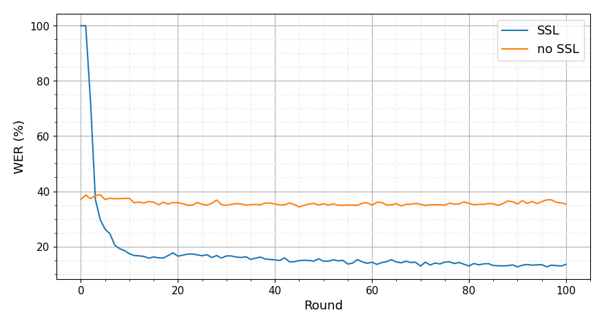

# Federated Learning for ASR Based on wav2vec 2.0

> Note: If you use this baseline in your work, please remember to cite the original authors of the paper as well as the Flower paper.

**Paper:** [ieeexplore.ieee.org/document/10096426](https://ieeexplore.ieee.org/document/10096426)

**Authors:** Tuan Nguyen, Salima Mdhaffar, Natalia Tomashenko, Jean-François Bonastre, Yannick Estève

**Abstract:** This paper presents a study on the use of federated learning to train an ASR model based on a wav2vec 2.0 model pre-trained by self supervision. Carried out on the well-known TED-LIUM 3 dataset, our experiments show that such a model can obtain, with no use of a language model, a word error rate of 10.92% on the official TEDLIUM 3 test set, without sharing any data from the different users. We also analyse the ASR performance for speakers depending to their participation to the federated learning. Since federated learning was first introduced for privacy purposes, we also measure its ability to protect speaker identity. To do that, we exploit an approach to analyze information contained in exchanged models based on a neural network footprint on an indicator dataset. This analysis is made layer-wise and shows which layers in an exchanged wav2vec 2.0 based model bring the speaker identity information.


## About this baseline

**What’s implemented:** Figure 1 in the paper. However, this baseline only provide the SSL from figure 1. However, this baseline exclusively offers the self-supervised learning (SSL) approach as depicted in Figure 1 due to it superior performance. If you wish to implement non-SSL methods yourself, you can use the provided recipe and pre-trained model by Speechbrain, available at this link: [Speechbrain Recipe for Non-SSL](https://github.com/speechbrain/speechbrain/tree/develop/recipes/CommonVoice/ASR/seq2seq).

**Datasets:** TED-LIUM 3 dataset. It requires a 54GB download. Once extracted it is ~60 GB. You can read more about this dataset in the [TED-LIUM 3](https://arxiv.org/abs/1805.04699) paper. A more concise description of this dataset can be found in the [OpenSLR](https://www.openslr.org/51/) site.

**Hardware Setup:** Training `wav2vec2.0` is a bit memory intensive so you'd need at least a 24GB GPU. With the current settings, each client requires ~15GB of VRAM. This suggest you could run the experiment fine on a 16GB GPU but not if you also need to pack the global model evaluation stage on the same GPU. On a single RTX 3090Ti (24GB VRAM) each round takes between 20 and 40 minutes (depending on which clients are sampled, some clients have more data than others).

**Contributors:** [Tuan Nguyen](https://www.linkedin.com/in/manh-tuan-nguyen-595898203)

## Experimental Setup

**Task:** Automatic Speech Recognition (ASR)

**Model:** Wav2vec2.0-large [from Huggingface](https://huggingface.co/facebook/wav2vec2-large-lv60) totalling 317M parameters. Read more in the [wav2vec2.0 paper](https://arxiv.org/abs/2006.11477).


**Dataset:** In this paper, we divided the training dataset of TED-LIUM 3 into 1943 clients, where each of them is represented by a speaker from TED-LIUM 3. The clients are ordered by CID, with `client_0` having the largest amount of speech hours and `client_1943` having the smallest. Each client's data will be divided into training, development, and test sets with an 80-10-10 ratio. For client who has more than 10 minutes, we extract 5 minutes from their training set for analysis purposes. This portion will not be used during training or in any part of this baseline. For clients with duration less than 10 minutes, all the speaker data will represent the local dataset for the client. The full structure breakdown is below: 
```bash
├── data
│   ├── client_{cid}
│   │   ├── ted_train.csv
│   │   ├── ted_dev.csv
│   │   ├── ted_test.csv
│   │   ├── ted_train_full5.csv {Analysis dataset contains only 5m from ted_train.csv}
│   │   ├── ted_train_wo5.csv {the training file for client who has more than 10m}
│   ├── server
│   │   ├── ted_train.csv {all TED-LIUM 3 train set}
│   │   ├── ted_dev.csv {all TED-LIUM 3 valid set}
│   │   ├── ted_test.csv {all TED-LIUM 3 test set}

```
For more details, please refer to the relevant section in the paper.

**Training Hyperparameters:** 
| Hyperparameter | Default Value | Description |
| ------- | ----- | ------- |
| `pre_train_model_path` | `null` | Path to pre-trained model or checkpoint. The best checkpoint could be found [here](https://github.com/tuanct1997/Federated-Learning-ASR-based-on-wav2vec-2.0/tree/main/material/pre-trained) |
| `save_checkpoint` | `null` | Path to folder where server model will be saved at each round |
| `label_path` | `docs/pretrained_wav2vec2` | Label each character for every client to ensure consistency during training phase|
| `sb_config` | `fedwav2vec2/conf/sb_config/w2v2.yaml` | Speechbrain config file for architecture model. Please refer to [SpeechBrain](https://github.com/speechbrain/speechbrain) for more information |
| `rounds` | `100` | Indicate the number of Federated Learning (FL) rounds|
| `local_epochs` | `20` | Specify the number of training epochs at the client side |
| `total_clients` | `1943` | Size of client pool, with a maximum set at 1943 clients|
| `server_cid` | `19999` | ID of the server to distinguish from the client's ID |
| `server_device` | `cuda` | You can choose between `cpu` or `cuda` for centralised evaluation, but it is recommended to use `cuda`|
| `parallel_backend` | `false` | Multi-gpus training. Only active if you have more than 1 gpu per client | 
| `strategy.min_fit_client` | `20` | Number of clients involve per round. Default is 20 as indicated in the paper |
| `strategy.fraction_fit` | `0.01` | Ratio of client pool to involve during training |
| `strategy.weight_strategy` | `num`| Different way to average clients weight. Could be chose between `num`,`loss`,`wer` |
| `client_resources.num_cpus` | `8`| Number of cpus per client. Recommended to have more than 8 |
| `client_resources.num_gpus` | `1`| Number of gpus per client. Recommended to have at least 1 with VRAM > 24GB |


By default, long audio sequences (>10s) are excluded from training. This is done so to keep the VRAM usage low enough to train a client on a 16GB GPU. This hyperparameter is defined in the `sb_config` under the `avoid_if_longer_than` tag.

## Environment Setup

Once you have installed `pyenv` and `poetry`, run the commands below to setup your python environment:

```bash
# Set a recent version of Python for your environment
pyenv local 3.10.6
poetry env use 3.10.6

# Install your environment
poetry install

# Activate your environment
poetry shell
```

When you run this baseline for the first time, you need first to download the data-to-client mapping files as well as the `TED-LIUM-3`` dataset.

```bash
# Then create a directory using the same name as you'll use for `dada_dir` in your config (see conf/base.yaml)
mkdir data

# Clone client mapping (note content will be moved to your data dir)
git clone https://github.com/tuanct1997/Federated-Learning-ASR-based-on-wav2vec-2.0.git _temp && mv _temp/data/* data/ && rm -rf _temp

# Download dataset, extract and prepare dataset partitions
# This might take a while depending on your internet connection
python -m fedwav2vec2.dataset_preparation
```


## Running the Experiments

```bash
# Run with default arguments (one client per GPU)
python -m fedwav2vec2.main

# if you have a large GPU (32GB+) you might want to fit two per GPU
python -m fedwav2vec2.main client_resources.num_gpus=0.5

# the global model can be saved at the end of each round if you specify a checkpoint path
python -m fedwav2vec2.main save_checkpoint=<path-to-checkpoint-dir> # if directory doesn't exist, it will be created

# then you can use it as the starting point for your global model like so:
python -m fedwav2vec2.main pre_train_model_path=<path-to-checkpoint-dir>/last_checkpoint.pt
```

When running the experiment, a structure of directories `<date>/<time>` will be created by Hydra. Inside you'll find a directory for each client (where their log is recorded). Another directory at the same level `<date>/<time>server` is created where the server log is recorded. For this baseline the metric of interes it the Word Error Rate (`WER`) which is logged in `train_log.txt` at the end of each round.


## Expected Results

Running the command above will generate the `SSL` results as shown on the plot below. The results should closely follow those in Figure 1 in the paper.

<p align="center">
      
</p>
