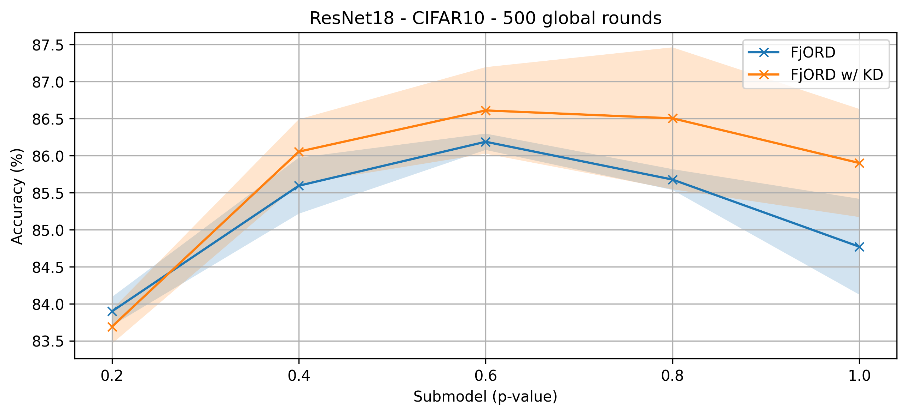

# FjORD: Fair and Accurate Federated Learning under heterogeneous targets with Ordered Dropout

**Paper:** [openreview.net/forum?id=4fLr7H5D_eT](https://openreview.net/forum?id=4fLr7H5D_eT)

**Authors:** Samuel Horváth\*, Stefanos Laskaridis\*, Mario Almeida\*, Ilias Leontiadis, Stylianos Venieris, Nicholas Donald Lane


**Abstract:** Federated Learning (FL) has been gaining significant traction across different ML tasks, ranging from vision to keyboard predictions. In large-scale deployments, client heterogeneity is a fact and constitutes a primary problem for fairness, training performance and accuracy. Although significant efforts have been made into tackling statistical data heterogeneity, the diversity in the processing capabilities and network bandwidth of clients, termed system heterogeneity, has remained largely unexplored. Current solutions either disregard a large portion of available devices or set a uniform limit on the model's capacity, restricted by the least capable participants.

In this work, we introduce Ordered Dropout, a mechanism that achieves an ordered, nested representation of knowledge in Neural Networks and enables the extraction of lower footprint submodels without the need for retraining. We further show that for linear maps our Ordered Dropout is equivalent to SVD.  We employ this technique, along with a self-distillation methodology, in the realm of FL in a framework called FjORD. FjORD alleviates the problem of client system heterogeneity by tailoring the model width to the client's capabilities.
Extensive evaluation on both CNNs and RNNs across diverse modalities shows that FjORD consistently leads to significant performance gains over state-of-the-art baselines while maintaining its nested structure.


## About this baseline

**What’s implemented:** The code in this directory implements the two variants of FjORD, with and without knowledge distillation.

**Datasets:** CIFAR-10

**Hardware Setup:** We trained the baseline on an Nvidia RTX 4090.

**Contributors:** @stevelaskaridis ([Brave Software](https://brave.com/)), @SamuelHorvath ([MBZUAI](https://mbzuai.ac.ae/))


## Experimental Setup

**Task:** Image Classification

**Model:** ResNet-18

**Dataset:**

| **Feature**                | **Value**                    |
| -------------------------- | ---------------------------- |
| **Dataset**                | CIFAR-10                     |
| **Partition**              | Randomised Sequential Split  |
| **Number of Partitions**   | 100 clients                  |
| **Data points per client** | 500 samples                  |

**Training Hyperparameters:**

| **Hyperparameter**      | **Value**                 |
| ----------------------- | ------------------------- |
| batch size              | 32                        |
| learning rate           | 0.1                       |
| learning rate scheduler | static                    |
| optimiser               | sgd                       |
| momentum                | 0                         |
| nesterov                | False                     |
| weight decay            | 1e-4                      |
| sample per round        | 10                        |
| local epochs            | 1                         |
| p-values                | [0.2, 0.4, 0.6, 0.8, 1.0] |
| client tier allocation  | uniform                   |


## Environment Setup

### Through regular pip

```bash
pip install -r requirements.txt
python setup.py install
```

### Through poetry

```bash
# Set python version
pyenv install 3.10.6
pyenv local 3.10.6

# Tell poetry to use python 3.10
poetry env use 3.10.6

# install the base Poetry environment
poetry install

# activate the environment
poetry shell
```

## Running the Experiments

### Through your environment


```bash
python -m fjord.main  # without knowledge distillation
# or
python -m fjord.main +train_mode=fjord_kd  # with knowledge distillation
```

### Through poetry

```bash
poetry run python -m fjord.main  # without knowledge distillation
# or
poetry run python -m fjord.main +train_mode=fjord_kd  # with knowledge distillation
```

## Expected Results

```bash
cd scripts/
./run.sh
```

Plots and the associated code reside in `fjord/notebooks/visualise.ipynb`.

