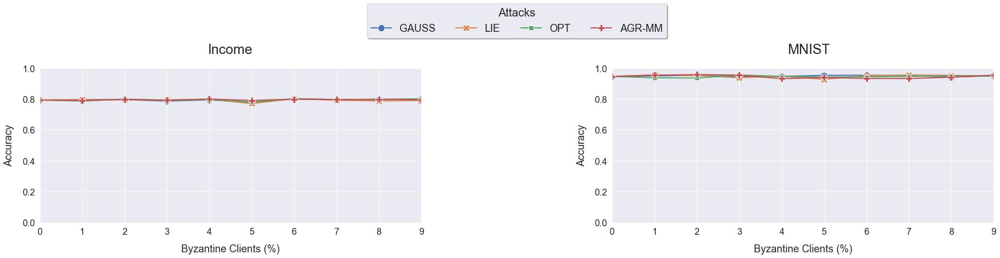
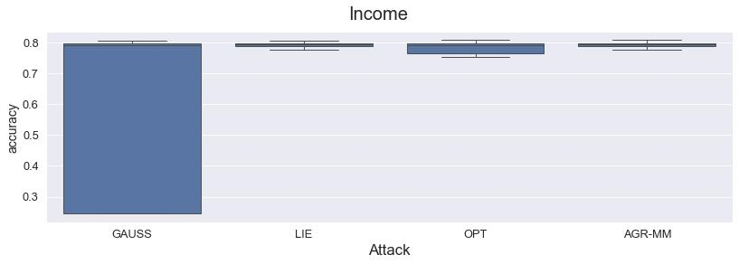
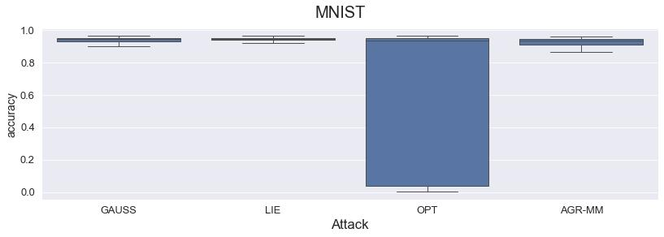

**Paper:** [arxiv.org/abs/2303.16668](https://arxiv.org/abs/2303.16668)

**Authors:** Edoardo Gabrielli, Gabriele Tolomei, Dimitri Belli, Vittorio Miori

**Abstract:** Current defense mechanisms against model poisoning attacks in federated learning (FL) systems have proven effective up to a certain threshold of malicious clients. In this work, we introduce FLANDERS, a novel pre-aggregation filter for FL resilient to large-scale model poisoning attacks, i.e., when malicious clients far exceed legitimate participants. FLANDERS treats the sequence of local models sent by clients in each FL round as a matrix-valued time series. Then, it identifies malicious client updates as outliers in this time series by comparing actual observations with estimates generated by a matrix autoregressive forecasting model maintained by the server. Experiments conducted in several non-iid FL setups show that FLANDERS significantly improves robustness across a wide spectrum of attacks when paired with standard and robust existing aggregation methods. 

## About this baseline

**What’s implemented:** The code in this directory replicates the results of FLANDERS+\[baseline\] on MNIST and Fashion-MNIST under all attack settings: Gaussian, LIE, OPT, and AGR-MM; with $r=[0.2,0.6,0.8]$, specifically about tables 1, 3, 10, 11, 15, 17, 19, 20 and Figure 3.

**Datasets:** MNIST, FMNIST

**Hardware Setup:** AMD Ryzen 9, 64 GB RAM, and an NVIDIA 4090 GPU with 24 GB VRAM.

**Estimated time to run:** You can expect to run experiments on the given setup in 2m with MNIST and 1h30m with Fashion-MNIST. With an Apple M2 Pro, 16gb RAM; each experiment with 10 clients for **MNIST** runs in about 24 minutes. Note that experiments with OPT (fang) and AGR-MM (minmax) can be 10x slower.

**Contributors:** Edoardo Gabrielli, Sapienza University of Rome ([GitHub](https://github.com/edogab33), [Scholar](https://scholar.google.com/citations?user=b3bePdYAAAAJ))


## Experimental Setup

**Task:** Image classification

**Models:** Appendix F and G of the paper describes the models, but here's a summary.

MNIST (multilabel classification, fully connected, feed forward NN):
- Multilevel Perceptron (MLP)
- minimizing multiclass cross-entropy loss using Adam optimizer
- input: 784
- hidden layer 1: 128
- hidden layer 2: 256

Fashion-MNIST (multilabel classification, fully connected, feed forward NN):
- Multilevel Perceptron (MLP)
- minimizing multiclass cross-entropy loss using Adam optimizer
- input: 784
- hidden layer 1: 256
- hidden layer 2: 128
- hidden layer 3: 64

**Dataset:** Every dataset is partitioned into two disjoint sets: 80% for training and 20% for testing. The training set is distributed uniformly across all clients (100), while the testing set is held by the server to evaluate the global model.

| Description | Default Value |
| ----------- | ----- |
| Partitions | 100 |
| Evaluation | centralized |
| Training set | 80% |
| Testing set | 20% |

**Training Hyperparameters:**

| Dataset | # of clients  | Clients per round | # of rounds | Batch size | Learning rate | Optimizer | Dropout | Alpha | Beta | # of clients to keep | Sampling |
| -- | -- | -- | -- | -- | -- | -- | -- | -- | -- | -- | -- |
| MNIST | 100 | 100 | 50 | 32 | $10^{-3}$ | Adam | 0.2 | 0.0 | 0.0 | $m - f$ | 500 |
| FMNIST | 100 | 100 | 50 | 32 | $10^{-3}$ | Adam | 0.2 | 0.0 | 0.0 | $m - f$ | 500 |

Where $m$ is the number of clients partecipating during n-th round and $f$ is the number of malicious clients. The variable $sampling$ identifies how many parameters MAR analyzes.


## Environment Setup

```bash  
# Use a version of Python >=3.9 and <3.12.0.
pyenv local 3.10.12
poetry env use 3.10.12

# Install everything from the toml
poetry install

# Activate the env
poetry shell
```


## Running the Experiments
Ensure that the environment is properly set up, then run:

```bash  
python -m flanders.main
```

To execute a single experiment with the default values in `conf/base.yaml`.

To run custom experiments, you can override the default values like that:

```bash
python -m flanders.main dataset=income server.attack_fn=lie server.num_malicious=1
```

Finally, to run multiple custom experiments:

```bash
python -m flanders.main --multirun dataset=mnist,fmnist server.attack_fn=gaussian,lie,fang,minmax server.num_malicious=0,1,2,3,4,5
```


## Expected Results

By running;
```bash
python -m flanders.main --multirun dataset=mnist,fmnist server.attack_fn=gaussian,lie,fang,minmax server.num_malicious=0,1,2,3,4,5,6,7,8,9
```

It will generate the results in `results/all_results.csv`. To generate the plots, use the notebook in `plotting/plots.ipynb`.

Expected maximum accuracy achieved across different numbers of malicious clients and different attacks:



Expected distribution of accuracy from round $L$ to the final round across all the experiments:



