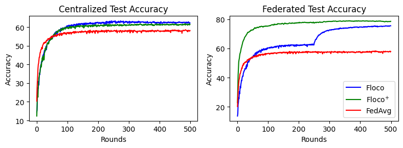
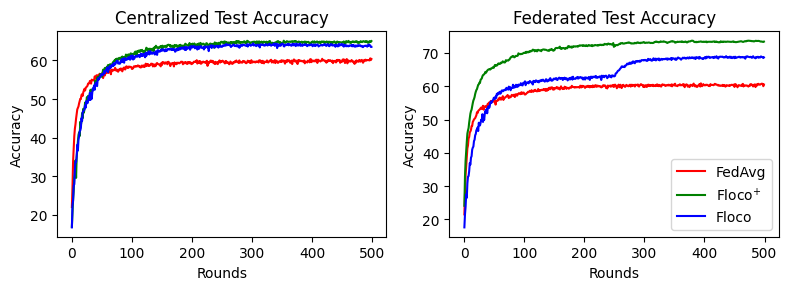

# Floco: Federated Learning over Connected Modes

**Paper:** [https://openreview.net/pdf?id=JL2eMCfDW8](https://openreview.net/pdf?id=JL2eMCfDW8)

**Authors:** Dennis Grinwald, Philipp Wiesner, Shinichi Nakajima

**Abstract:** Statistical heterogeneity in federated learning poses two major challenges: slow global training due to conflicting gradient signals, and the need of personalization for local distributions. In this work, we tackle both challenges by leveraging recent advances in *linear mode connectivity* --- identifying a linearly connected low-loss region in the parameter space of neural networks, which we call solution simplex. We propose federated learning over connected modes (Floco), where clients are assigned local subregions in this simplex based on their gradient signals, and together learn the shared global solution simplex. This allows personalization of the client models to fit their local distributions within the degrees of freedom in the solution simplex and homogenizes the update signals for the global simplex training.  Our experiments show that Floco accelerates the global training process, and significantly improves the local accuracy with minimal computational overhead in cross-silo federated learning settings.


## About this baseline

**What’s implemented:** The code in this directory implements the method Floco and Floco+.

**Datasets:** CIFAR-10

**Hardware Setup:** We trained the models used for the plots below on an Apple M1 Pro chip.

**Contributors:** Dennis Grinwald (dennis.grinwald@tu-berlin.de), Philipp Wiesner (wiesner@tu-berlin.de).

## Experimental Setup

**Task:** Image Classification

**Model:** This repository implements a two-layer CNN as in [McMahan et al. 2017](https://arxiv.org/abs/1602.05629). Additional models can be implemented by changing the `base_model` attribute in the `SimplexModel` class in `floco/model.py`.

**Dataset:**

| **Feature**                | **Value**                    |
| -------------------------- | ---------------------------- |
| **Dataset**                | CIFAR-10                     |
| **Partition**              | Dirichlet and Fold split     |
| **Number of Partitions**   | 100 clients                  |
| **Data points per client** | 500 samples                  |

**Training Hyperparameters:**

| **Hyperparameter**            | **Value**                           |
| ----------------------------- | ----------------------------------- |
| batch size                    | 50                                  |
| learning rate                 | 0.02                                |
| learning rate scheduler       | static                              |
| optimizer                     | sgd                                 |
| momentum                      | 0.5                                 |
| nesterov                      | False                               |
| weight decay                  | 5e-4                                |
| clients per round             | 30                                  |
| local epochs                  | 5                                   |
| personalized epochs           | 5                                   |
| rho (l1-ball radius)          | 0.1(Fold) / 0.3(Dirichlet)          |
| tau (=round of projection)    | 250                                 |
| M (=number simplex endpoints) | 10                                  |


## Environment Setup

### Through regular pip

```bash
# Create a python env
pyenv virtualenv 3.10.14 floco

# Activate it
pyenv activate floco

# Install project including packages
pip install .
```

## Running the Experiments
In order to run using the default settings, simply run:
### Through your environment
```bash
flwr run .
```
This will run Floco on the Dirichlet(0.5) split. If you want to test other splits, you can specify which config you want to use. For example, if you would like to test Floco<sup>+</sup> on the CIFAR-10 Five Fold split from the original paper, simply run:
```bash
flwr run . --run-config conf/cifar10_fold_floco_p.toml
```
If you want to run the benchmark shown int the Figures below, simply run:
```bash
bash ./run.sh
```
This will run FedAvg, Floco and Floco<sup>+</sup> on the CIFAR-10 Five-Fold and Dirichlet(0.5) split.
## Expected Results
In order to generate the result plots shown below, run:
```
python floco/plot_results.py
```
### CIFAR-10 Five-Fold split
 

### CIFAR-10 Dirichlet split
 

## How to cite this work
### Bibtex

```bibtex
@inproceedings{grinwald2024floco,
  title={Federated Learning over Connected Modes},
  author={Grinwald, Dennis and Wiesner, Philipp and Nakajima, Shinichi},
  booktitle={The Thirty-eighth Annual Conference on Neural Information Processing Systems (NeurIPS'24)},
  year={2024},
  url={https://openreview.net/forum?id=JL2eMCfDW8}
}