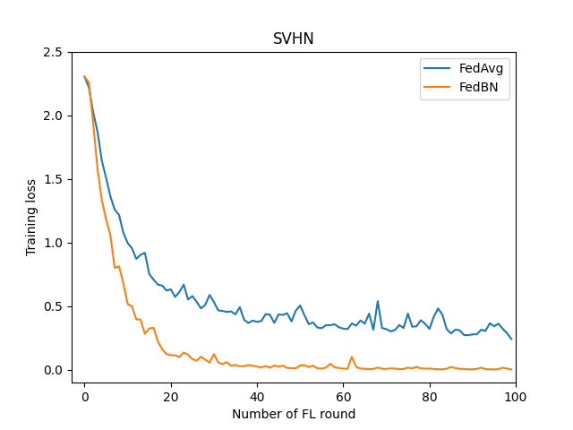
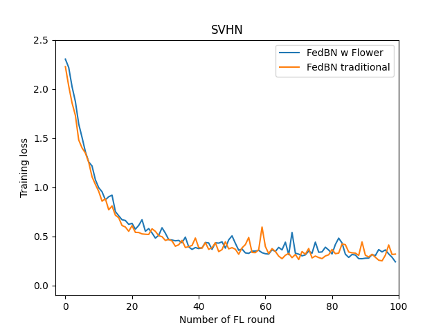

# FedBN Baseline - Convergence Rate

## Experiment Introduction

The **FedBN - Convergence Rate** baseline is based on the paper [FEDBN: FEDERATED LEARNING ON NON-IID FEATURES VIA LOCAL BATCH NORMALIZATION](https://arxiv.org/pdf/2102.07623.pdf) and reproduces the results presented in *Chapter 5 - Convergence Rate (Figure 3)*. The implementation is based on the Flower federated learning framework. This experiment uses 5 completely different image datasets of digits to emulate a non-IID data distribution over the different clients. The experiment therefore uses 5 clients for the training. The local training is set up to perform 1 epoch and it uses a CNN model together with the SGD optimizer (cross-entropy loss).

## Dataset 

### General Overview

The following 5 different datasets are used to simulate a non-IID data distribution over 5 clients:

* [MNIST](https://ieeexplore.ieee.org/document/726791)
* [MNIST-M]((https://arxiv.org/pdf/1505.07818.pdf))
* [SVHN](http://ufldl.stanford.edu/housenumbers/nips2011_housenumbers.pdf)
* [USPS](https://ieeexplore.ieee.org/document/291440)
* [SynthDigits](https://arxiv.org/pdf/1505.07818.pdf)

A more detailed explanation of the datasets is given in the following table.

|     | MNIST     | MNIST-M   | SVHN  |  USPS    | SynthDigits |
|--- |---        |---        |---    |---            |---    |
| data type| handwritten digits| MNIST modification randomly colored with colored patches| Street view house numbers | handwritten digits from envelopes by the U.S. Postal Service | Syntehtic digits Windows TM font varying the orientation, blur and stroke colors |
| color | greyscale | RGB | RGB | greyscale | RGB |
| pixelsize | 28x28 | 28 x 28 | 32 x32 | 16 x16 | 32 x32 |
| labels | 0-9 | 0-9 | 1-10 | 0-9 | 1-10 |
| number of trainset | 60.000 | 60.000 | 73.257 | 9,298 | 50.000 |
| number of testset| 10.000 | 10.000 | 26.032 | - | - |
| image shape | (28,28) | (28,28,3) | (32,32,3) | (16,16) | (32,32,3) |

### Dataset Download

The [FedBN](https://arxiv.org/pdf/2102.07623.pdf) authors prepared a preprocessed dataset on their GitHub repository. It is available [here](https://github.com/med-air/FedBN). Please download the dataset, save it in a `/data` directory, and unzip it.

The training data contains only 7438 samples and it is split into 10 files, but only one file is used for the **FedBN: Convergence Rate** baseline. Therefore, 743 samples are used for the local training.

Run the following commands to download and preprocess the original data:

```bash
# download data (will create a directory in ./path)
python utils/data_download.py

# preprocess
python utils/data_preprocess.py
```

All the datasets (with the exception of SynthDigits) can be downloaded from the original sources:

```bash
# download
python utils/data_download_raw.py 

# preprocess
python utils/data_preprocess.py
```

## Training Setup

### CNN Architecture

The CNN architecture is detailed in the paper and used to create the **FedBN - Convergence Rate** baseline.

| Layer | Details|
| ----- | ------ |
| 1 | Conv2D(3,64, 5,1,2) <br/> BN(64), ReLU, MaxPool2D(2,2)  |
| 2 | Conv2D(64, 64, 5, 1, 2) <br/> BN(64), ReLU, MaxPool2D(2,2) |
| 3 | Conv2D(64, 128, 5, 1, 2) <br/> BN(128), ReLU |
| 4 | FC(6272, 2048) <br/> BN(2048), ReLU |
| 5 | FC(2048, 512) <br/> BN(512), ReLU |
| 6 | FC(512, 10) |

### Training Paramaters

| Description | Value |
| ----------- | ----- |
| training samples | 743 |
| mu | 10E-2 |
| local epochs | 1 |
| loss | cross entropy loss |
| optimizer | SGD |

## Running the Experiment

Before running any part of the experiment, [please get the required data](dataset-download), and place it in the `/data` directory.

As soon as you have downloaded the data you are ready to start the baseline experiment. The baseline implementation is split across different files:

* cnn_model.py
* client.py
* server.py
* run.sh
* utils/data_utils.py
* evaluation_plot.py

In order to run the experiment, you simply make `run.sh` executable and run it:

```bash
chmod +x run.sh
# train the CNN with FedAvg strategy
./run.sh fedavg
# train the CNN with FedBN strategy
./run.sh fedbn
```

The `run.sh` script first creates the files in which the evaluation results are saved and starts `server.py` and 5 clients in parallel with `client.py`. As explained before, each client loads a different dataset. The clients save the evaluation results after the parameters were sent from the server to the client and right before the local training. The saved parameters are included in a dict with the following information:

```python
test_dict =  {"dataset": self.num_examples["dataset"], "fl_round" : fl_round, "strategy": self.mode, "test_loss": loss, "test_accuracy": accuracy}
```

The `utils/data_utils.py` script prepares/loads the data for the training and `cnn_model.py` defines the [CNN model architecture](#cnn-architecture). This baseline only uses one single file with 743 samples from the downloaded dataset.

If you want to compare the results of both strategy runs (FedAvg and FedBN) you can run:

```bash
# create the evalutation plot
python evaluation_plot.py
```

This will create a plot `convergence_rate.png` including the train loss after the server aggregation from a certain client for the FedAvg and FedBN stretegy. A noticeable difference between both stretagies is visible for the SVHN dataset. The train loss has a more stable and steeper decrease when using FedBN over FedAvg.



This baseline was created to reproduce the [FedBN implementation available on GitHub](https://github.com/med-air/FedBN). The following diagram shows the convergence rate of the SVHN client with same strategy, FedBN, using the Flower implementation and the original FedBN implementation. The loss decrease is very similar in both cases.



### Server

This baseline compares Federated Averaging (FedAvg) with Federated Batch Normalization (FedBN). In both cases, we are using FedAvg on the server-side. All model parameters are sent from the client to the server and aggregated. However, in the case of FedBN, we are setting up the client to exclude batch norm layers from the transmission to the server. FedBN is therefore a strategy that only requires changes on the client-side.

The server is kept very simple and remains the same in both settings. We are using FedAvg on the server-side with the parameters `min_fit_clients`, `min_eval_clients`, and `min_available_clients`. All are set to the value `5` since we have five clients to be trained and evaluated in each FL round. All in all, the *FedBN* paper runs 600 FL rounds that can be implemented as follows.     

```python
import flwr as fl

if __name__ == "__main__":
    strategy = fl.server.strategy.FedAvg(
        min_fit_clients=5,
        min_eval_clients=5,
        min_available_clients=5,
    )
    fl.server.start_server(server_address="[::]:8080", config={"num_rounds": 100}, strategy=strategy)

```

### Client

The client is a little more complex. However, it can be separated into different parts. The main parts are:

* `load_partition()`
    * load the right dataset
* `train()`
    * perfom the local training
* `test()`
    * evaluate the training results
* `FlowerClient(fl.client.NumPyClient)`
    * start the Flower client
* `main()`
    * start all previous process in a main() file

The `load_partition()` function loads the datasets saved in the `/data` dierctory.

You can directly see that the training and evaluation process is defined within the client. We are using PyTorch to train and evaluate the model with the parameters described in the section [Training Setup](#training-setup). 

The Flower client `FlowerClient(fl.client.NumPyClient)` implements the usual methods:

* get_paramaters()
* set_parameters()
* fit()
* evaluate()

Let us take a closer look at `set_parameters()` in order to understand the difference between FedAvg and FedBN:

```python 
def set_parameters(self, parameters: List[np.ndarray])-> None:
    self.model.train()
    if self.mode == 'fedbn':
        keys = [k for k in self.model.state_dict().keys() if "bn" not in k]
        params_dict = zip(keys, parameters)
        state_dict = OrderedDict({k: torch.tensor(v) for k, v in params_dict})
        self.model.load_state_dict(state_dict, strict=False)
    else:
        params_dict = zip(self.model.state_dict().keys(), parameters)
        state_dict = OrderedDict({k: torch.tensor(v) for k, v in params_dict})
        self.model.load_state_dict(state_dict, strict=True)
```

You can see that the clients update all layers of the PyTorch model with the values received from the server when using the plain FedAvg strategy (including batch norm layers). However, in the case of FedBN, the parameters for the batch norm layers (`bn`) are excluded. 
