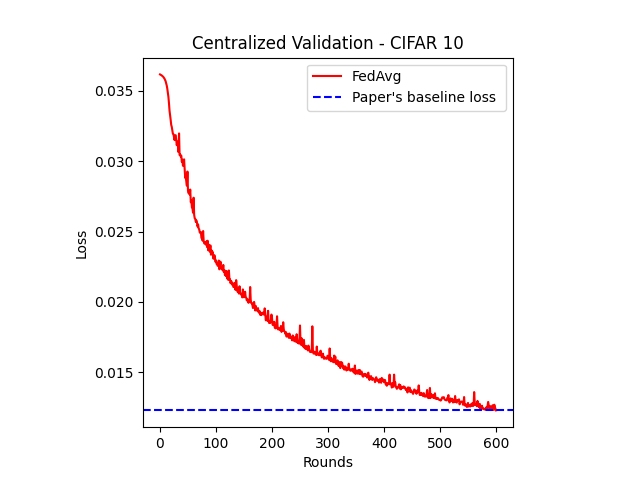
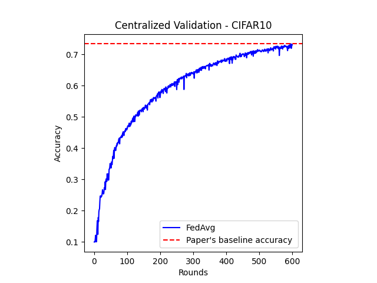

**Federated Averaging CIFAR10**

The following baseline replicates the experiments in “Communication-Efficient Learning of Deep Networks from Decentralized Data” (McMahan et al., 2017), which was the first paper to coin the term Federated Learning and to propose the FederatedAveraging algorithm.

**Paper Abstract:**

    Modern mobile devices have access to a wealth of data suitable for learning models, which in turn can greatly improve the user experience on the device. For example, language models can improve speech recognition and text entry, and image models can automatically select good photos. However, this rich data is often privacy sensitive, large in quantity, or both, which may preclude logging to the data center and training there using conventional approaches. We advocate an alternative that leaves the training data distributed on the mobile devices, and learns a shared model by aggregating locally-computed updates. We term this decentralized approach Federated Learning. We present a practical method for the federated learning of deep networks based on iterative model averaging, and conduct an extensive empirical evaluation, considering five different model architectures and four datasets. These experiments demonstrate the approach is robust to the unbalanced and non-IID data distributions that are a defining characteristic of this setting. Communication costs are the principal constraint, and we show a reduction in required communication rounds by 10-100 * — as compared to synchronized stochastic gradient descent

**Paper Authors:**

H.Brendan McMahan,  Eider Moore, Daniel Ramage, Seth Hampson, and Blaise  Aguera yarcas.

[Link to paper](<https://arxiv.org/abs/1602.05629> "Link to paper")

**TRAINING SETUP**

**CNN ARCHITECTURE**

The CNN architecture is detailed in the paper and was used to create the  Federated Averaging CIFAR10  baseline.

| LAYER |  DETAILS |
| ------------ | ------------ |
|1 |  Conv2D(3, 16, 3, 1, 1),  ReLU, MaxPool2D(2, 2, 1) |
|2 |  conv2D(16, 32, 3, 1, 1), ReLU, MaxPool2D(2, 2, 1) |
|3 |  conv2D(32, 64, 3, 1, 1), ReLU, MaxPool2D(2, 2, 1), dropout(0.5)|
|4 |  FC(64\* 4\* 4, 512), ReLU, dropout(0.5) |
|5 |  FC(512, 128),  ReLU, dropout(0.5)  |
|6 |  FC(128, 10) |

**TRAINING PARAMETERS**

|DESCRIPTION   |  VALUE |
| ------------ | ------------ |
| loss  |  cross entropy loss  |
| optimizer  |  SGD  |
| Learning rate |  0.01 (by default)  |
| Local epochs  | 10 (by default)|  |
| Local batch size  | 64 (by default)  |

**RUNNING EXPERIMENTS**

The `config.yaml` file containing all the tunable hyperparameters and the necessary variables can be found under the conf folder.

[Hydra](https://hydra.cc/docs/tutorials/) is used to manage the different parameters experiments can be run with. 

To run using the default parameters,  enter `python main.py`.
To overwrite, use the following as an example. 

`python main.py num_epochs=10 num_rounds=600 iid=True`

Results will be stored as timestamped folders inside either `outputs` or `multiruns`, depending on whether you perform single- or multi-runs. 

**OUTPUTS**
To visualize, the script will plot loss and accuracy curves. Below are some samples:

------------

 

 
 

------------
The saved history will be in the `docs/results/` folder.   `C` = number of clients, `B =`  batch size,  `E =` number of local epochs , and `R =`  number of rounds.