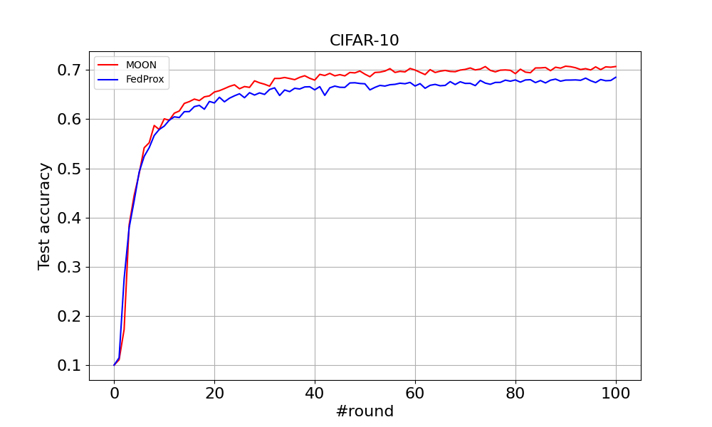
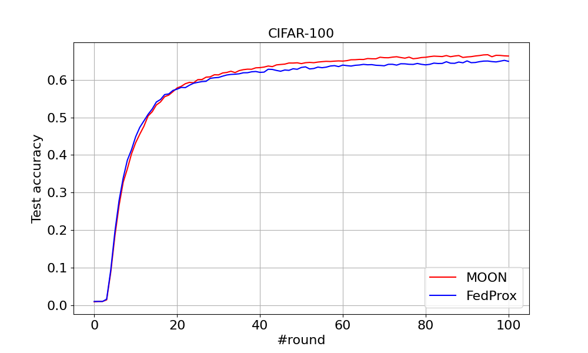

# Model-Contrastive Federated Learning

> Note: If you use this baseline in your work, please remember to cite the original authors of the paper as well as the Flower paper.


**Paper:** [arxiv.org/abs/2103.16257](https://arxiv.org/abs/2103.16257)

**Authors:** Qinbin Li, Bingsheng He, Dawn Song

**Abstract:** Federated learning enables multiple parties to collaboratively train a machine learning model without communicating their local data. A key challenge in federated learning is to handle the heterogeneity of local data distribution across parties. Although many studies have been proposed to address this challenge, we find that they fail to achieve high performance in image datasets with deep learning models. In this paper, we propose MOON: modelcontrastive federated learning. MOON is a simple and effective federated learning framework. The key idea of MOON is to utilize the similarity between model representations to correct the local training of individual parties, i.e., conducting contrastive learning in model-level. Our extensive experiments show that MOON significantly outperforms the other state-of-the-art federated learning algorithms on various image classification tasks.


## About this baseline

**What’s implemented:** The code in this directory replicates the experiments in *Model-Contrastive Federated Learning* (Li et al., 2021), which proposed the MOON algorithm. Concretely ,it replicates the results of MOON for CIFAR-10 and CIFAR-100 in Table 1.

**Datasets:** CIFAR-10 and CIFAR-100

**Hardware Setup:** The experiments are run on a server with 4x Intel Xeon Gold 6226R and 8x Nvidia GeForce RTX 3090. A machine with at least 1x 16GB GPU should be able to run the experiments in a reasonable time.

****Contributors:**** [Qinbin Li](https://qinbinli.com)

**Description:** MOON requires to compute the model-contrastive loss in local training, which requires access to the local model of the previous round (Lines 14-17 of Algorithm 1 of the paper). Since currently `FlowerClient` does not preserve the states when starting a new round, we store the local models into the specified `model.dir` in local training indexed by the client ID, which will be loaded to the corresponding client in the next round.

## Experimental Setup

**Task:** Image classification.

**Model:** This directory implements two models as same as the paper:
* A simple-CNN with a projection head for CIFAR-10
* A ResNet-50 with a projection head for CIFAR-100.
  
**Dataset:** This directory includes CIFAR-10 and CIFAR-100. They are partitioned in the same way as the paper. The settings are as follow:

| Dataset | partitioning method |
| :------ | :---: |
| CIFAR-10  | Dirichlet with beta 0.5 |
| CIFAR-100 | Dirichlet with beta 0.5 |


**Training Hyperparameters:**

| Description | Default Value |
| ----------- | ----- |
| number of clients | 10 |
| number of local epochs | 10 |
| fraction fit | 1.0 |
| batch size | 64 |
| learning rate | 0.01 |
| mu | 1 |
| temperature | 0.5 |
| alg | moon |
| seed | 0 |
| service_device | cpu |
| number of rounds | 100 |
| client resources | {'num_cpus': 2.0, 'num_gpus': 0.0 }|

## Environment Setup

In a new Python environment:

```bash
# Navigate to the moon directory
# Then install the project
pip install -e .
```

## Running the Experiments

First ensure you have activated your. To run MOON on CIFAR-10 (Table 1 of the paper), you should run from the top-level directory of this baseline:
```bash  
flwr run .
```

To run MOON on CIFAR-100 (Table 1 of the paper), you should run:
```bash
python -m moon.main --config-name cifar100 # update with `flwr run`
```


You can also run FedProx on CIFAR-10:
```bash
python -m moon.main --config-name cifar10_fedprox # update with `flwr run`
```

To run FedProx on CIFAR-100:
```bash
python -m moon.main --config-name cifar100_fedprox # update with `flwr run`
```

## Expected Results

You can find the output logs of a single run in this [link](https://drive.google.com/drive/folders/1YZEU2NcHWEHVyuJMlc1QvBSAvNMjH-aR?usp=share_link). After running the above commands, you can see the accuracy list at the end of the output, which is the test accuracy of the global model. For example, in one running, for CIFAR-10 with MOON, the accuracy after running 100 rounds is 0.7071. 

For CIFAR-10 with FedProx, the accuracy after running 100 rounds is 0.6852. For CIFAR100 with MOON, the accuracy after running 100 rounds is 0.6636. For CIFAR100 with FedProx, the accuracy after running 100 rounds is 0.6494. The results are summarized below:


|  | CIFAR-10 | CIFAR-100 |
| ----------- | ----- | ----- |
| MOON | 0.7071 | 0.6636 |
| FedProx| 0.6852 | 0.6494 |

### Figure 6
You can find the curve comparing MOON and FedProx on CIFAR-10 and CIFAR-100 below.


 


You can tune the hyperparameter `mu` for both MOON and FedProx by changing the configuration file in `conf`.

### Figure 8(a)
You can run the experiments in Figure 8 of the paper. To run MOON (`mu=10`) on CIFAR-100 with 50 clients (Figure 8(a) of the paper):
```bash
python -m moon.main --config-name cifar100_50clients # update with `flwr run`
```

To run FedProx on CIFAR-100 with 50 clients (Figure 8(a) of the paper):
```bash
python -m moon.main --config-name cifar100_50clients_fedprox # update with `flwr run`
```


You can find the curve presenting MOON and FedProx below.


You may also run MOON on CIFAR-100 with 100 clients (Figure 8(b) of the paper):
```bash
python -m moon.main --config-name cifar100_100clients # update with `flwr run`
```