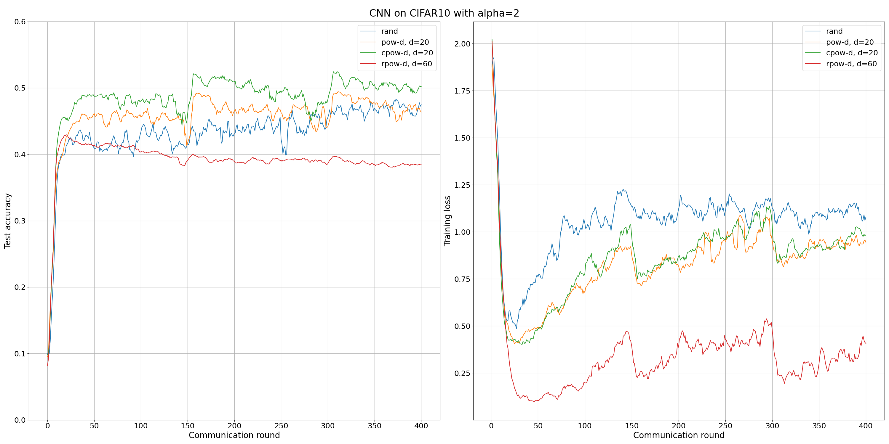

# Power of Choice

> Note: If you use this baseline in your work, please remember to cite the original authors of the paper as well as the Flower paper.

**Paper:** [proceedings.mlr.press/v151/jee-cho22a.html](https://proceedings.mlr.press/v151/jee-cho22a.html)

**Authors:** Yae Jee Cho, Jianyu Wang, Gauri Joshi

**Abstract:** Federated learning is a distributed optimization paradigm that enables a large number of resource-limited client nodes to cooperatively train a model without data sharing. Previous works analyzed the convergence of federated learning by accounting of data heterogeneity, communication/computation limitations, and partial client participation. However, most assume unbiased client participation, where clients are selected such that the aggregated model update is unbiased. In our work, we present the convergence analysis of federated learning with biased client selection and quantify how the bias affects convergence speed. We show that biasing client selection towards clients with higher local loss yields faster error convergence. From this insight, we propose Power-of-Choice, a communication- and computation-efficient client selection framework that flexibly spans the trade-off between convergence speed and solution bias. Extensive experiments demonstrate that Power-of-Choice can converge up to 3 times faster and give **10** higher test accuracy than the baseline random selection.


## About this baseline

****What’s implemented:**** The code in this directory replicates the experiments in *Towards Understanding Biased Client Selection in Federated Learning*(Jee Cho et al., 2022), using MLP on FMNIST and CNN on CIFAR10 for Image Classification. Concretely, it replicates the results for FMNIST in Figure 4 and for CIFAR10 in Figure 6.

****Datasets:**** FMNIST, CIFAR10 from Keras

****Hardware Setup:**** These experiments were run on a desktop machine with 10 CPU threads. Any machine with 4 CPU cores or more would be able to run it in a reasonable amount of time. Note: the entire experiment runs on CPU-only mode.

****Contributors:**** Andrea Restelli (Politecnico di Milano, Italy)


## Experimental Setup

****Task:**** Image classification

****Model:**** This directory implements two models:
* A Multi Layer Perceptron (MLP) used in Power of Choice paper for FMNIST. 
This is the model used by default.
* A CNN used in the paper on CIFAR10 dataset. To use this model you have to set is_cnn=True in the configuration file base.yaml.

****Dataset:**** This baseline includes two datasets: FMINST (Fashion MNIST) and CIFAR10. Both are partitioned by default among 100 clients, creating imbalanced non-iid partitions using Latent Dirichlet Allocation (LDA) without resampling. All the clients have the same number of samples. Parameter `alpha` of the LDA can be set in the `base.yaml` or passed as argument, by default it is set to 2.

| Dataset | #classes | #partitions | partitioning method | partition settings |
| :------ | :---: | :---: | :---: | :---: |
| Fashion MNIST | 10 | 100 | Latent Dirichlet Allocation | All clients with same number of samples |
| CIFAR10 | 10 | 100 | Latent Dirichlet Allocation | All clients with same number of samples |


:warning: *_Earlier you listed already the datasets that your baseline uses. Now you should include a breakdown of the details about each of them. Please include information about: how the dataset is partitioned (e.g. LDA with alpha 0.1 as default and all clients have the same number of training examples; or each client gets assigned a different number of samples following a power-law distribution with each client only instances of 2 classes)? if  your dataset is naturally partitioned just state “naturally partitioned”; how many partitions there are (i.e. how many clients)? Please include this an all information relevant about the dataset and its partitioning into a table._*

****Training Hyperparameters:**** 
| Hyperparameter | Description | Default Value |
| ---- | ----------- | ----- |
| `num_clients` | Number of total clients | 100 |
| `batch_size` | Batch size | 32 |
| `local_epochs` | Number of epochs during training | 5 |
| `fraction_samples` | Fraction of local samples to be used by clients | 1.0|
| `b` | Number of samples in the mini-batch of *rpow* | 64 |
| `d` | Number of clients selected in the *first phase* | 6 |
| `ck` | Number of clients selected at each round | 3 |


## Environment Setup

:warning: _The Python environment for all baselines should follow these guidelines in the `EXTENDED_README`. Specify the steps to create and activate your environment. If there are any external system-wide requirements, please include instructions for them too. These instructions should be comprehensive enough so anyone can run them (if non standard, describe them step-by-step)._


## Environment Setup
By default, Poetry will use the Python version in your system. 
In some settings, you might want to specify a particular version of Python 
to use inside your Poetry environment. You can do so with `pyenv`. 
Check the documentation for the different ways of installing `pyenv`,
but one easy way is using the automatic installer:

```bash
curl https://pyenv.run | bash
```
You can then install any Python version with `pyenv install <python-version>`
(e.g. `pyenv install 3.10.6`) and set that version as the one to be used. 
```bash
# cd to your power_of_choice directory (i.e. where the `pyproject.toml` is)
pyenv install 3.10.6

pyenv local 3.10.6

# set that version for poetry
poetry env use 3.10.6
```
To build the Python environment as specified in the `pyproject.toml`, use the following commands:
```bash
# cd to your power_of_choice directory (i.e. where the `pyproject.toml` is)

# install the base Poetry environment
poetry install

# activate the environment
poetry shell
```

## Running the Experiments

First ensure you have activated your Poetry environment (execute `poetry shell` from this directory).

### Generate Clients' Dataset
First (and just the first time), the data partitions of clients must be generated.

To generate the partitions for the FMNIST dataset (used in Figure 4 of the paper), run the following command:

```bash
# this will generate the datasets using the default settings in the `conf/base.yaml`
python -m power_of_choice.dataset_preparation
```

The generated datasets will be saved in the `fmnist` folder.

If you want to modify the `alpha` parameter used to create the LDA partitions, you can override the parameter:

```bash
python -m power_of_choice.dataset_preparation alpha=<alpha>
```

To generate partitions of the CIFAR10 dataset (used in Figure 6 of the paper), you can override the parameter:

```bash
python -m power_of_choice.dataset_preparation dataset.dataset="cifar10"
```

In this case the generated datasets will be saved in the `cifar10` folder.

### Running simulations and reproducing results
If you have not done it yet, [generate the clients' dataset](#generate-clients-dataset).


#### MLP on FMNIST 

The default configuration for `power_of_choice.main` uses the base version Power of Choice strategy with MLP on FMNIST dataset. It can be run with the following:

```bash
python -m power_of_choice.main # this will run using the default settings in the `conf/config.yaml`
```

You can override settings directly from the command line in this way:

```bash
python -m power_of_choice.main num_rounds=100 # will set the number of rounds to 100
```

To run using FedAvg:
```bash
# This will use FedAvg as strategy
python -m power_of_choice.main variant="rand" 
```

To run all the experiments in Figure 4 of the paper, use the following commands:
```bash
# This will use FedAvg as strategy
python -m power_of_choice.main variant="rand" 

# This will use base version of Power of Choice with d=6
python -m power_of_choice.main strategy.d=6

# This will use base version of Power of Choice with d=9
python -m power_of_choice.main strategy.d=9

# This will use base version of Power of Choice with d=12
python -m power_of_choice.main strategy.d=12
```

To run all the experiments in Figure 6 of the paper, use the following commands:
```bash
# This will use FedAvg as strategy
python -m power_of_choice.main variant="rand" 

# This will use base version of Power of Choice with d=6
python -m power_of_choice.main strategy.d=6

# This will use base version of Power of Choice with d=9
python -m power_of_choice.main strategy.d=9

# This will use base version of Power of Choice with d=12
python -m power_of_choice.main strategy.d=12
```

## Expected Results

This repository can reproduce the results for 4 baselines used in the experimental part of the original paper: FedAvg, pow-d, cpow-d, rpow-d.
The following tables compare the results obtained with the code in this repository with the results reported in the paper. Results from the paper are reported in brackets.

### Figure 4a and 4b
The results in Figure 4a and 4b in the paper refer to FMNIST dataset partitioned using LDA with `alpha=2` and `alpha=0.3`, respectively. 

To reproduce the results in Figure 4a, [generate the clients' dataset](#generate-clients-dataset) with `alpha=2`.

To reproduce the results in Figure 4b, [generate the clients' dataset](#generate-clients-dataset) with `alpha=0.3`.

In both cases, then run:

```bash
# This will run the experiment using FedAvg strategy
python -m power_of_choice.main variant="rand"
```

and

```bash
# This will produce 3 consecutive runs, using pow-d strategy with d=6,9,15, respectively
python -m power_of_choice.main --multirun strategy.d=6,9,15
```

### Figure 6a and 6b
The results in Figure 6a and 6b in the paper refer to CIFAR10 dataset partitioned using LDA with `alpha=2` and `alpha=0.3`, respectively. 

To reproduce the results in Figure 6a, [generate the clients' dataset](#generate-clients-dataset) with parameters `dataset.dataset="cifar10"` and  `alpha=2`.

Then run:

```bash
# This will run the experiment using FedAvg strategy
python -m power_of_choice.main dataset.dataset="cifar10" variant="rand" is_cnn=True

# This will run the experiment using pow-d with d=20 and CK=9
python -m power_of_choice.main dataset.dataset="cifar10" variant="base" is_cnn=True strategy.d=20 strategy.ck=9

# This will run the experiment using cpow-d with d=20 and CK=9
python -m power_of_choice.main dataset.dataset="cifar10" variant="cpow" is_cnn=True strategy.d=20 strategy.ck=9

# This will run the experiment using rpow-d with d=60 and CK=9
python -m power_of_choice.main dataset.dataset="cifar10" variant="rpow" is_cnn=True strategy.d=60 strategy.ck=9
```

To reproduce the results in Figure 6b, [generate the clients' dataset](#generate-clients-dataset) with parameters `dataset.dataset="cifar10"` and  `alpha=0.3`.

Then run:

```bash
# This will run the experiment using FedAvg strategy
python -m power_of_choice.main dataset.dataset="cifar10" variant="rand" is_cnn=True

# This will run the experiment using pow-d with d=12 and CK=9
python -m power_of_choice.main dataset.dataset="cifar10" variant="base" is_cnn=True strategy.d=12 strategy.ck=9

# This will run the experiment using cpow-d with d=12 and CK=9
python -m power_of_choice.main dataset.dataset="cifar10" variant="cpow" is_cnn=True strategy.d=12 strategy.ck=9

# This will run the experiment using rpow-d with d=60 and CK=9
python -m power_of_choice.main dataset.dataset="cifar10" variant="rpow" is_cnn=True strategy.d=60 strategy.ck=9
```

The above commands would generate results by creating a directory under the following path `outputs/<date>/<dataset_name>_${variant}_d${strategy.d}_CK${strategy.ck}`, containing a `results.pkl` file that you can plot by using the following command:

```bash
# This will plot a set of results in the same figure. 
python -m power_of_choice.plot_from_pickle --metrics-type="paper_metrics" <paths_to_results>
```

The resulting plots should look similar to the one below (reproducing Figure 6a of the paper).



