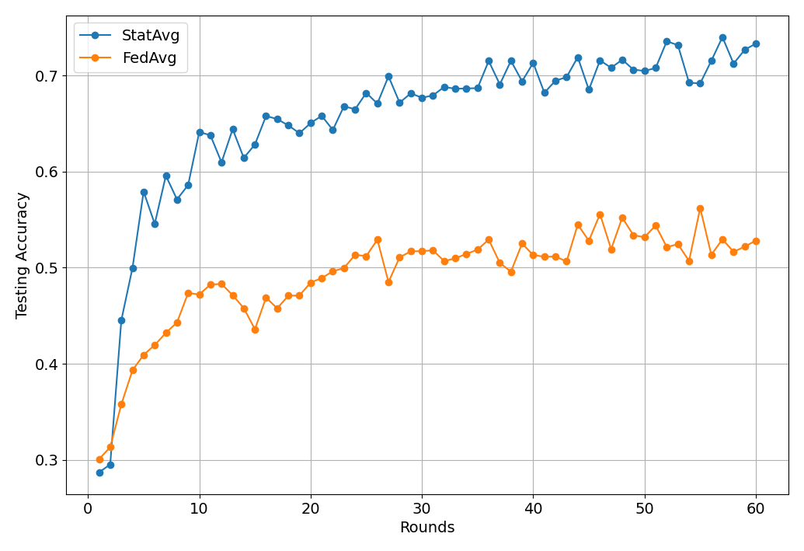

# StatAvg: Mitigating Data Heterogeneity in Federated Learning for Intrusion Detection Systems

**Paper:** https://arxiv.org/abs/2405.13062

**Authors:** Pavlos S. Bouzinis, Panagiotis Radoglou-Grammatikis, Ioannis Makris, Thomas Lagkas, Vasileios Argyriou, Georgios Th. Papadopoulos, Panagiotis Sarigiannidis, George K. Karagiannidis

**Abstract:** Federated learning (FL) is a decentralized learning technique that enables participating devices to collaboratively build a shared Machine Leaning (ML) or Deep Learning (DL) model without revealing their raw data to a third party. Due to its privacy-preserving nature, FL has sparked widespread attention for building Intrusion Detection Systems (IDS) within the realm of cybersecurity. However, the data heterogeneity across participating domains and entities presents significant challenges for the reliable implementation of an FL-based IDS. In this paper, we propose an effective method called Statistical Averaging (StatAvg) to alleviate non-independently and identically (non-iid) distributed features across local clients' data in FL. In particular, StatAvg allows the FL clients to share their individual data statistics with the server, which then aggregates this information to produce global statistics. The latter are shared with the clients and used for universal data normalisation. It is worth mentioning that StatAvg can seamlessly integrate with any FL aggregation strategy, as it occurs before the actual FL training process. The proposed method is evaluated against baseline approaches using datasets for network and host Artificial Intelligence (AI)-powered IDS. The experimental results demonstrate the efficiency of StatAvg in mitigating non-iid feature distributions across the FL clients compared to the baseline methods.


## About this baseline

**What’s implemented:** The code in this directory replicates the experiments in the above paper for TON IoT datasets, which proposed the StatAvg algorithm. It replicates the Figure 3 of the paper.


**Datasets:** TON IoT dataset (linux memory logs). Online [here](https://research.unsw.edu.au/projects/toniot-datasets). Please see `dataset_preparation` below for more details about how to process this dataset correctly.

**Hardware Setup:**  These experiments were run on a desktop machine with 16 CPU threads. Any machine with 4 CPU cores or more would be able to run it in a reasonable amount of time.

**Contributors:** Pavlos Bouzinis (Metamind Innovations) and Andrej Jovanović


## Experimental Setup

**Task:** Classification of cyberattacks.

**Model:** A simple MLP with three hidden layers.

**Dataset:** This baseline only includes the TON IoT dataset. By default, it will be partitioned into 5 clients following a stratified split based on the labels. The settings are as follows:
| Dataset | #classes | #partitions | partitioning method | partition settings |
| :------ | :---: | :---: | :---: | :---: |
| TON IoT | 6 | 5 | stratified based on labels | 6 classes per client |

**Training Hyperparameters:** The following table shows the main hyperparameters for this baseline with their default value.
| Description | Default Value |
| ----------- | ----- |
| total clients | 5 |
| clients per round | 5 |
| number of rounds | 40 |
| local epochs | 2 |
| client resources | {'num_cpus': 2.0, 'num_gpus': 0.0 }|
| data partition | stratified based on labels (6 classes per client) |
| optimizer | Adam |

## Environment Setup

To construct the Python environment, simply run:

```bash
# Create the virtual environment
pyenv virtualenv 3.10.14 statavg

# Activate it
pyenv activate statavg

# Install the baseline
pip install -e .
```

## Dataset Preparation

You can download the TON_IoT dataset by accessing the following [link](https://research.unsw.edu.au/projects/toniot-datasets). Please navigate to `TON_IoT datasets/Train_Test_datasets/Train_Test_Linux_dataset` and download the file `Train_test_linux_memory.csv`. Then, rename the downloaded file to `dataset.csv` and place it in a new `dataset/` directory located in the directory where this `README.md` is.
 
If you want to run the experiments with your own data, ensure your dataset is also named `dataset.csv` and located in the same directory. The dataset is preprocessed using `dataset_preparation.py`, which you can modify if you wish to add custom preprocessing steps.
## Running the Experiments
To run StatAvg with TON IoT baseline, ensure you have activated your Poetry environment (execute `poetry shell` from this directory), then:

```bash
flwr run .  # this will run using the default settings in the `pyproject.toml`

# you can override settings directly from the command line
flwr run . --run-config "num_server_rounds=2"  # will set number of rounds to 20
```
It is noted that an auxiliary directory is created in the runtime to persist client state, which includes the data scalers/normalizers of each client. By default, this directory is deleted upon the termination of the execution. To prevent automatic deletion (in this case, it is recommended to manually delete the directory from previous runs), execute the following:

```bash
# disable automated removal of the auxiliary directory of scalers
flwr run. --run_config "delete_scaler_dir=False"
```

## Expected Results

To reproduce the results of the paper (Fig. 3., StatAvg), simply run:

```bash
bash run_experiments.sh
```

The expected results should look similar to the following figure (which you can visualize using the notebook contained in the `docs` directory):
<p align="center">
  <b>Testing Accuracy vs Rounds for StatAvg</b><br>
  
</p>

It is noted that the results are saved into a pickle file in the directory `results/`, which will be automatically created when the experiments are run.
In the paper, server-side evaluation is not implemented, as it is considered that the server does not own any data. However, it can be enabled by executing:

```bash
# enable server-side evaluation with the data ratio of your preference. Default settings do not include this option.
flwr run . --run_config "include_testset=true testset_ratio=0.15"
```
Disclaimer: Please note that the results presented above differ from those in the paper. Since the experiments for the paper were conducted, the dataset authors have made slight modifications to the dataset. Although these changes result in a decrease in accuracy (approximately a 10% drop), `StatAvg` is still expected to consistently outperform `FedAvg`, as demonstrated in the paper.
