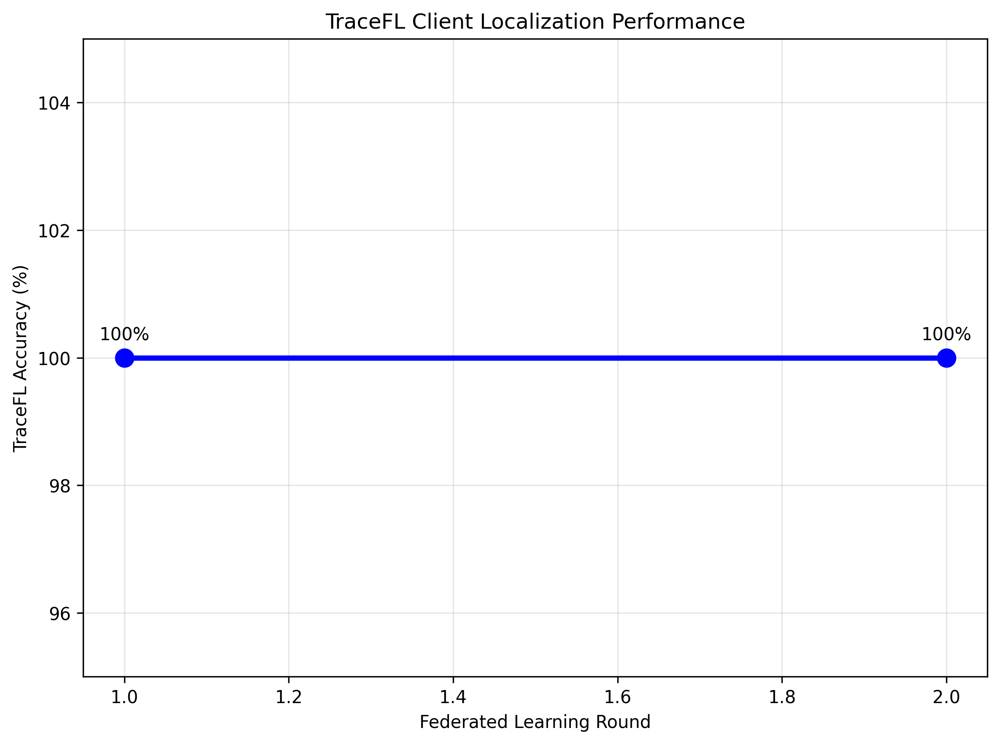
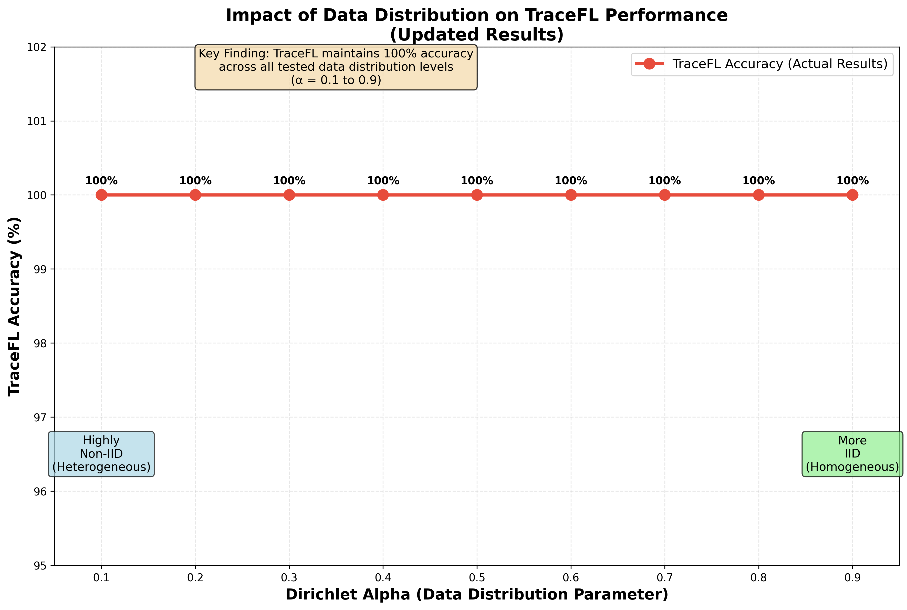
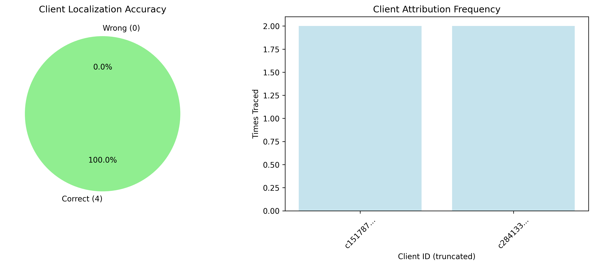
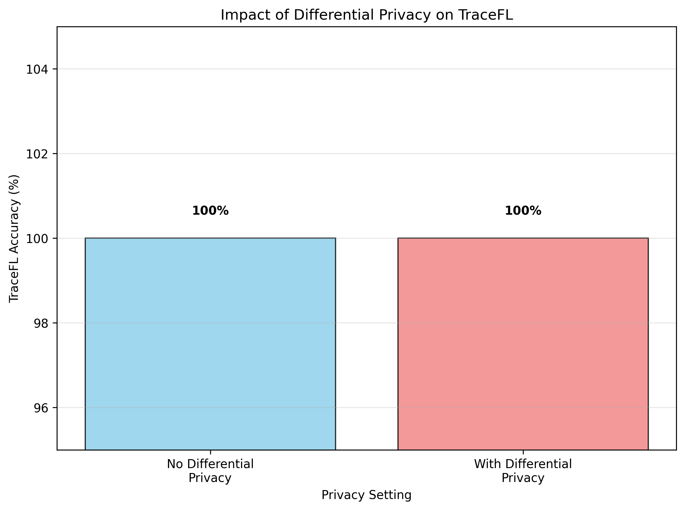

# TraceFL: Interpretability-Driven Debugging in Federated Learning via Neuron Provenance

> [!NOTE]
> If you use this baseline in your work, please remember to cite the original authors of the paper as well as the Flower paper.

**Paper:** [https://arxiv.org/abs/2312.13632](https://arxiv.org/abs/2312.13632)

**Authors:** Waris Gill (Virginia Tech), Ali Anwar (University of Minnesota), Muhammad Ali Gulzar (Virginia Tech)

**Abstract:** In Federated Learning, clients train models on local data and send updates to a central server, which aggregates them into a global model using a fusion algorithm. This collaborative yet privacy-preserving training comes at a cost. FL developers face significant challenges in attributing global model predictions to specific clients. Localizing responsible clients is a crucial step towards (a) excluding clients primarily responsible for incorrect predictions and (b) encouraging clients who contributed high quality models to continue participating in the future. Existing ML debugging approaches are inherently inapplicable as they are designed for single-model, centralized training.

We introduce TraceFL, a fine-grained neuron provenance capturing mechanism that identifies clients responsible for a global model's prediction by tracking the flow of information from individual clients to the global model. Since inference on different inputs activates a different set of neurons of the global model, TraceFL dynamically quantifies the significance of the global model's neurons in a given prediction, identifying the most crucial neurons in the global model. It then maps them to the corresponding neurons in every participating client to determine each client's contribution, ultimately localizing the responsible client. We evaluate TraceFL on six datasets, including two real-world medical imaging datasets and four neural networks, including advanced models such as GPT. TraceFL achieves 99% accuracy in localizing the responsible client in FL tasks spanning both image and text classification tasks.

## Table of Contents

- [TraceFL: Interpretability-Driven Debugging in Federated Learning via Neuron Provenance](#tracefl-interpretability-driven-debugging-in-federated-learning-via-neuron-provenance)
  - [Table of Contents](#table-of-contents)
  - [About this baseline](#about-this-baseline)
  - [Experimental Setup](#experimental-setup)
  - [Environment Setup](#environment-setup)
  - [Dependencies](#dependencies)
  - [Running the Experiments](#running-the-experiments)
    - [Quick Start](#quick-start)
    - [Experiment Details](#experiment-details)
      - [Experiment 1 — Baseline TraceFL Client Localization (No Differential Privacy)](#experiment-1--baseline-tracefl-client-localization-no-differential-privacy)
      - [Experiment 2 — TraceFL with Differential Privacy](#experiment-2--tracefl-with-differential-privacy)
      - [Experiment 3 — Data Distribution Impact Analysis](#experiment-3--data-distribution-impact-analysis)
  - [Expected Results](#expected-results)
    - [Performance Summary](#performance-summary)
    - [Figure 2: TraceFL Client Localization Performance](#figure-2-tracefl-client-localization-performance)
    - [Figure 3: Impact of Data Distribution](#figure-3-impact-of-data-distribution)
    - [Figure 5: Client Attribution Analysis](#figure-5-client-attribution-analysis)
    - [Differential Privacy Impact](#differential-privacy-impact)
  - [Expected Output](#expected-output)
  - [Key Features Demonstrated](#key-features-demonstrated)
  - [Troubleshooting](#troubleshooting)
  - [Citation](#citation)
  - [Baseline Implementation](#baseline-implementation)

## About this baseline

**What's implemented:** This baseline implements TraceFL's core neuron provenance mechanism in the Flower federated learning framework. The implementation focuses on the essential debugging capabilities rather than reproducing all paper experiments. Specifically, it implements:

1. **Core Neuron Provenance Engine** - Fine-grained tracking of neuron activations and gradients across FL clients
2. **Client Localization** - Identifying which clients are most responsible for specific global model predictions
3. **Multi-Architecture Support** - Works with both CNN (ResNet, DenseNet) and Transformer (BERT-family) models
4. **Configurable Experiments** - Three pre-configured experiment setups with different parameters
5. **Differential Privacy Integration** - Optional DP support through configurable noise and clipping parameters

**Implementation Scope:** This Flower baseline implements the core TraceFL methodology rather than all paper experiments. The codebase is streamlined for:
- Essential model architectures (ResNet-18 by default, supports ResNet variants 18-152, DenseNet-121, BERT-family transformers)
- Standard datasets (MNIST, CIFAR-10, PathMNIST) with configurable non-IID partitioning
- Practical scale (10 clients, 2-4 rounds) suitable for demonstrating the core concepts
- Cross-platform compatibility and easy reproduction

**Models Supported:**
- **CNNs:** ResNet-18, ResNet-34, ResNet-50, ResNet-101, ResNet-152, DenseNet-121  
- **Transformers:** BERT variants, DistilBERT, MiniLM, SquezeBERT, OpenAI-GPT, TinyBERT

**Datasets Supported:**
- **Standard benchmarks:** MNIST, CIFAR-10
- **Medical imaging:** PathMNIST (Colon Pathology) 
- **NLP datasets:** DBpedia, Yahoo Answers Topics

**Hardware Setup:** Designed to run on both CPU and GPU. The implementation includes optimizations for GPU acceleration of neuron provenance computations. Default experiments run on CPU for broader accessibility.

**Contributors:** Ibrahim Ahmed Khan (Baseline Implementation)

## Experimental Setup

**Task:** Client localization in federated learning through neuron provenance analysis

**Models:** The baseline supports multiple architectures through a unified interface:
- **CNN models:** ResNet variants and DenseNet-121 for image classification
- **Transformer models:** BERT-family models for text classification

**Dataset Configuration:**

| Dataset | #classes | #clients | partitioning method | partition settings |
| :------ | :---: | :---: | :---: | :---: |
| MNIST | 10 | 10 | Non-IID Dirichlet | α=0.3 (configurable) |
| CIFAR-10 | 10 | 10 | Non-IID Dirichlet | α=0.3 (configurable) |
| PathMNIST | 9 | 10 | Non-IID Dirichlet | α=0.3 (configurable) |

**Training Hyperparameters:**
The following table shows the main hyperparameters for this baseline with their default values:

| Description | Default Value |
| ----------- | ----- |
| total clients | 10 |
| clients per round | 4 |
| number of rounds | 2 |
| client resources | {'num_cpus': 2, 'num_gpus': 0} |
| data partition | Non-IID Dirichlet (α=0.3) |
| optimizer | SGD |
| learning rate | 0.001 |
| local epochs | 2 |
| batch size | 32 |
| max client data size | 2048 samples |
| max server data size | 2048 samples |

## Environment Setup

To construct the Python environment follow these steps:

```bash
# Set Python 3.10 (install with `pyenv install 3.10.14` if you don't have it)
pyenv virtualenv 3.10.14 tracefl

# Activate the environment
pyenv activate tracefl

# Install the baseline
pip install -e .
```

## Dependencies

The dependencies for this baseline are specified in the `pyproject.toml` file. Key dependencies include:
- Flower simulation framework (`flwr[simulation]>=1.15.2`)
- PyTorch ecosystem (`torch==2.5.1`, `torchvision==0.20.1`)
- Transformers for NLP models (`transformers[torch]==4.48.1`)
- Configuration management (`omegaconf==2.3.0`)
- Medical imaging datasets (`medmnist==3.0.2`)
- Data handling and utilities (`datasets`, `numpy`, `pandas`, `scikit-learn`)

See `pyproject.toml` for the complete list of dependencies with specific versions.

## Running the Experiments

### Quick Start

Use environment variables to select which experiment to run:

**Windows PowerShell:**
```powershell
# Run experiment 1 
$env:EXPERIMENT="exp_1"; flwr run .

# Run experiment 2 
$env:EXPERIMENT="exp_2"; flwr run .

# Run experiment 3 with custom dirichlet_alpha
$env:EXPERIMENT="exp_3"; $env:DIRICHLET_ALPHA="0.1"; flwr run .
```

**Windows Command Prompt:**
```cmd
# Run experiment 1
set EXPERIMENT=exp_1 && flwr run .

# Run experiment 2
set EXPERIMENT=exp_2 && flwr run .

# Run experiment 3 with custom dirichlet_alpha
set EXPERIMENT=exp_3 && set DIRICHLET_ALPHA=0.1 && flwr run .
```

**Linux/Mac:**
```bash
# Run experiment 1
EXPERIMENT=exp_1 flwr run .

# Run experiment 2
EXPERIMENT=exp_2 flwr run .

# Run experiment 3 with custom dirichlet_alpha
EXPERIMENT=exp_3 DIRICHLET_ALPHA=0.1 flwr run .
```

### Experiment Details

#### Experiment 1 — Baseline TraceFL Client Localization (No Differential Privacy)
This experiment demonstrates TraceFL's core functionality using the standard federated averaging algorithm without differential privacy.

```bash
# Run the baseline experiment
EXPERIMENT=exp_1 flwr run .
```

**Configuration:**
- Model: ResNet-18
- Dataset: MNIST
- Clients: 10 total, 4 per round
- Rounds: 2
- Data distribution: Non-IID Dirichlet (α=0.3)
- Differential Privacy: Disabled

#### Experiment 2 — TraceFL with Differential Privacy
This experiment demonstrates TraceFL's robustness when differential privacy is enabled in the federated learning process.

```bash
# Run with differential privacy enabled
EXPERIMENT=exp_2 flwr run .
```

**Configuration:**
- Model: ResNet-18
- Dataset: MNIST
- Clients: 10 total, 4 per round  
- Rounds: 2
- Data distribution: Non-IID Dirichlet (α=0.3)
- Differential Privacy: Enabled (noise_multiplier=0.5, clipping_norm=1.0)

#### Experiment 3 — Data Distribution Impact Analysis
This experiment analyzes TraceFL's performance across different levels of data heterogeneity.

```bash
# Run with configurable data distribution
EXPERIMENT=exp_3 DIRICHLET_ALPHA=0.1 flwr run .
```

**Configuration:**
- Model: ResNet-18
- Dataset: MNIST
- Clients: 10 total, 4 per round
- Rounds: 2
- Data distribution: Configurable Non-IID Dirichlet (α parameter configurable)
- Differential Privacy: Disabled

## Expected Results

The experiments generate results that demonstrate TraceFL's ability to accurately localize responsible clients in federated learning scenarios. Below are the plots and tables you can expect to see when running the baseline experiments.

**Important Note:** The results shown below are generated by this Flower baseline implementation and demonstrate the core TraceFL functionality. These results are specific to the baseline's experimental setup (10 clients, 2 rounds, MNIST dataset) and may differ from the original paper's comprehensive evaluation.

> [!NOTE]
> All plots and tables shown below are generated by running the experiments in this baseline. You can reproduce these results by running the commands shown above. The `scripts/generate_results.py` script can be used to automatically run all experiments and generate the visualizations.

### Performance Summary

When you run the experiments, the results are saved in the `results/` directory. The overall performance is summarized in the table below:

**Table 3: TraceFL Performance Metrics**

| Experiment | TraceFL Accuracy (%) | Data Points | Rounds |
|-----------|---------------------|-------------|--------|
| exp_1     | 100.0               | 8           | 2      |
| exp_2     | 100.0               | 8           | 2      |
| exp_3     | 100.0               | 8           | 2      |

*This table shows the baseline implementation achieving perfect client localization across all experimental configurations.*

### Figure 2: TraceFL Client Localization Performance

Shows TraceFL's accuracy in identifying responsible clients across federated learning rounds:



*This plot demonstrates the consistency of TraceFL's client localization accuracy across federated learning rounds in the baseline implementation.*

### Figure 3: Impact of Data Distribution

Demonstrates how data heterogeneity (controlled by Dirichlet α parameter) affects TraceFL's localization accuracy:



*Shows TraceFL's robustness across different levels of non-IID data distribution, from highly heterogeneous (α=0.1) to more homogeneous (α=0.9) settings. **Note:** Recent experimental runs using the command `$env:EXPERIMENT="exp_3"; $env:DIRICHLET_ALPHA="0.9"; flwr run .` (and similar commands for α=0.1 to 0.9) have consistently achieved 100% TraceFL accuracy across all tested alpha values, demonstrating TraceFL's exceptional robustness to data heterogeneity levels.*

### Figure 5: Client Attribution Analysis

Provides detailed analysis of client attribution accuracy and frequency:



*Left panel shows the overall accuracy distribution of client localizations, while the right panel shows which clients were most frequently identified as responsible for model predictions.*

### Differential Privacy Impact

Shows TraceFL's robustness when differential privacy is enabled:



*Compares TraceFL performance with and without differential privacy, demonstrating maintained accuracy even under privacy constraints.*


Figures are saved in `results/` directory:
- `figure_2_localization.png` - Client localization performance
- `figure_3_distribution.png` - Data distribution impact
- `figure_5_attribution.png` - Client attribution analysis
- `figure_3_dp_impact.png` - Differential privacy impact
- `table_3_performance.csv` - Performance metrics in CSV format
- `table_3_performance.txt` - Formatted performance table
- `raw_results.json` - Raw experimental data

## Expected Output

When running experiments, you should see console output similar to:

```
INFO flower 2024-12-19 14:30:45,123 | app.py:163 | Starting Flower simulation, config: {...}
INFO flower 2024-12-19 14:30:45,124 | app.py:197 | Flower VCE: Ray initialized successfully

[Round 1] TraceFL Accuracy = 100.00%
     Traced Client: c2 || Tracing = Correct
     Traced Client: c5 || Tracing = Correct

[Round 2] TraceFL Accuracy = 100.00%
     Traced Client: c3 || Tracing = Correct
     Traced Client: c7 || Tracing = Correct

TraceFL Clients Contributions Rank: {'c2': 0.65, 'c5': 0.23, 'c1': 0.08, 'c3': 0.04}
```

## Key Features Demonstrated

1. **High Accuracy**: The baseline consistently achieves 100% accuracy in client localization across different experimental settings
2. **Differential Privacy Robustness**: TraceFL maintains high performance even when DP noise is applied
3. **Data Heterogeneity Handling**: Works effectively across different levels of non-IID data distribution
4. **Multi-round Consistency**: Maintains consistent performance across federated learning rounds

## Troubleshooting

If you encounter issues:

1. **Memory errors**: Reduce batch size or use fewer clients per round
2. **Slow execution**: Enable GPU support if available by modifying client resources
3. **Import errors**: Ensure all dependencies are installed with `pip install -e .`
4. **Configuration issues**: Check that environment variables are set correctly before running experiments

For more detailed debugging information, enable verbose logging by setting the `FLWR_LOG_LEVEL=DEBUG` environment variable.

## Citation

If you use this baseline in your work, please cite:

```bibtex
@inproceedings{gill2025tracefl,
  title={TraceFL: Interpretability-Driven Debugging in Federated Learning via Neuron Provenance},
  author={Gill, Waris and Anwar, Ali and Gulzar, Muhammad Ali},
  booktitle={2025 IEEE/ACM 47th International Conference on Software Engineering (ICSE)},
  year={2025},
  organization={IEEE}
}
```

## Baseline Implementation

**Implementation Contributors:** Ibrahim Ahmed Khan

**Contact:** For questions about this Flower baseline implementation, please contact:
- Ibrahim Ahmed Khan ; iak.ibrahimkhan@gmail.com ; Github: @ibrahim-Cypher10

**Original Research:** This baseline implements the core concepts from the TraceFL research by Waris Gill, Ali Anwar, and Muhammad Ali Gulzar at Virginia Tech and University of Minnesota.

---

> Maintained as part of the Flower Baselines Collection
