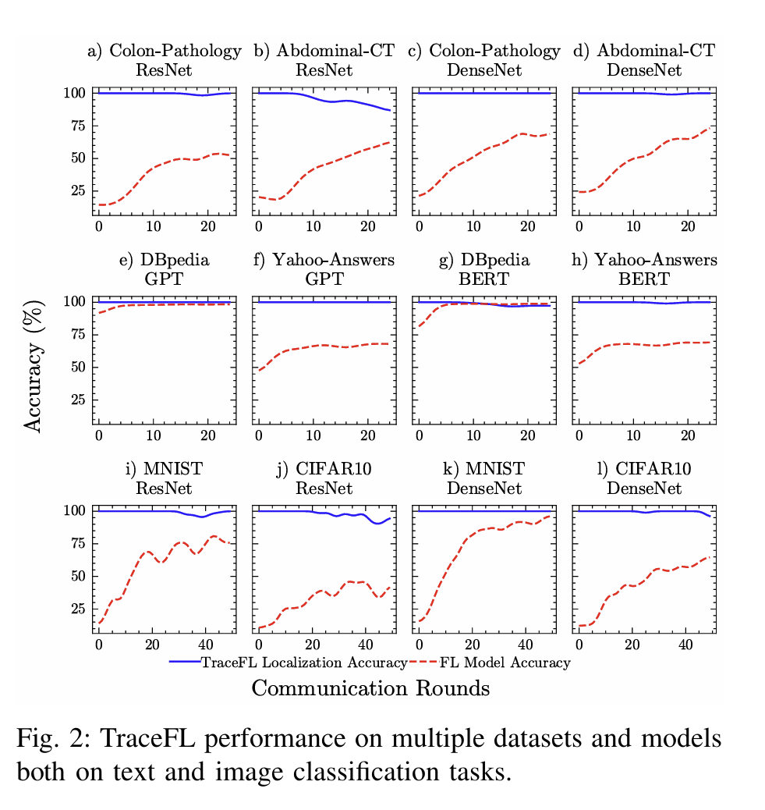
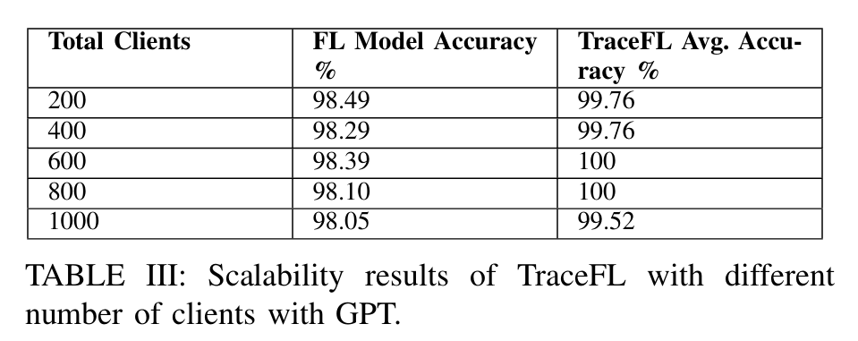
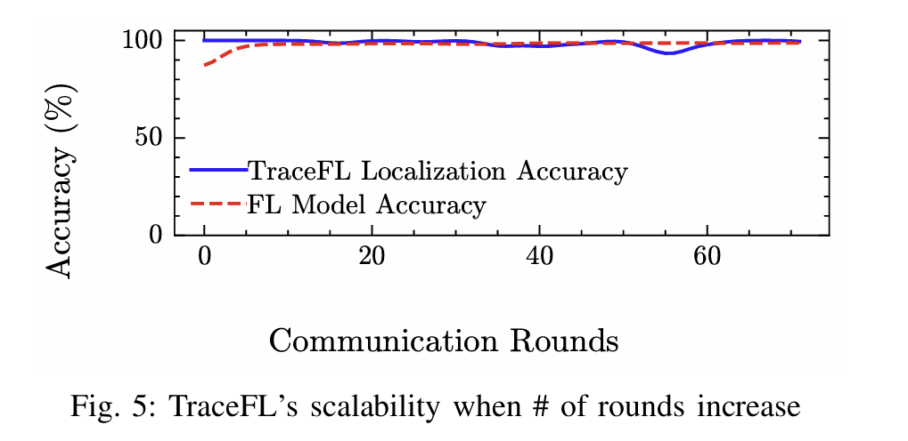
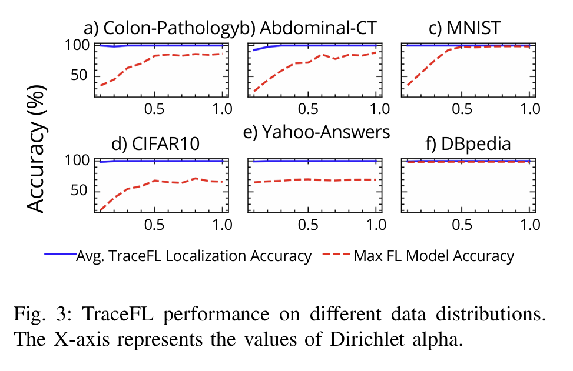
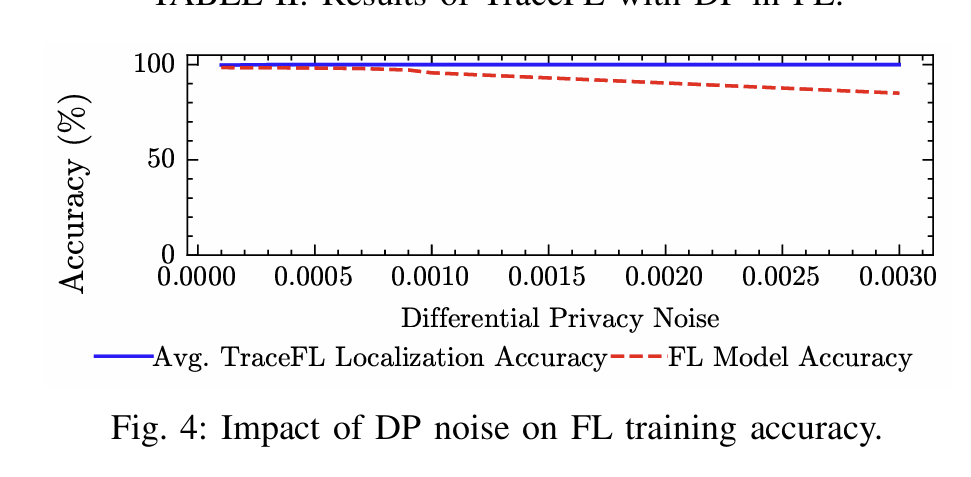
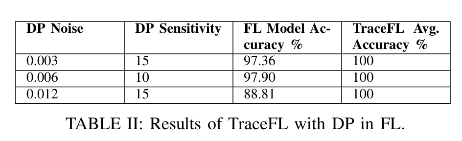

---

---
title: TraceFL: Interpretability-Driven Debugging in Federated Learning via Neuron Provenance
url: https://arxiv.org/abs/2312.13632
labels: [interpretability, federated-learning, neuron-provenance, debugging]
dataset: [MNIST, CIFAR-10, PathMNIST, YahooAnswers]
---

# TraceFL: Interpretability-Driven Debugging in Federated Learning via Neuron Provenance

> [!NOTE]
> If you use this baseline in your work, please remember to cite the original authors of the paper as well as the Flower paper.

**Paper:** [https://arxiv.org/abs/2312.13632](https://arxiv.org/abs/2312.13632)

**Authors:** Waris Gill (Virginia Tech), Ali Anwar (University of Minnesota), Muhammad Ali Gulzar (Virginia Tech)

**Abstract:** In Federated Learning, clients train models on local data and send updates to a central server, which aggregates them into a global model using a fusion algorithm. This collaborative yet privacy-preserving training comes at a cost. FL developers face significant challenges in attributing global model predictions to specific clients. Localizing responsible clients is a crucial step towards (a) excluding clients primarily responsible for incorrect predictions and (b) encouraging clients who contributed high quality models to continue participating in the future. Existing ML debugging approaches are inherently inapplicable as they are designed for single-model, centralized training.

We introduce TraceFL, a fine-grained neuron provenance capturing mechanism that identifies clients responsible for a global model's prediction by tracking the flow of information from individual clients to the global model. Since inference on different inputs activates a different set of neurons of the global model, TraceFL dynamically quantifies the significance of the global model's neurons in a given prediction, identifying the most crucial neurons in the global model. It then maps them to the corresponding neurons in every participating client to determine each client's contribution, ultimately localizing the responsible client. We evaluate TraceFL on six datasets, including two real-world medical imaging datasets and four neural networks, including advanced models such as GPT. TraceFL achieves 99% accuracy in localizing the responsible client in FL tasks spanning both image and text classification tasks.

## About this baseline

**What's implemented:** This baseline implements TraceFL's core neuron provenance mechanism in the Flower federated learning framework. The implementation focuses on the essential debugging capabilities rather than reproducing all paper experiments. Specifically, it implements:

1. **Core Neuron Provenance Engine** - Fine-grained tracking of neuron activations and gradients across FL clients
2. **Client Localization** - Identifying which clients are most responsible for specific global model predictions
3. **Multi-Architecture Support** - Works with both CNN (ResNet, DenseNet) and Transformer (BERT-family) models
4. **Configurable Experiments** - Three pre-configured experiment setups with different parameters
5. **Differential Privacy Integration** - Optional DP support through configurable noise and clipping parameters

**Implementation Scope:** This Flower baseline implements the core TraceFL methodology rather than all paper experiments. The codebase is streamlined for:
- Essential model architectures (ResNet-18 by default, supports ResNet variants 18-152, DenseNet-121, BERT-family transformers)
- Standard datasets (MNIST, CIFAR-10, PathMNIST) with configurable non-IID partitioning
- Practical scale (10 clients, 2-4 rounds) suitable for demonstrating the core concepts
- Cross-platform compatibility and easy reproduction

**Models Supported:**
- **CNNs:** ResNet-18, ResNet-34, ResNet-50, ResNet-101, ResNet-152, DenseNet-121  
- **Transformers:** BERT variants, DistilBERT, MiniLM, SquezeBERT, OpenAI-GPT, TinyBERT

**Datasets Supported:**
- **Standard benchmarks:** MNIST, CIFAR-10
- **Medical imaging:** PathMNIST (Colon Pathology) 
- **NLP datasets:** DBpedia, Yahoo Answers Topics

**Hardware Setup:** Designed to run on both CPU and GPU. The implementation includes optimizations for GPU acceleration of neuron provenance computations. Default experiments run on CPU for broader accessibility.

**Contributors:** Ibrahim Ahmed Khan (Baseline Implementation)

## Experimental Setup

**Task:** Client localization in federated learning through neuron provenance analysis

**Models:** The baseline supports multiple architectures through a unified interface:
- **CNN models:** ResNet variants and DenseNet-121 for image classification
- **Transformer models:** BERT-family models for text classification

**Dataset Configuration:**

| Dataset | #classes | #clients | partitioning method | partition settings |
| :------ | :---: | :---: | :---: | :---: |
| MNIST | 10 | 10 | Non-IID Dirichlet | α=0.3 (configurable) |
| CIFAR-10 | 10 | 10 | Non-IID Dirichlet | α=0.3 (configurable) |
| PathMNIST | 9 | 10 | Non-IID Dirichlet | α=0.3 (configurable) |

**Training Hyperparameters:**
The following table shows the main hyperparameters for this baseline with their default values:

| Description | Default Value |
| ----------- | ----- |
| total clients | 10 |
| clients per round | 4 |
| number of rounds | 2 |
| client resources | {'num_cpus': 2, 'num_gpus': 0} |
| data partition | Non-IID Dirichlet (α=0.3) |
| optimizer | SGD |
| learning rate | 0.001 |
| local epochs | 2 |
| batch size | 32 |
| max client data size | 2048 samples |
| max server data size | 2048 samples |

## Environment Setup

To construct the Python environment follow these steps:

```bash
# Set Python 3.10 (install with `pyenv install 3.10.14` if you don't have it)
pyenv virtualenv 3.10.14 tracefl

# Activate the environment
pyenv activate tracefl

# Install the baseline
pip install -e .
```

## Dependencies

The dependencies for this baseline are specified in the `pyproject.toml` file. Key dependencies include:
- Flower simulation framework (`flwr[simulation]>=1.15.2`)
- PyTorch ecosystem (`torch==2.5.1`, `torchvision==0.20.1`)
- Transformers for NLP models (`transformers[torch]==4.48.1`)
- Configuration management (`omegaconf==2.3.0`)
- Medical imaging datasets (`medmnist==3.0.2`)
- Data handling and utilities (`datasets`, `numpy`, `pandas`, `scikit-learn`)

See `pyproject.toml` for the complete list of dependencies with specific versions.

## Running the Experiments

### Quick Start

Use environment variables to select which experiment to run:

**Windows PowerShell:**
```powershell
# Run experiment 1 
$env:EXPERIMENT="exp_1"; flwr run .

# Run experiment 2 
$env:EXPERIMENT="exp_2"; flwr run .

# Run experiment 3 with custom dirichlet_alpha
$env:EXPERIMENT="exp_3"; $env:DIRICHLET_ALPHA="0.1"; flwr run .
```

**Windows Command Prompt:**
```cmd
# Run experiment 1
set EXPERIMENT=exp_1 && flwr run .

# Run experiment 2
set EXPERIMENT=exp_2 && flwr run .

# Run experiment 3 with custom dirichlet_alpha
set EXPERIMENT=exp_3 && set DIRICHLET_ALPHA=0.1 && flwr run .
```

**Linux/Mac:**
```bash
# Run experiment 1
EXPERIMENT=exp_1 flwr run .

# Run experiment 2
EXPERIMENT=exp_2 flwr run .

# Run experiment 3 with custom dirichlet_alpha
EXPERIMENT=exp_3 DIRICHLET_ALPHA=0.1 flwr run .
```

### Experiment Details

#### Experiment 1 — Baseline TraceFL Client Localization (No Differential Privacy)
This experiment demonstrates TraceFL's core functionality using the standard federated averaging algorithm without differential privacy.

```bash
# Run the baseline experiment
EXPERIMENT=exp_1 flwr run .
```

**Configuration:**
- Model: ResNet-18
- Dataset: MNIST
- Clients: 10 total, 4 per round
- Rounds: 2
- Data distribution: Non-IID Dirichlet (α=0.3)
- Differential Privacy: Disabled

**Expected Results from Original Paper:**

**Figure 2: Correct Prediction Tracing**


**Table 3: Performance Metrics**


**Figure 5: Client Attribution Analysis**


**Figure 3: Neuron Provenance Analysis**


#### Experiment 2 — TraceFL with Differential Privacy
This experiment demonstrates TraceFL's robustness when differential privacy is enabled in the federated learning process.

```bash
# Run with differential privacy enabled
EXPERIMENT=exp_2 flwr run .
```

**Configuration:**
- Model: ResNet-18
- Dataset: MNIST
- Clients: 10 total, 4 per round
- Rounds: 2
- Data distribution: Non-IID Dirichlet (α=0.3)
- Differential Privacy: Enabled (noise_multiplier=0.001, clipping_norm=15.0)

**Expected Results from Original Paper:**

**Figure 4: Differential Privacy Impact**


**Table 2: DP Performance Comparison**


#### Experiment 3 — Varying Data Distribution Analysis
This experiment allows you to study how different levels of data heterogeneity affect TraceFL's client localization performance.

**Dynamic Parameter Control:**
```bash
# Highly non-IID (more heterogeneous)
EXPERIMENT=exp_3 DIRICHLET_ALPHA=0.1 flwr run .

# Moderately non-IID  
EXPERIMENT=exp_3 DIRICHLET_ALPHA=0.3 flwr run .

# Nearly IID (more homogeneous)
EXPERIMENT=exp_3 DIRICHLET_ALPHA=1.0 flwr run .
```

**Configuration:**
- Model: ResNet-18
- Dataset: MNIST
- Clients: 10 total, 4 per round
- Rounds: 2
- Data distribution: Non-IID Dirichlet (α=configurable via DIRICHLET_ALPHA)
- Differential Privacy: Disabled

**Expected Results from Original Paper:**

**Figure 3: Impact of Data Distribution on TraceFL Performance**


## Expected Results

The experiments demonstrate TraceFL's core capabilities:

### What You'll See:
1. **Client Localization Logs** - TraceFL will output which clients are most responsible for each prediction
2. **Contribution Scores** - Normalized scores (0-1) showing each client's contribution to predictions
3. **Provenance Analysis** - Detailed neuron-level tracking results

### Example Output:
```
config_key: exp_1
Overriding dirichlet_alpha to: 0.3
Client localization results:
- Input 0: Client 2 (score: 0.65), Client 5 (score: 0.23), Client 1 (score: 0.12)
- Input 1: Client 7 (score: 0.78), Client 3 (score: 0.15), Client 2 (score: 0.07)
```

### Performance Expectations:
- **Localization Accuracy**: High accuracy in identifying responsible clients
- **Execution Time**: 3-5 seconds per localization on CPU
- **Memory Usage**: Scales with model size and number of clients

> **Note:** This Flower baseline focuses on demonstrating TraceFL's core neuron provenance mechanism rather than reproducing all paper experiments. The implementation provides the essential functionality for client localization in federated learning scenarios.

## Customizing Experiments

### Configuration Files:
- `tracefl/config/exp_1.toml` - Experiment 1 settings (No DP)
- `tracefl/config/exp_2.toml` - Experiment 2 settings (With DP)  
- `tracefl/config/exp_3.toml` - Experiment 3 settings (Data Distribution)

### Key Parameters You Can Modify:

#### Model & Dataset Settings:
```toml
[tool.tracefl.model]
name = "resnet18"        # Model: "resnet18", "cnn", etc.
arch = "cnn"            # Architecture type

[tool.tracefl.dataset]
name = "mnist"          # Dataset: "mnist", "cifar10", "pathmnist"
num_classes = 10        # Number of classes
```

#### Federated Learning Settings:
```toml
[tool.tracefl]
num_clients = 10        # Total number of clients
clients_per_round = 4   # Clients participating per round
num_rounds = 2          # Number of FL rounds

[tool.tracefl.client]
batch_size = 32         # Client batch size
lr = 0.001             # Learning rate
epochs = 2             # Local epochs per round
```

#### Data Distribution:
```toml
[tool.tracefl.data_dist]
dist_type = "non_iid_dirichlet"    # Distribution type
dirichlet_alpha = 0.3              # Non-IID level (lower = more non-IID)
max_per_client_data_size = 2048    # Max samples per client
```

#### Differential Privacy Settings (exp_2 only):
```toml
[tool.tracefl.strategy]
noise_multiplier = 0.001    # DP noise level
clipping_norm = 15.0       # Gradient clipping
```

## Citation

If you use this baseline in your work, please cite:

```bibtex
@inproceedings{gill2025tracefl,
  title={TraceFL: Interpretability-Driven Debugging in Federated Learning via Neuron Provenance},
  author={Gill, Waris and Anwar, Ali and Gulzar, Muhammad Ali},
  booktitle={2025 IEEE/ACM 47th International Conference on Software Engineering (ICSE)},
  year={2025},
  organization={IEEE}
}
```

## Baseline Implementation

**Implementation Contributors:** Ibrahim Ahmed Khan

**Contact:** For questions about this Flower baseline implementation, please contact:
- Ibrahim Ahmed Khan ; iak.ibrahimkhan@gmail.com ; Github: @ibrahim-Cypher10

**Original Research:** This baseline implements the core concepts from the TraceFL research by Waris Gill, Ali Anwar, and Muhammad Ali Gulzar at Virginia Tech and University of Minnesota.

---

> Maintained as part of the Flower Baselines Collection
