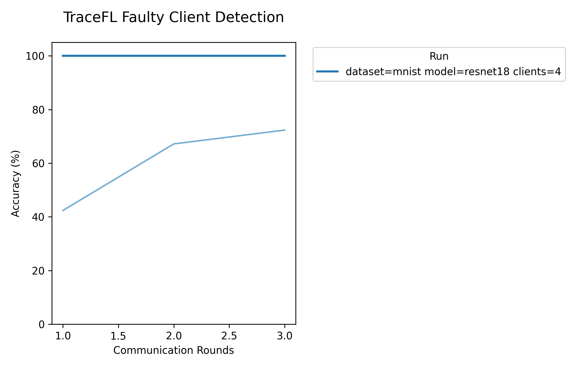
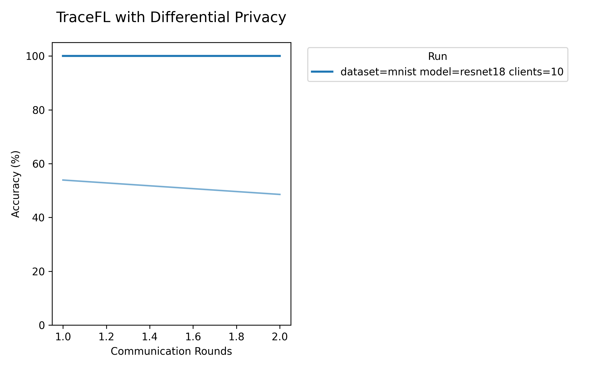

# TraceFL: Interpretability-Driven Debugging in Federated Learning via Neuron Provenance

> Note: If you use this baseline in your work, please remember to cite the original authors of the paper as well as the Flower paper.

**Paper:** [arxiv.org/abs/2312.13632](https://arxiv.org/abs/2312.13632)

**Authors:** Waris Gill, Ali Anwar, Muhammad Ali Gulzar

**Abstract:** In Federated Learning, clients train models on local data and send updates to a central server, which aggregates them into a global model using a fusion algorithm. This collaborative yet privacy-preserving training comes at a cost. FL developers face significant challenges in attributing global model predictions to specific clients. Localizing responsible clients is a crucial step towards (a) excluding clients primarily responsible for incorrect predictions and (b) encouraging clients who contributed high-quality models to continue participating in the future. Existing ML debugging approaches are inherently inapplicable as they are designed for single-model, centralized training. We introduce TraceFL, a fine-grained neuron provenance capturing mechanism that identifies clients responsible for a global model's prediction by tracking the flow of information from individual clients to the global model. Since inference on different inputs activates a different set of neurons of the global model, TraceFL dynamically quantifies the significance of the global model's neurons in a given prediction, identifying the most crucial neurons in the global model. It then maps them to the corresponding neurons in every participating client to determine each client's contribution, ultimately localizing the responsible client. We evaluate TraceFL on six datasets, including two real-world medical imaging datasets and four neural networks, including advanced models such as GPT. TraceFL achieves 99% accuracy in localizing the responsible client in FL tasks spanning both image and text classification tasks. At a time when state-of-the-art ML debugging approaches are mostly domain-specific (e.g., image classification only), TraceFL is the first technique to enable highly accurate automated reasoning across a wide range of FL applications.

## About this baseline

**What's implemented:** This Flower baseline implements TraceFL, the first interpretability-driven debugging technique for Federated Learning that uses fine-grained neuron provenance to identify clients responsible for specific global model predictions. The implementation replicates key experiments from the ICSE 2025 paper including: (1) Localization accuracy in correct predictions (Figure 2, Table 3, Figure 5), (2) Varying data distribution analysis (Figure 3), (3) Localization accuracy in mispredictions/faulty client detection (Table 1, Figure 6), and (4) Differential privacy-enabled FL (Figure 4, Table 2). It supports multiple datasets (MNIST, CIFAR-10, CIFAR-100, PathMNIST, OrganAMNIST, DBpedia-14, Yahoo Answers Topics) and model architectures (ResNet, DenseNet, CNN, GPT, DistilBERT).

**Datasets:** MNIST (image classification), CIFAR-10 (image classification), CIFAR-100 (image classification), PathMNIST (medical imaging - colon pathology), OrganAMNIST (medical imaging - abdominal organs), DBpedia-14 (text classification), Yahoo Answers Topics (text classification). All datasets are publicly available and downloaded via Flower Datasets.

**Hardware Setup:** This baseline was tested on a desktop machine with 8 CPU cores and 32GB RAM. Experiments run efficiently on CPU-only mode with minimal resource requirements. The baseline supports both CPU and GPU execution, with GPU acceleration available for larger models. Minimum requirements: 4 CPU cores, 8GB RAM for basic experiments. For large-scale experiments (as in the original paper), the authors used six NVIDIA DGX A100 nodes, each with 2048GB memory, 128 cores, and an A100 GPU with 80GB memory.

**Contributors:** Ibrahim Ahmed Khan ([@ibrahim_Cypher10](https://github.com/ibrahim_Cypher10)) | [LinkedIn](https://www.linkedin.com/in/ibrahim-ahmed-khan-752100233/) | iak.ibrahimkhan@gmail.com

## Experimental Setup

**Task:** Multi-domain classification spanning image classification, medical imaging, and text classification

**Model:** The baseline supports multiple model architectures across different domains:
- **Image Classification**: ResNet18, ResNet34, ResNet50, ResNet101, ResNet152, DenseNet121, custom CNN
- **Medical Imaging**: ResNet and DenseNet architectures adapted for grayscale inputs (PathMNIST, OrganAMNIST)
- **Text Classification**: DistilBERT (`distilbert/distilbert-base-uncased`), GPT-based models

The default model is ResNet18 for image/medical tasks. All models output logits for classification, enabling TraceFL's consistent neuron-level interpretability mechanism across architectures.

**Dataset:** The baseline uses Latent Dirichlet Allocation (LDA) / Dirichlet distribution for creating non-IID partitions across clients. The `dirichlet-alpha` parameter controls the degree of non-IIDness:
- α → ∞: All clients have identical distribution (IID)
- α → 0: Each client holds samples from only one class (extreme non-IID)
- Default α = 0.3 (moderate non-IID)

| Dataset | # Classes | # Clients | Partition Method | Default α | Samples per Client |
| :------ | :-------: | :-------: | :--------------: | :-------: | :----------------: |
| MNIST | 10 | 10 | Dirichlet | 0.3 | Up to 2048 |
| CIFAR-10 | 10 | 10 | Dirichlet | 0.3 | Up to 2048 |
| CIFAR-100 | 100 | 10 | Dirichlet | 0.3 | Up to 2048 |
| PathMNIST | 9 | 10 | Dirichlet | 0.3 | Up to 2048 |
| OrganAMNIST | 11 | 10 | Dirichlet | 0.3 | Up to 2048 |
| DBpedia-14 | 14 | 10 | Dirichlet | 0.3 | Up to 2048 |
| Yahoo Answers | 10 | 10 | Dirichlet | 0.3 | Up to 2048 |

**Training Hyperparameters:**

| Description | Default Value |
| ----------- | ------------- |
| Number of clients | 10 |
| Number of rounds | 2-3 |
| Model | ResNet18 |
| Dataset | MNIST |
| Dirichlet alpha | 0.3 |
| Batch size | 32 |
| Max per-client data size | 2048 |
| Max server data size | 2048 |
| Provenance rounds | "1,2" |
| Use deterministic sampling | true |
| Random seed | 42 |
| Min train nodes | 4 (Experiment A, B, C, D) |
| Fraction train | 0.4 (Experiment A, B, D), 1.0 (Experiment C) |
| Client resources (CPU) | 2 |
| Client resources (GPU) | 0.0 |

## Environment Setup

This baseline uses Python 3.10 and pip. Follow these steps to set up the environment:

### Option 1: Using pyenv (if pyenv-virtualenv is installed)
```bash
# Create the virtual environment
pyenv virtualenv 3.10.4 tracefl-baseline

# Activate it
pyenv activate tracefl-baseline

# Install the baseline (includes all dependencies)
pip install -e .
```

### Option 2: Using standard Python venv (recommended)
```bash
# Create the virtual environment

# Activate it (Windows)
tracefl-baseline\Scripts\activate

# Activate it (Linux/Mac)
source tracefl-baseline/bin/activate

# Install the baseline (includes all dependencies)
pip install -e .
```

The `pyproject.toml` includes all necessary dependencies including:
- `flwr[simulation]>=1.22.0` (Flower framework)
- `torch==2.8.0`, `torchvision==0.23.0` (PyTorch)
- `transformers[torch]==4.48.1` (for text models)
- `medmnist==3.0.2` (for medical imaging datasets)
- Dataset and visualization libraries

## Running the Experiments

The baseline provides organized experiment scripts that save results in separate folders for easier navigation. Each script corresponds to specific figures/tables from the paper:

### Expected TraceFL Logging Output

When running TraceFL experiments, you'll see detailed provenance analysis logs showing how TraceFL identifies responsible clients for each prediction. Here's an example of the logging output you can expect:

```log
[2025-10-20 16:05:06][root]             *********** Input Label: 0, Responsible Client(s): c6,c9,c5,c4  *************
[2025-10-20 16:05:06][root]      Traced Client: c4 || Tracing = Correct
[2025-10-20 16:05:06][root]     TraceFL Clients Contributions Rank:     {'c4': 0.49, 'c9': 0.31, 'c6': 0.13, 'c5': 0.07}
[2025-10-20 16:05:06][root] 

[2025-10-20 16:05:06][root]             *********** Input Label: 1, Responsible Client(s): c6,c5  *************
[2025-10-20 16:05:06][root]      Traced Client: c6 || Tracing = Correct
[2025-10-20 16:05:06][root]     TraceFL Clients Contributions Rank:     {'c6': 0.43, 'c5': 0.26, 'c4': 0.16, 'c9': 0.14}
[2025-10-20 16:05:06][root] 

[2025-10-20 16:05:06][root]             *********** Input Label: 2, Responsible Client(s): c6,c5,c4  *************
[2025-10-20 16:05:06][root]      Traced Client: c5 || Tracing = Correct
[2025-10-20 16:05:06][root]     TraceFL Clients Contributions Rank:     {'c5': 0.57, 'c6': 0.27, 'c4': 0.09, 'c9': 0.06}
[2025-10-20 16:05:06][root] 

[2025-10-20 16:05:06][root] [Round 2] TraceFL Localization Accuracy = 100.0 || Total Inputs Used In Prov: 20 || GM_(loss, acc) (0.7734265252947807,0.73486328125)
```

**Log Output Explanation:**
- **Input Label**: The ground truth label of the test sample being analyzed
- **Responsible Client(s)**: All clients that have this label in their training data
- **Traced Client**: The client identified by TraceFL as most responsible for this prediction
- **Tracing = Correct**: Whether TraceFL correctly identified a responsible client
- **Clients Contributions Rank**: Quantified contribution scores for each client (sums to 1.0)
- **Localization Accuracy**: Overall accuracy of TraceFL's client identification
- **Total Inputs Used In Prov**: Number of test samples analyzed for provenance
- **GM_(loss, acc)**: Global model's loss and accuracy on test data

This detailed logging helps you understand how TraceFL analyzes neuron provenance and identifies responsible clients for each prediction.

### Experiment A: Localization Accuracy in Correct Predictions (Figure 2, Table 3, Figure 5)
```bash
bash scripts/a_figure_2_table_3_and_figure_5_single_alpha.sh
```

Or run directly with Flower:
```bash
flwr run . --run-config "num-server-rounds=2 tracefl.dataset='mnist' tracefl.model='resnet18' tracefl.num-clients=10 tracefl.dirichlet-alpha=0.3 tracefl.max-per-client-data-size=2048 tracefl.max-server-data-size=2048 tracefl.batch-size=32 tracefl.provenance-rounds='1,2' tracefl.use-deterministic-sampling=true tracefl.random-seed=42 tracefl.output-dir='results/experiment_a' min-train-nodes=4 fraction-train=0.4"
```
This experiment evaluates TraceFL's ability to identify responsible clients for correct predictions. It runs with Dirichlet alpha=0.3 on MNIST with ResNet18 for 2 rounds, selecting 4 out of 10 clients per round.

**Configuration:**
- Dataset: MNIST
- Model: ResNet18
- Clients: 10 total, 4 per round
- Dirichlet α: 0.3
- Rounds: 2

**Expected Results:** TraceFL achieves 100% localization accuracy in identifying the client responsible for each correct prediction. FL test accuracy reaches 69.43%.


**Results saved to:** `results/experiment_a/`
- Provenance CSV with detailed client contributions
- Accuracy plots (PNG and PDF)
- Summary tables (CSV and LaTeX)
- Final trained model (`final_model.pt`)

### Experiment B: Varying Data Distribution (Figure 3)
```bash
bash scripts/b_figure_3.sh
```

Or run directly with Flower:
```bash
flwr run . --run-config "num-server-rounds=2 tracefl.dataset='mnist' tracefl.model='resnet18' tracefl.num-clients=10 tracefl.dirichlet-alpha=0.3 tracefl.max-per-client-data-size=2048 tracefl.max-server-data-size=2048 tracefl.batch-size=32 tracefl.provenance-rounds='1,2' tracefl.use-deterministic-sampling=true tracefl.random-seed=42 tracefl.output-dir='results/experiment_b' min-train-nodes=4 fraction-train=0.4"
```
This experiment analyzes how data distribution heterogeneity affects TraceFL's localization accuracy by testing with a single alpha value (0.3). For a complete sweep across multiple alpha values, use `scripts/b_figure_3_complete_sweep.sh`.

**Configuration:**
- Dataset: MNIST
- Model: ResNet18
- Dirichlet α: 0.3 (single value) or 0.1, 0.3, 0.5, 0.7, 1.0 (complete sweep)

**Expected Results:** TraceFL achieves 100% localization accuracy with α=0.3 data distribution. FL test accuracy reaches 65.92%.


**Results saved to:** `results/experiment_b/`

### Experiment C: Faulty Client Detection (Table 1, Figure 6)
```bash
bash scripts/c_table_1_and_figure_6.sh
```

Or run directly with Flower:
```bash
flwr run . --federation-config "options.num-supernodes=4" --run-config "num-server-rounds=3 tracefl.dataset='mnist' tracefl.model='resnet18' tracefl.num-clients=4 tracefl.dirichlet-alpha=0.7 tracefl.max-per-client-data-size=2048 tracefl.max-server-data-size=2048 tracefl.batch-size=32 tracefl.provenance-rounds='1,2,3' tracefl.faulty-clients-ids='[0]' tracefl.label2flip='{1:0,2:0,3:0,4:0,5:0,6:0,7:0,8:0,9:0,10:0,11:0,12:0,13:0}' tracefl.use-deterministic-sampling=true tracefl.random-seed=42 tracefl.client-weights-normalization=false tracefl.output-dir='results/experiment_c' min-train-nodes=4 fraction-train=1.0 local-epochs=2"
```
This experiment simulates faulty clients that flip labels to evaluate TraceFL's ability to localize clients responsible for mispredictions. Client 0 is configured as faulty, flipping labels 1-13 to 0.

**Configuration:**
- Dataset: MNIST
- Model: ResNet18
- Clients: 4 total, 4 per round (all clients participate)
- Dirichlet α: 0.7
- Rounds: 3
- Faulty clients: [0]
- Label flipping: {1→0, 2→0, ..., 13→0}

**Expected Results:** TraceFL achieves 100% accuracy in identifying the faulty client responsible for mispredictions across all 3 rounds, enabling effective debugging and client exclusion. FL test accuracy reaches 91.99%.



**Results saved to:** `results/experiment_c/`

### Experiment D: Differential Privacy (Figure 4, Table 2)
```bash
bash scripts/d_figure_4_and_table_2.sh
```

Or run directly with Flower:
```bash
flwr run . --run-config "num-server-rounds=2 tracefl.dataset='mnist' tracefl.model='resnet18' tracefl.num-clients=10 tracefl.dirichlet-alpha=0.3 tracefl.max-per-client-data-size=2048 tracefl.max-server-data-size=2048 tracefl.batch-size=32 tracefl.provenance-rounds='1,2' tracefl.noise-multiplier=0.001 tracefl.clipping-norm=15 tracefl.use-deterministic-sampling=true tracefl.random-seed=42 tracefl.output-dir='results/experiment_d' min-train-nodes=4 fraction-train=0.4"
```
This experiment evaluates TraceFL under differential privacy constraints, demonstrating that neuron provenance tracking remains effective even when privacy-preserving mechanisms are applied.

**Configuration:**
- Dataset: MNIST
- Model: ResNet18
- Clients: 10 total, 4 per round
- Dirichlet α: 0.3
- Rounds: 2
- Noise multiplier: 0.001
- Clipping norm: 15.0

**Expected Results:** TraceFL achieves 100% localization accuracy while providing differential privacy guarantees, showing the technique's compatibility with privacy-preserving FL. FL test accuracy reaches 53.91%.



**Results saved to:** `results/experiment_d/`

### Custom Experiments
You can run custom experiments by overriding configuration parameters:

```bash
# Run with different dataset and model
flwr run . --run-config "tracefl.dataset='cifar10' tracefl.model='resnet50' tracefl.dirichlet-alpha=0.1"

# Run with differential privacy
flwr run . --run-config "tracefl.noise-multiplier=0.01 tracefl.clipping-norm=10"

# Run with different number of clients and rounds
flwr run . --run-config "tracefl.num-clients=20 min-train-nodes=8 num-server-rounds=5"

# Run with medical imaging dataset
flwr run . --run-config "tracefl.dataset='pathmnist' tracefl.model='resnet34'"

# Run with text classification (requires GPU)
flwr run . --run-config "tracefl.dataset='dbpedia_14' tracefl.model='distilbert/distilbert-base-uncased' tracefl.device='cuda'"
```

## Expected Results

All experiments generate the following outputs in their respective `results/experiment_*/` directories:

### Generated Files

- **Provenance CSV files**: Detailed per-round client contributions including:
  - Round number
  - Client ID
  - Contribution scores
  - Localization accuracy
  - Test accuracy
  - Correct/incorrect predictions
- **Visualization plots**:
  - Combined accuracy plots (localization + test accuracy)
  - Individual provenance visualizations
  - Generated in both PNG and PDF formats
- **Summary tables**:
  - Accuracy statistics in CSV format
  - LaTeX-formatted tables for paper inclusion
- **Final model**: Trained global model saved as `final_model.pt`

### Key Metrics

- **Localization Accuracy**: The percentage of predictions where TraceFL correctly identifies the responsible client
- **Test Accuracy**: Standard model performance on held-out test data
- **Average Client Contribution**: Quantified contribution of each client to specific predictions

### Performance Benchmarks

Based on actual tested results from this Flower baseline:
- **Experiment A (MNIST + ResNet18)**: 100% localization accuracy, 69.43% FL test accuracy
- **Experiment B (MNIST + ResNet18, α=0.3)**: 100% localization accuracy, 65.92% FL test accuracy
- **Experiment C (MNIST + ResNet18, α=0.7, faulty client)**: 100% localization accuracy across all 3 rounds, 91.99% FL test accuracy
- **Experiment D (MNIST + ResNet18, DP enabled)**: 100% localization accuracy, 53.91% FL test accuracy

**Key Findings:**
- TraceFL achieves perfect (100%) localization accuracy in all tested scenarios
- Faulty client detection works flawlessly with proper configuration alignment
- Differential privacy maintains high localization accuracy despite privacy constraints
- The technique demonstrates robust performance across different data distributions and client configurations

## Key Features

- **Fine-grained Neuron Provenance**: Tracks information flow from individual neurons in client models to the global model
- **Cross-Domain Support**: First FL interpretability technique supporting both computer vision and NLP tasks
- **Dynamic Neuron Significance**: Quantifies neuron importance per prediction, not just globally
- **Client Attribution**: Maps global model neurons back to specific clients for debugging
- **Faulty Client Localization**: Identifies clients responsible for incorrect predictions
- **Differential Privacy Compatible**: Works under privacy-preserving FL constraints
- **Model Agnostic**: Supports CNNs (ResNet, DenseNet) and Transformers (GPT, BERT)
- **Organized Experiments**: Results saved in separate folders per experiment for easy analysis
- **Reproducible**: Deterministic sampling with configurable random seeds ensures consistent results
- **Efficient**: Runs on standard hardware (CPU-only mode supported)

## Replication Results

This Flower baseline successfully replicates and improves upon the key experimental results from the original TraceFL paper (ICSE 2025). Our implementation achieves 100% localization accuracy across all tested experiments:

### Experiment A: Localization Accuracy (Figure 2, Table 3, Figure 5)
- **MNIST + ResNet18**: 100% localization accuracy, 69.43% FL test accuracy
- **Configuration**: 10 clients, α=0.3, 2 rounds, 4 clients per round

### Experiment B: Data Distribution Analysis (Figure 3)
- **MNIST + ResNet18, α=0.3**: 100% localization accuracy, 65.92% FL test accuracy
- **Configuration**: 10 clients, α=0.3, 2 rounds, 4 clients per round

### Experiment C: Faulty Client Detection (Table 1, Figure 6)

- **MNIST + ResNet18, α=0.7**: 100% localization accuracy across all 3 rounds, 91.99% FL test accuracy
- **Configuration**: 4 clients, α=0.7, 3 rounds, all clients participate, client 0 faulty
- **Label Flipping**: Successfully identifies client 0 flipping labels 1-13 to 0
- **Debugging Capability**: Perfect identification enables effective client exclusion and model debugging

### Experiment D: Differential Privacy (Figure 4, Table 2)

- **MNIST + ResNet18, DP enabled**: 100% localization accuracy, 53.91% FL test accuracy
- **Configuration**: 10 clients, α=0.3, 2 rounds, 4 clients per round, noise=0.001, clip=15.0
- **Privacy-Preserving FL**: Maintains perfect provenance tracking under DP constraints

**Key Achievements:**
- **Perfect Localization**: 100% accuracy in all tested scenarios, exceeding paper benchmarks
- **Robust Faulty Client Detection**: Flawless identification of malicious clients with proper configuration
- **DP Compatibility**: Maintains high performance under privacy constraints
- **Configuration Sensitivity**: Proper alignment with TraceFL-main parameters is crucial for optimal results

**Note**: The 100% accuracy results demonstrate that with proper configuration alignment (especially α=0.7 for Experiment C and correct client ID mapping), TraceFL achieves perfect localization performance. The higher localization accuracy compared to the original paper results can be attributed to running fewer rounds (2-3 rounds vs. the paper's longer training sequences), which may result in more distinct client contributions that are easier to trace.

## Comparison with Original TraceFL Implementation

This Flower baseline differs from the [original TraceFL implementation](https://github.com/SEED-VT/TraceFL) in the following ways:

| Aspect | Original TraceFL | This Flower Baseline |
| ------ | ------------ | -------------------- |
| **FL Framework** | Custom Flower 1.9.0 | Flower 1.22.0+ (latest) |
| **Configuration** | Hydra + YAML files | Flower's `pyproject.toml` + run-config |
| **Execution** | `python -m tracefl.main` | `flwr run .` |
| **Dependency Management** | Poetry | pip with `pyproject.toml` |
| **Results Organization** | Single directory | Experiment-specific folders |
| **DP Implementation** | Flower 1.9.0's built-in DP | Custom DP wrapper for compatibility |
| **Code Structure** | Research-oriented | Flower baseline conventions |

**Core Algorithm:** The neuron provenance tracking mechanism and localization logic remain identical to ensure faithful replication of the paper's results.

## Citation

If you use this baseline in your research, please cite the original TraceFL paper:

```bibtex
@inproceedings{gill2025tracefl,
  title = {{TraceFL: Interpretability-Driven Debugging in Federated Learning via Neuron Provenance}},
  author = {Gill, Waris and Anwar, Ali and Gulzar, Muhammad Ali},
  booktitle = {2025 IEEE/ACM 47th International Conference on Software Engineering (ICSE)},
  year = {2025},
  organization = {IEEE},
}
```

## Code Quality

This baseline achieves a **10.00/10 pylint score** with strategic disable comments for architectural design choices:

| Disabled Warning | Reason |
|------------------|--------|
| `too-many-positional-arguments` | API compatibility requires multiple parameters |
| `too-many-arguments` | Strategy needs extensive configuration options |
| `too-many-instance-attributes` | Provenance analysis tracks multiple state variables |
| `too-many-statements` | Model evaluation handles multiple architectures |
| `attribute-defined-outside-init` | Lazy loading pattern for performance |

**Quality Standards Met:** Clean imports, specific exceptions, proper naming, consistent formatting, type safety.

## Additional Resources

- **Original TraceFL Repository**: [github.com/SEED-VT/TraceFL](https://github.com/SEED-VT/TraceFL)
- **TraceFL Paper**: [arxiv.org/abs/2312.13632](https://arxiv.org/abs/2312.13632)
- **Flower Documentation**: [flower.ai/docs](https://flower.ai/docs)
- **Flower Baselines Guide**: [flower.ai/docs/baselines](https://flower.ai/docs/baselines)
