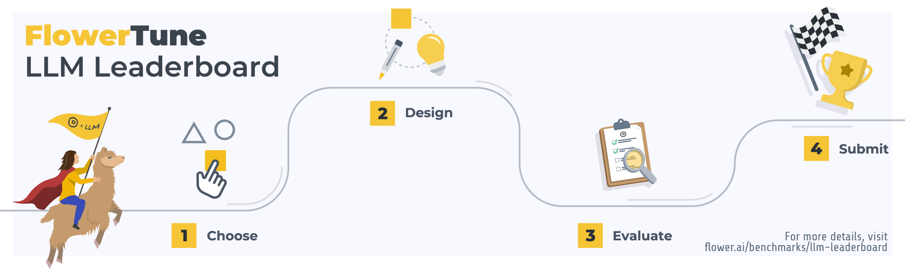

# FlowerTune LLM Leaderboard

This repository guides you through the process of federated LLM instruction tuning with a
pre-trained [Mistral-7B](https://huggingface.co/mistralai/Mistral-7B-v0.3) model across 4 domains --- general NLP, finance, medical and code.

Please follow the instructions to run and evaluate the federated LLMs.

## Create a new project

As the first step, please register for a Flower account on [flower.ai/login](https://flower.ai/login).
Then, create a new Python environment and install Flower. 

> [!TIP]
> We recommend using `pyenv` and the `virtualenv` plugin to create your environment. Other manager such as Conda would likely work too. Check the [documentation](https://flower.ai/docs/framework/how-to-install-flower.html) for alternative ways of installing Flower.

```shell
pip install flwr
```

On the new environment, create a new Flower project using the `FlowerTune` template. You will be prompted for a name to give to your project, your username, and for your choice of LLM challenge:
```shell
flwr new --framework=FlowerTune
```

The `flwr new` command will generate a directory with the following structure:

```bash
<project-name>
       ├── README.md           # <- Instructions
       ├── pyproject.toml      # <- Environment dependencies and configs
       └── <project_name>
                  ├── client_app.py   # <- Flower ClientApp build
                  ├── dataset.py      # <- Dataset and tokenizer build
                  ├── models.py       # <- Model build
                  ├── server_app.py   # <- Flower ServerApp build
                  └── strategy.py     # <- Flower strategy build
```

This can serve as the starting point for you to build up your own federated LLM fine-tuning methods.

> [!IMPORTANT]
> Please note that if you intend to submit your project as an entry to the [LLM Leaderboard](https://flower.ai/benchmarks/llm-leaderboard) modifications to `[tool.flwr.app.config.static]` and `[tool.flwr.federations.local-simulation]` sections in the `pyproject.toml` are not allowed and will invalidate the submission.


## Run FlowerTune LLM challenges

With a new project directory created, running a baseline challenge can be done by:

1. Navigate inside the directory that you just created.


2. Follow the `Environments setup` section of `README.md` in the project directory to install the project dependencies.


3. Run the challenge as indicated in the `Running the challenge` section in the `README.md`.

## Evaluate fine-tuned LLMs

Once the LLM fine-tuning finished, evaluate the performance of your fine-tuned LLM
following the `README.md` in [`evaluation`](https://github.com/adap/flower/tree/main/benchmarks/flowertune-llm/evaluation) directory.


> [!NOTE]
> If you have any questions about running FlowerTune LLM challenges or evaluation, please feel free to make posts at [Flower Discuss](https://discuss.flower.ai) forum, 
or join our [Slack channel](https://flower.ai/join-slack/) to ask questions in the `#flowertune-llm-leaderboard` channel.
