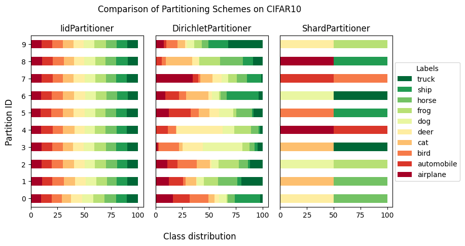

Flower Datasets
===============

Flower Datasets (``flwr-datasets``) is a library to quickly and easily create datasets for federated
learning/analytics/evaluation. It is created by the ``Flower Labs`` team that also created `Flower <https://flower.ai>`_ - a Friendly Federated Learning Framework.

Flower Datasets Framework
-------------------------

Install
~~~~~~~

.. code-block:: bash

  python -m pip install flwr-datasets[vision]

Check out all the details on the download in :doc:`how-to-install-flwr-datasets`.

Tutorials
~~~~~~~~~

A learning-oriented series of tutorials is the best place to start.

.. toctree::
   :maxdepth: 1
   :caption: Tutorial

   tutorial-quickstart

How-to guides
~~~~~~~~~~~~~

Problem-oriented how-to guides show step-by-step how to achieve a specific goal.

.. toctree::
   :maxdepth: 1
   :caption: How-to guides

   how-to-install-flwr-datasets
   how-to-use-with-pytorch
   how-to-use-with-tensorflow
   how-to-use-with-numpy
   how-to-use-with-local-data
   how-to-disable-enable-progress-bar

References
~~~~~~~~~~

Information-oriented API reference and other reference material.

.. autosummary::
   :toctree: ref-api
   :template: autosummary/module.rst
   :caption: API reference
   :recursive:

      flwr_datasets

Main features
-------------
Flower Datasets library supports:

- **downloading datasets** - choose the dataset from Hugging Face's ``dataset`` (`link <https://huggingface.co/datasets>`_)
- **partitioning datasets** - choose one of the implemented partitioning scheme or create your own.
- **creating centralized datasets** - leave parts of the dataset unpartitioned (e.g. for centralized evaluation)
- **visualization of the partitioned datasets** - visualize the label distribution of the partitioned dataset (and compare the results on different parameters of the same partitioning schemes, different datasets, different partitioning schemes, or any mix of them)

Thanks to using Hugging Face's ``datasets`` used under the hood, Flower Datasets integrates with the following popular formats/frameworks:

- Hugging Face
- PyTorch
- TensorFlow
- Numpy
- Pandas
- Jax
- Arrow

Here are a few of the ``Partitioner`` s that are available: (for a full list see `link <ref-api/flwr_datasets.partitioner.html#module-flwr_datasets.partitioner>`_ )

* Partitioner (the abstract base class) ``Partitioner``
* IID partitioning ``IidPartitioner(num_partitions)``
* Dirichlet partitioning ``DirichletPartitioner(num_partitions, partition_by, alpha)``
* InnerDirichlet partitioning ``InnerDirichletPartitioner(partition_sizes, partition_by, alpha)``
* Natural ID partitioner ``NaturalIdPartitioner(partition_by)``
* Size partitioner (the abstract base class for the partitioners dictating the division based the number of samples) ``SizePartitioner``
* Linear partitioner ``LinearPartitioner(num_partitions)``
* Square partitioner ``SquarePartitioner(num_partitions)``
* Exponential partitioner ``ExponentialPartitioner(num_partitions)``
* more to come in the future releases (contributions are welcome).

How To Use the library
----------------------
Learn how to use the ``flwr-datasets`` library from the :doc:`tutorial-quickstart` examples .

Join the Flower Community
-------------------------

The Flower Community is growing quickly - we're a friendly group of researchers, engineers, students, professionals, academics, and other enthusiasts.

.. button-link:: https://flower.ai/join-slack
    :color: primary
    :shadow:

    Join us on Slack
