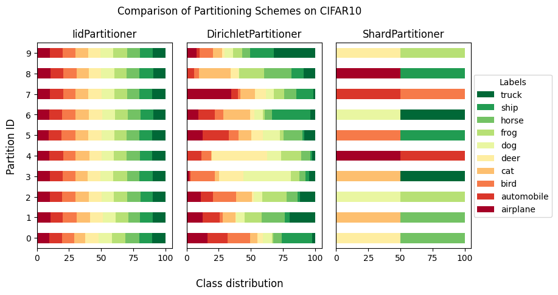

Flower Datasets
===============

Flower Datasets (``flwr-datasets``) is a library that enables the quick and easy creation of datasets for federated learning/analytics/evaluation. It enables heterogeneity (non-iidness) simulation and division of datasets with the preexisting notion of IDs. The library was created by the ``Flower Labs`` team that also created `Flower <https://flower.ai>`_ : A Friendly Federated AI Framework.

Try out an interactive demo to generate code and visualize heterogeneous divisions at the :ref:`bottom of this page<demo>`.

Flower Datasets Framework
-------------------------

Install
~~~~~~~

.. code-block:: bash

  python -m pip install "flwr-datasets[vision]"

Check out all the details on how to install Flower Datasets in :doc:`how-to-install-flwr-datasets`.

Tutorials
~~~~~~~~~

A learning-oriented series of tutorials is the best place to start.

.. toctree::
   :maxdepth: 1
   :caption: Tutorial

   tutorial-quickstart
   tutorial-use-partitioners
   tutorial-visualize-label-distribution

How-to guides
~~~~~~~~~~~~~

Problem-oriented how-to guides show step-by-step how to achieve a specific goal.

.. toctree::
   :maxdepth: 1
   :caption: How-to guides

   how-to-install-flwr-datasets
   how-to-use-with-pytorch
   how-to-use-with-tensorflow
   how-to-use-with-numpy
   how-to-use-with-local-data
   how-to-disable-enable-progress-bar
   how-to-generate-demo-data-for-deployment

References
~~~~~~~~~~

Information-oriented API reference and other reference material.

.. toctree::
    :titlesonly:
    :maxdepth: 2
    :caption: References

    reference

.. toctree::
   :maxdepth: 1
   :caption: Reference docs

   recommended-fl-datasets
   ref-telemetry

.. toctree::
   :maxdepth: 1
   :caption: Contributor tutorials

   contributor-how-to-contribute-dataset

Main features
-------------
Flower Datasets library supports:

- **Downloading datasets** - choose the dataset from Hugging Face's ``dataset`` (`link <https://huggingface.co/datasets>`_)(*)
- **Partitioning datasets** - choose one of the implemented partitioning schemes or create your own.
- **Creating centralized datasets** - leave parts of the dataset unpartitioned (e.g. for centralized evaluation)
- **Visualization of the partitioned datasets** - visualize the label distribution of the partitioned dataset (and compare the results on different parameters of the same partitioning schemes, different datasets, different partitioning schemes, or any mix of them)

.. note::

  (*) Once the dataset is available on HuggingFace Hub, it can be **immediately** used in ``Flower Datasets`` without requiring approval from the Flower team or the need for custom code.

Thanks to using Hugging Face's ``datasets`` used under the hood, Flower Datasets integrates with the following popular formats/frameworks:

- Hugging Face
- PyTorch
- TensorFlow
- Numpy
- Pandas
- Jax
- Arrow

Here are a few of the ``Partitioners`` that are available: (for a full list see `link <ref-api/flwr_datasets.partitioner.html#module-flwr_datasets.partitioner>`_ )

* Partitioner (the abstract base class) ``Partitioner``
* IID partitioning ``IidPartitioner(num_partitions)``
* Dirichlet partitioning ``DirichletPartitioner(num_partitions, partition_by, alpha)``
* Distribution partitioning ``DistributionPartitioner(distribution_array, num_partitions, num_unique_labels_per_partition, partition_by, preassigned_num_samples_per_label, rescale)``
* InnerDirichlet partitioning ``InnerDirichletPartitioner(partition_sizes, partition_by, alpha)``
* PathologicalPartitioner ``PathologicalPartitioner(num_partitions, partition_by, num_classes_per_partition, class_assignment_mode)``
* Natural ID partitioner ``NaturalIdPartitioner(partition_by)``
* Size partitioner (the abstract base class for the partitioners dictating the division based the number of samples) ``SizePartitioner``
* Linear partitioner ``LinearPartitioner(num_partitions)``
* Square partitioner ``SquarePartitioner(num_partitions)``
* Exponential partitioner ``ExponentialPartitioner(num_partitions)``
* more to come in the future releases (contributions are welcome).

How To Use the library
----------------------
Learn how to use the ``flwr-datasets`` library from the :doc:`tutorial-quickstart` examples .

Distinguishing Features
-----------------------
What makes Flower Datasets stand out from other libraries?

* Access to the largest online repository of datasets:

  * The library functionality is independent of the dataset, so you can use any dataset available on `🤗Hugging Face Datasets <https://huggingface.co/datasets>`_. This means that others can immediately benefit from the dataset you added.

  * Out-of-the-box reproducibility across different projects.

  * Access to naturally dividable datasets (with some notion of id) and datasets typically used in centralized ML that need partitioning.

* Customizable levels of dataset heterogeneity:

  * Each ``Partitioner`` takes arguments that allow you to customize the partitioning scheme to your needs.

  * Partitioning can also be applied to the dataset with naturally available division.

* Flexible and open for extensions API.

  * New custom partitioning schemes (``Partitioner`` subclasses) integrated with the whole ecosystem.

Join the Flower Community
-------------------------

The Flower Community is growing quickly - we're a friendly group of researchers, engineers, students, professionals, academics, and other enthusiasts.

.. button-link:: https://flower.ai/join-slack
    :color: primary
    :shadow:

    Join us on Slack

Recommended FL Datasets
-----------------------

Below we present a list of recommended datasets for federated learning research, which can be
used with Flower Datasets ``flwr-datasets``.

.. note::

    All datasets from `HuggingFace Hub <https://huggingface.co/datasets>`_ can be used with our library. This page presents just a set of datasets we collected that you might find useful.

For more information about any dataset, visit its page by clicking the dataset name. 

.. include:: recommended-fl-datasets-tables.rst

.. _demo:
Demo
----

.. raw:: html

  

  <gradio-app src="https://flwrlabs-federated-learning-datasets-by-flwr-datasets.hf.space"></gradio-app>
