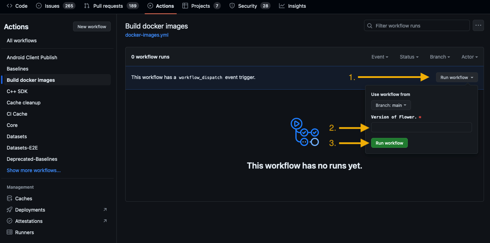

Release Flower
==============

This document describes the current release process. It may or may not change in the future.

During the release
------------------

The version number of a release is stated in ``pyproject.toml``. To release a new version of Flower, the following things need to happen (in that order):

1. Run ``python3 src/py/flwr_tool/update_changelog.py <YOUR_GH_TOKEN>`` in order to add every new change to the changelog (feel free to make manual changes to the changelog afterwards until it looks good).
2. Once the changelog has been updated with all the changes, open a pull request.
3. Once the pull request is merged, tag the release commit with the version number as soon as the PR is merged: ``git tag v<NEW_VERSION>`` (notice the ``v`` added before the version number), then ``git push --tags``. This will create a draft release on GitHub containing the correct artifacts and the relevant part of the changelog.
4. Check the draft release on GitHub, and if everything is good, publish it.
5. Trigger the CI for building the Docker images.

To trigger the workflow, a collaborator must create a ``workflow_dispatch`` event in the
GitHub CI. This can be done either through the UI or via the GitHub CLI. The event requires only one
input, the Flower version, to be released.

**Via the UI**

1. Go to the ``Build docker images`` workflow `page <https://github.com/adap/flower/actions/workflows/docker-images.yml>`_.
2. Click on the ``Run workflow`` button and type the new version of Flower in the ``Version of Flower`` input field.
3. Click on the **green** ``Run workflow`` button.

**Via the GitHub CI**

1. Make sure you are logged in via ``gh auth login`` and that the current working directory is the root of the Flower repository.
2. Trigger the workflow via ``gh workflow run docker-images.yml -f flwr-version=<NEW_VERSION>``.

After the release
-----------------

Create a pull request which contains the following changes:

1. Increase the minor version in ``pyproject.toml`` by one.
2. Update all files which contain the current version number if necessary.
3. Add a new ``Unreleased`` section in ``changelog.md``.

Merge the pull request on the same day (i.e., before a new nightly release gets published to PyPI).

Publishing a pre-release
------------------------

Pre-release naming
~~~~~~~~~~~~~~~~~~

PyPI supports pre-releases (alpha, beta, release candidate). Pre-releases MUST use one of the following naming patterns:

- Alpha: ``MAJOR.MINOR.PATCHaN``
- Beta: ``MAJOR.MINOR.PATCHbN``
- Release candidate (RC): ``MAJOR.MINOR.PATCHrcN``

Examples include:

- ``1.0.0a0``
- ``1.0.0b0``
- ``1.0.0rc0``
- ``1.0.0rc1``

This is in line with PEP-440 and the recommendations from the Python Packaging
Authority (PyPA):

- `PEP-440 <https://peps.python.org/pep-0440/>`_
- `PyPA Choosing a versioning scheme <https://packaging.python.org/en/latest/guides/distributing-packages-using-setuptools/#choosing-a-versioning-scheme>`_

Note that the approach defined by PyPA is not compatible with SemVer 2.0.0 spec, for details consult the `Semantic Versioning Specification <https://semver.org/spec/v2.0.0.html#spec-item-11>`_ (specifically item 11 on precedence).

Pre-release classification
~~~~~~~~~~~~~~~~~~~~~~~~~~

Should the next pre-release be called alpha, beta, or release candidate?

- RC: feature complete, no known issues (apart from issues that are classified as "won't fix" for the next stable release) - if no issues surface this will become the next stable release
- Beta: feature complete, allowed to have known issues
- Alpha: not feature complete, allowed to have known issues
