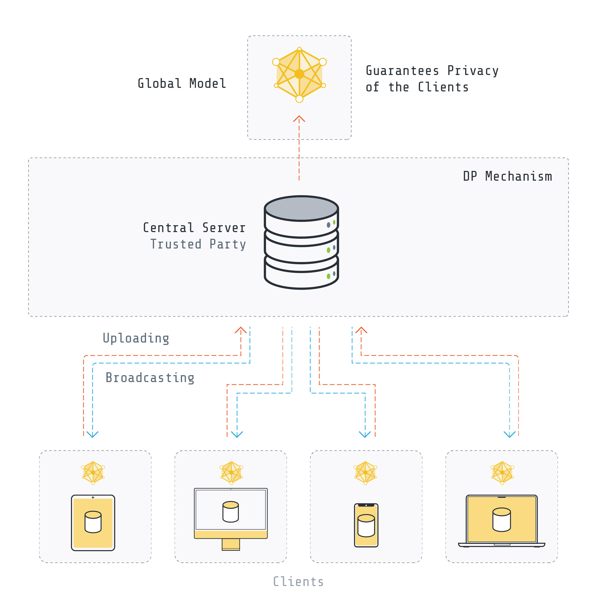
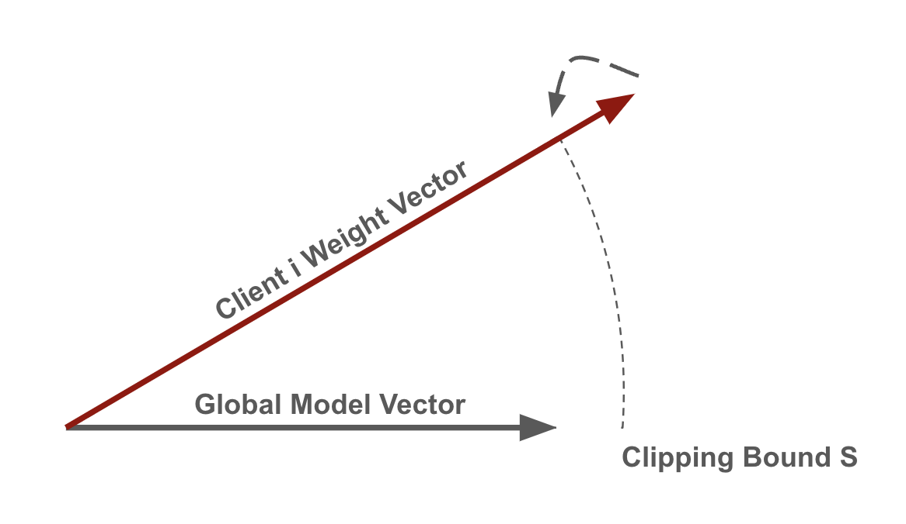

Differential Privacy Explainer: From Fundamentals to Using it in Flower
====================
The information in datasets like healthcare, financial transactions, user preferences, and etc. is valuable and has the potential for scientific breakthroughs and provide important business insights. However, such data is also sensitive and there is a risk of compromising individual privacy.
Traditional methods like anonymization alone would not work because of attacks like Re-identification and Data Linkage.
That's where differential privacy comes in. It provides the possibility of analyzing data while ensuring the privacy of individual.

Differential Privacy
-------
Imagine two datasets that are identical except for a single record (for instance Alice's data).
Differential Privacy (DP) guarantees that any analysis (M), like calculating the average income, will produce nearly identical results for both datasets (O and O' would be similar).
This preserves group patterns while obscuring individual details, ensuring individual's information remains hidden in the crowd.

.. image:: ./_static/DP/dp-intro.png
  :align: center
  :width: 400
  :alt: DP Intro

One of the most commonly used mechanisms achieve DP is adding enough noise to the outputof the analysis to mask the contribution of each individual in the data while preserving the overall accuracy of the analysis.

Formal Definition
~~~~~~~~~~
Differential Privacy (DP) provides statistical guarantees against the information an adversary can infer through the output of a randomized algorithm.
It provides an unconditional upper bound on the influence of a single individual on the output of the algorithm by adding noise [1].
A randomized mechanism
M provides (:math:`\epsilon`, :math:`\delta`)-differential privacy if for any two neighboring databases, D :sub:`1` and D :sub:`2`, that differ in only a single record,
and for all possible outputs S ⊆ Range(A):

.. math::

   P[M(D_{1} \in A)] \leq e^{\delta} P[M(D_{2} \in A)] + \delta

The :math:`\epsilon` parameter, also known as the privacy budget, is a metric of privacy loss.
It also controls the privacy-utility trade-off; lower :math:`\epsilon` values indicate higher levels of privacy but are likely to reduce utility as well.
The :math:`\delta` parameter accounts for a small probability on which the upper bound :math:`\epsilon` does not hold.
The amount of noise needed to achieve differential privacy is proportional to the sensitivity of the output, which measures the maximum change in the output due to the inclusion or removal of a single record.

Differential Privacy in Machine Learning
-------
DP can be utilized in machine learning to preserve the privacy of the training data.
Differentially private machine learning algorithms are designed in a way to prevent the algorithm to learn any specific information about any individual data points and subsecuntly prevents the model from revealing sensitive information.
Depending on the stage at which noise is introduced, various methods exist for applying DP to machine learning algorithms.
One approach involves adding noise to the training data (either to the features or labels), while another method entails injecting noise into the gradients of the loss function during model training.
Additionally, such noise can be incorporated into the model's output.

Differential Privacy in Federated Learning
-------
Federated learning is a data minimization approach that allows multiple parties to collaboratively train a model without sharing their raw data.
However, federated learning also introduces new privacy challenges. The model updates between parties and the central server can leak information about the local data.
These leaks can be exploited by attacks such as membership inference and property inference attacks, or model inversion attacks.

DP can play a curcial role in federated learning to provide privacy for the clients' data.

Depending on the granularity of privacy provision or the location of noise addition, different forms of DP exist in federated learning.
In this explainer, we focus on two approaches of DP utilization in federated learning based on where the noise is added: at the server (also known as the center) or at the client (also known as the local).

- **Central Differential Privacy**: DP is applied by the server and the goal is to prevent the aggregated model from leaking information about each client's data.

- **Local Differential Privacy**: DP is applied on the client side before sending any information to the server and the goal is to prevent the updates that are sent to the server from leaking any information about the client's data.

Central Differential Privacy
~~~~~~~~~~
In this approach, which is also known as user-level DP, the central server is responsible for adding noise to the globally aggregated parameters. It should be noted that trust in the server is required.

While there are various ways to implement central DP in federated learning, we concentrate on the algorithms proposed by [2] and [3].
The overall approach is to clip the model updates sent by the clients and add some amount of noise to the aggregated model.
In each iteration, a random set of clients are chosen for training.
Each client performs local training on its own data.
The updates of each client is then clipped by some value `S` (sensitivity S).
This would limit the impact of any individual client which is crucial for privacy and often beneficial for robustness.
A common approach to achieve this is by restricting the `L2` norm of its model update, ensuring that larger updates are scaled down to fit within the norm `S`.

Afterwards, Gaussian mechanism is used to add noise in order to distort the sum of all clients' updates.
The amount of noise is scaled to the sensitivity value to obtain a privacy guarantee.
The Gaussian mechanism is used with a noise sampled from `N (0, σ²)` where `σ =( noise_scale * S ) / (number of sampled clients)`.

Clipping
^^^^^^^^^^^^^^^^
There are two forms of clipping commonly used in Central DP: Fixed Clipping and Adaptive Clipping.

- **Fixed Clipping** :

- **Adaptive Clipping** :

Local Differential Privacy
~~~~~~~~~~
In this approach, each client is responsible for performing DP.
Local DP avoids the need for a fully trusted aggregator, but it should be noted that local DP leads to a decrease in accuracy in comparison to central DP.
In this explainer, we focus on two forms of achieving Local DP:

-

Distributed Differential Privacy
~~~~~~~~~~

Differential Privacy in Flower
-------
Note: we are at the experimental phase of using differential privacy in Flower. Please

[1] Dwork et al. The Algorithmic Foundations of Differential Privacy.

[2] McMahan et al. Learning Differentially Private Recurrent Language Models.

[3] Geyer et al. Differentially Private Federated Learning: A Client Level Perspective.

