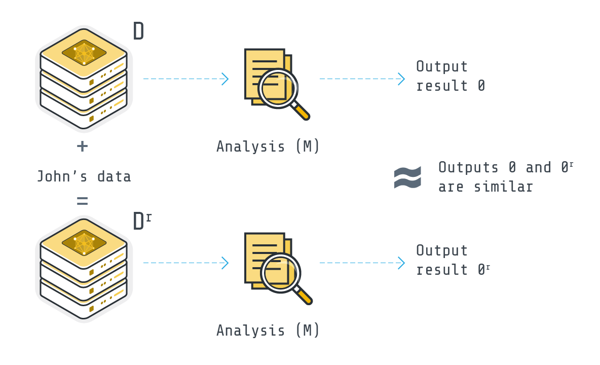

Differential Privacy Explainer: From Fundamentals to Federated Learning
====================
The information in datasets like healthcare, financial transactions, user preferences, and etc. is valuable and has the potential for scientific breakthroughs and provide important business insights. However, such data is also sensitive and there is a risk of compromising individual privacy.
Traditional methods like anonymization alone would not work because of attacks like Re-identification and Data Linkage.
That's where differential privacy comes in. It provides the possibility of analyzing data while ensuring the privacy of individual.

Differential Privacy
-------
Imagine two datasets that are identical except for a single record.
Differential Privacy (DP) guarantees that any analysis, like calculating the average income, will produce nearly identical results for both datasets.
This preserves group patterns while obscuring individual details, ensuring individual's information remains hidden in the crowd.

In the following image,

Subsection
~~~~~~~~~~

