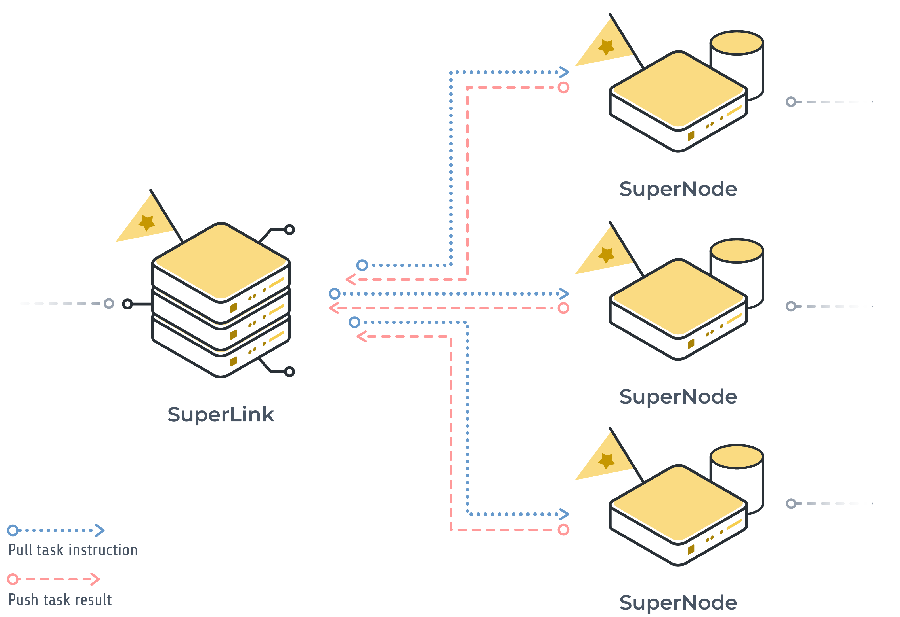
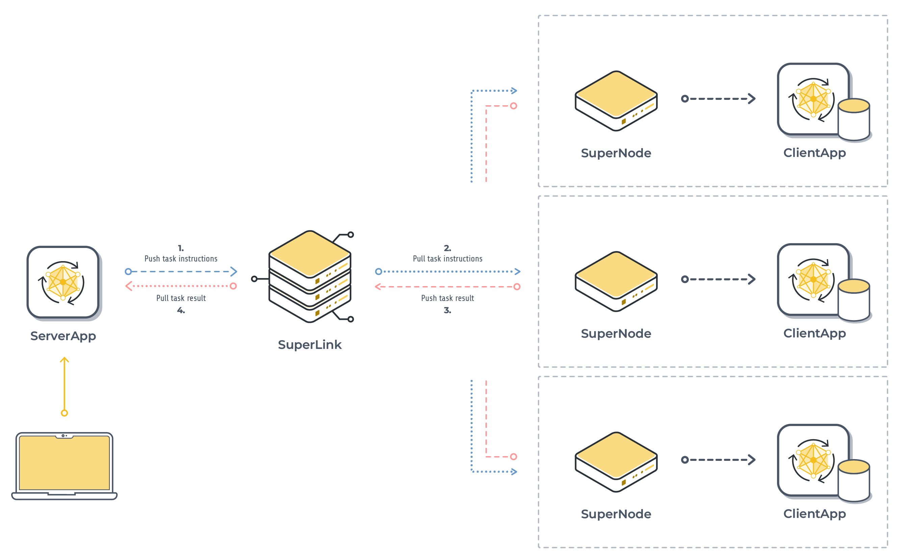

Key Concepts of Flower Next
===========================

This page explains the decoupling concept in Flower Next and how it benefits Flower users.

.. |clientapp_link| replace:: ``ClientApp()``
.. |serverapp_link| replace:: ``ServerApp()``
.. |message_link| replace:: ``Message()``
.. |context_link| replace:: ``Context()``
.. |mods_link| replace:: ``mods``
.. _clientapp_link: ref-api/flwr.client.ClientApp.html
.. _serverapp_link: ref-api/flwr.server.ServerApp.html
.. _message_link: ref-api/flwr.common.Message.html
.. _context_link: ref-api/flwr.common.Context.html
.. _mods_link: how-to-use-built-in-mods.html

Infrastructure layer
--------------------

Federated learning typically relies on a system that relays messages during training. Beyond sending and receiving messages, this backbone system may also handle a variety of other tasks that are non-learning related, like syncing with federation nodes or temporarily storing messages. However, as the range and complexity of applications benefiting from federated learning grows, reliability and reproducibility of such a system become key challenges. These challenges are especially pertinent to users wanting to deploy their federated learning workflows to production.

With Flower Next, we address this set of challenges by decoupling and standardizing the infrastructure layer for federated learning (see the following diagram).

    
    Flower infrastructure layer consisting of the SuperLink and SuperNodes.

This layer is dedicated to tasks such as transmitting data and maintaining connections. It is separate from the application layer (more on that below) which is the user-interaction layer [#f1]_. Because of this decoupling, the Flower federated learning system becomes truly infrastructure agnostic, meaning that Flower users can seamlessly move projects between simulation and deployment without code changes. 

In Flower Next, the infrastructure layer consists of the SuperLink and SuperNode.

SuperLink
~~~~~~~~~

The SuperLink relays messages in a Flower federated learning system. It acts like a hub that receives the model and training instructions from the server, then passes them along to the training nodes.

More concretely, the SuperLink relays messages between the SuperNodes and the ServerApp. Let's give an example for a federated learning workflow: a SuperLink receives a model to be federated in a message from the ServerApp. Selected SuperNodes then pull that message from the SuperLink and respectively process their messages by running their ClientApps. In this case, the SuperNodes launch their ClientApps to train a model each on their local data. Once trainings are complete, the ClientApps return their models to the SuperNodes, which in turn relay messages via the SuperLink back to the ServerApp for aggregation.

..
    TODO: Add section labels where appropriate: https://docs.readthedocs.io/en/stable/guides/cross-referencing-with-sphinx.html#automatically-label-sections

In the "Application layer" section, we will define what we mean by the ServerApp, ClientApp, and Message. For now, it is important to know that as the main relay hub, the SuperLink is always running in the background to handle any communication needs. 

SuperNode
~~~~~~~~~

The SuperNode is the next component of the infrastructure layer. Just like SuperLink, the SuperNode continuously runs in the background. It runs where the data is gathered, like on smartphones, IoT devices, or servers belonging to organizations. All connected SuperNodes check in with the SuperLink regularly. They pull messages (that were first pushed by a ServerApp) from the SuperLink, process the messages by launching a ClientApp, and then push the results back to the SuperLink.

Together, SuperLink and SuperNodes make up the infrastructure layer of a Flower federated learning system.

Application layer
-----------------

On the application layer, we have the ServerApp and ClientApp. These are essentially applications or packaged code that runs on the server and clients, respectively. Flower users only need to interact with the ServerApp to start tasks on federated nodes, such as initiating federated learning. ClientApps will be launched on demand by the long-running SuperNodes. The graphic below illustrates the workflow.

    Flower application layer (ServerApp and ClientApps) interacting with the infrastructure layer.

ServerApp
~~~~~~~~~

Let's start with the ServerApp (|serverapp_link|_). Typically, in federated learning, only a handful of connected nodes are involved in training. The ServerApp plays a crucial role in this. It is responsible for sampling SuperNodes that are connected to the SuperLink, pushing messages to the SuperLink, and pulling messages from it. It would normally process messages that get pulled, for example, when performing model aggregation. The ServerApp is also ephemeral, meaning that it is temporarily spun up and executed for a task, for instance one complete federated learning run. This allows server-side resources to be consumed on-demand.

ClientApp
~~~~~~~~~

Now, onto its counterpart, the ClientApp (|clientapp_link|_). Like the ServerApp, the ClientApp is ephemeral - it is spun up on-demand by the SuperNode to process a message (sent by the ServerApp). When the ClientApp is launched, it receives a message from the SuperNode, executes the instructions in the message, returns results back to the SuperNode, and finally terminates.

.. note::
    In a future release, we will introduce the concept of multi-app support. This means that multiple ClientApps can be connected to a single SuperNode. This allows multiple users of the same federation to execute different tasks on the same SuperNode, bringing greater freedom for building and using task-specific apps, all while using the same infrastructure.

The reason for employing the mechanisms for launching apps is to enable code reusability: In previous versions (<1.8), clients are inherently linked to a server for an FL project and additional code needs to be written to move a simulation-based FL setup to a real-world deployment. This can sometimes prohibitively impede the productizing of federated learning workflows. Instead, with the decoupling of the layers in Flower Next, the same ServerApp and ClientApp code can be easily run in a simulation setup or deployment setup *without any code changes*.

Information exchange
--------------------

Messages
~~~~~~~~

Message (|message_link|_) is an object that Flower uses to carry information between ServerApp and ClientApp. This information can be a model the ServerApp wants to federate, metrics the ClientApp is pushing back to the ServerApp via the SuperLink, and anything in between. The design of Messages and how they are handled by Flower ensures that a Message sent by the ServerApp looks exactly the same when received by the ClientApp (and vice versa). This ensures a more unified and smoother developer experience.

Context
~~~~~~~

Context (|context_link|_) is another useful object that we introduced in Flower Next. For every execution of `ServerApp`, i.e. a run, it carries the record and messages that is unique to the run. Each time a SuperNode runs a ClientApp within the run, the same Context object is exposed to the ClientApp, allowing the ClientApp to persist throughout the duration of the run. Context can be used as a temporary buffer for executing additional tasks, like |mods_link|_. 

Summary
-------

In this explainer, you've learnt the essential components of federated learning with Flower Next, divided neatly into infrastructure and application layers.

At the infrastructure layer, we've the backbone: the SuperLink and SuperNode, ensuring standardized and persistent communication between nodes. On the application layer, we've seen the ServerApp and ClientApp in action, handling tasks on the server and client sides, respectively.

The benefit of this setup lies in decoupling—data scientists and ML researchers can focus on building and using the apps while making use of pre-existing infrastructure. Importantly, users can seamlessly move projects between simulation and real-world setting without code changes, thereby easily making meaningful progress in production based on the success on simulated problems. Under the hood, Message and Context objects standardize the mechanisms of relaying and persisting information between ServerApp and ClientApps. It's a win-win scenario, enabling smoother development experience and flexibility to experiment and build federated learning systems.

.. admonition:: Important
    :class: important

    As we continuously enhance Flower Next at a rapid pace, we'll be periodically updating this explainer document. Please feel free to share any feedback with us!

.. rubric:: Footnotes

.. [#f1] This concept of layers is broadly based on the `Open Systems Interconnection (OSI) model <https://en.wikipedia.org/wiki/OSI_model>`_.
