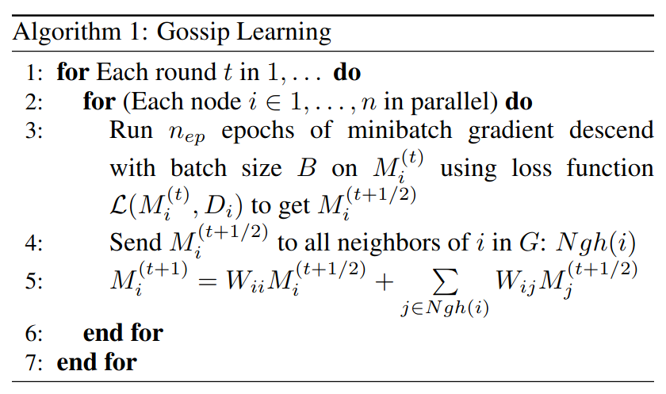

# Gossip Learning FED

## Table of Contents

- [Table of Contents](#table-of-contents)
- [Summary](#summary)
- [Motivation](#motivation)
  - [Goals](#goals)
  - [Non-Goals](#non-goals)
- [Proposal](#proposal)
- [Drawbacks](#drawbacks)
- [Alternatives Considered](#alternatives-considered)
- [Appendix](#appendix)

## Summary

Flower doesn't provide a way to train models in a fully decentralized way.

A gossip learning algorithm could be implemented as a decentralized Flower prototype.

## Motivation

Federated Learning was introduced in order to improve the privacy of users when training models using sensitive data.
But it still relies on a centralized server that coordonates every aspect of the training. The next step in terms of privacy and independence is to be able 
to train a model in a fully decentralized way without having to share any sensitive data either.
Also, it greatly reduces the infrastructure requirements, there is no single point failure as in the FL setting and no communication bottleneck at the server either.

### Goals

* Develop a (hybrid) gossip learning prototype that uses Flower

* Make it as compatible with the current API as possible

* Make it a standalone example

### Non-Goals

* Make Gossip Learning a main feature of Flower (it will be experimental)

* Get rid of the server completely

* Make the setting realistic

## Proposal

As a first prototype, we could heavily rely on the server to make the algorithm work.

### Client side

Each client could hold a list of neighbours, a function to discover its neighbours, and a function to average its model with its neighbours.

### Server side

The server would hold a graph of the clients and would be responsible for calling the neighbour discovering and average functions of each client.

## Drawbacks

This prototype wouldn't represent a fully decentralized system.

 ## Alternatives Considered

### Client-to-client communication

In order to have truly decentralized gossip learning we would need to allow for the clients to communicate between each other, which is not currently possible in Flower.
This might require some important changes to the main framework, but the average function would be the same as in the main proposal.

<!-- ### [Alternative 2] 

[TODO] -->

## Appendix

  
  
