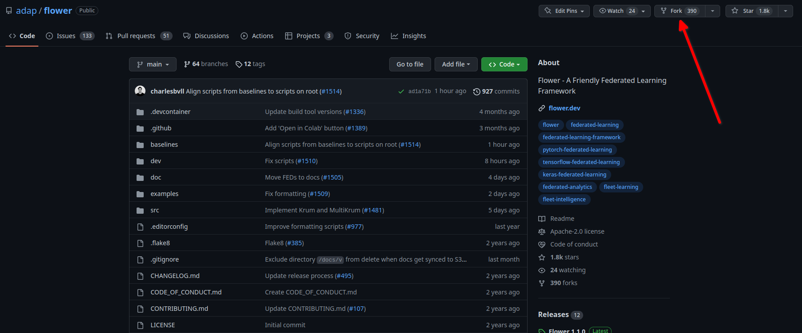
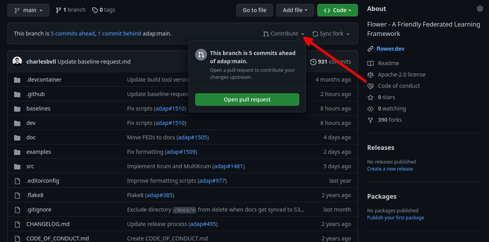

First time contributors
=======================

This guide is geared towards people that want to get involved in Flower
but that are not used to contributing on GitHub projects.

If GitHub contributions have no secret for you, 
you can directly checkout our 
`getting started guide for contributors <https://flower.dev/docs/getting-started-for-contributors.html>`_ 
and examples of `good first contributions <https://flower.dev/docs/good-first-contributions.html>`_.

Forking the Flower repo
-----------------------

The firt step to become a contributor is to fork the Flower repo, to do so, 
navigate to https://github.com/adap/flower (while connected to your GitHub account) and click the fork button on the top right.

You can change the name if you want, but this is not necessary as this version of Flower will be yours and will sit inside your own repositories.

Contributing
------------

Then, the process for contributing is as follows:

- Setting up the environment by following this `guide <https://flower.dev/docs/getting-started-for-contributors.html>`_
- Make modifications to your personal fork of Flower
- Push them to GitHub and the following message should appear on your fork:

- Click on "Open pull request"
- Describe what you have done following the premade template
- If you PR is not ready to be 
reviewed, open a "Draft pull request" 
- Otherwise open a regular pull request so reviewers can be notified and look into your contribution
- Apply the changes reviewers might request and once the PR as been approved and passes all the test, it can be merged! 🎉
- You will officially become a Flower contributor, thanks!

Example of first contribution
-----------------------------

Problem
*******

For our documentation, we’ve started to use the `Diàtaxis framework <https://diataxis.fr/>`_.

Our “How to” guides should have titles that continue the sencence “How to …”, for example, “How to upgrade to Flower 1.0”.

Most of our guides do not follow this new format yet, and changing their title is (unfortunately) more involved than one might think.

This issue is about changing the title of a doc from present continious to present simple.

Let's take the example of “Saving Progress” which we changed to “Save Progress”. Does this pass our check?

Before: ”How to saving progress” ❌

After: ”How to save progress” ✅

Solution
********

This is a tiny change, but it’ll allow us to test your end-to-end setup. After cloning and setting up the Flower repo, here’s what you should do:

- Find the source file in `doc/source`
- Make the change in the `.rst` file (beware, the dashes under the title should be the same length as the title itself)
- Build the docs and check the result: `<https://flower.dev/docs/writing-documentation.html#edit-an-existing-page>`_

Rename file
:::::::::::

You might have noticed that the file name still reflects the old wording. 
If we just change the file, then we break all existing links to it - it is **very important** to avoid that, breaking links can harm our search engine ranking.

Here’s how to change the file name:

- Change the file name to `save-progress.rst`
- Add a redirect rule to `doc/source/conf.py`

This will cause a redirect from `saving-progress.html` to `save-progress.html`, old links will continue to work.

Apply changes in the index file
:::::::::::::::::::::::::::::::

For the lateral navigation bar to work properly, it is very important to update the `index.rst` file as well. 
This is where we define the whole arborescence of the navbar.

- Find and modify the file name in `index.rst`

Open PR
:::::::

- Commit the change (commit messages are always imperative: “Do something”, in this case “Change …”)
- Push the changes to your fork
- Open a PR (as shown at above)
- Wait for it to be approved!

Next steps
----------

Once you have made your first PR, and want to contribute more, be sure to check out the following :

- `Good first contributions <https://flower.dev/docs/good-first-contributions.html>`_, 
where you should look into the baseline contributions.
