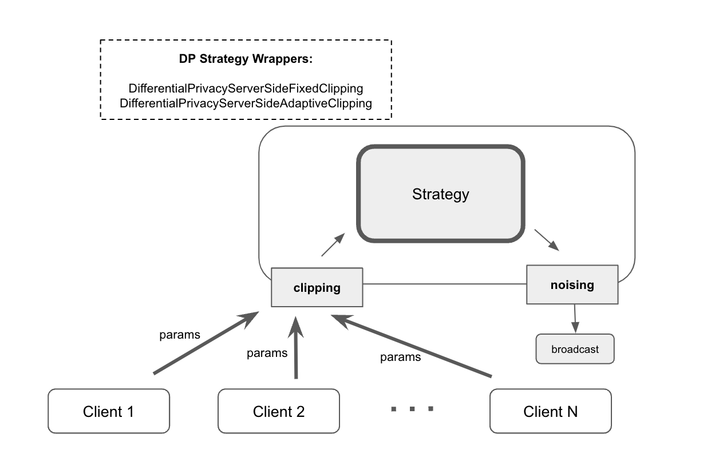

Use Differential Privacy
------------------------
This guide explains how you can utilize differential privacy in the Flower framework. If you are not yet familiar with differential privacy, you can refer to :doc:`explanation-differential-privacy`.

.. warning::

   Differential Privacy in Flower is in a preview phase. If you plan to use these features in a production environment with sensitive data, feel free contact us to discuss your requirements and to receive guidance on how to best use these features.

Central Differential Privacy
~~~~~~~~~~~~~~~~~~~~~~~~~~~~
This approach consists of two seprate phases: clipping of the updates and adding noise to the aggregated model.
For the clipping phase, Flower framework has made it possible to decide whether to perform clipping on the server side or the client side.

- **Server-side Clipping**: This approach has the advantage of the server enforcing uniform clipping across all clients' updates and reducing the communication overhead for clipping values. However, it also has the disadvantage of increasing the computational load on the server due to the need to perform the clipping operation for all clients.
- **Client-side Clipping**: This approach has the advantage of reducing the computational overhead on the server. However, it also has the disadvantage of lacking centralized control, as the server has less control over the clipping process.

Server-side Clipping
^^^^^^^^^^^^^^^^^^^^
For central DP with server-side clipping, there are two :code:`Strategy` classes that act as wrappers around the actual :code:`Strategy` instance (for example, :code:`FedAvg`).
The two wrapper classes are :code:`DifferentialPrivacyServerSideFixedClipping` and :code:`DifferentialPrivacyServerSideAdaptiveClipping` for fixed and adaptive clipping.

The code sample below enables the :code:`FedAvg` strategy to use server-side fixed clipping using the :code:`DifferentialPrivacyServerSideFixedClipping` wrapper class.
The same approach can be used with :code:`DifferentialPrivacyServerSideAdaptiveClipping` by adjusting the corresponding input parameters.

.. code-block:: python

  from flwr.server.strategy import DifferentialPrivacyClientSideFixedClipping

  # Create the strategy
  strategy = fl.server.strategy.FedAvg(...)

  # Wrap the strategy with the DifferentialPrivacyServerSideFixedClipping wrapper
  dp_strategy = DifferentialPrivacyServerSideFixedClipping(
      strategy,
      cfg.noise_multiplier,
      cfg.clipping_norm,
      cfg.num_sampled_clients,
  )

Client-side Clipping
^^^^^^^^^^^^^^^^^^^^
For central DP with client-side clipping, the server sends the clipping value to selected clients on each round.
Clients can use existing Flower :code:`Mods` to perform the clipping.
Two mods are available for fixed and adaptive client-side clipping: :code:`fixedclipping_mod` and :code:`adaptiveclipping_mod` with corresponding server-side wrappers :code:`DifferentialPrivacyClientSideFixedClipping` and :code:`DifferentialPrivacyClientSideAdaptiveClipping`.

.. image:: ./_static/DP/clientsideCDP.png
  :align: center
  :width: 800
  :alt: client side clipping

The code sample below enables the :code:`FedAvg` strategy to use differential privacy with client-side fixed clipping using both the :code:`DifferentialPrivacyClientSideFixedClipping` wrapper class and, on the client, :code:`fixedclipping_mod`:

.. code-block:: python

  from flwr.server.strategy import DifferentialPrivacyClientSideFixedClipping

  # Create the strategy
  strategy = fl.server.strategy.FedAvg(...)

  # Wrap the strategy with the DifferentialPrivacyClientSideFixedClipping wrapper
  dp_strategy = DifferentialPrivacyClientSideFixedClipping(
      strategy,
      cfg.noise_multiplier,
      cfg.clipping_norm,
      cfg.num_sampled_clients,
  )

In addition to the server-side strategy wrapper, the :code:`ClientApp` needs to configure the matching :code:`fixedclipping_mod` to perform the client-side clipping:

.. code-block:: python

  from flwr.client.mod import fixedclipping_mod

  # Add fixedclipping_mod to the client-side mods
  app = fl.client.ClientApp(
      client_fn=client_fn,
      mods=[
          fixedclipping_mod,
      ]
  )

Local Differential Privacy
~~~~~~~~~~~~~~~~~~~~~~~~~~
To utilize local differential privacy (DP) and add noise to the client model parameters before transmitting them to the server in Flower, you can use the `LocalDpMod`. The following hyperparameters need to be set: clipping norm value, sensitivity, epsilon, and delta.

.. image:: ./_static/DP/localdp.png
  :align: center
  :width: 700
  :alt: local DP mod

Below is a code example that shows how to use :code:`LocalDpMod`:

.. code-block:: python

  from flwr.client.mod.localdp_mod import LocalDpMod

  # Create an instance of the mod with the required params
  local_dp_obj = LocalDpMod(
      cfg.clipping_norm, cfg.sensitivity, cfg.epsilon, cfg.delta
  )
  # Add local_dp_obj to the client-side mods

  app = fl.client.ClientApp(
    client_fn=client_fn,
    mods=[local_dp_obj],
  )

Please note that the order of mods, especially those that modify parameters, is important when using multiple modifiers. Typically, differential privacy (DP) modifiers should be the last to operate on parameters.

Local Training using Privacy Engines
^^^^^^^^^^^^^^^^^^^^^^^^^^^^^^^^^^^^
For ensuring data instance-level privacy during local model training on the client side, consider leveraging privacy engines such as Opacus and TensorFlow Privacy. For examples of using Flower with these engines, please refer to the Flower examples directory (`Opacus <https://github.com/adap/flower/tree/main/examples/opacus>`_, `Tensorflow Privacy <https://github.com/adap/flower/tree/main/examples/dp-sgd-mnist>`_).