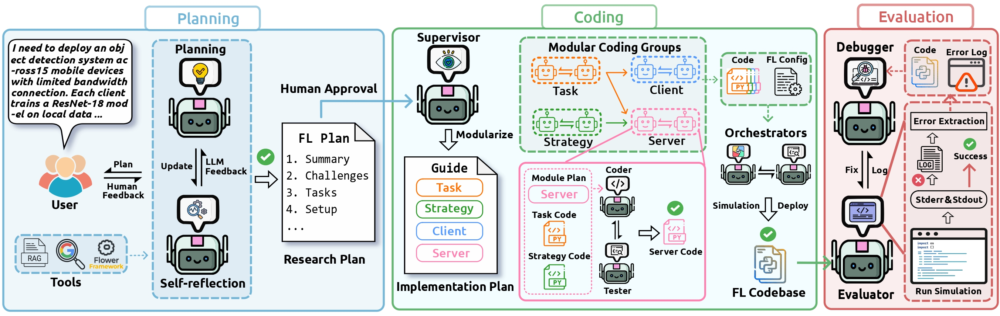

# ☸ Helmsman: Autonomous Synthesis of Federated Learning Systems via Collaborative LLM Agents

<div align="center">

<div>
    <a href='https://haoyuan-l.github.io/' target='_blank'>Haoyuan Li</a><sup>1</sup>&emsp;
    <a href='https://mathias-funk.com/' target='_blank'>Mathias Funk</a><sup>1</sup>&emsp;
    <a href='https://aqibsaeed.github.io/' target='_blank'>Aaqib Saeed</a><sup>1</sup>&emsp;
</div>

<div>
<sup>1</sup><a href="https://www.tue.nl/en/our-university/departments/industrial-design/research/our-research-labs/decentralized-artificial-intelligence-research-lab" target="_blank" rel="noopener noreferrer">
Decentralized Artificial Intelligence Research Lab, Eindhoven University of Technology
</a>
</div>

<br>


[](https://arxiv.org/abs/2510.14512)
[](https://iclr.cc/)
[](https://haoyuan-l.github.io/helmsman-web/)

</div>

## 📢 Updates

* **[02/2026]** 🚀 **Code Release:** The official implementation and **AgentFL-Bench** are now available.
* **[02/2026]** 🌐 **Project Page:** We have released the [project page](https://haoyuan-l.github.io/helmsman-web/) with demos and visualizations.
* **[01/2026]** 🎉 **Acceptance:** **Helmsman** has been accepted to **ICLR 2026**!
* **[11/2025]** 📄 **Preprint:** The [arXiv paper](https://arxiv.org/abs/2510.14512) has been released.



**Helmsman** is a pioneering multi-agent framework designed to automate the end-to-end synthesis of Federated Learning (FL) systems. By bridging the gap between high-level user intent and executable, robust code, Helmsman addresses the intractable complexity of the FL design space.

This repository hosts the official implementation of the paper **"Helmsman: Autonomous Synthesis of Federated Learning Systems via Collaborative LLM Agents"**, published at **ICLR 2026**.

## 📖 Introduction

Federated Learning (FL) holds immense promise for privacy-centric collaborative AI, yet its practical deployment remains a complex engineering challenge. Designing an effective FL system requires navigating a combinatorial design space defined by statistical heterogeneity, system constraints, and shifting task objectives. To date, this process has been a manual, labor-intensive effort led by domain experts, resulting in bespoke solutions that are often brittle in the face of real-world dynamics.

To bridge this gap, we introduce **Helmsman**, a multi-agent system designed to automate the end-to-end research and development of task-oriented FL systems. Helmsman moves beyond simple code generation to holistic system synthesis, navigating the intractable design space by emulating a principled R&D workflow.

**Key Contributions:**

* **End-to-End Synthesis**: We develop **Helmsman**, an agentic framework that translates high-level specifications into deployable FL systems through three collaborative phases: *Interactive Planning*, *Modular Coding*, and *Autonomous Evaluation*.
* **Novel Benchmark**: We introduce **AgentFL-Bench**, a rigorous benchmark comprising 16 diverse tasks across 5 research areas, designed to evaluate the system-level generation capabilities of agentic systems.
* **SOTA Performance**: Extensive experiments demonstrate that Helmsman-generated solutions achieve performance competitive with, and often exceeding, established hand-crafted FL baselines.

## 🏗️ System Architecture

Helmsman orchestrates a collaborative team of LLM agents through a principled, three-phase R&D workflow.

### 1. Interactive Planning
A **Planning Agent** synthesizes a rigorous research plan using external web search and an internal **RAG pipeline** of FL literature. A **Reflection Agent** critiques the strategy for theoretical validity, followed by a final **Human-in-the-Loop** verification to ensure technical soundness and alignment.

### 2. Modular Code Generation
A **Supervisor Agent** decomposes the plan into a modular blueprint (*Task, Client, Strategy, Server*). Specialized **Coder** and **Tester** teams then implement and verify these components in parallel, ensuring separation of concerns and robust code quality.

### 3. Autonomous Refinement
To guarantee robustness, the system runs a closed-loop **Flower simulation**. An **Evaluator Agent** diagnoses runtime and semantic failures, triggering a **Debugger Agent** to iteratively patch the code until the system is certified as fully executable and high-performing.


## ⚙️ Installation

### Prerequisites
* OS: Linux (Recommended)
* Python: 3.12
* CUDA: 12.9 (for GPU acceleration)

### 1. Environment Setup
We recommend using [Miniconda](https://docs.conda.io/en/latest/miniconda.html) to manage the environment.

```bash
# Download and install Miniconda
wget [https://repo.anaconda.com/miniconda/Miniconda3-latest-Linux-x86_64.sh](https://repo.anaconda.com/miniconda/Miniconda3-latest-Linux-x86_64.sh)
bash Miniconda3-latest-Linux-x86_64.sh source ~/.bashrc

# Create and activate the environment
conda create --name agenticfl python=3.12
conda activate agenticfl
```

### 2. Install Core FL Dependencies
Install PyTorch and the Flower (Flwr) federated learning framework.
```bash
# Install PyTorch (CUDA 12.9)
pip3 install torch torchvision torchaudio --index-url [https://download.pytorch.org/whl/cu129](https://download.pytorch.org/whl/cu129)

# Install Flower framework and vision datasets
python -m pip install flwr
python -m pip install "flwr[simulation]"
python -m pip install "flwr-datasets[vision]"

# Audio processing support
pip install librosa
pip install soundfile
```

### 3. Install Agent Framework
Install LangChain, LangGraph, and provider packages for the LLM agents.
```bash
pip install python-dotenv
pip install tree-sitter
pip install -U langchain
pip install -U langchain-openai
pip install -U langchain-anthropic
pip install -U langchain-google-genai
pip install -U langgraph
pip install huggingface-hub
```

## 🔑 API Configuration

Helmsman requires API keys from various LLM providers. We recommend using a `.env` file to manage your keys securely.

**1. Create a `.env` file in the project root directory**

**2. Edit `.env` and add your API keys:**

```env
# Required API Keys
GOOGLE_API_KEY=your_google_api_key_here
OPENAI_API_KEY=your_openai_api_key_here
ANTHROPIC_API_KEY=your_anthropic_api_key_here

# Utility APIs (required for tools)
VOYAGE_API_KEY=your_voyage_api_key_here
COHERE_API_KEY=your_cohere_api_key_here
TAVILY_API_KEY=your_tavily_api_key_here
```

## 🚀 Usage

To start Helmsman, execute the main script. The system will prompt you for the necessary API keys (OpenAI, Anthropic, Google, etc.) if they are not already set in your environment variables.

```bash
python agenticFL_workflow.py
```

## 🔄 Workflow

### 1. API Setup
Enter your Models and API keys when prompted.

### 2. Input Query
Provide a natural language description of your FL experiment when asked.

**Example Query:**

> "I need to deploy a personalized handwriting recognition app across 15 mobile devices. Each client holds FEMNIST data from individual users with unique writing styles. Help me build a personalized federated learning framework that balances global knowledge with local user adaptation for a CNN model, evaluating performance by average client test accuracy."

### 3. Plan Approval
The agents will generate a research plan. Review it and type `yes` to proceed or provide feedback to refine it.

### 4. Auto-Coding
Helmsman will generate the code, run unit tests, and execute a simulation.

### 5. Results
Upon success, the generated FL system will be available in the `fl_codebase/` directory, and you can run it independently:
```bash
python fl_codebase/run.py
```

## 📈 Key Results

We rigorously evaluated **Helmsman** on **AgentFL-Bench**, comparing its synthesized solutions against standard baselines (FedAvg, FedProx) and specialized state-of-the-art methods (e.g., FedNova, HeteroFL, FedPer).

### 1. Robustness Against Heterogeneity & Constraints
Helmsman consistently generates effective hybrid strategies that address data imbalances, distribution shifts, and system constraints, often outperforming both general and specialized baselines.

| Challenge Category | Task Examples | Helmsman Performance vs. Baselines |
| :--- | :--- | :--- |
| **Data Heterogeneity** | Quantity Skew, Label Noise | **Competitive**: Surpasses FedAvg/FedProx; achieves SOTA on Noisy Labels (Q3). |
| **Distribution Shift** | User/Speaker Variation, Domain Shift | **Superior**: Outperforms specialized methods in Human Activity (Q5) & Speech Recognition (Q6). |
| **System Constraints** | Resource & Bandwidth Limits | **Dominant**: Top performance in resource-constrained CIFAR-100 (Q9) & bandwidth-limited tasks (Q10-Q11). |

### 2. Advanced & Interdisciplinary Scenarios
Helmsman proves capable of solving complex, compound challenges that require sophisticated algorithmic reasoning.

* **Personalization**: In handwriting recognition (FEMNIST) and distribution skew tasks, Helmsman synthesizes solutions that effectively balance global knowledge with local adaptation, rivaling specialized personalization methods like FedPer.
* **Federated Continual Learning (FCL)**: Notably, in the challenging Split-CIFAR100 task (Q16), Helmsman synthesized a solution that **substantially outperformed** the specialized *FedWeIT* baseline (**50.95%** vs. 29.45%), demonstrating exceptional capability in mitigating catastrophic forgetting.

## 🏆 Evaluation & Performance

We evaluated Helmsman against state-of-the-art code synthesis pipelines—**Codex** (powered by GPT-5.1) and **Claude Code** (powered by Claude Sonnet 4.5)—across all 16 tasks in the **AgentFL-Bench**.

**Key Findings:**
* ✅ **100% Success Rate**: Helmsman successfully synthesized valid, executable FL systems for every query, whereas standard coding agents failed more than half the time.
* 💰 **Cost Efficiency**: By optimizing agent coordination, Helmsman (GPT-5.1) reduces token consumption by **~13x** compared to raw Codex.
* ⚡ **Speed**: Helmsman delivers the fastest end-to-end solution synthesis.

### Performance Summary

| Framework | Backend LLM | Success Rate | Avg Cost ($) | Avg Tokens | Walltime (s) |
| :--- | :--- | :---: | :---: | :---: | :---: |
| **Helmsman** | **GPT-5.1** | **100%** | **$0.57** | **177k** | **716** |
| **Helmsman** | Claude 4.5 | **100%** | $1.04 | 195k | 864 |
| Claude Code | Claude 4.5 | 43.8% | $1.70 | 2,233k | 1,218 |
| Codex | GPT-5.1 | 37.5% | $0.93 | 2,455k | 909 |

> **Note**: *Success Rate* indicates the percentage of tasks where the system produced fully executable code that passed both runtime and semantic verification. *Avg Cost* and *Tokens* represent the resources required to generate one complete solution.

## 📚 Citation

If you find **Helmsman** or **AgentFL-Bench** useful for your research, please cite our **ICLR 2026** paper:

```bibtex
@article{li2025helmsman,
  title={Helmsman: Autonomous Synthesis of Federated Learning Systems via Collaborative LLM Agents},
  author={Li, Haoyuan and Funk, Mathias and Saeed, Aaqib},
  journal={arXiv preprint arXiv:2510.14512},
  year={2025}
}
```