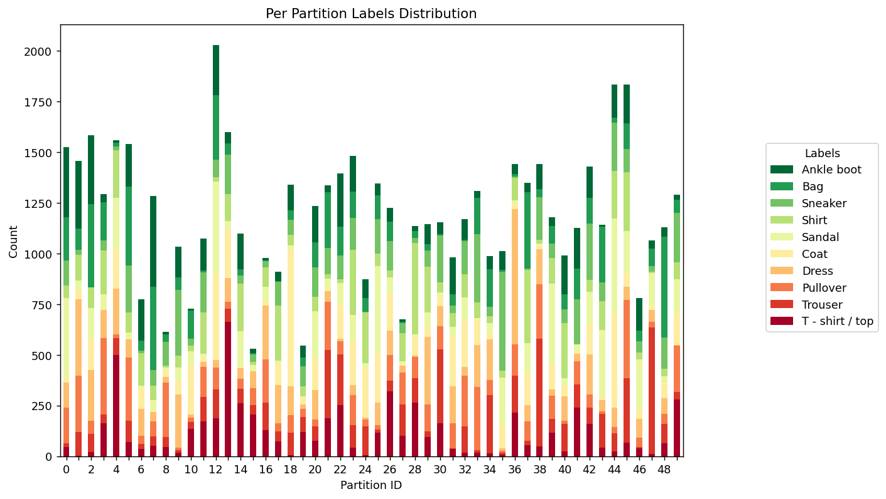
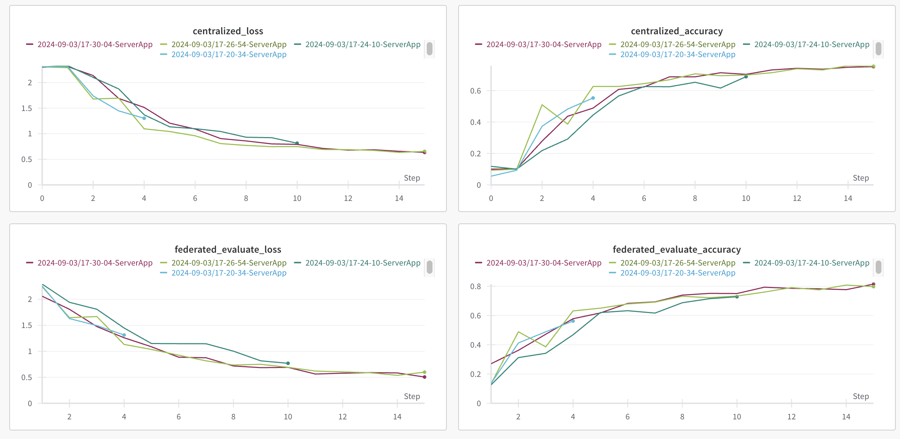

# Federated Learning with PyTorch and Flower (Advanced Example)

> [!TIP]
> This example shows intermediate and advanced functionality of Flower. It you are new to Flower, it is recommended to start from the [quickstart-pytorch](https://github.com/adap/flower/tree/main/examples/quickstart-pytorch) example or the [quickstart PyTorch tutorial](https://flower.ai/docs/framework/tutorial-quickstart-pytorch.html).

This example shows how to extend your `ClientApp` and `ServerApp` capabilities compared to what's shown in the [`quickstart-pytorch`](https://github.com/adap/flower/tree/main/examples/quickstart-pytorch) example. In particular, it will show how the `ClientApp`'s state (an object of type [RecordDict](https://flower.ai/docs/framework/ref-api/flwr.common.RecordDict.html)) can be used to enable stateful clients, facilitating the design of personalized federated learning strategies, among others. The `ServerApp` in this example makes use of a custom strategy derived from the built-in [FedAvg](https://flower.ai/docs/framework/ref-api/flwr.serverapp.strategy.FedAvg.html). In addition, it will also showcase how to:

1. Save model checkpoints
2. Save the metrics available at the strategy (e.g. accuracies, losses)
3. Log training artefacts to [Weights & Biases](https://wandb.ai/site)
4. Implement a simple decaying learning rate schedule across rounds

The structure of this directory is as follows:

```shell
advanced-pytorch
├── pytorch_example
│   ├── __init__.py
│   ├── client_app.py   # Defines your ClientApp
│   ├── server_app.py   # Defines your ServerApp
│   ├── strategy.py     # Defines a custom strategy
│   └── task.py         # Defines your model, training and data loading
├── pyproject.toml      # Project metadata like dependencies and configs
└── README.md
```

> [!NOTE]
> By default this example will log metrics to Weights & Biases. For this, you need to ensure that your system has logged in. Often it's as simple as executing `wandb login` on the terminal after installing `wandb`. Please, refer to this [quickstart guide](https://docs.wandb.ai/quickstart#2-log-in-to-wb) for more information.

This examples uses [Flower Datasets](https://flower.ai/docs/datasets/) with the [Dirichlet Partitioner](https://flower.ai/docs/datasets/ref-api/flwr_datasets.partitioner.DirichletPartitioner.html#flwr_datasets.partitioner.DirichletPartitioner) to partition the [Fashion-MNIST](https://huggingface.co/datasets/zalando-datasets/fashion_mnist) dataset in a non-IID fashion into 50 partitions.



> [!TIP]
> You can use Flower Datasets [built-in visualization tools](https://flower.ai/docs/datasets/tutorial-visualize-label-distribution.html) to easily generate plots like the one above.

### Install dependencies and project

Install the dependencies defined in `pyproject.toml` as well as the `pytorch_example` package.

```bash
pip install -e .
```

## Run the project

You can run your Flower project in both _simulation_ and _deployment_ mode without making changes to the code. If you are starting with Flower, we recommend you using the _simulation_ mode as it requires fewer components to be launched manually. By default, `flwr run` will make use of the Simulation Engine.

When you run the project, the strategy will create a directory structure in the form of `outputs/date/time` and store two `JSON` files: `config.json` containing the `run-config` that the `ServerApp` receives; and `results.json` containing the results (accuracies, losses) that are generated at the strategy.

By default, the metrics: {`centralized_accuracy`, `centralized_loss`, `federated_evaluate_accuracy`, `federated_evaluate_loss`} will be logged to Weights & Biases (they are also stored to the `results.json` previously mentioned). Upon executing `flwr run` you'll see a URL linking to your Weight&Biases dashboard where you can see the metrics.



The `results.json` would look along the lines of:

```JSON
[
    {
        "round": 1,
        "train_metrics": {
            "train_loss": 2.42163295142398
        },
        "evaluate_metrics_clientapp": {
            "eval_loss": 2.303316633324679,
            "eval_acc": 0.11882631674867869
        },
        "evaluate_metrics_serverapp": {
            "accuracy": 0.1,
            "loss": 2.3280856304656203
        }
    },
    {
        "round": 2,
        "train_metrics": {
            "train_loss": 1.8474334717885639
        },
        "evaluate_metrics_clientapp": {
            "eval_loss": 2.1314486836388467,
            "eval_acc": 0.19826539462272333
        },
        "evaluate_metrics_serverapp": {
            "accuracy": 0.1,
            "loss": 2.2980988307501944
        }
    },
]
```

### Run with the Simulation Engine

With default parameters, 25% of the total 50 nodes (see `num-supernodes` in `pyproject.toml`) will be sampled for `train` and 50% for an `evaluate` round. By default, `ClientApp` objects will run on CPU.

> [!TIP]
> To run your `ClientApps` on GPU or to adjust the degree or parallelism of your simulation, edit the `[tool.flwr.federations.local-simulation]` section in the `pyproject.toml`. Check the [Simulation Engine documentation](https://flower.ai/docs/framework/how-to-run-simulations.html) to learn more about Flower simulations and how to optimize them.

```bash
flwr run .
```

You can run the app using another federation (see `pyproject.toml`). For example, if you have a GPU available, select the `local-sim-gpu` federation:

```bash
flwr run . local-sim-gpu
```

You can also override some of the settings for your `ClientApp` and `ServerApp` defined in `pyproject.toml`. For example:

```bash
flwr run . --run-config "num-server-rounds=5 fraction-train=0.5"
```

### Run with the Deployment Engine

Follow this [how-to guide](https://flower.ai/docs/framework/how-to-run-flower-with-deployment-engine.html) to run the same app in this example but with Flower's Deployment Engine. After that, you might be interested in setting up [secure TLS-enabled communications](https://flower.ai/docs/framework/how-to-enable-tls-connections.html) and [SuperNode authentication](https://flower.ai/docs/framework/how-to-authenticate-supernodes.html) in your federation.

If you are already familiar with how the Deployment Engine works, you may want to learn how to run it using Docker. Check out the [Flower with Docker](https://flower.ai/docs/framework/docker/index.html) documentation.
