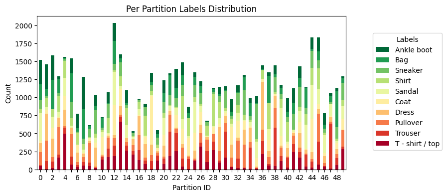

> \[!TIP\]
> This example shows intermediate and advanced functionality of Flower. It you are new to Flower, it is recommended to start from the [quickstart-pytorch](https://github.com/adap/flower/tree/main/examples/quickstart-pytorch) example or the [quickstart PyTorch tutorial](https://flower.ai/docs/framework/tutorial-quickstart-pytorch.html)

# Federated Learning with PyTorch and Flower (Advanced Example)

This example extends the content of the [quickstart-pytorch](https://github.com/adap/flower/tree/main/examples/quickstart-pytorch) example. Primarily, it demonstrates how to customize your `ServerApp` so it gains additional functionality:

- Saves results (e.g. accuracy, loss) to JSON in the file system
- Saves a checkpoint of the global model when a new best model is found
- Logs metrics to [Weights & Biases](<>) if enabled

In addition, it also shows how to make your `ClientApp` use the context so clients behave as if they were stateful. This is useful if your `ClientApp` objects should make use of some data structures (e.g. metrics, model parameters) set in previous rounds. The example implements a basic for of _FL personalization_.

This example shows how to achieve the above using both a `Strategy` as well as the low-level API.

This examples uses [Flower Datasets](https://flower.ai/docs/datasets/) with the [Dirichlet Partitioner](https://flower.ai/docs/datasets/ref-api/flwr_datasets.partitioner.DirichletPartitioner.html#flwr_datasets.partitioner.DirichletPartitioner) to partition the [Fashion-MNIST](https://huggingface.co/datasets/zalando-datasets/fashion_mnist) dataset in a non-IID fashion into 50 partitions.



> \[!TIP\]
> You can use Flower Datasets [built-in visualization tools](https://flower.ai/docs/datasets/tutorial-visualize-label-distribution.html) to easily generate plots like the one above.

## Set up the project

### Clone the project

Start by cloning the example project:

```shell
git clone --depth=1 https://github.com/adap/flower.git _tmp \
        && mv _tmp/examples/advanced-pytorch . \
        && rm -rf _tmp \
        && cd advanced-pytorch
```

This will create a new directory called `advanced-pytorch` with two sub-directories, each containing the same Flower app, but one makes use of high-level components such as the `Strategy` and the other uses the low-level API.

### Run the examples

Please navigate to either sub-directory to run the example.
