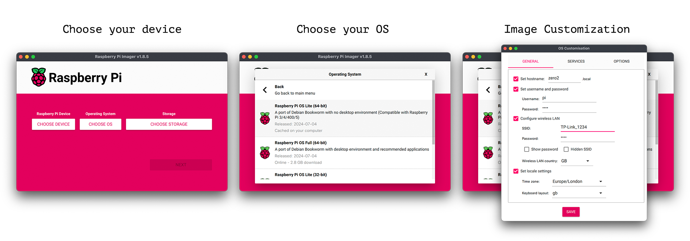

# Federated Learning on Embedded Devices with Flower

This example will show you how Flower makes it very easy to run Federated Learning workloads on edge devices. Here we'll be showing how to use NVIDIA Jetson devices and Raspberry Pi as Flower clients. You can run this example using either PyTorch or Tensorflow. The FL workload (i.e. model, dataset and training loop) is mostly borrowed from the [quickstart-pytorch](https://github.com/adap/flower/tree/main/examples/simulation-pytorch) and [quickstart-tensorflow](https://github.com/adap/flower/tree/main/examples/quickstart-tensorflow) examples.


## Getting things ready

> This example is designed for beginners that know a bit about Flower and/or ML but that are less familiar with embedded devices. If you already have a couple of devices up and running, clone this example and start the Flower clients after launching the Flower server.

This tutorial allows for a variety of settings (some shown in the diagrams above). As long as you have access to one embedded device, you can follow along. This is a list of components that you'll need:

- For Flower server: A machine running Linux/macOS/Windows (e.g. your laptop). You can run the server on an embedded device too!
- For Flower clients (one or more): Raspberry Pi 4 (or Zero 2), or an NVIDIA Jetson Xavier-NX (or Nano), or anything similar to these.
- A uSD card with 32GB or more. While 32GB is enough for the RPi, a larger 64GB uSD card works best for the NVIDIA Jetson.
- Software to flash the images to a uSD card:
  - For Raspberry Pi we recommend the [Raspberry Pi Imager](https://www.raspberrypi.com/software/)
  - For other devices [balenaEtcher](https://www.balena.io/etcher/) it's a great option.

What follows is a step-by-step guide on how to setup your client/s and the server.

## Clone this example

Start with cloning this example on your laptop or desktop machine. Later you'll run the same command on your embedded devices. We have prepared a single line which you can copy and execute:

```bash
git clone --depth=1 https://github.com/adap/flower.git && mv flower/examples/embedded-devices . && rm -rf flower && cd embedded-devices
```

## Setting up the server

The only requirement for the server is to have Flower installed alongside your ML framework of choice. Inside your Python environment run:

```bash
pip install -r requierments_pytorch.txt # to install Flower and PyTorch

# or the below for TensorFlower
# pip install -r requirements_tensorflow.txt
```

If you are working on this tutorial on your laptop or desktop, it can host the Flower server that will orchestrate the entire FL process. You could also use an embedded device (e.g. a Raspberry Pi) as the Flower server. In order to do that, please follow the setup steps below.

## Setting up a Raspberry Pi

> Wheter you use your RPi as a Flower server or a client, you need to follow these steps.



1. **Installing Ubuntu server on your Raspberry Pi** is easy with the [Raspberry Pi Imager](https://www.raspberrypi.com/software/). Before starting ensure you have a uSD card attached to your PC/Laptop and that it has sufficient space (ideally larger than 16GB). Then:

   - Click on `CHOOSE OS` > `Other general-pupose OS` > `Ubuntu` > `Ubuntu Server 22.04.03 LTS (64-bit)`. Other versions of `Ubuntu Server` would likely work but try to use a `64-bit` one.
   - Select the uSD you want to flash the OS onto. (This will be the uSD you insert in your Raspberry Pi)
   - Click on the gear icon on the bottom right of the `Raspberry Pi Imager` window (the icon only appears after choosing your OS image). Here you can very conveniently set the username/password to access your device over ssh. You'll see I use as username `piubuntu` (you can choose something different) It's also the ideal place to select your WiFi network and add the password (this is of course not needed if you plan to connect the Raspberry Pi via ethernet). Click "save" when you are done.
   - Finally, click on `WRITE` to start flashing Ubuntu onto the uSD card.

2. **Connecting to your Rapsberry Pi**

   After `ssh`-ing into your Raspberry Pi for the first time, make sure your OS is up-to-date.

   - Run: `sudo apt update` to look for updates
   - And then: `sudo apt upgrade -y` to apply updates (this might take a few minutes on the RPi Zero)
   - Then reboot your RPi with `sudo reboot`. Then ssh into it again.

3. **Preparations for your Flower experiments**

   - Install `pip`. In the terminal type: `sudo apt install python3-pip -y`
   - Now clone this directory. You just need to execute the `git clone` command shown at the top of this README.md on your device.
   - Install Flower and your ML framework of choice: We have prepared some convenient installation scripts that will install everything you need. You are free to install other versions of these ML frameworks to suit your needs.
     - If you want your clients to use PyTorch: `pip3 install -r requirements_pytorch.txt`
     - If you want your clients to use TensorFlow: `pip3 install -r requirements_tf.txt`

   > While preparing this example I noticed that installing TensorFlow on the **Raspberry pi Zero** would fail due to lack of RAM (it only has 512MB). A workaround is to create a `swap` disk partition (non-existant by default) so the OS can offload some elements to disk. I followed the steps described [in this blogpost](https://www.digitalocean.com/community/tutorials/how-to-add-swap-space-on-ubuntu-20-04) that I copy below. You can follow these steps if you often see your RPi Zero running out of memory:

   ```bash
   # Let's create a 1GB swap partition
   sudo fallocate -l 1G /swapfile
   sudo chmod 600 /swapfile
   sudo mkswap /swapfile
   # Enable swap
   sudo swapon /swapfile # you should now be able to see the swap size on htop.
   # make changes permanent after reboot
   sudo cp /etc/fstab /etc/fstab.bak
   echo '/swapfile none swap sw 0 0' | sudo tee -a /etc/fstab
   ```

   Please note using swap as if it was RAM comes with a large penalty in terms of data movement.

4. Run your Flower experiments following the steps in the [Running FL with Flower](https://github.com/adap/flower/tree/main/examples/embedded-devices#running-fl-training-with-flower) section.

## Setting up a Jetson Xavier-NX

> These steps have been validated for a Jetson Xavier-NX Dev Kit. An identical setup is needed for a Jetson Nano once you get ssh access to it (i.e. jumping straight to point `4` below). For instructions on how to setup these devices please refer to the "getting started guides" for [Jetson Nano](https://developer.nvidia.com/embedded/learn/get-started-jetson-nano-devkit#intro).

1. **Install JetPack 5.1.2 on your Jetson device**

   - Download the JetPack 5.1.2 image from [NVIDIA-embedded](https://developer.nvidia.com/embedded/jetpack-sdk-512), note that you might need an NVIDIA developer account. You can find the download link under the `SD Card Image Method` section on NVIDIA's site. This image comes with Docker pre-installed as well as PyTorch+Torchvision and TensorFlow compiled with GPU support.

   - Extract the image (~18GB and named `sd-blob.img`) and flash it onto the uSD card using [balenaEtcher](https://www.balena.io/etcher/) (or equivalent).

2. **Follow [the instructions](https://developer.nvidia.com/embedded/learn/get-started-jetson-xavier-nx-devkit) to set up the device.** The first time you boot your Xavier-NX you should plug it into a display to complete the installation process. After that, a display is no longer needed for this example but you could still use it instead of connecting to your device over ssh.

3. **Setup Docker**: Docker comes pre-installed with the Ubuntu image provided by NVIDIA. But for convenience, we will create a new user group and add our user to it (with the idea of not having to use `sudo` for every command involving docker (e.g. `docker run`, `docker ps`, etc)). More details about what this entails can be found in the [Docker documentation](https://docs.docker.com/engine/install/linux-postinstall/). You can achieve this by doing:

   ```bash
   sudo usermod -aG docker $USER
   # apply changes to current shell (or logout/reboot)
   newgrp docker
   ```

4. **Update OS and install utilities.** Then, install some useful utilities:

   ```bash
   sudo apt update && sudo apt upgrade -y
   # now reboot
   sudo reboot
   ```

   Login again and (optional) install the following packages:

   

   - [jtop](https://github.com/rbonghi/jetson_stats),  to monitor CPU/GPU utilization, power consumption and, many more. You can read more about it in [this blog post](https://jetsonhacks.com/2023/02/07/jtop-the-ultimate-tool-for-monitoring-nvidia-jetson-devices/).

     ```bash
     # First we need to install pip3
     sudo apt install python3-pip -y
     # finally, install jtop
     sudo pip3 install -U jetson-stats
     # now reboot (or run `sudo systemctl restart jtop.service` and login again)
     sudo reboot
     ```

     Now you have installed `jtop`, just launch it by running the `jtop` command on your terminal. An interactive panel similar to the one shown on the right will show up. `jtop` allows you to monitor and control many features of your Jetson device. Read more in the [jtop documentation](https://rnext.it/jetson_stats/jtop/jtop.html)

   - [TMUX](https://github.com/tmux/tmux/wiki), a terminal multiplexer. As its name suggests, it allows you to device a single terminal window into multiple panels. In this way, you could (for example) use one panel to show your terminal and another to show `jtop`. That's precisely what the visualization on the right shows.

     ```bash
     # install tmux
     sudo apt install tmux -y
     # add mouse support
     echo set -g mouse on > ~/.tmux.conf
     ```

5. **Power modes**. The Jetson devices can operate at different power modes, each making use of more or less CPU cores clocked at different frequencies. The right power mode might very much depend on the application and scenario. When power consumption is not a limiting factor, we could use the highest 15W mode using all 6 CPU cores. On the other hand, if the devices are battery-powered we might want to make use of a low-power mode using 10W and 2 CPU cores. All the details regarding the different power modes of a Jetson Xavier-NX can be found [here](https://docs.nvidia.com/jetson/l4t/index.html#page/Tegra%2520Linux%2520Driver%2520Package%2520Development%2520Guide%2Fpower_management_jetson_xavier.html%23wwpID0E0NO0HA). For this demo, we'll be setting the device to high-performance mode:

   ```bash
   sudo /usr/sbin/nvpmodel -m 2 # 15W with 6cpus @ 1.4GHz
   ```

   Jetson Stats (that you launch via `jtop`) also allows you to see and set the power mode on your device. Navigate to the `CTRL` panel and click on one of the `NVM modes` available.

6. **Build base client image**. Before running a Flower client, we need to install `Flower` and other ML dependencies (i.e. Pytorch or Tensorflow). Instead of installing this manually via `pip3 install ...`, let's use the pre-built Docker images provided by NVIDIA. In this way, we can be confident that the ML infrastructure is optimized for these devices. Build your Flower client image with:

   ```bash
   # On your Jetson's terminal run
   ./build_jetson_flower_client.sh --pytorch # or --tensorflow
   # Bear in mind this might take a few minutes since the base images need to be donwloaded (~7GB) and decompressed.
   # To the above script pass the additional flag `--no-cache` to re-build the image.
   ```

   Once your script is finished, verify your `flower_client` Docker image is present. If you type `docker images` you'll see something like the following:

   ```bash
   REPOSITORY      TAG       IMAGE ID       CREATED          SIZE
   flower_client   latest    87e935a8ee37   18 seconds ago   12.6GB
   ```

7. **Access your client image**. Before launching the Flower client, we need to run the image we just created. To keep things simpler, let's run the image in interactive mode (`-it`), mount the entire repository you cloned inside the `/client` directory of your container (`` -v `pwd`:/client ``), and use the NVIDIA runtime so we can access the GPU `--runtime nvidia`:

   ```bash
   # first ensure you are in the `embedded-devices` directory. If you are not, use the `cd` command to navigate to it

   # run the client container (this won't launch your Flower client, it will just "take you inside docker". The client can be run following the steps in the next section of the readme)
   docker run -it --rm --runtime nvidia -v `pwd`:/client flower_client
   # this will take you to a shell that looks something like this:
   root@6e6ce826b8bb:/client# <here you can run python commands or any command as usual>
   ```

8. **Run your FL experiments with Flower**. Follow the steps in the section below.

## Running Embedded FL with Flower

For this demo, we'll be using [CIFAR-10 | https://huggingface.co/datasets/uoft-cs/cifar10](https://www.cs.toronto.edu/~kriz/cifar.html), a popular dataset for image classification comprised of 10 classes (e.g. car, bird, airplane) and a total of 60K `32x32` RGB images. The training set contains 50K images. The server will automatically download the dataset should it not be found in `./data`. The clients do the same. The dataset is by default split into 50 partitions (each to be assigned to a different client). This can be controlled with the `NUM_CLIENTS` global variable in the client scripts. In this example, each device will play the role of a specific user (specified via `--cid` -- we'll show this later) and therefore only do local training with that portion of the data. For CIFAR-10, clients will be training a MobileNet-v2/3 model.

You can run this example using MNIST and a smaller CNN model by passing flag `--mnist`. This is useful if you are using devices with a very limited amount of memory (e.g. RaspberryPi Zero) or if you want the training taking place on the embedded devices to be much faster (specially if these are CPU-only). The partitioning of the dataset is done in the same way.

### Start your Flower Server

On the machine of your choice, launch the server:

```bash
# Launch your server.
# Will wait for at least 2 clients to be connected, then will train for 3 FL rounds
# The command below will sample all clients connected (since sample_fraction=1.0)
# The server is dataset agnostic (use the same command for MNIST and CIFAR10)
python server.py --rounds 3 --min_num_clients 2 --sample_fraction 1.0
```

> If you are on macOS with Apple Silicon (i.e. M1, M2 chips), you might encounter a `grpcio`-related issue when launching your server. If you are in a conda environment you can solve this easily by doing: `pip uninstall grpcio` and then `conda install grpcio`.

### Start the Flower Clients

It's time to launch your clients! Ensure you have followed the setup stages outline above for the devices at your disposal.

The first time you run this, the dataset will be downloaded. From the commands below, replace `<FRAMEWORK>` with either `pytorch` or `tf` to run the corresponding client Python file. In a FL setting, each client has its unique dataset. In this example you can simulate this by manually assigning an ID to a client (`cid`) which should be an integer `[0, NUM_CLIENTS-1]`, where `NUM_CLIENTS` is the total number of partitions or clients that could participate at any point. This is defined at the top of the client files and defaults to `50`. You can change this value to make each partition larger or smaller.

Launch your Flower clients as follows. Remember that if you are using a Jetson device, you need first to run your Docker container (see tha last steps for the Jetson setup). If you are using Raspberry Pi Zero devices, it is normal if starting the clients take a few seconds.

```bash
# Run the default example (CIFAR-10)
python3 client_<FRAMEWORK>.py --cid=<CLIENT_ID> --server_address=<SERVER_ADDRESS>

# Use MNIST (and a smaller model) if your devices require a more lightweight workload
python3 client_<FRAMEWORK>.py --cid=<CLIENT_ID> --server_address=<SERVER_ADDRESS> --mnist
```

Repeat the above for as many devices as you have. Pass a different `CLIENT_ID` to each device. You can naturally run this example using different types of devices (e.g. RPi, RPi Zero, Jetson) at the same time as long as they are training the same model. If you want to start more clients than the number of embedded devices you currently have access to, you can launch clients in your laptop: simply open a new terminal and run one of the `python3 client_<FRAMEWORK>.py ...` commands above.
