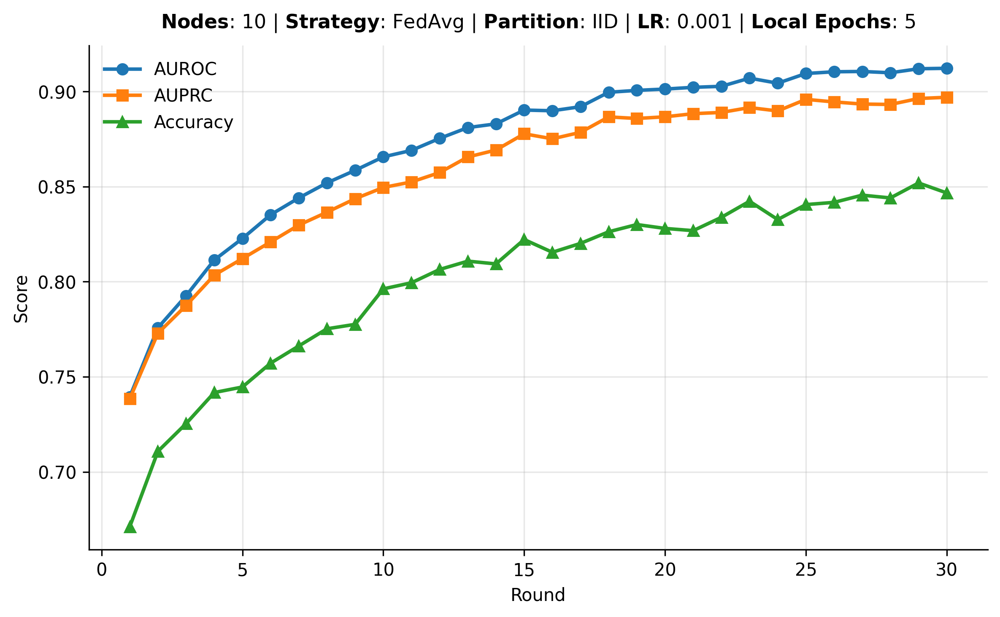

# Personalized Federated Framework with Flower & Docker for OMOP-CDM Multi-Hospital Readmission

**Authors:** Dani Manjah and Pierre Remacle  
**Last update:** 17/03/2026

---

## About

This repository documents how to run simulations and deploy **Federated Learning (FL)** experiments using **Flower** in a distributed, multi-machine setup for **OMOP-CDM multi-hospital data**. The **30-day readmission** use case is provided as an illustrative example.

> **Note**  
> This repository uses a simplified demonstration dataset.  
> The full experimental archive described in the paper is not publicly distributed and is planned for a future release.

---

## Installation

You can install the project either with `venv` or Conda.

### Option 1 — Python virtual environment

```bash
python -m venv fedomop
source fedomop/bin/activate
pip install --upgrade pip
pip install -e .
```

### Option 2 — Conda

```bash
conda create -n fedomop python=3.10
conda activate fedomop
pip install -e .
```

---

## Dataset Generation

This pipeline preprocesses **MIMIC-IV v2.2** Electronic Health Record (EHR) data into structured **static** and **time-series** features.

The code provided here is dedicated to the **readmission** use case. The same overall pipeline can be adapted to other tasks such as:
- mortality prediction
- length of stay
- phenotyping

### Dataset Access

Access must first be approved through the official **PhysioNet** data use agreement.

PhysioNet portal:  
https://physionet.org/content/mimiciv/2.2/

Scroll to the bottom of the page to find the instructions on how to become a credentialed user and which requirements must be fulfilled.

Once access is granted:

1. Download **MIMIC-IV v2.2** (let's assume it is `mimic-iv-2.2.zip`).
2. Unzip it into the folder `preprocess_MIMIC`.
3. Change `RawDataPath` in the configuration file `config.py` to indicate the relative path, for example: `"RawDataPath": "mimic-iv-2.2/"`.
4. Run the readmission dataset generation pipeline using the `base_config` defined in the code.

If you are in the root directory, run:

```bash
cd preprocess_MIMIC
python generate_dataset.py config.json
```

This generates CSV files containing the feature matrix `X` and the readmission target `y` in:

```bash
preprocess_MIMIC/data/output
```

For more details about the data pipeline and outputs, see:
- [MIMIC-IV Overview](docs/mimiciv.md)

---

## Running Experiments

### 1. Simulation Mode

Simulation is the default mode in this repository.

To run a fully local federated simulation, make sure you are in the root directory where `pyproject.toml` is present, then execute:

```bash
flwr run . --stream
```

This will:
- spawn virtual clients
- partition the dataset
- train the federated model
- log metrics

#### Simulation Configuration

The `local-simulation` runtime is defined in the Flower configuration file:

```bash
~/.flwr/config.toml
```

Example:

```toml
[superlink.local-simulation]
options.num-supernodes = 3
```

This configuration runs the simulation locally with **3 virtual SuperNodes (clients)**.

#### Custom Simulation Parameters

You can override parameters defined in `pyproject.toml` with `--run-config`:

```bash
flwr run . --run-config='partitioner="dirichlet" dirichlet_alpha=0.8 local-epochs=2' --stream
```

---

### 2. Deployment Mode

Deployment mode simulates a real multi-hospital distributed setup.

For each link and node, start a dedicated terminal.

#### Step 1 — Start the SuperLink

```bash
flower-superlink --insecure
```

#### Step 2 — Start the SuperNodes

Example with 3 hospitals:

```bash
flower-supernode --insecure \
    --superlink 127.0.0.1:9092 \
    --clientappio-api-address 127.0.0.1:9104 \
    --node-config "partition-id=0 num-partitions=3"
```

```bash
flower-supernode --insecure \
    --superlink 127.0.0.1:9092 \
    --clientappio-api-address 127.0.0.1:9105 \
    --node-config "partition-id=1 num-partitions=3"
```

```bash
flower-supernode --insecure \
    --superlink 127.0.0.1:9092 \
    --clientappio-api-address 127.0.0.1:9106 \
    --node-config "partition-id=2 num-partitions=3"
```

#### Step 3 — Launch the Federated Run

The `local-deployment` runtime must be added to `config.toml`.

If it is not already present, add the following:

```toml
[superlink.local-deployment]
address = "127.0.0.1:9093"
insecure = true
```

Once it is included, run the following command in **another terminal**:

```bash
flwr run . local-deployment --stream
```

---

## Metrics and Outputs

The framework reports both **centralized** and **distributed** metrics per round, including:
- loss
- accuracy
- AUROC
- AUPR

It also tracks summary statistics across clients, including:
- variance
- minimum

Simulation results are automatically saved in the `results/` directory. The final model is also exported as a `.pt` file.

If you had launched with 10 nodes using our standard parameters, you should obtain:



---

## License

This project is open-source under the **Apache 2.0 License**.

---

## Funding

This project was developed as part of the **MAIDAM** BioWin project funded by the **Walloon Region** under grant agreement:

**PIT ATMP - Convention 8881**