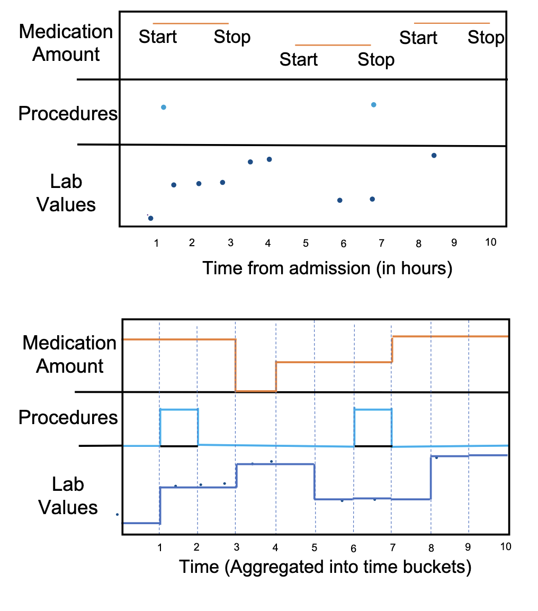

# MIMIC-IV (v2.2) Preprocessing Pipeline

Adapted from the official MIMIC-IV data pipeline:  
Healthylaife — https://github.com/healthylaife/MIMIC-IV-Data-Pipeline  

Based on:  
An Extensive Data Processing Pipeline for MIMIC-IV  
Gupta et al., Proceedings of Machine Learning Research, 2022.

---

# Overview

This pipeline preprocesses MIMIC-IV v2.2 Electronic Health Record (EHR) data into structured static and time-series representations suitable for machine learning tasks such as:

- Mortality prediction  
- Length of Stay  
- Readmission  
- Phenotyping  

It performs:

1. Clinical grouping  
2. Feature summarization and selection  
3. Outlier removal  
4. Time-series representation  
5. Data verification and formatting  

---

## Dataset Access

Before downloading the data, request access to the **MIMIC-IV** dataset through the PhysioNet portal.

Access must be approved via the official data use agreement on PhysioNet.

Once access is granted, download the required MIMIC-IV version (e.g., v2.2) and place the raw files in the directory specified by `RawDataPath` in the configuration file.

PhysioNet portal:  
https://physionet.org/content/mimiciv/2.2/

---

# Usage

## Run with Default Configuration

```bash
python generate_dataset.py
```

Uses `base_config` defined in the code.

---

## Run with a Custom Configuration File

```bash
python generate_dataset.py ../folder/config.json
```

---

# Configuration Parameters

## Dataset Version and Paths

| Parameter | Description |
|------------|------------|
| `Version` | Dataset version (e.g. `"2.2"`) |
| `RawDataPath` | Path to raw MIMIC-IV data |

---

## Prediction Task Settings

### `Task`

Defines the downstream task:

- `"mortality"`
- `"LengthOfStay"`
- `"readmission"`
- `"phenotype"`

---

### Task-Specific Parameters

#### Mortality

| Parameter | Description |
|------------|------------|
| `Mortality_prediction_horizon` | Prediction horizon (hours) |

Example:  
Predict mortality within the next 24 hours using `24`.

---

#### Length of Stay

| Parameter | Description |
|------------|------------|
| `LengthOfStay_greater_or_equal_threshold` | Threshold in days |

Example:  
`3` → classify whether LOS ≥ 3 days.

---

#### Readmission

| Parameter | Description |
|------------|------------|
| `Readmission_number_of_days_threshold` | Readmission window (days) |

Example:  
`30` → predict readmission within 30 days.

---

#### Phenotype Prediction

| Parameter | Description |
|------------|------------|
| `Phenotype` | Target phenotype (`HF`, `COPD`, `CKD`, `CAD`) |
| `Phenotype_prediction_horizon` | Prediction window (hours) |

Example:  
Predict phenotype within first 24 hours of ICU stay.

---

## Data Inclusion Flags

| Parameter | Description |
|------------|------------|
| `Include_ICU` | Include ICU stays |
| `Include_Diagnosis` | Include diagnosis codes |
| `Include_Procedures` | Include procedures |
| `Include_Medications` | Include medications |
| `Include_chart_event` | Include labs and vitals |
| `Include_output_event` | Include ICU output events |

When ICU is enabled:
- Chart events include labs + vitals
- Output events can be included 

When ICU is disabled:
- Vitals are excluded
- Output events are not available (thus the flag has no impact)

---

## Disease Filtering

| Parameter | Description |
|------------|------------|
| `Disease_Filter` | Filter cohort by disease (`None`, `HF`, `COPD`, `CKD`, `CAD`) |

---

## Outlier Handling

| Parameter | Description |
|------------|------------|
| `Outliers_management` | `remove`, `impute_mean`, `impute_median`, `impute_mode`, `impute_random`, `none` |
| `Outliers_threshold_right` | Right percentile threshold (e.g. 98.0) |
| `Outliers_threshold_left` | Left percentile threshold (e.g. 0.0) |

Outliers are detected per feature distribution after unit standardization.

---

## Time-Series Configuration

| Parameter | Description |
|------------|------------|
| `Time_window_size` | Observation window (hours) |
| `Time_window_bucket_size` | Time resolution (hours) |

Example:
- `24` hours window
- `1` hour bins

---

## Missing Value Handling

| Parameter | Description |
|------------|------------|
| `Missing_values_management` | `mean`, `median`, `mode`, `random`, `none` |

Imputation is performed **only within the observation window** to prevent data leakage.

If `none`:
- Missing values are encoded as `0`.

---


## Oversampling

| Parameter | Description |
|------------|------------|
| `Oversampling` | `True`, `False` |

When enabled, the pipeline performs **oversampling of the minority class** to reduce class imbalance in the training data.

Oversampling is applied **after feature extraction**

## Concatenate 

| Parameter | Description |
|------------|------------|
| `Concatenate` | `True`, `False` |

When enabled, temporal features from multiple sources are merged along the **feature dimension**:

**Warning**

Concatenation can significantly increase the **feature dimensionality** and **memory usage**.

## Output Format

| Parameter | Description |
|------------|------------|
| `Output_format` | `csv`, `npy` , `pkl` |

# Preprocessing Steps

## 1. Clinical Grouping

Purpose: Reduce dimensionality while preserving clinical meaning.

### Diagnosis Grouping

- ICD-9 codes are converted to ICD-10.
- Mapping follows Gupta et al.
- First three digits of ICD-10 used as grouping root.

Result: Reduced and standardized diagnosis feature space.

---

### Medication Grouping

- NDC codes converted to 11-digit format.
- Mapped to FDA NDC database.
- Grouped using:
  - Labeler code (digits 1–5)
  - Product code (digits 6–9)
- Drug names converted to non-proprietary names.

Result: Consistent medication representation.

---

## 2. Feature Summarizing and Selection

After grouping, the pipeline generates summary CSV files containing:

- Mean frequency per admission
- Percentage of missing values


---

## 3. Outlier Removal

The pipeline:

- Detects statistical outliers per feature
- Uses user-defined Z-score or percentile thresholds
- Either removes or imputes values

Before detection:

- Units are standardized per feature

Example:

- If threshold = 98  
- Values > 98th percentile are removed or replaced

---

## 4. Time-Series Representation

### Observation Window

User defines:

- Reference point (admission/discharge)
- Duration (e.g. first 24 hours)

Only data inside this window is used.

---

### Time Binning

Data is discretized into fixed intervals:

- Size defined by `Time_window_bucket_size`
- Example: 1-hour bins

 


---

### Feature Encoding

**Labs & Vitals**

- Forward-filled by default
- Aggregated if high frequency
- Missing values imputed (mean/median) if enabled
- Imputation uses only values inside the observation window (prevents leakage)

---

**Medications**

- Represented by dosage between start and stop time
- 0 when not administered
- No imputation performed

---

**Procedures**

- 1 at time of procedure
- 0 otherwise

---

**Diagnoses**

- Static feature
- Do not vary over time

---

## 5. Data Verification

The pipeline automatically:

- Removes admissions with invalid timestamps
- Removes medications with invalid start/stop times
- Adjusts medication times to:
  - Shift start to admission if given before admission
  - Shift stop to discharge if beyond discharge

---

# Output Format

For each admission:

Three CSV files are generated:

1. Static features  
2. Dynamic time-series features  
3. Demographic features  

Then a pair of X , y file are generated. 

---

# Data Flow Summary

Raw MIMIC-IV v2.2  
→ Clinical grouping  
→ Feature summary  
→ Feature filtering  
→ Outlier handling  
→ Time window selection  
→ Time binning  
→ Missing value handling  
→ Verification checks  
→ CSV + dictionary output  

---

# Intended Use

This pipeline produces machine-learning-ready structured EHR representations for:

- Deep learning models  
- Time-series models  
- Traditional ML classifiers  
- Survival analysis  

It prevents:

- Data leakage  
- Inconsistent time references  
- Invalid clinical timestamps  
- Unit mismatch errors  

---

<!-- # Citation

If using this pipeline, cite:

An Extensive Data Processing Pipeline for MIMIC-IV  
Gupta et al., ML4H 2022. -->