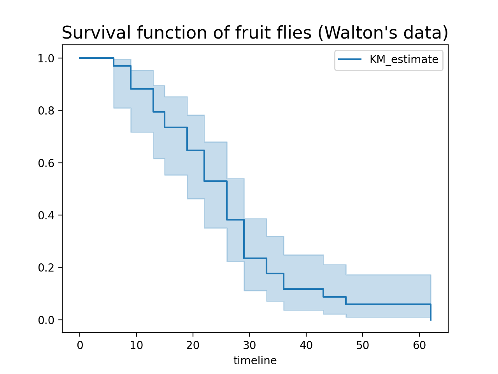

# Flower Example using KaplanMeierFitter

This is an introductory example on **federated survival analysis** using [Flower](https://flower.ai/)
and [lifelines](https://lifelines.readthedocs.io/en/stable/index.html) library.

The aim of this example is to estimate the survival function using the
[Kaplan-Meier Estimate](https://en.wikipedia.org/wiki/Kaplan%E2%80%93Meier_estimator) implemented in
lifelines library (see [KaplanMeierFitter](https://lifelines.readthedocs.io/en/stable/fitters/univariate/KaplanMeierFitter.html#lifelines.fitters.kaplan_meier_fitter.KaplanMeierFitter)). The distributed/federated aspect of this example
is the data sending to the server. You can think of it as a federated analytics example. However, it's worth noting that this procedure violates privacy since the raw data is exchanged.

Finally, many other estimators beyond KaplanMeierFitter can be used with the provided strategy:
AalenJohansenFitter, GeneralizedGammaFitter, LogLogisticFitter,
SplineFitter, and WeibullFitter.

We also use the [NatualPartitioner](https://flower.ai/docs/datasets/ref-api/flwr_datasets.partitioner.NaturalIdPartitioner.html#flwr_datasets.partitioner.NaturalIdPartitioner) from [Flower Datasets](https://flower.ai/docs/datasets/) to divide the data according to
the group it comes from therefore to simulate the division that might occur.

<p style="text-align:center;">

</p>

## Project Setup

Start by cloning the example project. We prepared a single-line command that you can copy into your shell which will checkout the example for you:

```shell
$ git clone --depth=1 https://github.com/adap/flower.git _tmp && mv _tmp/examples/federated-kaplan-meier-fitter . && rm -rf _tmp && cd federated-kaplan-meier-fitter
```

This will create a new directory called `federated-kaplan-meier-fitter` containing the following files:

```shell
-- pyproject.toml
-- requirements.txt
-- client.py
-- server.py
-- centralized.py
-- README.md
```

### Installing Dependencies

Project dependencies (such as `lifelines` and `flwr`) are defined in `pyproject.toml` and `requirements.txt`. We recommend [Poetry](https://python-poetry.org/docs/) to install those dependencies and manage your virtual environment ([Poetry installation](https://python-poetry.org/docs/#installation)) or [pip](https://pip.pypa.io/en/latest/development/), but feel free to use a different way of installing dependencies and managing virtual environments if you have other preferences.

#### Poetry

```shell
poetry install
poetry shell
```

Poetry will install all your dependencies in a newly created virtual environment. To verify that everything works correctly you can run the following command:

```shell
poetry run python3 -c "import flwr"
```

If you don't see any errors you're good to go!

#### pip

Write the command below in your terminal to install the dependencies according to the configuration file requirements.txt.

```shell
pip install -r requirements.txt
```

## Run Federated Survival Analysis with Flower and lifelines's KaplanMeierFitter

### Start the long-running Flower server (SuperLink)

```bash
flower-superlink --insecure
```

### Start the long-running Flower client (SuperNode)

In a new terminal window, start the first long-running Flower client:

```bash
flower-client-app client:node_1_app --insecure
```

In yet another new terminal window, start the second long-running Flower client:

```bash
flower-client-app client:node_2_app --insecure
```

### Run the Flower App

With both the long-running server (SuperLink) and two clients (SuperNode) up and running, we can now run the actual Flower App:

```bash
flower-server-app server:app --insecure
```

You will see that the server is printing survival function, median survival time and saves the plot with the survival function.

You can also check that the results match the centralized version.

```shell
$ python3 centralized.py
```
